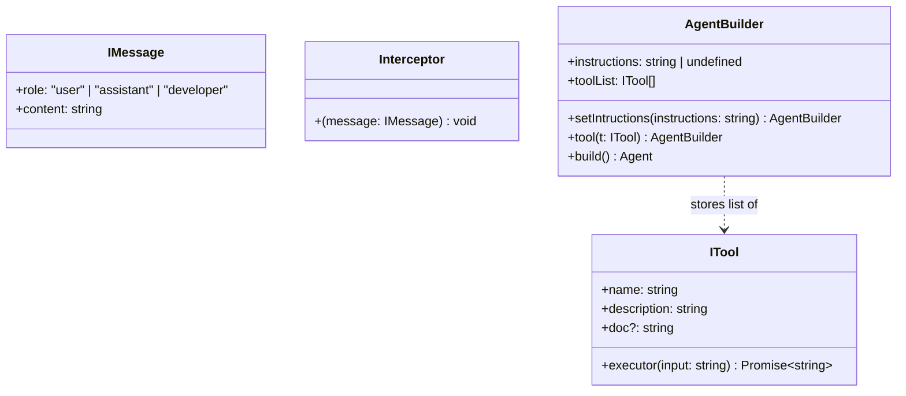

# Chapter 2 — Data Interfaces & AgentBuilder Pattern

## 1. Chapter Goal

The goal of this chapter is to create the core data contracts and implement the **Fluent Builder Pattern** (`AgentBuilder`) inside `src/app/agent.ts`.

Software frameworks require clear, type-safe interfaces to decouple agent configuration from execution logic. By adopting the **Builder Pattern**, developers can incrementally configure custom system instructions, attach multiple tools, and configure options using an intuitive method-chaining syntax before instantiating the `Agent`.

In this chapter, we:
* Define domain interfaces: `IMessage`, `ITool`, and `Interceptor`
* Implement the `AgentBuilder` class with method chaining (`setIntructions`, `tool`, `build`)
* Establish strong type safety for tool execution contracts

---

### 🎯 Expected Outcome

By the end of this chapter, developers can create configured Agent instances using fluent builder syntax:

```typescript
const agent = Agent.builder()
    .setIntructions("You are an expert coding assistant")
    .tool(weatherTool)
    .tool(cliTool)
    .build();
```

---

## 2. Domain Data Contracts (Interfaces & Types)

Before building class logic, we define the foundational interfaces used throughout the SDK engine.



### Interface Details

1. **`IMessage`**: Represents a single entry in the Agent's conversation history trajectory.
   * `role`: Supports standard OpenAI roles `"user"` and `"assistant"`, plus `"developer"` (used to return tool execution results or SDK system error notifications directly to LLM context).
   * `content`: The raw text payload.
2. **`ITool`**: Represents an executable capability available to the Agent.
   * `name`: Unique key matching LLM `functionName` requests.
   * `description`: Short description used by LLM to infer tool utility.
   * `doc`: Optional signature documentation string (e.g., `fetchWeatherInfo(cityName: string): WeatherReport`).
   * `executor`: Asynchronous function receiving string input and returning a string response.
3. **`Interceptor`**: Callback function definition `(message: IMessage) => void` triggered whenever a message is added to trajectory.

---

## 3. Implementation of Interfaces & `AgentBuilder`

### File Path

```text
agent-sdk-sir/src/app/agent.ts (Part 1)
```

### Code

```typescript
import { HARNESS_PROMPT } from "./config.js";
import Openai from "openai";

export interface IMessage {
  role: "user" | "assistant" | "developer";
  content: string;
}

export interface ITool {
  name: string;
  description: string;
  doc?: string;
  executor: (input: string) => Promise<string>;
}

export type Interceptor = (message: IMessage) => void;

export class AgentBuilder {
  public instructions: string | undefined;
  public toolList: ITool[];

  constructor() {
    this.toolList = [];
  }

  public setIntructions(instructions: string) {
    this.instructions = instructions;
    return this;
  }

  public tool(t: ITool) {
    this.toolList.push(t);
    return this;
  }

  public build() {
    return new Agent(this);
  }
}
```

---

## 4. Line-by-Line Code Breakdown

### `AgentBuilder` Internal Mechanics

* **`constructor()`**: Initializes `toolList` as an empty array ready to accept registered tool implementations.
* **`setIntructions(instructions: string)`**: Assigns custom system instructions tailored to a specific agent role (e.g. coding agent, weather agent). Returns `this` to enable method chaining.
* **`tool(t: ITool)`**: Appends an `ITool` object to `toolList`. Returns `this` to enable method chaining.
* **`build()`**: Passes the configured `AgentBuilder` instance into `new Agent(this)` constructor, returning the fully initialized operational `Agent`.

---

## 5. Verification & Testing

Verify that `AgentBuilder` compiles cleanly and supports method chaining:

### Code Snippet Verification

Create a temporary test script to verify method chaining behavior:

```bash
npx tsx -e "
import { AgentBuilder } from './src/app/agent.js';
const builder = new AgentBuilder()
    .setIntructions('Test Instructions')
    .tool({
        name: 'testTool',
        description: 'A dummy test tool',
        executor: async (input) => 'OK: ' + input
    });
console.log('Registered Tools Count:', builder.toolList.length);
console.log('Target Instructions:', builder.instructions);
"
```

### Expected Output

```text
Registered Tools Count: 1
Target Instructions: Test Instructions
```

Now that the data contracts and builder pattern are ready, move to **Chapter 3** to build the core `Agent` engine and autonomous execution loop.
