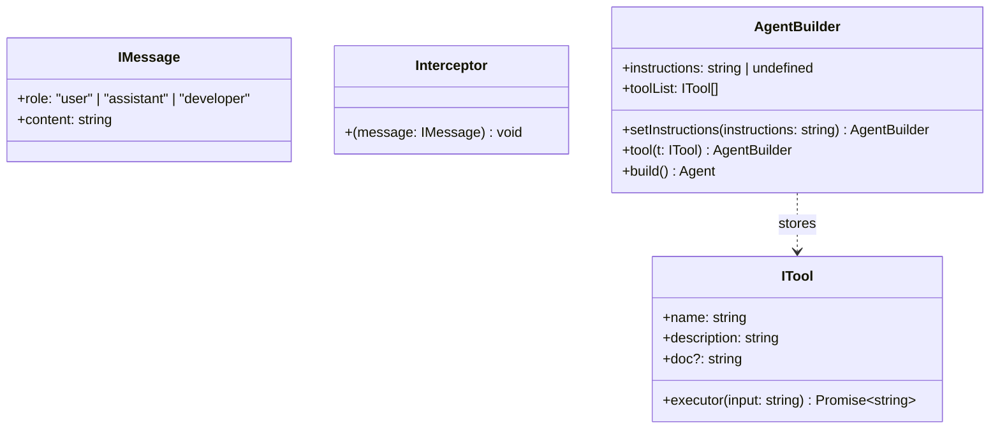

# Chapter 2 — Data Interfaces & AgentBuilder Pattern

## 1. Chapter Goal

In Chapter 1, we designed the **agent pipeline** and defined how the LLM should communicate using structured steps such as:

```text
INITIAL
   ↓
THINK
   ↓
TOOL_REQUEST
   ↓
ANALYSE
   ↓
OUTPUT
```

Now we need to build the TypeScript structures that will support that pipeline.

The goal of this chapter is to create the core **data contracts** and implement the **Fluent Builder Pattern** using an `AgentBuilder` class.

These contracts will define:

* What a conversation message looks like.
* What an executable tool looks like.
* How interceptors can observe messages.
* How tools are registered with an agent.
* How custom instructions are configured.
* How a configured `Agent` instance is created.

By the end of this chapter, we should be able to write:

```ts
const agent = Agent.builder()
  .setInstructions("You are an expert coding assistant")
  .tool(weatherTool)
  .tool(cliTool)
  .build();
```

The important idea is:

> **Configure first → Build once → Execute later.**

---

# 2. Why Do We Need Data Contracts?

An Agent SDK contains several different parts that need to communicate with each other.

For example:

```text
                ┌──────────────────┐
                │      Agent       │
                └────────┬─────────┘
                         │
          ┌──────────────┼──────────────┐
          ↓              ↓              ↓
      Messages         Tools       Instructions
     IMessage[]        ITool[]        string
```

Without clearly defined types, different parts of the SDK could pass incompatible data around.

For example, one developer might create a tool like:

```ts
{
  toolName: "weather",
  run: () => {}
}
```

while another part of the SDK expects:

```ts
{
  name: "weather",
  executor: async () => {}
}
```

TypeScript interfaces prevent this kind of mismatch.

They act as **contracts**.

---

# 3. Domain Data Contracts

We need three foundational contracts:

```text
IMessage
   │
   └── Represents conversation messages

ITool
   │
   └── Represents executable agent tools

Interceptor
   │
   └── Observes messages added to the trajectory
```

Conceptually:



---

# 4. `IMessage` — Conversation Message

The first interface represents a single message in the agent's conversation history.

```ts
export interface IMessage {
  role: "user" | "assistant" | "developer";
  content: string;
}
```

For example:

```ts
const message: IMessage = {
  role: "user",
  content: "What is the weather in Goa?"
};
```

Another example:

```ts
const response: IMessage = {
  role: "assistant",
  content: "I need to check the weather information."
};
```

## 4.1 `role`

The `role` property tells us who or what produced the message.

```ts
role: "user" | "assistant" | "developer";
```

Because this is a TypeScript union type, only these three values are allowed:

```ts
"user"
"assistant"
"developer"
```

This is much safer than:

```ts
role: string;
```

With `string`, the following would also be accepted:

```ts
role: "random";
```

The union type prevents that mistake.

### User

Represents the user's input:

```ts
{
  role: "user",
  content: "Find the weather in Kolkata"
}
```

### Assistant

Represents an assistant-generated message:

```ts
{
  role: "assistant",
  content: "I will check the weather."
}
```

### Developer

Represents SDK/application-generated context.

For example, the runtime may use this role for internal execution results or framework-generated messages.

The exact semantics of this role should remain consistent with how the SDK's runtime constructs the conversation.

---

# 5. `content`

The `content` property contains the actual message text.

```ts
content: string;
```

Example:

```ts
const message: IMessage = {
  role: "user",
  content: "Calculate 25 * 10"
};
```

Here:

```text
role
 ↓
"user"

content
 ↓
"Calculate 25 * 10"
```

So `IMessage` gives the SDK a predictable structure for conversation data.

---

# 6. `ITool` — Agent Tool Contract

The second important interface represents an executable capability.

```ts
export interface ITool {
  name: string;
  description: string;
  doc?: string;
  executor: (input: string) => Promise<string>;
}
```

A tool could represent:

* Weather API
* Calculator
* Database query
* File search
* HTTP request
* CLI command
* Internal business logic

Conceptually:

```text
LLM
 │
 │ requests tool
 ↓
Agent Runtime
 │
 ↓
ITool.executor()
 │
 ↓
External system
 │
 ↓
string result
```

---

# 7. `ITool.name`

```ts
name: string;
```

This is the unique identifier of the tool.

Example:

```ts
name: "getWeatherData"
```

The name becomes important when the LLM produces a `TOOL_REQUEST`.

For example:

```json
{
  "step": "TOOL_REQUEST",
  "functionName": "getWeatherData",
  "input": "Goa"
}
```

The runtime can then search the registered tools:

```text
functionName
     │
     ↓
"getWeatherData"
     │
     ↓
Find matching ITool
     │
     ↓
executor("Goa")
```

Therefore, tool names should be unique within an agent.

---

# 8. `ITool.description`

```ts
description: string;
```

The description explains what the tool does.

Example:

```ts
description: "Gets the current weather information for a city."
```

This information can later be provided to the LLM so that it can understand when a particular tool should be used.

For example:

```text
Tool: getWeatherData

Description:
Gets the current weather information for a city.
```

The model can then reason:

> The user wants current weather information, so the weather tool is relevant.

---

# 9. `ITool.doc`

```ts
doc?: string;
```

The `?` means this property is optional.

Therefore, both of these are valid:

```ts
{
  name: "weather",
  description: "Gets weather information.",
  executor: async (input) => "Sunny"
}
```

and:

```ts
{
  name: "weather",
  description: "Gets weather information.",
  doc: "getWeather(city: string): WeatherReport",
  executor: async (input) => "Sunny"
}
```

The `doc` field can contain additional documentation about how the tool works.

For example:

```ts
doc: "fetchWeatherInfo(cityName: string): WeatherReport"
```

This can become useful when building richer tool descriptions for the LLM.

---

# 10. `ITool.executor`

This is the most important property of the tool.

```ts
executor: (input: string) => Promise<string>;
```

It defines the actual function that executes the tool.

Let's break it down:

```text
executor
   │
   ├── input: string
   │
   └── Promise<string>
```

The tool:

1. Receives a string input.
2. Performs some operation.
3. Eventually returns a string result.

Example:

```ts
const weatherTool: ITool = {
  name: "getWeatherData",
  description: "Gets weather information for a city",

  executor: async (input) => {
    return `Weather information for ${input}`;
  }
};
```

Calling:

```ts
await weatherTool.executor("Goa");
```

could produce:

```text
Weather information for Goa
```

---

# 11. Why Does `executor` Return a Promise?

Tools commonly perform asynchronous operations.

For example:

```text
Agent
  ↓
Weather API
  ↓
Internet request
  ↓
Response
```

Network requests do not complete instantly.

Therefore:

```ts
Promise<string>
```

allows the tool to perform asynchronous work.

Example:

```ts
executor: async (input) => {
  const response = await fetch(
    `https://example.com/weather?city=${input}`
  );

  return await response.text();
}
```

The `async` function automatically returns a `Promise`.

This gives us one consistent contract for both simple and complex tools.

---

# 12. `Interceptor` — Observing Agent Messages

The third contract is:

```ts
export type Interceptor = (message: IMessage) => void;
```

An interceptor is simply a function that receives a message whenever the agent adds something to its trajectory.

Conceptually:

```text
Agent generates message
        │
        ↓
   Interceptor
        │
        ↓
 logging / monitoring / debugging
```

Example:

```ts
const logger: Interceptor = (message) => {
  console.log(`[${message.role}]`, message.content);
};
```

The interceptor does not need to return anything.

That's why its return type is:

```ts
void
```

---

# 13. Why Are Interceptors Useful?

Interceptors become useful for framework-level functionality such as:

* Logging
* Debugging
* Observability
* Metrics
* Tracing
* Monitoring agent execution

For example:

```text
User Message
     ↓
Interceptor
     ↓
Agent
     ↓
THINK
     ↓
TOOL_REQUEST
     ↓
Interceptor
     ↓
ANALYSE
     ↓
OUTPUT
```

This allows developers to inspect the agent's execution without tightly coupling logging logic to the Agent itself.

---

# 14. Introducing the Builder Pattern

Now that our data contracts are defined, we need a clean way to configure an agent.

One possible approach would be:

```ts
const agent = new Agent(
  instructions,
  tools,
  interceptors,
  options
);
```

But as the framework grows, the constructor can become difficult to use.

Imagine:

```ts
new Agent(
  instructions,
  tools,
  interceptors,
  maxIterations,
  model,
  temperature,
  timeout,
  ...
);
```

This becomes hard to read and maintain.

Instead, we use the **Builder Pattern**.

---

# 15. What Is the Builder Pattern?

The Builder Pattern separates:

```text
Object configuration
        ↓
Object construction
```

Instead of creating the final object immediately, we gradually configure a builder.

Example:

```ts
const agent = Agent.builder()
  .setInstructions("You are an expert coding assistant")
  .tool(weatherTool)
  .tool(cliTool)
  .build();
```

Read this almost like English:

```text
Create an agent builder
        ↓
Set instructions
        ↓
Add weather tool
        ↓
Add CLI tool
        ↓
Build the Agent
```

This is called **fluent API design** because each method returns the builder itself.

---

# 16. `AgentBuilder` Internal State

The builder needs to remember the configuration.

We use:

```ts
export class AgentBuilder {
  public instructions: string | undefined;
  public toolList: ITool[];

  constructor() {
    this.toolList = [];
  }
}
```

There are two important properties.

### `instructions`

```ts
instructions: string | undefined;
```

This stores the custom instructions provided by the developer.

Initially:

```ts
undefined
```

After:

```ts
builder.setInstructions("You are a coding assistant");
```

it becomes:

```ts
"You are a coding assistant"
```

### `toolList`

```ts
toolList: ITool[];
```

This stores all tools registered with the builder.

Initially:

```ts
[]
```

After adding two tools:

```text
[
  weatherTool,
  cliTool
]
```

---

# 17. Builder Constructor

```ts
constructor() {
  this.toolList = [];
}
```

When a new builder is created:

```ts
const builder = new AgentBuilder();
```

the constructor initializes:

```ts
this.toolList = [];
```

This ensures that every builder starts with its own empty tool collection.

---

# 18. `setInstructions()`

The first builder method is:

```ts
public setInstructions(instructions: string) {
  this.instructions = instructions;

  return this;
}
```

It performs two operations.

### Step 1 — Save instructions

```ts
this.instructions = instructions;
```

For:

```ts
builder.setInstructions("You are a coding assistant");
```

the builder now contains:

```ts
instructions:
  "You are a coding assistant"
```

### Step 2 — Return `this`

```ts
return this;
```

This is the key to method chaining.

Without:

```ts
return this;
```

we could not write:

```ts
builder
  .setInstructions(...)
  .tool(...)
  .build();
```

---

# 19. Understanding `return this`

Suppose:

```ts
const builder = new AgentBuilder();
```

When we call:

```ts
builder.setInstructions("Hello");
```

the method returns:

```ts
this
```

which means:

```text
the same AgentBuilder instance
```

Therefore:

```ts
builder.setInstructions(...)
```

still gives us the builder.

Then we can immediately call:

```ts
.tool(...)
```

This produces:

```text
builder
   │
   ├── setInstructions()
   │       ↓
   │     this
   │
   ├── tool()
   │       ↓
   │     this
   │
   └── build()
```

This is the core mechanism behind fluent APIs.

---

# 20. `tool()`

The next method registers a tool:

```ts
public tool(t: ITool) {
  this.toolList.push(t);

  return this;
}
```

The parameter:

```ts
t: ITool
```

means only objects matching the `ITool` contract can be passed.

For example:

```ts
builder.tool({
  name: "calculator",
  description: "Performs calculations",

  executor: async (input) => {
    return "42";
  }
});
```

The tool is added to:

```ts
this.toolList
```

using:

```ts
this.toolList.push(t);
```

---

# 21. Why `ITool` Gives Us Type Safety

Consider this:

```ts
builder.tool({
  name: "calculator"
});
```

TypeScript will report an error because required properties are missing:

```text
description
executor
```

That's exactly what we want.

The builder should reject invalid tools before the program runs.

This is one of the major advantages of TypeScript interfaces.

---

# 22. `build()`

Finally, we need to convert the configuration into an actual `Agent`.

```ts
public build() {
  return new Agent(this);
}
```

The builder contains:

```text
instructions
toolList
```

and passes itself into:

```ts
new Agent(this)
```

Conceptually:

```text
AgentBuilder
┌──────────────────────────┐
│ instructions              │
│ toolList                  │
└────────────┬─────────────┘
             │
             │ build()
             ↓
┌──────────────────────────┐
│          Agent           │
│                          │
│ execution logic          │
│ pipeline                 │
│ tools                    │
│ conversation             │
└──────────────────────────┘
```

The `Agent` class will be implemented in the next chapter.

---

# 23. Complete `agent.ts` — Part 1

At this stage, our file can look like this:

```ts
export interface IMessage {
  role: "user" | "assistant" | "developer";
  content: string;
}

export interface ITool {
  name: string;
  description: string;
  doc?: string;
  executor: (input: string) => Promise<string>;
}

export type Interceptor = (message: IMessage) => void;

export class AgentBuilder {
  public instructions: string | undefined;
  public toolList: ITool[];

  constructor() {
    this.toolList = [];
  }

  public setInstructions(instructions: string) {
    this.instructions = instructions;

    return this;
  }

  public tool(t: ITool) {
    this.toolList.push(t);

    return this;
  }

  public build() {
    return new Agent(this);
  }
}
```

However, there is one temporary issue:

```ts
new Agent(this)
```

requires an `Agent` class.

That class will be implemented in **Chapter 3**.

So if Chapter 2 is compiled before `Agent` exists, TypeScript will report that `Agent` is not defined.

For now, treat `build()` as the interface between the builder and the upcoming Agent engine.

---

# 24. Complete Architecture So Far

After Chapters 1 and 2, the architecture looks like this:

```text
                    USER
                     │
                     ↓
              ┌─────────────┐
              │    Agent    │
              └──────┬──────┘
                     │
              ┌──────┴──────┐
              ↓             ↓
        HARNESS_PROMPT    Tools
              │             │
              ↓             ↓
       Pipeline Steps     ITool[]
              │
              ↓
   ┌──────────────────────────┐
   │ INITIAL                  │
   │ THINK                    │
   │ TOOL_REQUEST             │
   │ ANALYSE                  │
   │ OUTPUT                   │
   └──────────────────────────┘

AgentBuilder
     │
     ├── instructions
     ├── toolList
     │
     └── build()
             │
             ↓
          Agent
```

---

# 25. Complete Fluent Builder Example

Let's create two example tools.

## Weather Tool

```ts
const weatherTool: ITool = {
  name: "getWeatherData",

  description: "Gets weather information for a city.",

  executor: async (input) => {
    return `Weather information for ${input}`;
  }
};
```

## CLI Tool

```ts
const cliTool: ITool = {
  name: "runCommand",

  description: "Runs an allowed CLI command.",

  executor: async (input) => {
    return `Command result for: ${input}`;
  }
};
```

Now configure the agent:

```ts
const builder = new AgentBuilder();

builder
  .setInstructions("You are an expert coding assistant.")
  .tool(weatherTool)
  .tool(cliTool);
```

At this point:

```text
builder
├── instructions
│   └── "You are an expert coding assistant."
│
└── toolList
    ├── weatherTool
    └── cliTool
```

Finally:

```ts
const agent = builder.build();
```

The builder transfers this configuration to the `Agent`.

---

# 26. Why Fluent APIs Are Useful

Compare the traditional approach:

```ts
const builder = new AgentBuilder();

builder.setInstructions("You are a coding assistant");
builder.tool(weatherTool);
builder.tool(cliTool);

const agent = builder.build();
```

with fluent syntax:

```ts
const agent = new AgentBuilder()
  .setInstructions("You are a coding assistant")
  .tool(weatherTool)
  .tool(cliTool)
  .build();
```

The second version clearly communicates the configuration flow.

It reads almost like a sentence:

```text
Build an agent
with these instructions
and these tools.
```

This is why builder APIs are common in SDKs and framework design.

---

# 27. Verification & Testing

We should verify that:

1. `AgentBuilder` can be instantiated.
2. `setInstructions()` works.
3. `tool()` registers tools.
4. Methods can be chained.
5. TypeScript correctly validates `ITool`.

Create a temporary test:

```bash
npx tsx -e "
import { AgentBuilder } from './src/app/agent.js';

const builder = new AgentBuilder()
  .setInstructions('Test Instructions')
  .tool({
    name: 'testTool',
    description: 'A dummy test tool',
    executor: async (input) => 'OK: ' + input
  });

console.log('Registered Tools Count:', builder.toolList.length);
console.log('Target Instructions:', builder.instructions);
"
```

Expected output:

```text
Registered Tools Count: 1
Target Instructions: Test Instructions
```

---

# 28. TypeScript Verification

Run:

```bash
npx tsc --noEmit
```

This checks the project without generating JavaScript files.

If the `Agent` implementation is not yet present, an error around:

```ts
new Agent(this)
```

is expected until Chapter 3 adds the class.

Once Chapter 3 is implemented, the project should compile cleanly.

---

# 29. Common Mistakes

## Mistake 1 — Forgetting `return this`

Incorrect:

```ts
public tool(t: ITool) {
  this.toolList.push(t);
}
```

Then this will fail:

```ts
builder
  .tool(weatherTool)
  .tool(cliTool);
```

because `tool()` returns `undefined`.

Correct:

```ts
public tool(t: ITool) {
  this.toolList.push(t);

  return this;
}
```

---

## Mistake 2 — Using `string` Instead of a Role Union

Avoid:

```ts
role: string;
```

Prefer:

```ts
role: "user" | "assistant" | "developer";
```

The union gives us compile-time validation.

---

## Mistake 3 — Making `executor` Synchronous

Avoid designing the interface as:

```ts
executor: (input: string) => string;
```

Tools frequently need network, database, filesystem, or other asynchronous operations.

Prefer:

```ts
executor: (input: string) => Promise<string>;
```

---

## Mistake 4 — Passing Invalid Tools

This:

```ts
builder.tool({
  name: "weather"
});
```

does not satisfy `ITool`.

A valid tool needs at least:

```ts
name
description
executor
```

---

## Mistake 5 — Typo in `setInstructions`

The original implementation used:

```ts
setIntructions()
```

`Intructions` is misspelled.

Use:

```ts
setInstructions()
```

It's better to fix this before the API is used throughout the SDK.

---

# 30. Key Concepts Learned

By completing this chapter, we introduced several important software-engineering concepts.

| Concept           | Purpose                                         |
| ----------------- | ----------------------------------------------- |
| `IMessage`        | Defines conversation message structure          |
| `ITool`           | Defines executable tool structure               |
| `Interceptor`     | Allows observation of messages                  |
| Union type        | Restricts values to known options               |
| Optional property | Allows properties such as `doc` to be omitted   |
| `Promise`         | Supports asynchronous tool execution            |
| Builder Pattern   | Separates configuration from construction       |
| Fluent API        | Enables readable method chaining                |
| `return this`     | Makes chaining possible                         |
| Type safety       | Prevents invalid configurations at compile time |

---

# 31. Mental Model

The most important mental model from this chapter is:

```text
                 AgentBuilder
                      │
          ┌───────────┴───────────┐
          │                       │
    Instructions                Tools
          │                       │
          │                 ┌─────┴─────┐
          │                 │           │
          │             Weather       CLI
          │
          └───────────────┬─────────────┘
                          │
                       build()
                          │
                          ↓
                        Agent
                          │
                          ↓
                 Autonomous Loop
                          │
                          ↓
                    LLM + Tools
```

The builder does **not** execute the agent.

Its job is simply to prepare configuration.

The `Agent` will be responsible for execution.

---

# 32. What Comes Next?

We now have:

```text
Chapter 0
   ↓
Project Setup
   ↓
Chapter 1
   ↓
System Prompt + Pipeline
   ↓
Chapter 2
   ↓
Data Contracts + Builder
   ↓
Chapter 3
   ↓
Agent Engine + Autonomous Loop
```

In **Chapter 3**, we will implement the actual `Agent` class.

That is where the SDK starts becoming an actual agent framework.

We will connect:

```text
User Input
    ↓
Agent
    ↓
LLM
    ↓
Structured Pipeline Step
    ↓
Tool Execution
    ↓
Tool Result
    ↓
LLM
    ↓
Final OUTPUT
```

The key transition is:

> **Chapter 2 defines what the agent is configured with. Chapter 3 defines how the agent actually runs.**
