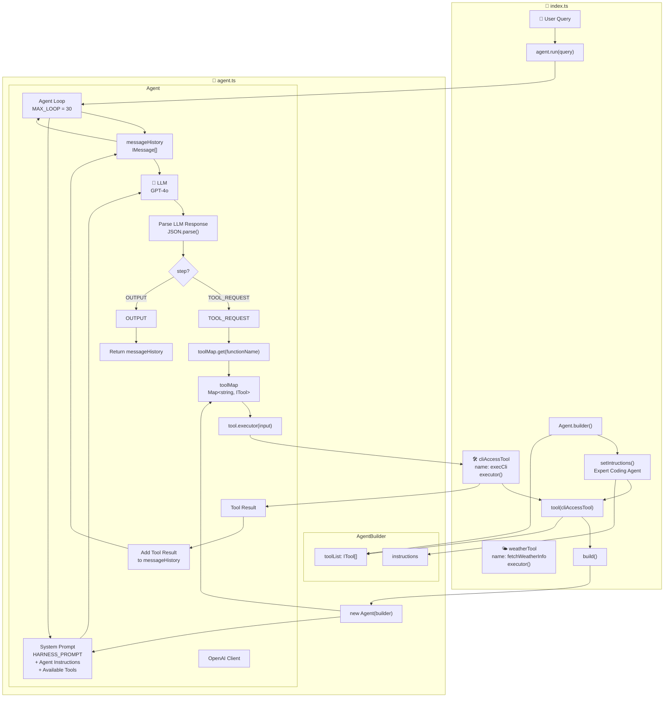
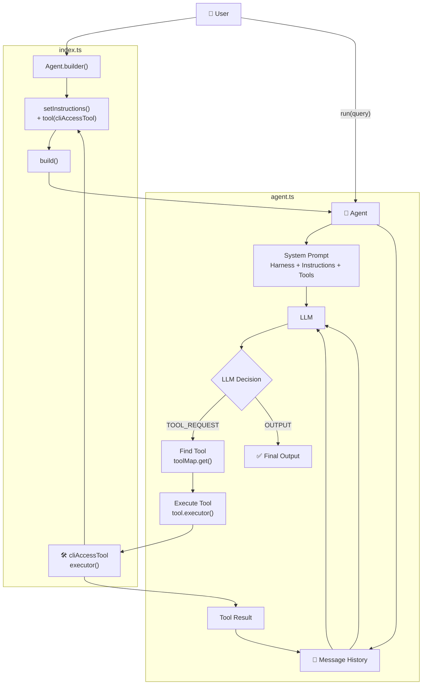

Yes. The easiest way to understand this code is to see it as a **small custom Agent framework**.

There are really only **2 important files**: 

* `agent.ts` → builds the **Agent engine**
* `index.ts` → creates an agent, gives it tools, and runs it

The relationship is:

```text
index.ts
   │
   │ imports
   ▼
agent.ts
   │
   ├── AgentBuilder
   │      └── creates/configures Agent
   │
   └── Agent
          ├── talks to OpenAI
          ├── remembers messages
          ├── decides whether to use a tool
          ├── executes the tool
          └── repeats until final output
```

---

# 1. First understand the big picture

Your code is implementing this loop:

```text
User
 │
 │ "Build hello world C++ program"
 ▼
Agent.run()
 │
 ▼
LLM
 │
 │ "I need to use execCli"
 ▼
Agent
 │
 ▼
Tool Map
 │
 │ find "execCli"
 ▼
execCli()
 │
 │ executes command
 ▼
Tool Result
 │
 ▼
Message History
 │
 ▼
LLM again
 │
 ▼
Final Answer
```

So the important idea is:

> **The LLM does not directly execute commands. The Agent receives the LLM's request, finds the appropriate tool, executes it, gives the result back to the LLM, and lets the LLM continue.**

---

# 2. `agent.ts` — The Agent Engine

Let's break it down from the beginning.

## Imports

```ts
import { HARNESS_PROMPT } from "./config.js";
import Openai from "openai";
```

Two things are imported.

### `HARNESS_PROMPT`

This comes from:

```text
./config.js
```

It is presumably a predefined prompt that tells the LLM **how it should behave and what format it should return**.

For example, it may instruct the model to return something like:

```json
{
  "step": "TOOL_REQUEST",
  "functionName": "execCli",
  "input": "touch hello.cpp"
}
```

or:

```json
{
  "step": "OUTPUT",
  "message": "Created hello.cpp"
}
```

The exact prompt isn't shown, but this is clearly what the code expects.

---

### OpenAI SDK

```ts
import Openai from "openai";
```

This allows your Agent to communicate with the LLM.

Later:

```ts
this.openai.chat.completions.create(...)
```

actually sends the messages to the model.

---

# 3. `IMessage`

```ts
export interface IMessage {
  role: "user" | "assistant" | "developer";
  content: string;
}
```

This defines the structure of a message.

For example:

```ts
{
  role: "user",
  content: "Create hello.cpp"
}
```

or:

```ts
{
  role: "assistant",
  content: "..."
}
```

or:

```ts
{
  role: "developer",
  content: "Tool execution result..."
}
```

So this interface is basically:

```text
IMessage
   │
   ├── role
   └── content
```

---

# 4. `ITool`

This is one of the most important parts.

```ts
export interface ITool {
  name: string;
  description: string;
  doc?: string;
  executor: (input: string) => Promise<string>;
}
```

A **tool** is basically a function that the Agent can give to the LLM.

Every tool needs:

```text
name
description
documentation
executor
```

For example, your weather tool:

```ts
const weatherTool: ITool = {
    name: "fetchWeatherInfo",
    description: "Fetches realtime weather data by cityname",
    doc: "fetchWeatherInfo(cityName: string): WeatherReport",

    async executor(cityName) {
        ...
    }
}
```

Think of it as:

```text
Tool
 │
 ├── Name
 │     fetchWeatherInfo
 │
 ├── Description
 │     Fetch weather
 │
 ├── Documentation
 │     How to call it
 │
 └── Executor
       Actual TypeScript function
```

The **LLM sees the description**, but **your application executes the executor**.

That's a very important distinction.

---

# 5. `Interceptor`

```ts
export type Interceptor = (message: IMessage) => void;
```

An interceptor is basically a **listener/logger**.

Whenever something important happens, the Agent can notify the interceptor.

For example:

```ts
agent.attachInterceptor(message => {
    console.log(
        `Message: ${message.role}: ${message.content}`
    );
});
```

Then whenever the Agent produces:

```text
assistant → ...
```

or:

```text
developer → tool result
```

your console can display it.

Think:

```text
Agent
 │
 ├── normal execution
 │
 └── notifyInterceptor()
          │
          ▼
      console.log()
```

---

# 6. `AgentBuilder`

Now we reach the builder.

```ts
export class AgentBuilder {
    public instructions: string | undefined;
    public toolList: ITool[];

    constructor() {
        this.toolList = [];
    }
```

The purpose of `AgentBuilder` is:

> Configure an Agent before creating it.

---

## Setting instructions

```ts
public setIntructions(instructions: string) {
    this.instructions = instructions;
    return this;
}
```

For example:

```ts
Agent.builder()
    .setIntructions("You are an expert coding agent")
```

Now:

```text
instructions
    ↓
"You are an expert coding agent"
```

Notice:

```ts
return this;
```

This enables **method chaining**.

That's why you can write:

```ts
Agent.builder()
    .setIntructions(...)
    .tool(...)
    .build()
```

instead of:

```ts
const builder = new AgentBuilder();

builder.setIntructions(...);
builder.tool(...);

const agent = builder.build();
```

---

# 7. Adding a tool

```ts
public tool(t: ITool) {
    this.toolList.push(t);
    return this;
}
```

Suppose:

```ts
.tool(cliAccessTool)
```

Then:

```text
AgentBuilder
     │
     ▼
toolList
     │
     └── cliAccessTool
```

You could add multiple tools:

```ts
Agent.builder()
    .setIntructions("You are an expert coding agent")
    .tool(cliAccessTool)
    .tool(weatherTool)
    .build();
```

Then the Agent would have both tools.

---

# 8. `build()`

```ts
public build() {
    return new Agent(this);
}
```

This is where the Builder creates the actual Agent.

So:

```ts
Agent.builder()
```

creates:

```text
AgentBuilder
```

Then:

```ts
.setIntructions(...)
.tool(...)
```

configures it.

Finally:

```ts
.build()
```

creates:

```text
Agent
```

The connection is:

```text
Agent.builder()
      │
      ▼
AgentBuilder
      │
      │ instructions
      │ tools
      ▼
build()
      │
      ▼
new Agent(builder)
```

---

# 9. `Agent` class

Now we reach the actual brain/orchestrator.

```ts
export class Agent {
```

It contains:

```ts
private instructions: string;
private messageHistory: IMessage[];
private toolMap: Map<string, ITool>;
private openai: Openai;
private interceptors: Interceptor[];
private MAX_LOOP = 30;
```

Let's understand each.

---

## `instructions`

```ts
private instructions: string;
```

This becomes the system prompt sent to the LLM.

---

## `messageHistory`

```ts
private messageHistory: IMessage[];
```

This is the Agent's memory for the current conversation/run.

Example:

```text
messageHistory

1. user
   "Create hello.cpp"

2. assistant
   "I need to call execCli"

3. developer
   "execCli returned: ..."

4. assistant
   "The file has been created"
```

This is how the Agent maintains context between LLM calls.

---

## `toolMap`

```ts
private toolMap: Map<string, ITool>;
```

This is used to quickly find a tool by name.

For example:

```text
"execCli"
     ↓
cliAccessTool
```

So when the LLM says:

```json
{
  "functionName": "execCli"
}
```

the Agent can do:

```ts
this.toolMap.get("execCli")
```

and retrieve the actual tool.

---

# 10. Creating the OpenAI client

```ts
this.openai = new Openai({
    apiKey: "",
});
```

This creates the OpenAI client.

In a real application, you would normally use an environment variable rather than hard-code or leave the API key empty.

Conceptually:

```text
Agent
  │
  ▼
OpenAI SDK
  │
  ▼
LLM
```

---

# 11. Converting tools into `toolMap`

This code is very important:

```ts
for (const t of builder.toolList) {
    this.toolMap.set(t.name, t);
}
```

Suppose `builder.toolList` contains:

```text
[
  cliAccessTool,
  weatherTool
]
```

The loop creates:

```text
toolMap

"execCli"           → cliAccessTool
"fetchWeatherInfo"  → weatherTool
```

Why?

Because later the LLM gives you the **tool name**.

Example:

```json
{
  "functionName": "execCli"
}
```

Then:

```ts
const tool = this.toolMap.get(functionName);
```

finds:

```text
"execCli"
    ↓
cliAccessTool
```

---

# 12. Building the System Prompt

This part is extremely important:

```ts
this.instructions = `
    ${HARNESS_PROMPT}

    System Prompt:
    ${builder.instructions}

    Available Tools:
    ${builder.toolList
      .map((t) => JSON.stringify({
          functionName: t.name,
          functionDescription: t.description,
          functionDoc: t.doc
      }))
      .join("\n")}
`;
```

This combines three things.

### 1. Harness instructions

```text
HARNESS_PROMPT
```

### 2. Agent-specific instructions

For your coding agent:

```text
You are an expert coding agent
```

### 3. Available tools

Something conceptually like:

```text
Available Tools:

{
  "functionName": "execCli",
  "functionDescription": "Runs a CLI command...",
  "functionDoc": "execCli(cli: string): CLIResponse"
}
```

So the final prompt becomes roughly:

```text
HARNESS PROMPT

System Prompt:
You are an expert coding agent

Available Tools:
{
   functionName: "execCli",
   ...
}
```

This is how the LLM **learns what tools are available**.

---

# 13. `run()` — The most important function

Everything comes together here:

```ts
public async run(query: string)
```

When you call:

```ts
agent.run(
  "can you build a simple hello world program in c++..."
)
```

execution enters this function.

---

# 14. Step 1 — Add user's query to history

```ts
this.messageHistory.push({
    role: "user",
    content: query
});
```

Now:

```text
messageHistory

[
  {
    role: "user",
    content: "Can you build..."
  }
]
```

---

# 15. Step 2 — Start Agent loop

```ts
for (let i = 0; i < this.MAX_LOOP; i++)
```

Your maximum is:

```ts
MAX_LOOP = 30
```

So the Agent can perform up to **30 reasoning/tool cycles**.

Why?

Because an agent may need multiple steps.

For example:

```text
User
 ↓
LLM
 ↓
execCli
 ↓
LLM
 ↓
execCli
 ↓
LLM
 ↓
Final answer
```

Without a loop, you would only get one LLM call.

---

# 16. Step 3 — Call the LLM

This is the core:

```ts
const llmResponse =
    await this.openai.chat.completions.create({
        model: "gpt-4o",
        messages: [
            {
                role: "system",
                content: this.instructions
            },

            ...this.messageHistory.map((e) => ({
                role: e.role,
                content: e.content,
            })),
        ],
    });
```

The LLM receives:

```text
SYSTEM PROMPT
      +
MESSAGE HISTORY
```

For example:

```text
SYSTEM:
You are an expert coding agent.
Available tools:
execCli(...)

USER:
Create hello.cpp
```

The model then decides what to do.

---

# 17. LLM response comes back

```ts
const rawLLMResponse =
    llmResponse.choices[0]?.message.content as string;
```

Suppose the model returns:

```json
{
  "step": "TOOL_REQUEST",
  "functionName": "execCli",
  "input": "echo '#include <iostream>' > hello.cpp"
}
```

At this point it is still just a **string**.

---

# 18. Save LLM response to history

```ts
this.messageHistory.push({
    role: "assistant",
    content: rawLLMResponse
});
```

Now history contains:

```text
USER
 ↓
"Create hello.cpp"

ASSISTANT
 ↓
{
  step: TOOL_REQUEST,
  functionName: execCli,
  ...
}
```

Then:

```ts
this.notifyInterceptors(...)
```

lets your logger see the assistant response.

---

# 19. Parse LLM response

```ts
const parsedReult = JSON.parse(rawLLMResponse);
```

This converts:

```text
"{\"step\":\"TOOL_REQUEST\", ...}"
```

into a JavaScript object:

```ts
{
    step: "TOOL_REQUEST",
    functionName: "execCli",
    input: "..."
}
```

Now your application can inspect it.

---

# 20. Two possible paths

The LLM response can essentially tell the Agent:

```text
What should happen next?
```

There are two major possibilities.

```text
              LLM Response
                   │
             ┌─────┴─────┐
             │           │
          OUTPUT      TOOL_REQUEST
             │           │
             ▼           ▼
           STOP       Execute tool
```

---

# 21. `OUTPUT` — Finish

```ts
if (
    parsedReult.step.toLowerCase() === "output"
)
    return this.messageHistory;
```

If the LLM says:

```json
{
  "step": "OUTPUT"
}
```

the Agent stops the loop.

So:

```text
LLM
 │
 │ OUTPUT
 ▼
return messageHistory
```

---

# 22. `TOOL_REQUEST` — Execute a tool

Now the interesting part:

```ts
if (
    parsedReult.step.toLowerCase() === "tool_request"
) {
```

Suppose LLM returned:

```json
{
  "step": "TOOL_REQUEST",
  "functionName": "execCli",
  "input": "touch hello.cpp"
}
```

The code extracts:

```ts
const { functionName, input } = parsedReult;
```

So:

```text
functionName = "execCli"
input = "touch hello.cpp"
```

---

# 23. Find the tool

```ts
const tool = this.toolMap.get(functionName);
```

This is where your `index.ts` tool connects to `agent.ts`.

Remember:

```ts
.tool(cliAccessTool)
```

put the tool into:

```text
AgentBuilder
     ↓
toolList
     ↓
Agent constructor
     ↓
toolMap
```

So now:

```ts
this.toolMap.get("execCli")
```

returns:

```ts
cliAccessTool
```

---

# 24. Execute the tool

This is the critical connection:

```ts
const toolResult =
    await tool.executor(input);
```

The LLM doesn't execute the command.

Instead:

```text
LLM
 │
 │ functionName = execCli
 ▼
Agent
 │
 │ toolMap.get("execCli")
 ▼
cliAccessTool
 │
 │ executor(input)
 ▼
child_process.exec()
 │
 ▼
Your computer
```

That's the actual Agent architecture.

---

# 25. What `execCli` does

In `index.ts`:

```ts
const cliAccessTool: ITool = {
    name: "execCli",

    description:
      "Runs a CLI command on users machine and returns output",

    doc:
      "execCli(cli: string): CLIResponse",

    executor(cmd) {
        return new Promise((res, rej) => {
            exec(cmd, (err, out) => {
                if (err)
                    return res(`There was an Error ${err}`);
                else
                    return res(out);
            });
        });
    }
}
```

The important line is:

```ts
exec(cmd, ...)
```

which comes from:

```ts
import { exec } from "child_process";
```

So your custom tool is basically a wrapper around Node.js's command execution.

---

# 26. Tool result goes back into history

After execution:

```ts
this.messageHistory.push({
    role: "developer",
    content: JSON.stringify({
        functionName,
        input,
        toolResult,
    }),
});
```

Suppose command output is:

```text
hello.cpp created successfully
```

The Agent adds something like:

```json
{
  "functionName": "execCli",
  "input": "touch hello.cpp",
  "toolResult": "..."
}
```

to the message history.

Now the LLM can see the result.

---

# 27. Then the loop continues

There is no explicit:

```ts
continue;
```

needed because the `for` loop naturally reaches its next iteration.

So:

```text
Iteration 1
    ↓
LLM
    ↓
TOOL_REQUEST
    ↓
execute tool
    ↓
save result
    ↓
Iteration 2
    ↓
LLM again
```

The second LLM call gets:

```text
SYSTEM PROMPT

USER:
Create hello.cpp

ASSISTANT:
TOOL_REQUEST execCli...

DEVELOPER:
execCli result...
```

The model can now decide:

```text
I have enough information.
```

and return:

```json
{
  "step": "OUTPUT"
}
```

Then the Agent stops.

---

# 28. `index.ts` — Where everything is connected

Now let's move to your second file.

At the top:

```ts
import { Agent, AgentBuilder } from './app/agent.js'
import type { ITool } from './app/agent.js'
```

This is the direct connection between:

```text
index.ts
   ↓
agent.ts
```

`index.ts` imports the Agent framework you created in `agent.ts`.

---

# 29. Creating `weatherTool`

```ts
const weatherTool: ITool = {
```

Because it says:

```ts
: ITool
```

TypeScript ensures this object follows the tool structure:

```text
name
description
doc
executor
```

The executor:

```ts
async executor(cityName) {
    const response = await axios.get(url);
    return JSON.stringify(...);
}
```

actually calls:

```text
wttr.in
```

and returns weather information.

---

# 30. Creating `cliAccessTool`

Same concept:

```ts
const cliAccessTool: ITool = {
```

but instead of calling an HTTP API, it calls:

```ts
exec(cmd, ...)
```

So:

```text
weatherTool
     ↓
HTTP request
     ↓
Weather API

cliAccessTool
     ↓
child_process.exec
     ↓
Local machine
```

Both follow the exact same `ITool` contract.

That's the power of your design.

---

# 31. Creating the coding Agent

This is probably the most important code in `index.ts`:

```ts
const agent: Agent = Agent.builder()
    .setIntructions(`You are an expert coding agent`)
    .tool(cliAccessTool)
    .build()
```

Let's execute this mentally.

### Step 1

```ts
Agent.builder()
```

returns:

```text
new AgentBuilder()
```

### Step 2

```ts
.setIntructions(...)
```

stores:

```text
instructions =
"You are an expert coding agent"
```

### Step 3

```ts
.tool(cliAccessTool)
```

stores:

```text
toolList = [
    cliAccessTool
]
```

### Step 4

```ts
.build()
```

does:

```ts
new Agent(builder)
```

Now the Agent constructor:

```text
builder.instructions
        ↓
Agent.instructions

builder.toolList
        ↓
Agent.toolMap
```

So finally:

```text
Agent
 ├── instructions
 │     └── coding agent
 │
 ├── toolMap
 │     └── "execCli" → cliAccessTool
 │
 ├── messageHistory
 │     └── []
 │
 └── OpenAI client
```

---

# 32. These two Agents are separate

You also create:

```ts
const weatherAgent: Agent = Agent.builder()
    .setIntructions(`You are an expert weather agent`)
    .tool(weatherTool)
    .build()
```

This Agent has:

```text
instructions:
"expert weather agent"

tools:
fetchWeatherInfo
```

Then:

```ts
const xyzAgent: Agent = Agent.builder()
    .setIntructions(`You are an expert weather agent`)
    .tool(weatherTool)
    .build()
```

This creates another completely separate Agent.

Currently, `weatherAgent` and `xyzAgent` aren't used afterward, so they don't affect the execution you're showing.

---

# 33. Interceptor connection

You then do:

```ts
agent.attachInterceptor(
    message =>
        console.log(
            `Message: ${message.role}: ${message.content}`
        )
);
```

This connects your logger to the Agent.

Inside `Agent`:

```ts
attachInterceptor(interceptor) {
    this.interceptors.push(interceptor);
}
```

Later:

```ts
notifyInterceptors(message)
```

runs:

```ts
interceptor(message)
```

So:

```text
index.ts
   │
   │ attachInterceptor(...)
   ▼
Agent.interceptors
   │
   │ notifyInterceptors(...)
   ▼
console.log(...)
```

---

# 34. Finally `agent.run()`

Your actual execution starts here:

```ts
const result = await agent.run(
    'can you build a simple hello world program in c++ on my current project as hello.cpp'
)
```

The complete flow is:

```text
                    index.ts
                       │
                       │ agent.run(query)
                       ▼
                 ┌─────────────┐
                 │    Agent    │
                 │   run()     │
                 └──────┬──────┘
                        │
                        ▼
                Add user message
                        │
                        ▼
                Call OpenAI LLM
                        │
                        ▼
                LLM returns JSON
                        │
             ┌──────────┴──────────┐
             │                     │
        TOOL_REQUEST             OUTPUT
             │                     │
             ▼                     ▼
       Find tool                 Stop
             │
             ▼
      toolMap.get(...)
             │
             ▼
       execCli tool
             │
             ▼
     child_process.exec()
             │
             ▼
      Local machine
             │
             ▼
       toolResult
             │
             ▼
      Message History
             │
             ▼
       Call LLM again
             │
             ▼
          OUTPUT
             │
             ▼
          return
```

---

# 35. The entire connection in one diagram

This is probably the most useful way to remember your code:

```text
                         index.ts
                            │
             ┌──────────────┼──────────────┐
             │              │              │
             ▼              ▼              ▼
       cliAccessTool   weatherTool    Agent.builder()
             │              │              │
             │              │              ▼
             │              │        AgentBuilder
             │              │              │
             │              │       .setInstructions()
             │              │              │
             │              │       .tool(cliAccessTool)
             │              │              │
             │              │              ▼
             │              │            build()
             │              │              │
             │              │              ▼
             │              │        new Agent(builder)
             │              │              │
             │              │              ├── instructions
             │              │              │
             │              │              ├── messageHistory
             │              │              │
             │              │              ├── toolMap
             │              │              │      │
             │              │              │      └── "execCli"
             │              │              │             ↓
             │              │              │        cliAccessTool
             │              │              │
             │              │              └── OpenAI
             │              │
             └──────────────┴─────────────────────┐
                                                  │
                                                  ▼
                                             agent.run()
                                                  │
                                                  ▼
                                               OpenAI
                                                  │
                                    ┌─────────────┴────────────┐
                                    │                          │
                             TOOL_REQUEST                   OUTPUT
                                    │                          │
                                    ▼                          ▼
                              toolMap.get()                  STOP
                                    │
                                    ▼
                              executor(input)
                                    │
                                    ▼
                              Tool Result
                                    │
                                    ▼
                            messageHistory
                                    │
                                    ▼
                              OpenAI again
```

---

# 36. The most important concept: LLM vs Agent

One thing I would strongly recommend understanding from this code:

### The LLM is not the Agent.

Your architecture is:

```text
                 ┌───────────────┐
                 │      LLM      │
                 │  "What next?" │
                 └───────┬───────┘
                         │
                         ▼
                 ┌───────────────┐
                 │     Agent     │
                 │  Orchestrator │
                 └───────┬───────┘
                         │
                  ┌──────┴──────┐
                  ▼             ▼
                Tool          Output
                  │
                  ▼
              Executor
                  │
                  ▼
           External world
```

The **LLM decides**.

The **Agent orchestrates**.

The **Tool performs the actual action**.

---

# 37. Your code is basically a ReAct-style loop

Conceptually:

```text
User
 ↓
THINK/DECIDE
 ↓
ACTION → Tool
 ↓
OBSERVATION → Tool result
 ↓
THINK/DECIDE
 ↓
ACTION → Tool
 ↓
OBSERVATION
 ↓
FINAL OUTPUT
```

Your implementation represents this using:

```json
{
  "step": "TOOL_REQUEST"
}
```

and:

```json
{
  "step": "OUTPUT"
}
```

So the model communicates its next step to your Agent through structured JSON.

---

# 38. One complete example

Suppose user asks:

```text
Create hello.cpp
```

### First LLM call

Agent sends:

```text
SYSTEM:
You are an expert coding agent.
Available Tools:
execCli(...)
```

plus:

```text
USER:
Create hello.cpp
```

LLM might return:

```json
{
  "step": "TOOL_REQUEST",
  "functionName": "execCli",
  "input": "cat > hello.cpp <<'EOF'\n#include <iostream>\nint main(){ std::cout << \"Hello World\"; }\nEOF"
}
```

Agent does:

```ts
toolMap.get("execCli")
```

↓

```text
cliAccessTool
```

Then:

```ts
tool.executor(input)
```

↓

```ts
exec(cmd)
```

↓

```text
hello.cpp created
```

Then Agent adds:

```text
developer:
{
  functionName: "execCli",
  input: "...",
  toolResult: "..."
}
```

to history.

### Second LLM call

The LLM sees:

```text
USER:
Create hello.cpp

ASSISTANT:
TOOL_REQUEST...

DEVELOPER:
Tool result...
```

Then it may return:

```json
{
  "step": "OUTPUT",
  "message": "Created hello.cpp successfully."
}
```

Agent sees:

```ts
step === "OUTPUT"
```

and stops.

---

# 39. One small but important issue in your code

You have:

```ts
console.log(result![result?.length! - 1])
```

Since `run()` returns:

```ts
this.messageHistory
```

you're printing the **last message in history**, not necessarily extracting the final answer from the JSON.

Also, your `OUTPUT` handling currently does:

```ts
return this.messageHistory;
```

It doesn't explicitly extract something like:

```ts
parsedResult.message
```

So your architecture could later be improved to return a cleaner result:

```text
Agent.run()
    ↓
AgentResult
    ├── output
    ├── messages
    └── toolCalls
```

rather than making the caller inspect `messageHistory`.

---

# 40. One more important security issue

This tool:

```ts
exec(cmd)
```

combined with an LLM is **extremely powerful**.

You are effectively giving the model:

```text
LLM → Agent → arbitrary shell command → user's machine
```

For example, the model could potentially generate destructive commands.

So this is fine as a **learning project**, but a production coding agent needs things such as:

```text
Command allowlist / denylist
Sandbox
Filesystem restrictions
Permission approval
Timeouts
Resource limits
Working-directory restriction
Command validation
Audit logs
```

The architecture you're learning, though, is exactly the important foundation.

---

## In one sentence

Your two files work together like this:

> **`index.ts` defines the Agent's personality and tools, `AgentBuilder` packages those configurations, `agent.ts` creates the actual Agent, the Agent sends the user's request + available tools to the LLM, interprets the LLM's JSON decision, executes the requested tool, puts the result back into message history, and keeps looping until the LLM says `OUTPUT`.**
---

-------

----------

Absolutely — here is a **clean Mermaid diagram** you can paste directly into a Mermaid editor. It focuses on **how `index.ts`, `agent.ts`, `AgentBuilder`, `Agent`, LLM, tools, and the execution loop connect**.



### Simplified version

If you want a **cleaner diagram for notes/documentation**, use this one:



The **second diagram is better for your handwritten notes / learning material** because it clearly shows the main relationship:

**User → Agent → LLM → Tool → Result → LLM → Final Output**.
