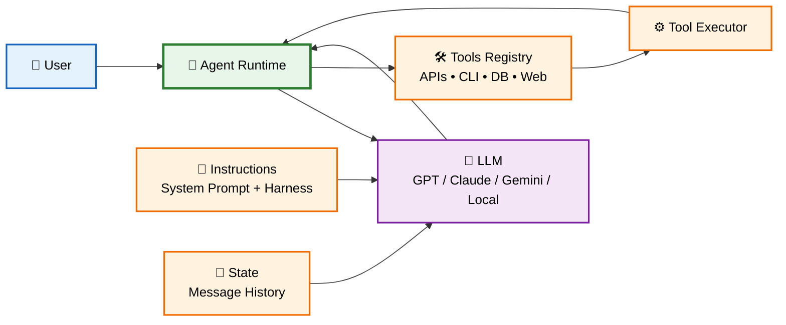
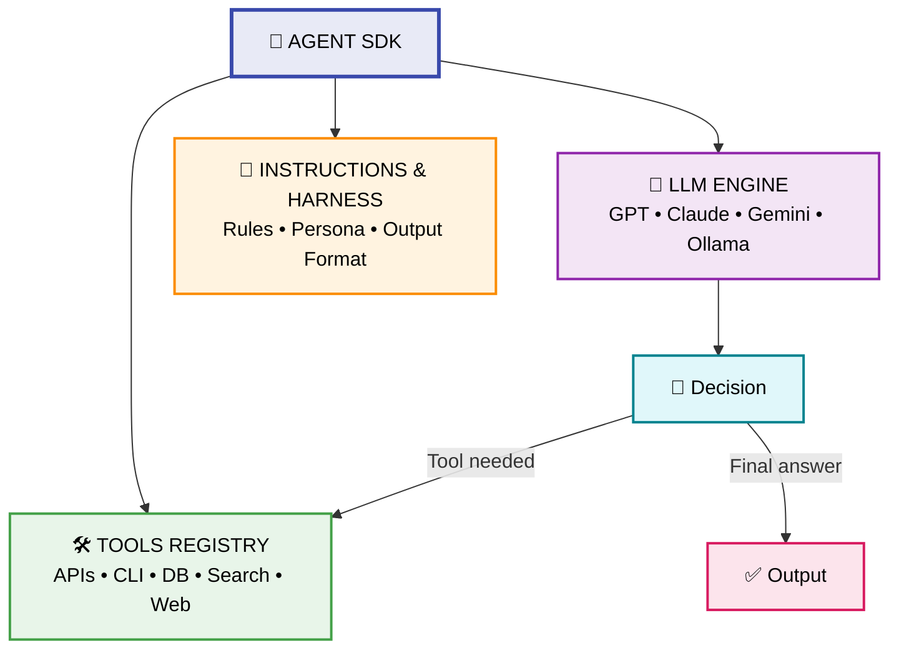
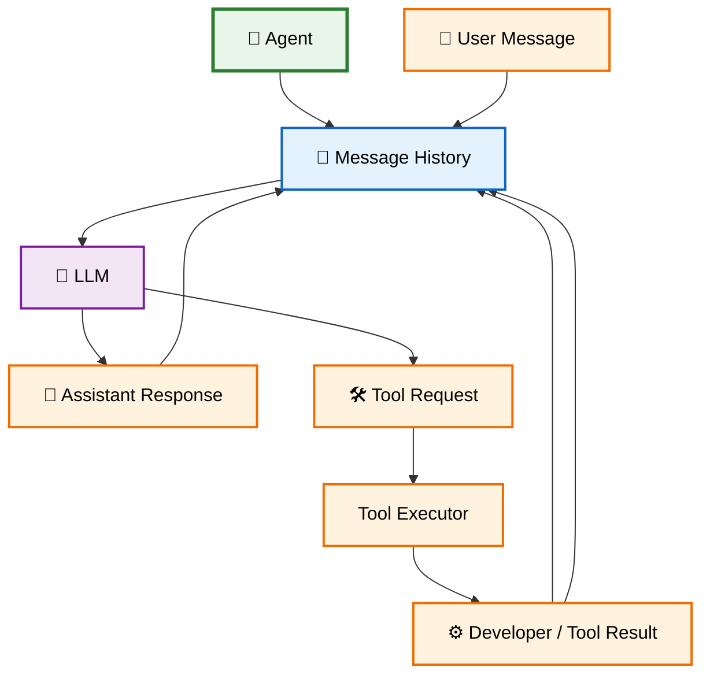
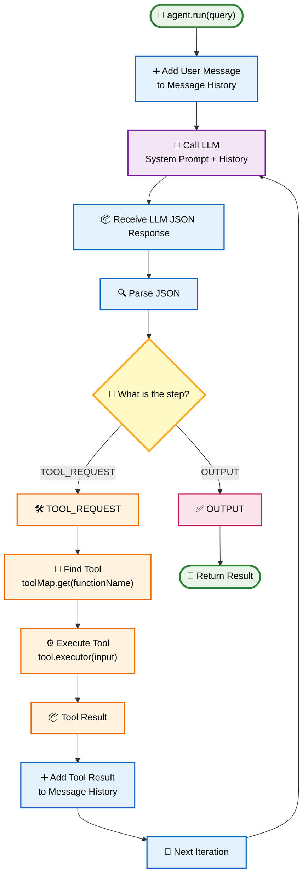
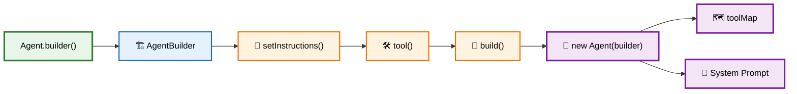
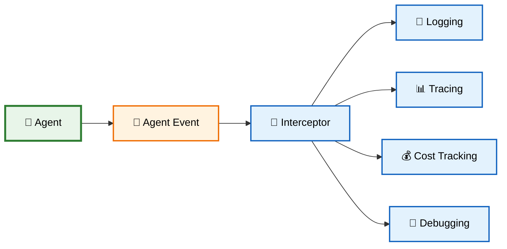
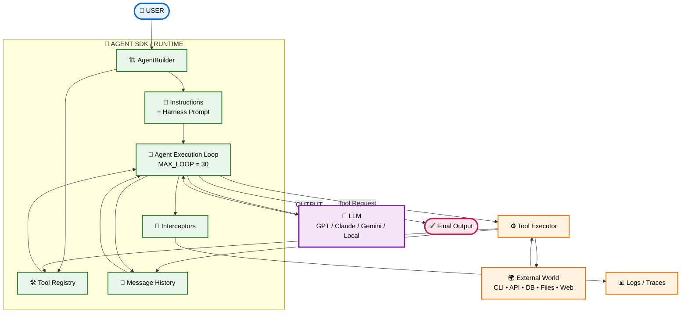
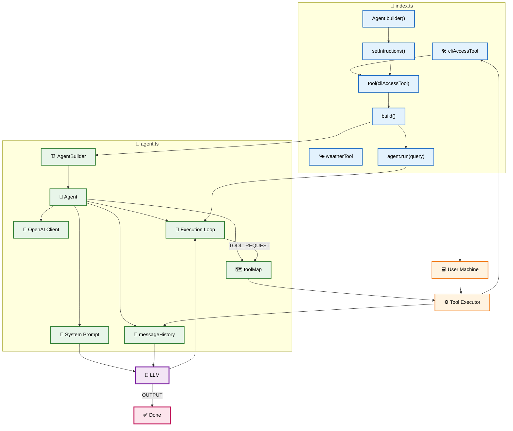

# 🤖 01 — Introduction to Agent SDK & Core Architecture

> **Goal:** Understand what an Agent SDK adds on top of a raw LLM API and how **Instructions → Tools → State → LLM → Execution Loop** work together.

---

# 1. 🧠 What is an Agent SDK?

An **Agent Software Development Kit (SDK)** is an abstraction layer built on top of raw LLM APIs such as OpenAI, Anthropic, Gemini, or local models.

A raw LLM API mainly gives you:

```text
Request → LLM → Response
```

But a real-world agent needs much more:

```text
User
  ↓
Agent Runtime
  ├── 🧠 State / Memory
  ├── 📜 Instructions
  ├── 🛠️ Tools
  ├── 🔄 Execution Loop
  ├── 👀 Interceptors / Observability
  └── 🤖 LLM
```

### Without an Agent SDK

The developer manually handles:

* Message history
* Tool registration
* Tool execution
* Parsing model responses
* Calling the model again
* Loop control
* Errors
* Logging
* Observability

### With an Agent SDK

These responsibilities are packaged into reusable abstractions:

```text
Agent
 ├── Instructions
 ├── Message History
 ├── Tool Registry
 ├── LLM Client
 ├── Execution Loop
 └── Interceptors
```

---

# 2. 🏗️ Core Agent Architecture

The simplest mental model is:



### The key idea

An Agent is **not just an LLM**.

Instead:

> **Agent = LLM + Instructions + State + Tools + Execution Loop**

---

# 3. 🧩 The Core Agent Triad

At the center of an Agent SDK are three major components:



## 3.1 🧠 LLM Engine

The LLM is responsible for:

* Understanding the user's request
* Reasoning about what needs to happen
* Choosing whether a tool is needed
* Generating the next response/action

Examples:

```text
GPT
Claude
Gemini
Llama
Qwen
Ollama models
```

**Important:** The LLM does **not directly execute your tools**.

It can say:

```json
{
  "step": "TOOL_REQUEST",
  "functionName": "execCli",
  "input": "..."
}
```

Your Agent runtime then executes the actual function.

---

# 4. 📜 Instructions & Harness

The Agent provides the LLM with instructions that define:

### System Instructions

Tell the agent **who it is and what its job is**.

Example:

```text
You are an expert coding agent.
```

### Harness Prompt

Defines **how the agent should behave internally**.

For example, it can instruct the LLM to return structured actions such as:

```json
{
  "step": "TOOL_REQUEST",
  "functionName": "execCli",
  "input": "..."
}
```

or:

```json
{
  "step": "OUTPUT",
  "message": "Task completed."
}
```

So conceptually:

```text
Agent Instructions
        +
Harness Rules
        ↓
   System Prompt
        ↓
       LLM
```

---

# 5. 🛠️ Tools Registry

Tools give the Agent access to the outside world.

Examples:

```text
🖥️ CLI
🌐 Web/API
🗄️ Database
📁 File System
🔍 Search
📧 Email
📅 Calendar
💳 Payment API
```

A tool generally contains:

```ts
interface ITool {
    name: string;
    description: string;
    doc?: string;
    executor: (input: string) => Promise<string>;
}
```

Think of a tool as:

```text
🛠️ Tool
 │
 ├── Name
 ├── Description
 ├── Documentation
 └── Executor
        ↓
   Actual Function
```

### Important distinction

```text
LLM
 │
 │ decides
 ▼
"Use execCli"
 │
 ▼
Agent Runtime
 │
 │ executes
 ▼
execCli()
 │
 ▼
Operating System
```

The **LLM decides**.

The **runtime executes**.

---

# 6. 🧠 Agent State & Message History

LLM API calls are generally **stateless**.

If you make:

```text
Request 1 → Response 1
```

and then:

```text
Request 2 → Response 2
```

the model does not automatically know Request 1.

The Agent runtime maintains state by storing previous messages and sending the relevant history again.



### Message roles in your implementation

Your `IMessage` defines:

```ts
type IMessage = {
    role: "user" | "assistant" | "developer";
    content: string;
}
```

So history can look like:

```text
1. user
   "Create hello.cpp"

2. assistant
   TOOL_REQUEST → execCli

3. developer
   Tool result → file created

4. assistant
   OUTPUT → Task completed
```

---

# 7. 🔄 The Agent Execution Loop

This is the **heart of your Agent implementation**.



---

# 8. 🔁 How the Tool Loop Works

Suppose the user says:

```text
Create hello.cpp containing a C++ Hello World program.
```

The Agent sends the LLM:

```text
System Prompt
+
Available Tools
+
User Request
```

The LLM may return:

```json
{
  "step": "TOOL_REQUEST",
  "functionName": "execCli",
  "input": "..."
}
```

The Agent then performs:

```text
functionName
      ↓
"execCli"
      ↓
toolMap.get("execCli")
      ↓
cliAccessTool
      ↓
executor(input)
      ↓
Operating System
      ↓
Tool Result
```

The result is added to history.

Then the LLM is called **again**.

Eventually:

```json
{
  "step": "OUTPUT",
  "message": "hello.cpp created successfully."
}
```

The loop stops.

---

# 9. 🏗️ Builder Pattern in Your Agent SDK

Your code uses the **Builder Pattern**.

Instead of:

```ts
new Agent(...)
```

directly, you write:

```ts
const agent = Agent.builder()
    .setIntructions("You are an expert coding agent")
    .tool(cliAccessTool)
    .build();
```

The flow is:



### Why Builder?

It makes Agent configuration readable:

```ts
Agent.builder()
    .setIntructions(...)
    .tool(...)
    .tool(...)
    .build();
```

You can easily add more configuration later:

```ts
.maxIterations(30)
.model("gpt-4o")
.temperature(0)
.interceptor(...)
```

---

# 10. 👀 Interceptors & Observability

Your Agent also supports:

```ts
agent.attachInterceptor(...)
```

An interceptor can observe important Agent events.



For example, your code:

```ts
agent.attachInterceptor(message => {
    console.log(
        `Message: ${message.role}: ${message.content}`
    );
});
```

allows you to see what is happening inside the Agent.

---

# 11. ⚖️ Raw LLM API vs Agent SDK

| Dimension               | Raw LLM API                  | Agent SDK                        |
| ----------------------- | ---------------------------- | -------------------------------- |
| 🧠 **State**            | Developer manages history    | Agent runtime manages history    |
| 🛠️ **Tools**           | Manually implemented         | Tool registry + executor         |
| 🔄 **Loop**             | Usually one request/response | Multi-step execution loop        |
| 📜 **Instructions**     | Manually constructed         | Agent configuration              |
| 🏗️ **Configuration**   | Scattered parameters         | Builder pattern                  |
| 👀 **Observability**    | Manual logging               | Interceptors/hooks               |
| 🛡️ **Loop Safety**     | Developer responsibility     | `MAX_LOOP` / runtime limits      |
| 🧩 **Architecture**     | Low-level                    | Higher-level abstraction         |
| 🔁 **Multi-step Tasks** | Manual orchestration         | Agent orchestrates automatically |

---

# 12. 🧠 Complete Agent Architecture

Put everything together:



---

# 13. 🔗 How Your Two Files Connect

Your specific project can be understood like this:



---

# 14. 🧭 The Complete Mental Model

Remember the architecture in **7 steps**:

```text
1️⃣ USER
   ↓
2️⃣ AGENT
   ↓
3️⃣ INSTRUCTIONS + HISTORY
   ↓
4️⃣ LLM
   ↓
5️⃣ DECISION
   ↓
6️⃣ TOOL EXECUTION
   ↓
7️⃣ RESULT → HISTORY → LLM → OUTPUT
```

Or even shorter:

> **🧠 LLM decides → 🤖 Agent orchestrates → 🛠️ Tool acts → 🧠 State remembers → 🔄 Loop continues**

---

# 15. 🔑 Key Takeaways

### 1. 🤖 Agent ≠ LLM

An LLM generates decisions/responses.
The Agent runtime manages the entire execution process.

### 2. 🧠 State is managed by the runtime

The model doesn't magically remember previous API calls. The Agent maintains `messageHistory` and sends the relevant history back to the model.

### 3. 🛠️ Tools connect AI to the real world

```text
LLM
 ↓
Tool Request
 ↓
Agent
 ↓
Executor
 ↓
Real World
```

### 4. 🔄 The loop creates agentic behavior

```text
LLM
 ↓
Tool
 ↓
Result
 ↓
LLM
 ↓
Tool
 ↓
Result
 ↓
LLM
 ↓
Final Output
```

### 5. 🏗️ Builder makes Agent creation clean

```ts
Agent.builder()
    .setIntructions(...)
    .tool(...)
    .build();
```

### 6. 👀 Interceptors provide observability

They allow you to monitor:

* Messages
* Tool calls
* Tool results
* Errors
* Execution behavior

### 7. 🛡️ Production agents need safety controls

Your `MAX_LOOP = 30` is a basic safeguard. Production agents should additionally consider:

```text
Timeouts
Rate limits
Tool permissions
Sandboxing
Input validation
Output validation
Human approval
Error handling
Cost limits
Audit logging
```

## 🎯 Final Formula

$$
\boxed{
\text{Agent System}
=
\text{LLM}
+
\text{Instructions}
+
\text{State}
+
\text{Tools}
+
\text{Execution Loop}
+
\text{Observability}
}
$$

**The most important flow to remember:**

```text
👤 User
  ↓
🤖 Agent
  ↓
🧠 LLM decides
  ↓
🎯 Tool Request?
  ↓
🛠️ Execute Tool
  ↓
📦 Tool Result
  ↓
🧠 Update State
  ↓
🤖 LLM again
  ↓
✅ Final Output
```
