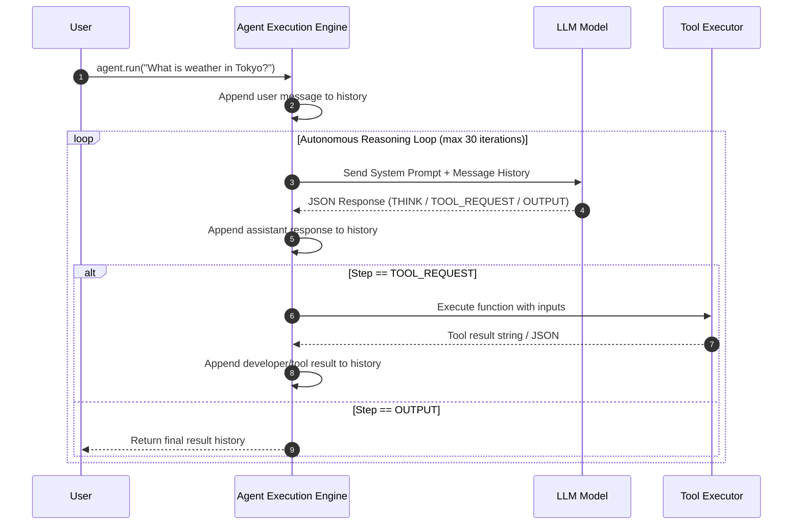

# 🤖 01 — Introduction to Agent SDK & Core Architecture

## 1. What is an Agent SDK?

An **Agent Software Development Kit (SDK)** is an abstraction layer built on top of raw LLM APIs (e.g., OpenAI, Anthropic, Gemini) that provides structured primitives for constructing **autonomous AI agents**.

While raw LLM APIs are **stateless request-response endpoints**, real-world autonomous agents require:
1. **State Persistence**: Maintaining chat history, developer context, tool outputs, and execution history across multi-turn interactions.
2. **Tool Orchestration**: Registering, serializing, selecting, and executing external functions/APIs.
3. **Structured Reasoning Loops**: Enforcing reasoning frameworks (e.g., ReAct, Harness Pipelines) to prevent hallucinations and unhandled loop divergence.
4. **Lifecycle Hooks & Observability**: Intercepting messages, tool calls, and model outputs for telemetry, logging, streaming, and cost control.

---

## 2. The Core Agent Triad

Every agent built with an Agent SDK relies on three fundamental components:

```
                  +-----------------------------------+
                  |            AGENT SDK              |
                  +-----------------------------------+
                                    |
        +---------------------------+---------------------------+
        |                           |                           |
        v                           v                           v
+---------------+           +---------------+           +---------------+
|   LLM BRAIN   |    +      | INSTRUCTIONS  |    +      |  TOOLS MAP    |
| (GPT-4o/Gemini|           | & HARNESS     |           | (APIs, CLI,   |
| /Claude/Ollama|           | PROMPTS       |           | DBs, Web)     |
+---------------+           +---------------+           +---------------+
```

$$\text{Agent System} = \text{LLM Engine} + (\text{System Instructions} + \text{Harness Prompt}) + \text{Tools Registry}$$

1. **LLM Engine**: The base foundation model responsible for language understanding, decision-making, and output generation.
2. **System Instructions & Harness Prompt**: The rules, persona, and structured output formatting instructions guiding the agent's behavior.
3. **Tools Registry**: The list of executable functions exposed to the model, complete with JSON schema descriptions and execution handlers.

---

## 3. Architecture Comparison: Raw API vs. Agent SDK

| Architecture Dimension | Raw LLM API Call | Agent SDK Architecture |
| :--- | :--- | :--- |
| **State Management** | Manual array manipulation on every request | Automatic `messageHistory` state engine |
| **Tool Execution** | Developer manually checks response, invokes function, passes output back | Agent framework executes tools automatically inside run loop |
| **Loop Control** | Single turn (1 request $\rightarrow$ 1 response) | Autonomous multi-turn loop with safety bounds (`MAX_LOOP`) |
| **Observability** | Standard HTTP logging | Event-driven interceptors (`attachInterceptor`) |
| **Configuration** | Scattered params across API calls | Fluent Builder Pattern (`Agent.builder()`) |

---

## 4. Message State Execution Flow

In an Agent SDK, state is maintained as an ordered sequence of messages. The state transitions through three primary roles:

- `user`: Inputs supplied by the human user.
- `assistant`: Thoughts, intermediate steps, tool calls, and final answers produced by the agent.
- `developer` / `tool`: Structured outputs returned by tool executions, errors, or system-injected state updates.



---

## 5. Summary Key Takeaways

1. **Raw APIs are stateless**; Agent SDKs introduce **stateful execution runtime**.
2. **Agent SDKs standardize agent building** through cohesive primitives (Builder, Harness, Tools, State History, Interceptors).
3. **Message State Execution** ensures full context awareness at each step of autonomous problem solving.
