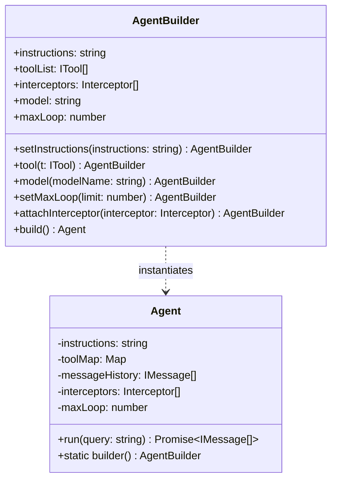

# 🏗️ 02 — Builder Pattern & Agent Configuration

## 1. Why Use the Builder Pattern for Agents?

When designing an Agent SDK, configuring an agent involves many optional and mandatory parameters:
- System instructions
- Registered tools
- Interceptors / middleware
- Model parameters (temperature, max tokens, model name)
- Loop constraints (`MAX_LOOP`)
- Memory & context pruning rules

Using a flat constructor leads to messy code or long parameter objects with missing validation:

```typescript
// BAD: Anti-pattern constructor with positional or cluttered parameters
const agent = new Agent("You are a helper", [tool1, tool2], "gpt-4o", 30, [logger], true);
```

The **Builder Pattern** separates object construction from representation, offering:
1. **Fluent Method Chaining**: Readable, self-documenting syntax.
2. **Step-by-Step Validation**: Validating inputs prior to instantiation.
3. **Encapsulation**: Keeping constructor parameters private and enforcing immutable agent instances.

---

## 2. Architecture of `AgentBuilder`



---

## 3. TypeScript Implementation

### Step 1: Defining Builder & Configuration Interfaces

```typescript
export interface ITool {
  name: string;
  description: string;
  doc?: string;
  executor: (input: string) => Promise<string> | string;
}

export interface IMessage {
  role: "user" | "assistant" | "developer";
  content: string;
}

export type Interceptor = (message: IMessage) => void;
```

### Step 2: Implementing `AgentBuilder`

```typescript
export class AgentBuilder {
  public instructions: string = "You are a helpful AI assistant.";
  public toolList: ITool[] = [];
  public interceptors: Interceptor[] = [];
  public modelName: string = "gpt-4o";
  public maxLoop: number = 30;

  constructor() {}

  public setInstructions(instructions: string): this {
    this.instructions = instructions;
    return this;
  }

  public tool(t: ITool): this {
    // Prevent duplicate tools by name
    if (this.toolList.some(existing => existing.name === t.name)) {
      throw new Error(`Tool with name '${t.name}' is already registered.`);
    }
    this.toolList.push(t);
    return this;
  }

  public model(modelName: string): this {
    this.modelName = modelName;
    return this;
  }

  public setMaxLoop(limit: number): this {
    this.maxLoop = limit;
    return this;
  }

  public attachInterceptor(interceptor: Interceptor): this {
    this.interceptors.push(interceptor);
    return this;
  }

  public build(): Agent {
    return new Agent(this);
  }
}
```

### Step 3: Integrating Builder in `Agent` Class

```typescript
export class Agent {
  private instructions: string;
  private toolMap: Map<string, ITool>;
  private messageHistory: IMessage[];
  private interceptors: Interceptor[];
  private maxLoop: number;
  private modelName: string;

  constructor(builder: AgentBuilder) {
    this.modelName = builder.modelName;
    this.maxLoop = builder.maxLoop;
    this.interceptors = [...builder.interceptors];
    this.messageHistory = [];
    this.toolMap = new Map();

    for (const tool of builder.toolList) {
      this.toolMap.set(tool.name, tool);
    }

    // Assemble system instructions with harness prompt and tools schema
    this.instructions = builder.instructions;
  }

  public static builder(): AgentBuilder {
    return new AgentBuilder();
  }
}
```

---

## 4. Developer Usage Example

```typescript
const agent = Agent.builder()
  .setInstructions("You are a senior DevOps specialist.")
  .tool(cliAccessTool)
  .tool(logAnalyzerTool)
  .model("gpt-4o")
  .setMaxLoop(15)
  .attachInterceptor((msg) => console.log(`[EVENT] ${msg.role}: ${msg.content}`))
  .build();
```

---

## 5. Summary Key Takeaways

1. **`Agent.builder()`** provides an elegant entry point for agent construction.
2. Method chaining ensures dynamic registration of tools and interceptors.
3. Decoupling initialization from execution enables reproducible agent templates and reusable configurations.
