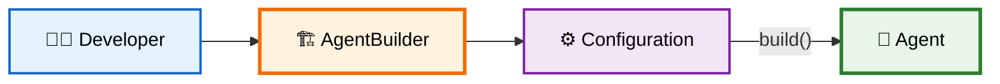
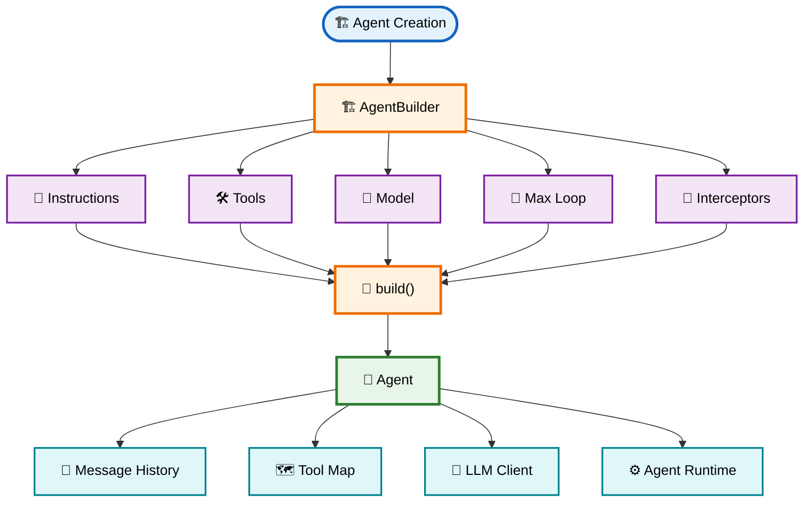
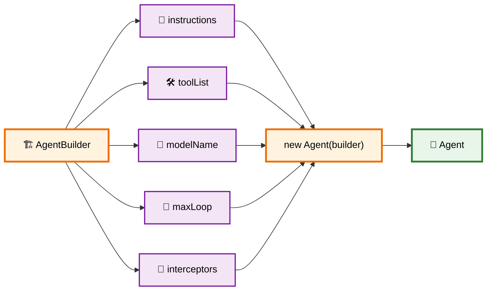
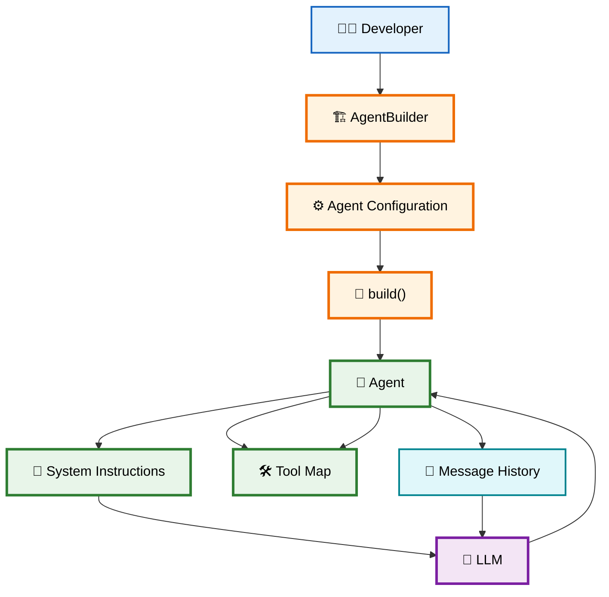
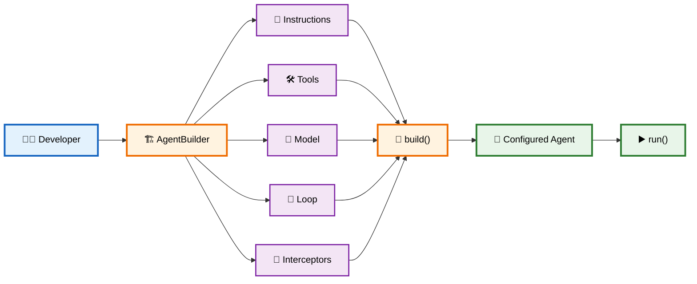

# 🏗️ 02 — Builder Pattern & Agent Configuration

> **Goal:** Understand how the **Builder Pattern** makes Agent creation clean, configurable, validated, and extensible.

---

# 1. 🤔 Why Use the Builder Pattern for Agents?

An Agent can have many configuration options:

* 📜 System instructions
* 🛠️ Tools
* 👀 Interceptors / middleware
* 🧠 Model name
* 🌡️ Temperature
* 📦 Max tokens
* 🔄 Maximum loop iterations
* 💾 Memory configuration
* ✂️ Context pruning
* 🛡️ Safety settings

Without a Builder, you may end up with a difficult constructor:

```ts
const agent = new Agent(
    "You are a helper",
    [tool1, tool2],
    "gpt-4o",
    30,
    [logger],
    true
);
```

The problem is that it's hard to understand what each argument means.

A Builder changes this into:

```ts
const agent = Agent.builder()
    .setInstructions("You are a helper")
    .tool(tool1)
    .tool(tool2)
    .model("gpt-4o")
    .setMaxLoop(30)
    .attachInterceptor(logger)
    .build();
```

Now the configuration is **self-documenting**.

---

# 2. 🏗️ What is the Builder Pattern?

The **Builder Pattern** separates:

```text
Object Configuration
        ↓
Object Creation
```

Instead of directly constructing an Agent, we first configure an `AgentBuilder`.



### Simple mental model

> **Builder = Agent Configuration**

> **Agent = Configured Runtime**

---

# 3. 🧩 AgentBuilder vs Agent

This distinction is extremely important.

| `AgentBuilder`             | `Agent`               |
| -------------------------- | --------------------- |
| Used during configuration  | Used during execution |
| Stores configuration       | Stores runtime state  |
| Collects tools             | Uses tools            |
| Stores instructions        | Uses instructions     |
| Stores model configuration | Calls the LLM         |
| Stores interceptors        | Executes interceptors |
| Calls `build()`            | Calls `run()`         |

Think:

```text
🏗️ Builder
   ↓
"How should my Agent be configured?"

          ↓ build()

🤖 Agent
   ↓
"How should my Agent execute?"
```

---

# 4. 🏛️ Agent Architecture



---

# 5. 🧱 Configuration Interfaces

Before creating the Builder, we define the basic types.

## 🛠️ `ITool`

```ts
export interface ITool {
    name: string;
    description: string;
    doc?: string;
    executor: (input: string) => Promise<string> | string;
}
```

Every tool must provide:

```text
🛠️ Tool
 ├── name
 ├── description
 ├── doc
 └── executor()
```

For example:

```ts
const cliTool: ITool = {
    name: "execCli",
    description: "Execute a CLI command",
    doc: "execCli(command: string)",
    executor: async (command) => {
        // execute command
    }
};
```

---

# 6. 💬 `IMessage`

```ts
export interface IMessage {
    role: "user" | "assistant" | "developer";
    content: string;
}
```

This represents Agent state.

Example:

```ts
{
    role: "user",
    content: "Create hello.cpp"
}
```

The Agent stores these messages inside:

```ts
messageHistory: IMessage[]
```

---

# 7. 👀 `Interceptor`

```ts
export type Interceptor =
    (message: IMessage) => void;
```

An interceptor allows external code to observe Agent events.

For example:

```ts
agent.attachInterceptor((msg) => {
    console.log(msg);
});
```

Useful for:

```text
👀 Logging
📊 Tracing
💰 Cost tracking
🐛 Debugging
📡 Monitoring
```

---

# 8. 🏗️ Implementing `AgentBuilder`

The Builder stores all configuration before the Agent is created.

```ts
export class AgentBuilder {

    public instructions =
        "You are a helpful AI assistant.";

    public toolList: ITool[] = [];

    public interceptors: Interceptor[] = [];

    public modelName = "gpt-4o";

    public maxLoop = 30;

    ...
}
```

Conceptually:

```text
AgentBuilder
│
├── 📜 instructions
├── 🛠️ toolList
├── 👀 interceptors
├── 🧠 modelName
└── 🔄 maxLoop
```

---

# 9. 🔗 Fluent Method Chaining

The Builder methods return `this`.

Example:

```ts
public setInstructions(instructions: string): this {
    this.instructions = instructions;
    return this;
}
```

Because it returns `this`, we can chain:

```ts
Agent.builder()
    .setInstructions(...)
    .tool(...)
    .model(...)
    .setMaxLoop(...)
    .build();
```

The flow is:

```mermaid id="4a1lpf"
flowchart LR

    START["Agent.builder()"]

    I["📜 setInstructions()"]
    T["🛠️ tool()"]
    M["🧠 model()"]
    L["🔄 setMaxLoop()"]
    X["👀 attachInterceptor()"]
    B["🔨 build()"]

    START --> I
    I --> T
    T --> M
    M --> L
    L --> X
    X --> B

    classDef start fill:#E3F2FD,stroke:#1565C0,stroke-width:3px,color:#000
    classDef method fill:#FFF3E0,stroke:#EF6C00,stroke-width:2px,color:#000
    classDef build fill:#E8F5E9,stroke:#2E7D32,stroke-width:3px,color:#000

    class START start
    class I,T,M,L,X method
    class B build
```



---

# 10. 🛠️ Registering Tools

The Builder can register tools dynamically.

```ts
public tool(t: ITool): this {

    if (
        this.toolList.some(
            existing => existing.name === t.name
        )
    ) {
        throw new Error(
            `Tool with name '${t.name}' is already registered.`
        );
    }

    this.toolList.push(t);

    return this;
}
```

The important part is duplicate prevention:

```ts
existing.name === t.name
```

So this is invalid:

```ts
.tool(cliTool)
.tool(cliTool)
```

because both have the same name.

### Why this matters

Later the Agent creates:

```ts
Map<string, ITool>
```

where the tool name becomes the key:

```text
"execCli" → cliTool
"weather" → weatherTool
"search"  → searchTool
```

Duplicate names would create ambiguity.

---

# 11. 🔨 `build()` — The Important Connection

The Builder eventually creates the actual Agent:

```ts
public build(): Agent {
    return new Agent(this);
}
```

This single line connects the two classes:

```text
AgentBuilder
     │
     │ build()
     ▼
new Agent(builder)
```

The Agent constructor receives the **entire configured Builder**.



---

# 12. 🤖 How `Agent` Receives the Configuration

The Agent constructor can then transfer Builder configuration into runtime state:

```ts
constructor(builder: AgentBuilder) {

    this.modelName = builder.modelName;

    this.maxLoop = builder.maxLoop;

    this.interceptors = [
        ...builder.interceptors
    ];

    this.messageHistory = [];

    this.toolMap = new Map();

    for (const tool of builder.toolList) {
        this.toolMap.set(tool.name, tool);
    }

    this.instructions = builder.instructions;
}
```

The important transformation is:

```text
Builder Configuration
        ↓
     Constructor
        ↓
Agent Runtime State
```

---

# 13. 🗺️ Tool List → Tool Map

This is an especially important design decision.

The Builder stores:

```ts
toolList: ITool[]
```

Example:

```text
[
    cliTool,
    weatherTool,
    searchTool
]
```

The Agent converts this into:

```ts
Map<string, ITool>
```

Result:

```text
toolMap

"execCli"    → cliTool
"weather"    → weatherTool
"search"     → searchTool
```

Why?

Because when the LLM returns:

```json
{
    "functionName": "execCli"
}
```

the Agent can quickly do:

```ts
this.toolMap.get("execCli")
```

and find the executor.

---

# 14. 🧠 Builder → Agent → LLM

The complete relationship is:



---

# 15. 👨‍💻 Developer Usage

Now the developer can create an Agent like this:

```ts
const agent = Agent.builder()

    .setInstructions(
        "You are a senior DevOps specialist."
    )

    .tool(cliAccessTool)

    .tool(logAnalyzerTool)

    .model("gpt-4o")

    .setMaxLoop(15)

    .attachInterceptor((msg) => {
        console.log(
            `[EVENT] ${msg.role}: ${msg.content}`
        );
    })

    .build();
```

This reads almost like configuration:

```text
Agent
 │
 ├── 📜 Role
 │    └── Senior DevOps specialist
 │
 ├── 🛠️ Tools
 │    ├── CLI
 │    └── Log Analyzer
 │
 ├── 🧠 Model
 │    └── GPT-4o
 │
 ├── 🔄 Max Loop
 │    └── 15
 │
 └── 👀 Interceptor
      └── Logger
```

---

# 16. 🔄 Builder Lifecycle

The complete lifecycle is:

```mermaid id="c2k4s6"
flowchart TD

    START(["🚀 Start"])

    CREATE["Agent.builder()"]

    CONFIG1["📜 Configure Instructions"]
    CONFIG2["🛠️ Register Tools"]
    CONFIG3["🧠 Configure Model"]
    CONFIG4["🔄 Configure Loop"]
    CONFIG5["👀 Add Interceptors"]

    VALIDATE["🛡️ Validate Configuration"]

    BUILD["🔨 build()"]

    AGENT["🤖 Agent Instance"]

    RUN["▶️ agent.run(query)"]

    END(["✅ Agent Executes"])

    START --> CREATE

    CREATE --> CONFIG1
    CONFIG1 --> CONFIG2
    CONFIG2 --> CONFIG3
    CONFIG3 --> CONFIG4
    CONFIG4 --> CONFIG5

    CONFIG5 --> VALIDATE
    VALIDATE --> BUILD
    BUILD --> AGENT
    AGENT --> RUN
    RUN --> END

    classDef start fill:#E3F2FD,stroke:#1565C0,stroke-width:3px,color:#000
    classDef config fill:#FFF3E0,stroke:#EF6C00,stroke-width:2px,color:#000
    classDef validation fill:#FFF9C4,stroke:#F9A825,stroke-width:3px,color:#000
    classDef agent fill:#E8F5E9,stroke:#2E7D32,stroke-width:3px,color:#000
    classDef end fill:#FCE4EC,stroke:#C2185B,stroke-width:3px,color:#000

    class START start
    class CREATE,CONFIG1,CONFIG2,CONFIG3,CONFIG4,CONFIG5,BUILD config
    class VALIDATE validation
    class AGENT,RUN agent
    class END end
```

> **Note:** Your current `build()` implementation does not actually perform validation yet. The diagram shows where validation **could/should** be added as the SDK becomes more production-ready.

---

# 17. 🆚 Without Builder vs With Builder

### ❌ Without Builder

```ts
const agent = new Agent(
    instructions,
    tools,
    interceptors,
    model,
    maxLoop,
    memory,
    ...
);
```

Problems:

```text
❌ Hard to read
❌ Parameter order matters
❌ Many optional values
❌ Difficult to extend
❌ Difficult to validate
```

### ✅ With Builder

```ts
const agent = Agent.builder()
    .setInstructions(...)
    .tool(...)
    .model(...)
    .setMaxLoop(...)
    .attachInterceptor(...)
    .build();
```

Benefits:

```text
✅ Readable
✅ Fluent API
✅ Easy to extend
✅ Configuration is centralized
✅ Better validation point
✅ Cleaner Agent constructor
```

---

# 18. 🧠 Why `Agent.builder()` Is Static

Inside `Agent`:

```ts
public static builder(): AgentBuilder {
    return new AgentBuilder();
}
```

This allows:

```ts
Agent.builder()
```

instead of:

```ts
new AgentBuilder()
```

So `Agent` becomes the public entry point:

```text
Developer
    │
    ▼
Agent.builder()
    │
    ▼
AgentBuilder
    │
    ▼
build()
    │
    ▼
Agent
```

This makes the SDK API feel natural.

---

# 19. 🎯 Builder Pattern in One Diagram



---

# 20. 🔑 Key Takeaways

### 1. 🏗️ Builder configures the Agent

```text
AgentBuilder = Configuration
```

### 2. 🤖 Agent performs the work

```text
Agent = Runtime
```

### 3. 🔗 `build()` connects them

```ts
return new Agent(this);
```

### 4. 🛠️ Tools are registered during configuration

```ts
.tool(cliAccessTool)
```

and converted into:

```text
toolMap
```

inside the Agent.

### 5. 📜 Instructions become Agent configuration

```ts
.setInstructions(...)
```

then:

```text
builder.instructions
        ↓
agent.instructions
        ↓
system prompt
        ↓
LLM
```

### 6. 👀 Interceptors are configured before execution

```ts
.attachInterceptor(...)
```

then copied into the Agent runtime.

### 7. 🔄 Builder enables fluent configuration

```ts
Agent.builder()
    .setInstructions(...)
    .tool(...)
    .model(...)
    .setMaxLoop(...)
    .build();
```

---

# 🧠 Final Mental Model

Remember these three lines:

```text
🏗️ AgentBuilder
      ↓
   CONFIGURE
      ↓
🤖 Agent
      ↓
   EXECUTE
```

Or:

> **Builder decides WHAT the Agent has. Agent decides HOW the Agent runs.**

And the complete Agent SDK architecture becomes:

```text
👨‍💻 Developer
      │
      ▼
🏗️ AgentBuilder
      │
      ├── 📜 Instructions
      ├── 🛠️ Tools
      ├── 🧠 Model
      ├── 🔄 Loop Limits
      └── 👀 Interceptors
      │
      ▼
🔨 build()
      │
      ▼
🤖 Agent Runtime
      │
      ├── 🧠 State
      ├── 🗺️ Tool Map
      ├── 📜 System Prompt
      └── 🔌 LLM Client
      │
      ▼
▶️ agent.run()
      │
      ▼
🧠 LLM ↔ 🛠️ Tools ↔ 🧠 State
      │
      ▼
✅ Final Output
```

### ⭐ Core Formula

$$
\boxed{
\text{Agent}
=
\text{Builder Configuration}
+
\text{Runtime State}
+
\text{LLM}
+
\text{Tools}
+
\text{Execution Loop}
}
$$
