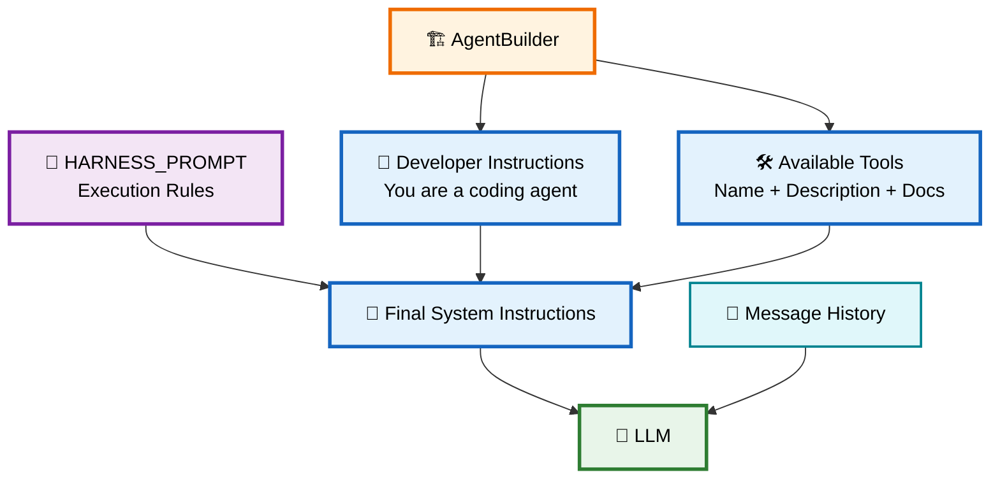
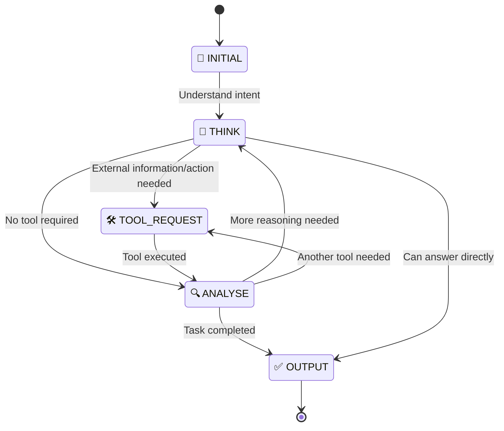
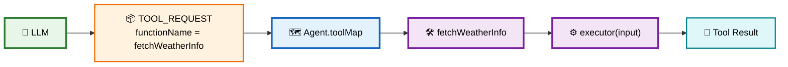
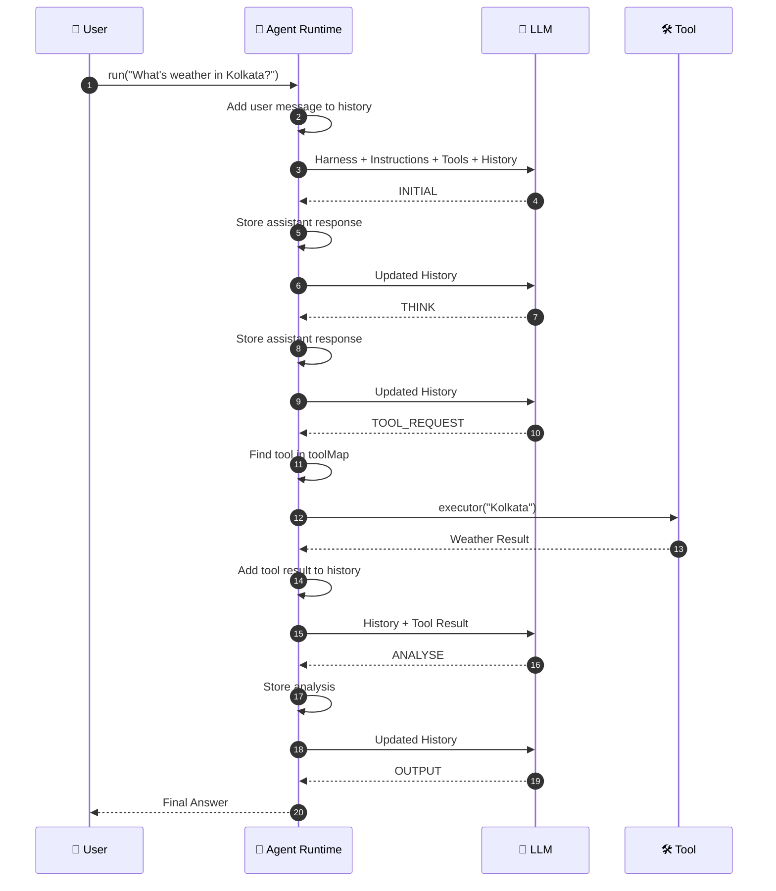
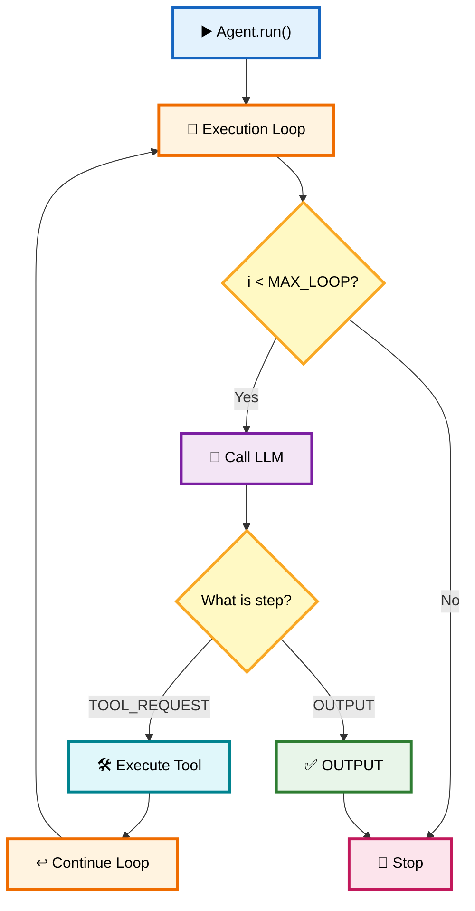
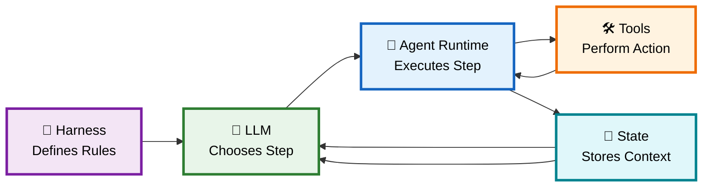
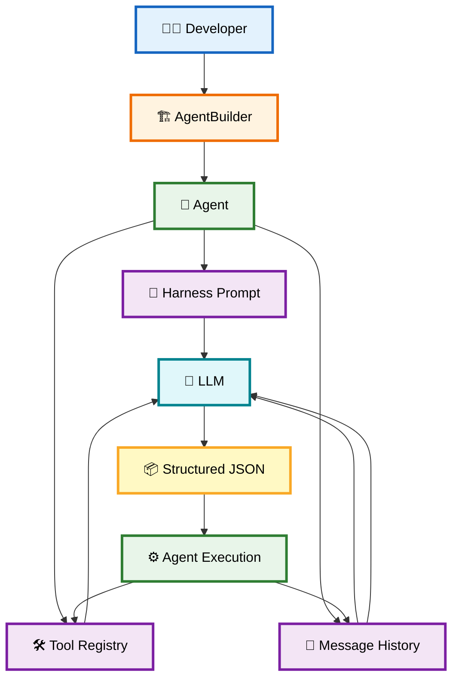

# 🎯 03 — Harness Prompting & ReAct Pipeline

> **Goal:** Understand how the **Harness Prompt controls the LLM**, how the LLM communicates with the **Agent Runtime**, and how the **ReAct-style loop** connects **reasoning → tools → analysis → final output**.

---

# 1. 🧠 What is a Harness Prompt?

A **Harness Prompt** is a special instruction layer added by the Agent SDK to control how the LLM behaves.

Instead of simply telling the LLM:

```text
"You are a coding agent."
```

the SDK gives it additional rules:

```text
HARNESS PROMPT
      +
SYSTEM INSTRUCTIONS
      +
MESSAGE HISTORY
      ↓
     LLM
```

The Harness tells the LLM:

* 📋 Which execution steps it can use
* 🛠️ When it should request a tool
* 📦 What JSON format it must return
* 🔄 How to continue the execution
* 🏁 When the task is finished

### Simple idea

> **System Prompt tells the Agent WHAT it is.**

> **Harness Prompt tells the Agent HOW to behave during execution.**

---

# 2. 🏗️ Where Does the Harness Prompt Connect?

This is the most important connection from your previous `agent.ts`.

Inside `Agent`:

```ts
this.instructions = `
    ${HARNESS_PROMPT}

    System Prompt:
    ${builder.instructions}

    Available Tools:
    ${builder.toolList...}
`;
```

So the final instructions sent to the LLM are assembled from multiple pieces.



---

# 3. 🧩 The Final Prompt Sent to the LLM

Conceptually, the Agent creates:

```text
┌──────────────────────────────────┐
│         SYSTEM MESSAGE           │
│                                  │
│ 🎯 Harness Prompt                │
│ 📜 Developer Instructions        │
│ 🛠️ Available Tools              │
│                                  │
└──────────────────────────────────┘

┌──────────────────────────────────┐
│         MESSAGE HISTORY           │
│                                  │
│ 👤 User messages                 │
│ 🤖 Previous assistant messages   │
│ 🔧 Tool results                  │
│                                  │
└──────────────────────────────────┘
                  │
                  ▼
              🤖 LLM
```

Therefore:

$$
\text{LLM Context}
=
\text{Harness}
+
\text{Instructions}
+
\text{Tools}
+
\text{History}
$$

---

# 4. 🎯 Why Do We Need a Harness?

A raw LLM might return:

```text
Sure! I'll check the weather for you.
```

That is useful for humans, but difficult for an Agent runtime to execute automatically.

The runtime wants something predictable:

```json
{
  "step": "TOOL_REQUEST",
  "functionName": "fetchWeatherInfo",
  "input": "Tokyo"
}
```

Now the Agent can programmatically understand:

```text
step = TOOL_REQUEST
        ↓
find functionName
        ↓
find tool
        ↓
execute tool
        ↓
send result back to LLM
```

So:

> **Harness Prompt = communication contract between LLM and Agent Runtime.**

---

# 5. 🔄 The 5-Stage Pipeline

Your Harness defines these stages:

```text
INITIAL
   ↓
THINK
   ↓
TOOL_REQUEST
   ↓
ANALYSE
   ↓
OUTPUT
```

But importantly, **the stages are not necessarily a fixed one-way sequence**.

The Agent can loop:

```text
THINK
  ↓
TOOL_REQUEST
  ↓
ANALYSE
  ↓
THINK
  ↓
TOOL_REQUEST
  ↓
ANALYSE
  ↓
OUTPUT
```

That's why this is better understood as a **state-driven execution loop**.

---

# 6. 🗺️ Complete Harness State Machine



---

# 7. 🎯 Stage 1 — `INITIAL`

The Agent first identifies the user's objective.

Example:

```text
User:
"What's the weather in Kolkata?"
```

LLM might return:

```json
{
  "step": "INITIAL",
  "text": "The user wants the current weather in Kolkata."
}
```

The Agent stores this response in:

```ts
messageHistory
```

---

# 8. 🧠 Stage 2 — `THINK`

The LLM determines what needs to happen next.

Example:

```json
{
  "step": "THINK",
  "text": "I need current weather data, so I should use the weather tool."
}
```

The important point is:

```text
LLM decides
     ↓
Does this task require a tool?
     ↓
YES
     ↓
TOOL_REQUEST
```

---

# 9. 🛠️ Stage 3 — `TOOL_REQUEST`

Now the LLM requests a specific registered tool.

Example:

```json
{
  "step": "TOOL_REQUEST",
  "functionName": "fetchWeatherInfo",
  "input": "Kolkata"
}
```

The Agent runtime receives this JSON.

Then:

```ts
const { functionName, input } = parsedResult;

const tool = this.toolMap.get(functionName);
```

This connects directly to the **Tool Map** created in the previous chapter.



---

# 10. ⚙️ Tool Execution

The Agent finds the tool:

```ts
const tool = this.toolMap.get(functionName);
```

Then executes:

```ts
const toolResult = await tool.executor(input);
```

For example:

```text
functionName:
fetchWeatherInfo

input:
Kolkata
```

becomes:

```ts
weatherTool.executor("Kolkata")
```

The tool might return:

```json
{
  "cityName": "Kolkata",
  "weatherInfo": "28°C, Partly cloudy"
}
```

---

# 11. 🔍 Stage 4 — `ANALYSE`

The tool result is added back into the Agent's message history.

Conceptually:

```text
👤 User
   ↓
🤖 Assistant → TOOL_REQUEST
   ↓
🛠️ Tool
   ↓
📄 Tool Result
   ↓
🧠 Agent History
   ↓
🤖 LLM
```

The LLM can now evaluate the result.

For example:

```json
{
  "step": "ANALYSE",
  "text": "The weather tool reports 28°C and partly cloudy conditions in Kolkata."
}
```

If more work is required:

```text
ANALYSE
   ↓
THINK
   ↓
TOOL_REQUEST
```

If everything is complete:

```text
ANALYSE
   ↓
OUTPUT
```

---

# 12. ✅ Stage 5 — `OUTPUT`

Once the task is complete, the LLM returns:

```json
{
  "step": "OUTPUT",
  "text": "The current weather in Kolkata is 28°C and partly cloudy."
}
```

The Agent checks:

```ts
if (
    parsedResult.step.toLowerCase() === "output"
) {
    return this.messageHistory;
}
```

And the loop terminates.

---

# 13. 🔄 Complete Agent ↔ LLM ↔ Tool Loop

This is the most important diagram to remember.



---

# 14. 📦 The JSON Contract

The Harness defines a contract between the LLM and runtime.

The basic structure is:

```json
{
  "step": "INITIAL | THINK | TOOL_REQUEST | ANALYSE | OUTPUT",
  "text": "....",
  "functionName": "optional",
  "input": "optional"
}
```

Think of it as:

```text
┌───────────────────────────────┐
│        LLM → Agent            │
│                               │
│  "step"       → What to do    │
│  "text"       → Explanation   │
│  "functionName" → Which tool  │
│  "input"      → Tool input    │
│                               │
└───────────────────────────────┘
```

This makes the LLM output **machine-readable**.

---

# 15. 🧠 Why JSON is Important

Without structured output:

```text
LLM
 ↓
"Okay, let me run the weather function..."
 ↓
Agent 😵
"Which function?"
"What input?"
```

With structured output:

```json
{
  "step": "TOOL_REQUEST",
  "functionName": "fetchWeatherInfo",
  "input": "Kolkata"
}
```

The Agent knows exactly what to do.

```text
step
 ↓
TOOL_REQUEST
 ↓
functionName
 ↓
fetchWeatherInfo
 ↓
input
 ↓
Kolkata
```

---

# 16. 🧮 ReAct-Style Example

Consider:

```text
"What is the weather in Kolkata?"
```

A simplified execution could be:

```text
1️⃣ INITIAL
   ↓
   Understand the request

2️⃣ THINK
   ↓
   Need real-time weather

3️⃣ TOOL_REQUEST
   ↓
   fetchWeatherInfo("Kolkata")

4️⃣ ANALYSE
   ↓
   Inspect weather result

5️⃣ OUTPUT
   ↓
   Tell user the weather
```

---

# 17. 🔁 ReAct Does NOT Mean "Always Use Tools"

For a simple question:

```text
"What is 2 + 2?"
```

The Agent might do:

```text
INITIAL
   ↓
THINK
   ↓
ANALYSE
   ↓
OUTPUT
```

No tool is required.

For:

```text
"What's the weather in Kolkata?"
```

the flow becomes:

```text
INITIAL
   ↓
THINK
   ↓
TOOL_REQUEST
   ↓
ANALYSE
   ↓
OUTPUT
```

For a more complex task:

```text
"Find my project, inspect the package.json,
install the missing dependency and run the tests."
```

the loop could be:

```text
THINK
 ↓
TOOL_REQUEST
 ↓
ANALYSE
 ↓
THINK
 ↓
TOOL_REQUEST
 ↓
ANALYSE
 ↓
THINK
 ↓
TOOL_REQUEST
 ↓
ANALYSE
 ↓
OUTPUT
```

That's where the Agent runtime becomes powerful.

---

# 18. 🔄 Where `MAX_LOOP` Fits

Your `agent.ts` contains:

```ts
private MAX_LOOP = 30;
```

And:

```ts
for (
    let i = 0;
    i < this.MAX_LOOP;
    i++
) {
    ...
}
```

This protects the Agent from infinite execution.



So:

> **Harness controls the logical protocol.**

> **MAX_LOOP controls the runtime safety boundary.**

---

# 19. 🧠 Harness vs ReAct vs Agent Runtime

These three concepts should not be confused.

| Component              | Responsibility                 |
| ---------------------- | ------------------------------ |
| 🎯 **Harness Prompt**  | Defines the execution protocol |
| 🧠 **LLM**             | Decides the next step          |
| 🤖 **Agent Runtime**   | Executes the step              |
| 🛠️ **Tools**          | Perform external actions       |
| 🔄 **Loop**            | Repeats execution              |
| 💬 **Message History** | Maintains context              |

The relationship:



---

# 20. ⚠️ Important Technical Correction

One thing in the original notes should be clarified:

### The Harness does not literally "force deep reasoning."

A prompt can **request** a structured process, but an LLM is still probabilistic.

A better description is:

> **The Harness constrains the LLM's communication protocol by requesting specific states and a machine-readable JSON format.**

Also, `THINK` / `ANALYSE` fields should **not be treated as guaranteed access to the model's private chain-of-thought**. In a production system, these fields are better used for **short, operational summaries or state information** rather than requiring hidden reasoning to be exposed.

---

# 21. 🔗 Connection With Previous Chapters

Now the architecture from **01 → 02 → 03** becomes clear.

### 📚 Chapter 01 — Agent SDK

Introduced:

```text
Agent
LLM
Tools
State
Interceptors
```

### 🏗️ Chapter 02 — Builder Pattern

Explained how we create the Agent:

```text
Agent.builder()
      ↓
configure
      ↓
build()
      ↓
Agent
```

### 🎯 Chapter 03 — Harness

Explains how the Agent controls LLM execution:

```text
Agent
  ↓
Harness + Instructions + Tools + History
  ↓
LLM
  ↓
Structured JSON
  ↓
Agent Runtime
```

Together:



---

# 🔑 Final Mental Model

Remember this:

```text
🏗️ BUILDER
     │
     │ creates/configures
     ▼
🤖 AGENT
     │
     ├── 🎯 Harness
     ├── 📜 Instructions
     ├── 🛠️ Tools
     ├── 💬 History
     └── 🔄 Loop
     │
     ▼
🧠 LLM
     │
     │ returns structured decision
     ▼
📦 JSON
     │
     ▼
🤖 AGENT RUNTIME
     │
     ├── 🛠️ Execute Tool
     ├── 💬 Update State
     └── 🔄 Call LLM Again
     │
     ▼
✅ OUTPUT
```

### ⭐ Core Formula

$$
\boxed{
\text{Harness}
+
\text{LLM}
+
\text{State}
+
\text{Tools}
+
\text{Execution Loop}
=
\text{Agent Runtime}
}
$$

And the key connection to remember is:

> **The Harness tells the LLM what protocol to follow → the LLM returns a structured action → the Agent Runtime executes that action → the result goes back into state → the LLM continues until `OUTPUT`.**
