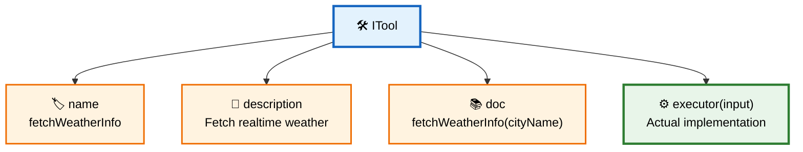
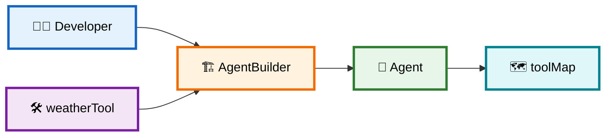
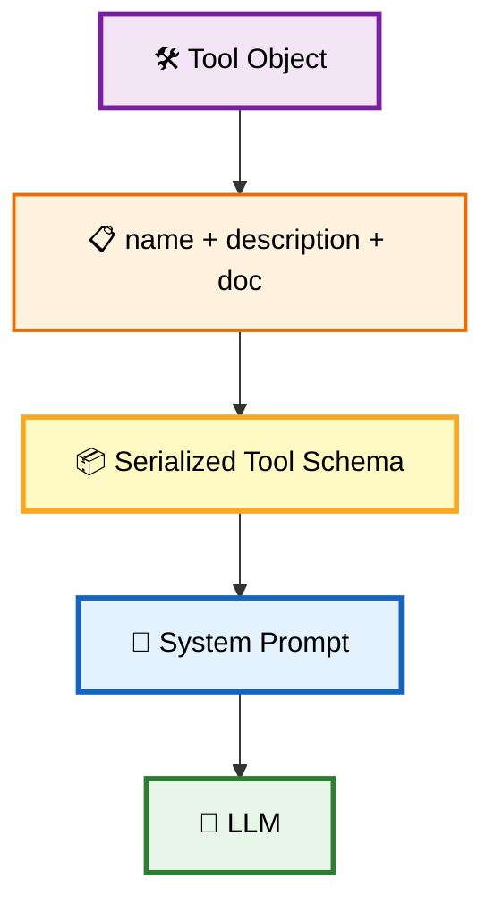
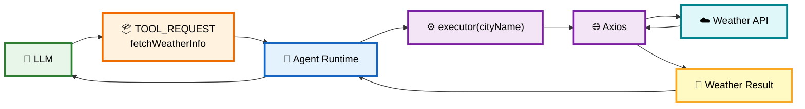
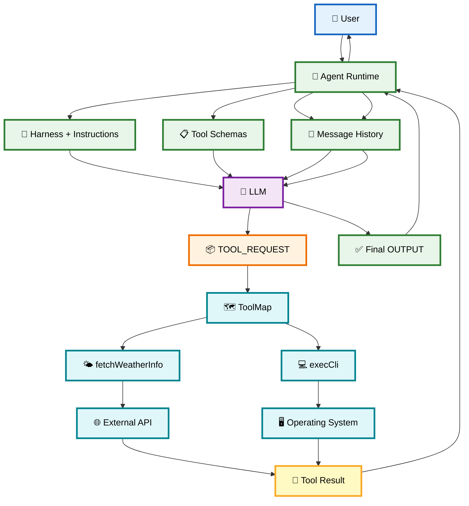
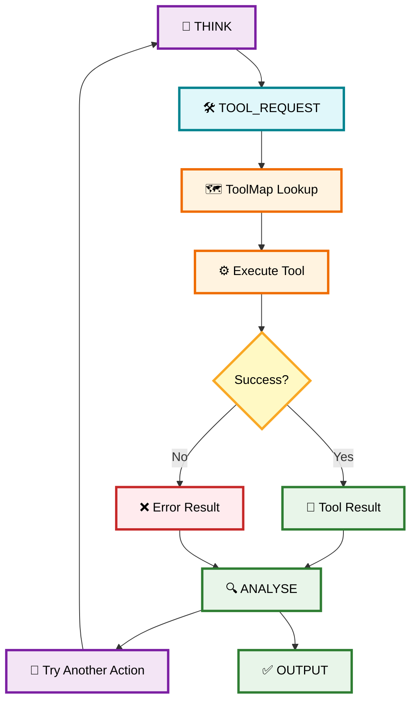
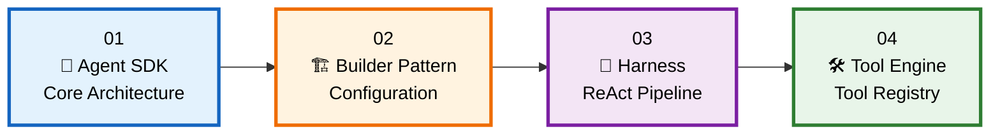

# 🛠️ 04 — Tool Execution Engine & Registry

> **Goal:** Understand how a tool goes from a normal TypeScript function → registered inside the Agent → described to the LLM → requested by the LLM → executed by the runtime → returned to the LLM.

The most important idea is:

> **The LLM does NOT directly execute your TypeScript function. The Agent Runtime executes it on the LLM's behalf.**

---

# 1. 🧠 What is a Tool?

A **Tool** is an external capability that the Agent can use to interact with the outside world.

For example:

```text
🤖 LLM
 │
 ├── 🧮 Calculator
 ├── 🌤️ Weather API
 ├── 💻 CLI
 ├── 🗄️ Database
 ├── 🌐 Web Search
 └── 📁 File System
```

The LLM itself only decides:

> "I need the weather tool."

The **Agent Runtime** actually executes:

```ts
weatherTool.executor("Kolkata")
```

So:

```text
LLM = 🧠 Decision Maker
Agent Runtime = ⚙️ Executor
Tool = 🛠️ Capability
```

---

# 2. 🏗️ The `ITool` Interface

Every tool follows the same contract:

```ts
export interface ITool {
  name: string;
  description: string;
  doc?: string;
  executor: (input: string) => Promise<string> | string;
}
```

Think of it as a standard shape:



### Each property has a different job

| Property      | Purpose                                 |
| ------------- | --------------------------------------- |
| `name`        | Unique tool identifier                  |
| `description` | Helps the LLM understand when to use it |
| `doc`         | Explains expected input/output          |
| `executor`    | Actual code that performs the operation |

---

# 3. 🔑 The Most Important Concept: Metadata vs Execution

This distinction is extremely important.

Suppose we have:

```ts
const weatherTool: ITool = {
  name: "fetchWeatherInfo",

  description: "Fetches realtime weather data",

  doc: "fetchWeatherInfo(cityName: string): WeatherReport",

  executor: async (cityName) => {
    // actual API call
  }
};
```

The first three properties are **metadata**.

The `executor` is the **actual capability**.

```text
             WEATHER TOOL
                  │
        ┌─────────┴─────────┐
        │                   │
   📋 Metadata          ⚙️ Executor
        │                   │
        ▼                   ▼
    LLM sees           Runtime executes
    these fields       this function
```

The LLM never receives the JavaScript function itself.

---

# 4. 🔗 How a Tool Gets Connected to an Agent

This starts in `index.ts`.

You create:

```ts
const agent = Agent.builder()
  .setInstructions("You are a weather agent")
  .tool(weatherTool)
  .build();
```

The connection is:



---

# 5. 🗺️ Why `toolMap`?

Inside `Agent`:

```ts
private toolMap: Map<string, ITool>;
```

During construction:

```ts
for (const tool of builder.toolList) {
  this.toolMap.set(tool.name, tool);
}
```

Suppose you registered:

```text
weatherTool
cliAccessTool
```

The Agent creates:

```text
🗺️ toolMap

"fetchWeatherInfo" ──→ 🌤️ weatherTool
"execCli"           ──→ 💻 cliAccessTool
```

Then when the LLM says:

```json
{
  "functionName": "fetchWeatherInfo"
}
```

the runtime does:

```ts
const tool = this.toolMap.get("fetchWeatherInfo");
```

and immediately gets the correct tool.

---

# 6. ⚡ Why `Map`?

A JavaScript `Map` provides efficient key-based lookup.

Conceptually:

```text
LLM
 │
 │ "fetchWeatherInfo"
 ▼
Map.get(functionName)
 │
 ▼
🌤️ weatherTool
```

For a registry with many tools, this is cleaner and generally provides **average O(1) lookup**.

---

# 7. 📦 Tool Schema Serialization

Now comes another important connection.

The LLM needs to know:

> "Which tools are available?"

The Agent therefore converts tool metadata into prompt text.

For example:

```ts
{
  functionName: "fetchWeatherInfo",
  functionDescription: "Fetches realtime weather data",
  functionDoc: "fetchWeatherInfo(cityName: string): WeatherReport"
}
```

This eventually becomes part of the system instructions.



---

# 8. 🧠 What the LLM Actually Sees

Conceptually, the system prompt contains:

```text
Available Tools:

{
  "functionName": "fetchWeatherInfo",
  "functionDescription": "Fetches realtime weather data",
  "functionDoc": "fetchWeatherInfo(cityName: string): WeatherReport"
}

{
  "functionName": "execCli",
  "functionDescription": "Executes shell commands",
  "functionDoc": "execCli(command: string): CLIResponse"
}
```

Now the LLM knows:

```text
Available capabilities:

🌤️ fetchWeatherInfo
💻 execCli
```

But again:

> **The LLM only sees their descriptions. It does not execute the functions.**

---

# 9. 🌤️ Weather Tool — Complete Connection

Your weather tool uses `axios`:

```ts
const weatherTool: ITool = {
  name: "fetchWeatherInfo",

  description: "Fetches realtime weather data for a given city.",

  doc: "fetchWeatherInfo(cityName: string): WeatherReport",

  async executor(cityName) {
    const response = await axios.get(...);

    return JSON.stringify({
      cityName,
      weatherInfo: response.data
    });
  }
};
```

Its architecture is:



---

# 10. 💻 CLI Tool

The CLI tool follows exactly the same architecture.

```ts
const cliAccessTool: ITool = {
  name: "execCli",

  description: "Executes shell commands",

  doc: "execCli(command: string): CLIResponse",

  executor(cmd) {
    return new Promise((resolve) => {
      exec(cmd, ...);
    });
  }
};
```

The difference is only the **executor implementation**.

```text
ITool
 │
 ├── Weather Tool
 │      └── axios → Weather API
 │
 └── CLI Tool
        └── child_process.exec → OS Shell
```

This is the power of the common `ITool` interface.

---

# 11. 🔄 Complete Tool Execution Lifecycle

Now connect everything together.

Suppose the user says:

```text
"What's the weather in Kolkata?"
```

### Step 1 — User

```text
👤 User
   │
   │ query
   ▼
🤖 Agent.run()
```

### Step 2 — Agent sends context

```text
Agent
 │
 ├── 🎯 Harness
 ├── 📜 Instructions
 ├── 🛠️ Tool Schemas
 └── 💬 Message History
       │
       ▼
     🧠 LLM
```

### Step 3 — LLM requests tool

```json
{
  "step": "TOOL_REQUEST",
  "functionName": "fetchWeatherInfo",
  "input": "Kolkata"
}
```

### Step 4 — Agent dispatches

```ts
const tool = this.toolMap.get(functionName);
```

### Step 5 — Executor runs

```ts
await tool.executor(input);
```

### Step 6 — Result enters history

```text
developer message
       │
       ▼
messageHistory
```

### Step 7 — LLM receives result

```text
Tool Result
    ↓
Message History
    ↓
LLM
```

### Step 8 — LLM produces final output

```json
{
  "step": "OUTPUT",
  "text": "The weather in Kolkata is..."
}
```

---

# 12. 🔥 Full Architecture Diagram



---

# 13. 🚨 What Happens If the Tool Doesn't Exist?

Suppose the LLM returns:

```json
{
  "step": "TOOL_REQUEST",
  "functionName": "searchGoogle",
  "input": "latest AI news"
}
```

But `searchGoogle` isn't registered.

The Agent does:

```ts
const tool = this.toolMap.get(functionName);

if (!tool) {
   // error
}
```

Then adds:

```text
developer:
Error: Tool 'searchGoogle' is not registered
```

to the history.

Then:

```text
Error
 ↓
Message History
 ↓
LLM
 ↓
LLM sees what went wrong
 ↓
Can choose another action
```

This is an important Agent behavior:

> **Tool errors become part of the Agent's context instead of necessarily crashing the entire Agent.**

---

# 14. 🛡️ Error Handling

Your improved implementation uses:

```ts
try {
  const toolResult = await tool.executor(input);
} catch (err) {
  ...
}
```

So there are two types of errors.

### Tool not registered

```text
LLM
 ↓
Unknown function
 ↓
toolMap.get()
 ↓
❌ Not found
 ↓
Developer error message
 ↓
LLM
```

### Tool execution failure

```text
LLM
 ↓
Tool Request
 ↓
Executor
 ↓
❌ API / CLI / DB failure
 ↓
Error captured
 ↓
Developer message
 ↓
LLM
```

---

# 15. 🔄 Self-Correction Loop

This is where tool execution connects with the **Harness/ReAct pipeline from Chapter 03**.



---

# 16. 🔗 Connection: Chapter 03 → Chapter 04

Now you can connect the two architectures.

### Chapter 03

The Harness tells the LLM:

```text
"Use TOOL_REQUEST when you need an external capability."
```

### Chapter 04

The Tool Engine implements:

```text
"Okay, you requested a tool.
I'll find it and execute it."
```

So:

```text
🎯 HARNESS
    │
    │ tells LLM the protocol
    ▼
🧠 LLM
    │
    │ TOOL_REQUEST
    ▼
🤖 AGENT RUNTIME
    │
    │ lookup
    ▼
🗺️ TOOL MAP
    │
    │ find function
    ▼
🛠️ EXECUTOR
    │
    ▼
🌐 External World
```

---

# 17. 📚 Chapter 01 → 02 → 03 → 04

The complete learning progression is now:



### Their responsibilities

| Chapter            | Main responsibility                    |
| ------------------ | -------------------------------------- |
| **01 — Agent SDK** | What an Agent Runtime is               |
| **02 — Builder**   | How an Agent is configured             |
| **03 — Harness**   | How LLM execution is controlled        |
| **04 — Tools**     | How external capabilities are executed |

---

# 18. 🧠 Final Mental Model

Remember this one diagram:

```text
                    👤 USER
                       │
                       ▼
                 🤖 AGENT
                       │
          ┌────────────┼────────────┐
          ▼            ▼            ▼
      🎯 Harness    💬 History    🛠️ Tools
          │            │            │
          └────────────┼────────────┘
                       ▼
                    🧠 LLM
                       │
                       │ "I need fetchWeatherInfo"
                       ▼
                 📦 TOOL_REQUEST
                       │
                       ▼
                  🗺️ toolMap
                       │
                       ▼
             ⚙️ tool.executor()
                       │
             ┌─────────┴─────────┐
             ▼                   ▼
          🌐 API                💻 OS
             │                   │
             └─────────┬─────────┘
                       ▼
                  📄 RESULT
                       │
                       ▼
                  💬 History
                       │
                       ▼
                    🧠 LLM
                       │
                       ▼
                  ✅ OUTPUT
```

## ⭐ The One Sentence to Remember

> **The LLM decides which tool to use, the Agent Runtime finds that tool in the registry, the executor performs the real-world action, and the result is injected back into message history so the LLM can continue reasoning.**

**One important production note:** a tool such as `execCli` gives the model the ability to execute arbitrary shell commands on the host. In a real production Agent SDK, this should be treated as a high-risk capability and protected with sandboxing, command allowlists, permissions, timeouts, resource limits, and preferably an isolated execution environment.
