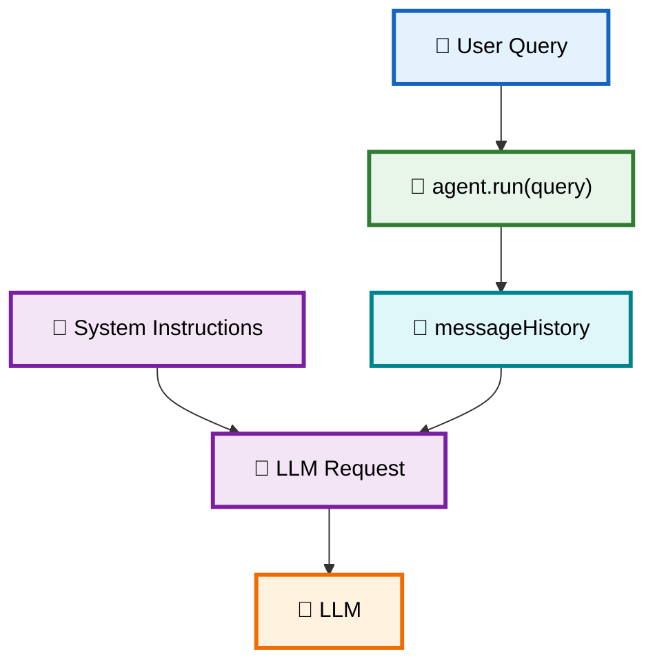
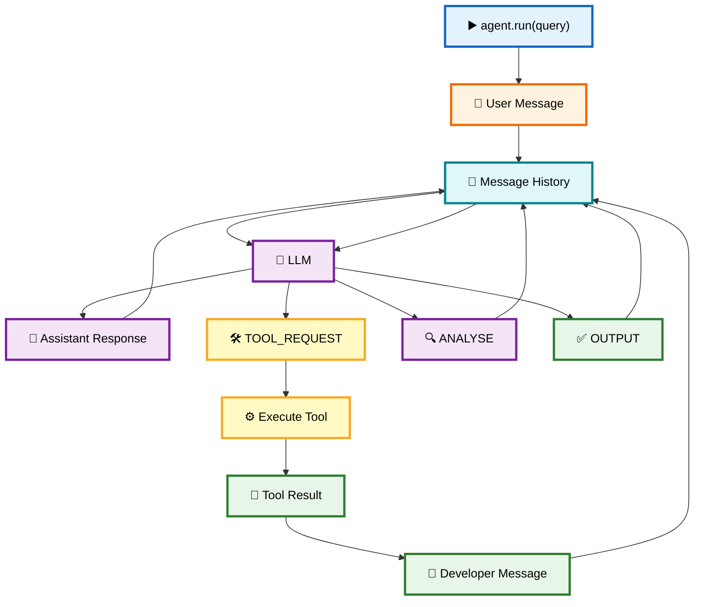
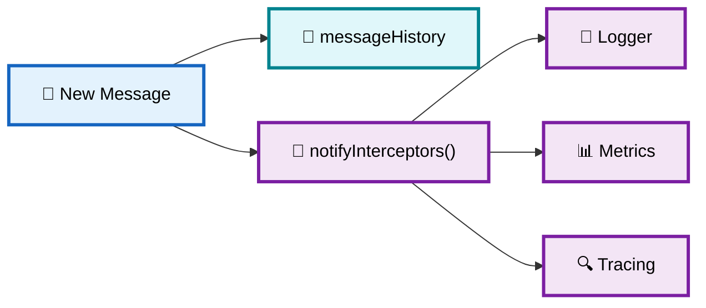
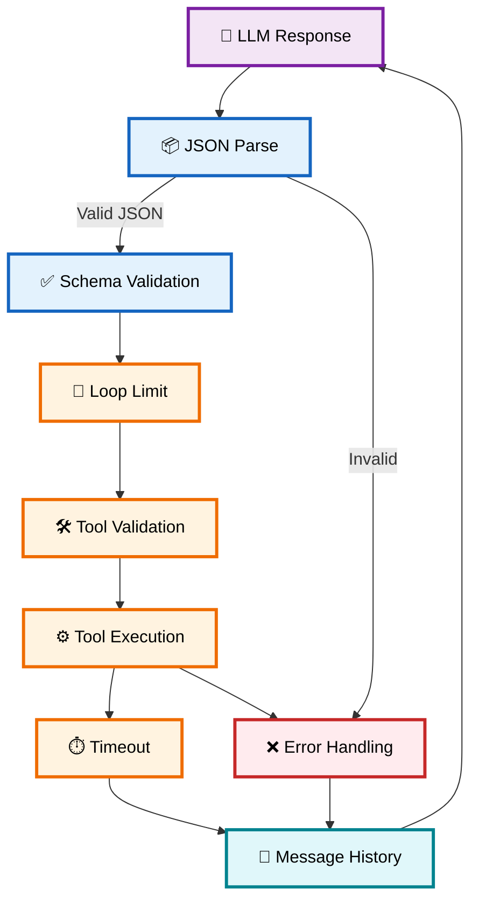
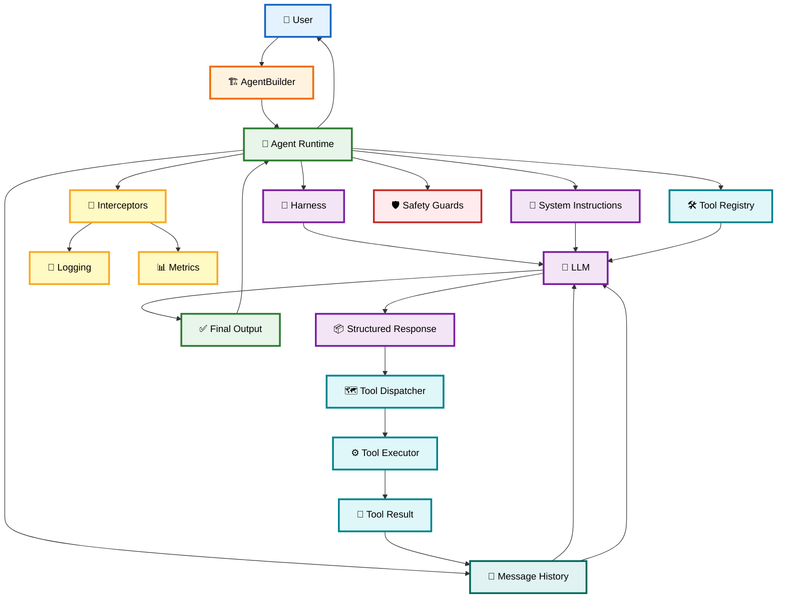

# 📡 05 — Message State Execution & Interceptor Middleware

> **Goal:** Understand how the Agent keeps track of everything that happens during execution, how messages move through the system, how interceptors observe those events, and how safety guards prevent the Agent from getting stuck or crashing.

The key idea is:

> **Message History is the Agent's memory for the current run, while Interceptors are observers that watch what happens without changing the core execution logic.**

---

# 1. 🧠 What is Message State Execution?

A normal LLM call often looks like:

```text
👤 User
   ↓
🧠 LLM
   ↓
💬 Response
```

But an Agent may need many steps:

```text
👤 User
   ↓
🧠 LLM
   ↓
🛠️ Tool
   ↓
📄 Result
   ↓
🧠 LLM
   ↓
🛠️ Another Tool
   ↓
📄 Result
   ↓
🧠 LLM
   ↓
✅ Final Answer
```

The Agent needs to remember all these events.

That's the job of:

```ts
messageHistory: IMessage[]
```

---

# 2. 💬 Message History = Agent's Execution State

Your `IMessage` interface is:

```ts
export interface IMessage {
  role: "user" | "assistant" | "developer";
  content: string;
}
```

Every important event becomes a message.

For example:

```text
┌──────────────────────────────────────┐
│         💬 messageHistory            │
├──────────────────────────────────────┤
│ 1. 👤 user                           │
│    "What's the weather in Kolkata?"  │
│                                      │
│ 2. 🤖 assistant                      │
│    {step: "INITIAL", ...}            │
│                                      │
│ 3. 🤖 assistant                      │
│    {step: "TOOL_REQUEST", ...}       │
│                                      │
│ 4. 🔧 developer                      │
│    {toolResult: "..."}               │
│                                      │
│ 5. 🤖 assistant                      │
│    {step: "ANALYSE", ...}            │
│                                      │
│ 6. 🤖 assistant                      │
│    {step: "OUTPUT", ...}             │
└──────────────────────────────────────┘
```

The next LLM call receives this history.

So the Agent can continue from where it left off.

---

# 3. 🔗 How Message History Connects to `agent.ts`

When the user calls:

```ts
await agent.run("What's the weather in Kolkata?");
```

the first thing the Agent does is:

```ts
this.messageHistory.push({
  role: "user",
  content: query
});
```

Then the Agent sends:

```ts
messages: [
  {
    role: "system",
    content: this.instructions
  },

  ...this.messageHistory
]
```

Therefore:



---

# 4. 🔄 Message State Changes During a Run

Let's follow a real example.

### User asks:

```text
"What's the weather in Kolkata?"
```

### Initial state

```text
messageHistory = []
```

---

### Step 1 — User message

```ts
{
  role: "user",
  content: "What's the weather in Kolkata?"
}
```

Now:

```text
messageHistory
└── 👤 User
```

---

### Step 2 — LLM responds

```json
{
  "step": "THINK",
  "text": "I need weather information."
}
```

Agent adds:

```ts
{
  role: "assistant",
  content: rawLLMResponse
}
```

Now:

```text
messageHistory
├── 👤 User
└── 🤖 Assistant → THINK
```

---

### Step 3 — LLM requests tool

```json
{
  "step": "TOOL_REQUEST",
  "functionName": "fetchWeatherInfo",
  "input": "Kolkata"
}
```

Added:

```text
messageHistory
├── 👤 User
├── 🤖 THINK
└── 🤖 TOOL_REQUEST
```

---

### Step 4 — Tool executes

The Agent calls:

```ts
await tool.executor("Kolkata");
```

Result:

```text
28°C, Partly cloudy
```

The Agent adds:

```ts
{
  role: "developer",
  content: JSON.stringify({
    functionName: "fetchWeatherInfo",
    input: "Kolkata",
    toolResult: "28°C, Partly cloudy"
  })
}
```

Now:

```text
messageHistory
├── 👤 User
├── 🤖 THINK
├── 🤖 TOOL_REQUEST
└── 🔧 Developer → Tool Result
```

---

### Step 5 — LLM analyses

```json
{
  "step": "ANALYSE",
  "text": "The weather is 28°C and partly cloudy."
}
```

---

### Step 6 — Final output

```json
{
  "step": "OUTPUT",
  "text": "The weather in Kolkata is 28°C and partly cloudy."
}
```

The loop stops.

---

# 5. 🗺️ Complete Message State Flow



---

# 6. 📡 What is an Interceptor?

Now we introduce another important component.

An **Interceptor** is a callback that observes Agent events.

You defined:

```ts
export type Interceptor =
  (message: IMessage) => void;
```

In simple terms:

```text
Agent creates message
        ↓
notifyInterceptors(message)
        ↓
┌─────────────┬─────────────┬─────────────┐
│             │             │             │
▼             ▼             ▼             ▼
📝 Logger    📊 Metrics    🔍 Tracing    🛡️ Audit
```

The interceptor doesn't need to control the Agent.

It simply **observes what happened**.

---

# 7. 🔗 How Interceptors Connect to `messageHistory`

This is the important connection.

Your Agent has:

```ts
private interceptors: Interceptor[] = [];
```

Developer attaches one:

```ts
agent.attachInterceptor(
  message => console.log(message)
);
```

When an event occurs:

```ts
this.notifyInterceptors(message);
```

Then:

```ts
for (const interceptor of this.interceptors) {
  interceptor(message);
}
```

So:



---

# 8. 📝 Logger Interceptor

Your logger:

```ts
const consoleLoggerInterceptor: Interceptor =
  (msg) => {
    console.log(
      `[${msg.role}] ${msg.content}`
    );
  };
```

When:

```ts
this.notifyInterceptors({
  role: "assistant",
  content: rawLLMResponse
});
```

the logger receives:

```text
[ASSISTANT] {"step":"THINK",...}
```

Later:

```text
[DEVELOPER] {"functionName":"fetchWeatherInfo",...}
```

This is useful for debugging.

---

# 9. 📊 Metrics Interceptor

The Metrics interceptor can track:

```text
Total messages
Total tool calls
Number of steps
Errors
Latency
Token usage
Cost
```

Your simplified example:

```ts
private stepCount = 0;
private toolCalls = 0;
```

Every message:

```ts
this.stepCount++;
```

And when it detects a tool-related developer message:

```ts
this.toolCalls++;
```

So you can later ask:

```ts
metrics.report();
```

and get:

```json
{
  "stepCount": 8,
  "toolCalls": 2
}
```

---

# 10. 🔌 Why Use Interceptors?

Without interceptors, your `Agent` class could become:

```text
Agent
 ├── LLM calls
 ├── Tool execution
 ├── Logging
 ├── Metrics
 ├── Database logging
 ├── Tracing
 ├── Cost tracking
 ├── Analytics
 └── Error reporting
```

That's bad separation of concerns.

With interceptors:

```text
                  🤖 AGENT
                     │
             📡 Event Stream
                     │
        ┌────────────┼────────────┐
        ▼            ▼            ▼
     📝 Logger    📊 Metrics    🔍 Tracing
```

The Agent focuses on **execution**.

Interceptors focus on **observation**.

---

# 11. 🔄 Multiple Interceptors

You can attach several:

```ts
agent.attachInterceptor(consoleLoggerInterceptor);

agent.attachInterceptor(
  metrics.getHandler()
);

agent.attachInterceptor(
  tracingInterceptor
);
```

Then:

```text
                 Agent Event
                     │
                     ▼
              notifyInterceptors()
                     │
        ┌────────────┼────────────┐
        ▼            ▼            ▼
     Logger       Metrics       Tracing
```

All three receive the same message.

---

# 12. 🛡️ Safety Guard #1 — `MAX_LOOP`

Agents can accidentally enter:

```text
THINK
 ↓
TOOL
 ↓
ANALYSE
 ↓
THINK
 ↓
TOOL
 ↓
ANALYSE
 ↓
...
```

forever.

That means:

```text
💰 More LLM calls
💰 More tokens
💰 More API calls
💥 Potential runaway execution
```

That's why your Agent has:

```ts
private MAX_LOOP = 30;
```

and:

```ts
for (
  let i = 0;
  i < this.MAX_LOOP;
  i++
) {
   ...
}
```

So:

```text
                 🔄 Agent Loop
                      │
                      ▼
                 i < 30 ?
                 /      \
              YES        NO
               │          │
               ▼          ▼
            Continue    🛑 Stop
```

---

# 13. 🛡️ Safety Guard #2 — JSON Parsing

Your Harness tells the LLM:

```text
"Return only JSON."
```

But LLM output can still sometimes be malformed.

Expected:

```json
{
  "step": "OUTPUT",
  "text": "Hello"
}
```

But it could return:

```text
Here is the result:

{
  "step": "OUTPUT",
  "text": "Hello"
}
```

Direct:

```ts
JSON.parse(rawText);
```

would fail.

So your defensive parser attempts to extract the JSON object.

```ts
const jsonMatch =
  rawText.match(/\{[\s\S]*\}/);
```

Conceptually:

```text
Raw LLM Response
       │
       ▼
   JSON.parse()
       │
    ┌──┴──┐
    │     │
  valid  invalid
    │     │
    ▼     ▼
 return  Extract {...}
          │
          ▼
       parse again
```

---

# 14. 🧱 Production Improvement: Validate the JSON Shape

Parsing JSON is not enough.

This:

```json
{
  "hello": "world"
}
```

is valid JSON but **not a valid Agent response**.

The Agent expects:

```json
{
  "step": "TOOL_REQUEST",
  "functionName": "fetchWeatherInfo",
  "input": "Kolkata"
}
```

So production systems should validate:

```text
JSON.parse()
     ↓
Schema Validation
     ↓
Is step valid?
     ↓
Does TOOL_REQUEST have functionName?
     ↓
Does tool exist?
     ↓
Execute
```

Libraries such as **Zod** are commonly used for this type of runtime validation.

---

# 15. 🔐 Safety Architecture

The complete safety layer looks like:



---

# 16. 🔗 How Everything Connects

At this point, your Agent architecture has four major layers:

```text
             🤖 AGENT RUNTIME
                    │
       ┌────────────┼────────────┐
       │            │            │
       ▼            ▼            ▼
   💬 STATE      🎯 HARNESS    🛠️ TOOLS
       │            │            │
       │            ▼            │
       │          🧠 LLM         │
       │            │            │
       │            ▼            │
       │       📦 JSON ACTION     │
       │            │            │
       │            ▼            │
       └───────→ ⚙️ EXECUTION ←──┘
                    │
                    ▼
              📡 INTERCEPTORS
```

---

# 17. 🌐 Complete Architecture — Chapters 01 → 05



---

# 18. 🧩 The Complete Execution Story

Let's put everything into one simple story.

### 👤 User

```text
"Build hello.cpp"
```

### 🤖 Agent

Adds:

```text
USER MESSAGE
```

to `messageHistory`.

### 🧠 LLM

Receives:

```text
Harness
+
Instructions
+
Tools
+
History
```

and returns:

```json
{
  "step": "TOOL_REQUEST",
  "functionName": "execCli",
  "input": "touch hello.cpp"
}
```

### 🤖 Agent Runtime

Finds:

```text
toolMap
   ↓
"execCli"
   ↓
cliAccessTool
```

### ⚙️ Tool

Executes:

```ts
exec("touch hello.cpp")
```

### 📄 Result

Gets injected into:

```text
messageHistory
```

### 📡 Interceptors

At the same time, observers can record:

```text
📝 Log
📊 Metrics
🔍 Trace
```

### 🧠 LLM

Receives updated history and decides:

```json
{
  "step": "OUTPUT",
  "text": "Created hello.cpp successfully."
}
```

### 👤 User

Receives final result.

---

# 19. ⭐ What Each Component Is Responsible For

| Component                    | Responsibility                         |
| ---------------------------- | -------------------------------------- |
| 🏗️ **Builder**              | Creates/configures Agent               |
| 🎯 **Harness**               | Defines LLM execution protocol         |
| 🧠 **LLM**                   | Chooses next action                    |
| 💬 **Message History**       | Stores execution context               |
| 🛠️ **Tool Registry**        | Stores available tools                 |
| 🗺️ **Tool Map**             | Finds tools by name                    |
| ⚙️ **Executor**              | Performs actual external action        |
| 📡 **Interceptor**           | Observes Agent events                  |
| 🛡️ **MAX_LOOP**             | Prevents infinite execution            |
| 📦 **JSON Parser/Validator** | Protects runtime from malformed output |

---

# 🧠 Final Mental Model

```text
                  👤 USER
                     │
                     ▼
               🏗️ BUILDER
                     │
                     ▼
                🤖 AGENT
                     │
       ┌─────────────┼─────────────┐
       ▼             ▼             ▼
   🎯 HARNESS     💬 STATE      🛠️ TOOLS
       │             │             │
       └─────────────┼─────────────┘
                     ▼
                  🧠 LLM
                     │
                     ▼
                📦 JSON STEP
                     │
             ┌───────┴───────┐
             ▼               ▼
       TOOL_REQUEST        OUTPUT
             │               │
             ▼               ▼
        🗺️ ToolMap        ✅ DONE
             │
             ▼
        ⚙️ Executor
             │
             ▼
       🌐 External World
             │
             ▼
         📄 Result
             │
             ▼
       💬 Message History
             │
             ▼
           🧠 LLM
             │
             └───────🔄───────┘

             Meanwhile:
                  │
                  ▼
             📡 INTERCEPTORS
              /      |      \
          📝 Log   📊 Metrics  🔍 Trace

             Safety:
          🛡️ MAX_LOOP
          🛡️ JSON Validation
          🛡️ Tool Validation
          🛡️ Timeouts
          🛡️ Error Handling
```

## 🔑 One Sentence to Remember

> **Message History gives the Agent state, Interceptors observe that state evolution, and Safety Guards keep the LLM → Tool → Result → LLM loop reliable and bounded.**

### 📚 Your Agent SDK architecture so far

```text
01 🤖 Agent SDK
      ↓
02 🏗️ Builder Pattern
      ↓
03 🎯 Harness + ReAct
      ↓
04 🛠️ Tool Registry + Execution
      ↓
05 📡 Message State + Interceptors
      ↓
06 🚀 Production Agent Runtime
```

This progression is important because **05 doesn't exist independently**: the **Harness generates structured steps → the Agent stores them in Message History → Tools add results back into that history → Interceptors observe those events → Safety Guards control the loop**.
