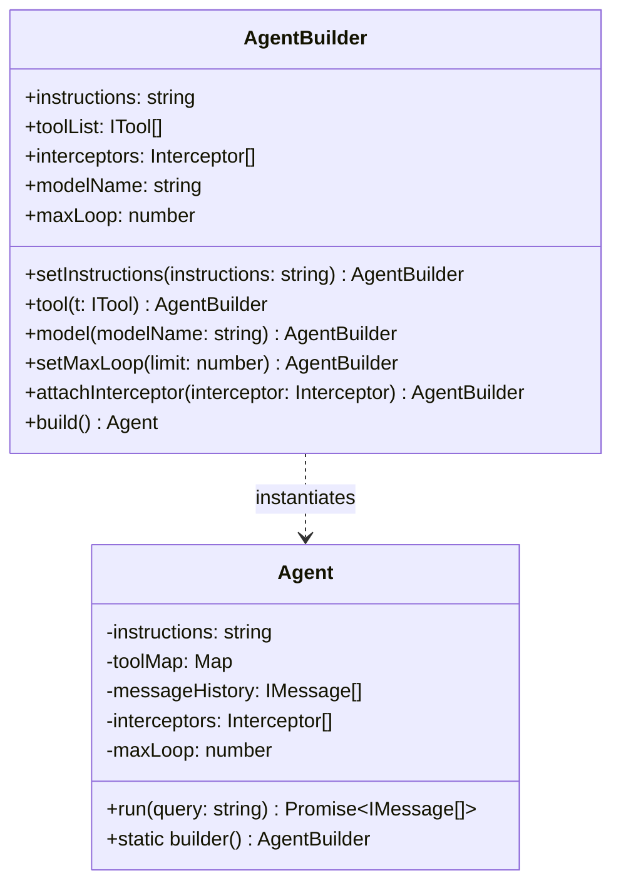
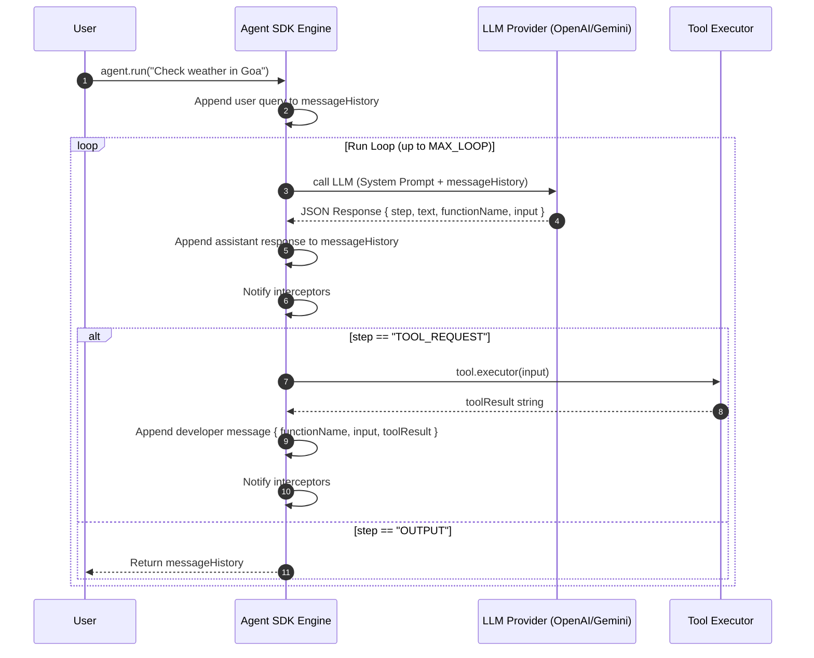

# 📚 Week 04 — Day 08 Complete Master Notes

# 🤖 Building an Agent SDK from Scratch: Architecture, Design Patterns & State Execution Engine

> **Goal:** Understand how to build a production-grade, stateful **Agent SDK** in TypeScript/Node.js from the ground up. Learn how to transform stateless LLM API calls into autonomous decision-making agents using the **Builder Pattern**, **Harness Prompts**, **ReAct Reasoning Pipelines**, **Tool Execution Registries**, and **Interceptor Middleware**.

---

# 📑 Table of Contents

1. [Stateless LLM APIs vs Stateful Agent Frameworks](#1-stateless-llm-apis-vs-stateful-agent-frameworks)
2. [The Core Agent Triad](#2-the-core-agent-triad)
3. [Design Pattern: The Agent Builder (`AgentBuilder`)](#3-design-pattern-the-agent-builder-agentbuilder)
4. [Harness Prompting & ReAct Execution Pipeline](#4-harness-prompting--react-execution-pipeline)
5. [Structured JSON Output Enforcement & Defense](#5-structured-json-output-enforcement--defense)
6. [Tool Execution Registry (`ITool` Engine)](#6-tool-execution-registry-itool-engine)
7. [Message State Execution (`messageHistory` Lifecycle)](#7-message-state-execution-messagehistory-lifecycle)
8. [Middleware & Interceptor Architecture (`attachInterceptor`)](#8-middleware--interceptor-architecture-attachinterceptor)
9. [Loop Control & Safety Bounds (`MAX_LOOP`)](#9-loop-control--safety-bounds-max_loop)
10. [Step-by-Step Complete SDK Implementation](#10-step-by-step-complete-sdk-implementation)
11. [Real-World Tool Implementations (Weather API & CLI Access)](#11-real-world-tool-implementations-weather-api--cli-access)
12. [Interview & Conceptual Questions](#12-interview--conceptual-questions)

---

# 1. Stateless LLM APIs vs Stateful Agent Frameworks

Standard LLM endpoints (e.g. OpenAI `POST /v1/chat/completions`) are **stateless**. Every HTTP call requires sending the complete context history manually.

When building real-world autonomous applications (coding assistants, workflow automation, autonomous researchers), raw API calls present major engineering challenges:
- **State Fragmentation**: Developers must write custom code to append messages, tools, and responses.
- **Uncontrolled Function Invocations**: LLMs may hallucinate tool arguments or output unstructured plain text instead of executing code.
- **Infinite Execution Risk**: Without a loop governor, an agent can stuck in recursive loops, exhausting tokens and API quotas.
- **Zero Observability**: Lacking middleware hooks makes tracking intermediate thoughts, tool calls, and execution metrics impossible.

An **Agent SDK** solves this by providing a unified, stateful runtime container that encapsulates prompt harnesses, tool registries, message state logs, and event streams.

---

# 2. The Core Agent Triad

Every agent constructed within an Agent SDK is defined by three fundamental components:

$$\text{Agent System} = \text{LLM Engine} + (\text{System Instructions} + \text{Harness Prompt}) + \text{Tools Registry}$$

```
                          +-------------------------------+
                          |           AGENT SDK           |
                          +-------------------------------+
                                          |
               +--------------------------+--------------------------+
               |                          |                          |
               v                          v                          v
     +------------------+       +------------------+       +------------------+
     |    LLM BRAIN     |       |   INSTRUCTIONS   |       |    TOOLS MAP     |
     | (GPT-4o / Gemini |   +   |   & HARNESS      |   +   | (APIs, CLI,      |
     |  / Local LLM)    |       |     PROMPT       |       |  Database, Web)  |
     +------------------+       +------------------+       +------------------+
```

1. **LLM Engine**: The base generative language model.
2. **Instructions & Harness Prompt**: The persona guidelines combined with a strict operational pipeline (`INITIAL` $\rightarrow$ `THINK` $\rightarrow$ `TOOL_REQUEST` $\rightarrow$ `ANALYSE` $\rightarrow$ `OUTPUT`).
3. **Tools Map**: A `Map<string, ITool>` dictionary containing registered executable functions.

---

# 3. Design Pattern: The Agent Builder (`AgentBuilder`)

The **Builder Pattern** decouples the step-by-step configuration of an agent from its actual execution runtime.

### Why Builder Pattern?
- **Fluent Interface**: Enables intuitive method chaining (`Agent.builder().setInstructions().tool().build()`).
- **Validation**: Ensures tool uniqueness, instruction defaults, and config sanity before instantiation.
- **Immutable Agents**: Once `.build()` is invoked, the `Agent` configuration remains stable during runtime.



---

# 4. Harness Prompting & ReAct Execution Pipeline

A **Harness Prompt** is a system prompt wrapper that dictates *how* the model thinks, reasons, and acts.

The SDK enforces a 5-step ReAct pipeline:

```
+----------+     +----------+     +--------------+     +------------+     +------------+
| INITIAL  | --> |  THINK   | --> | TOOL_REQUEST | --> |  ANALYSE   | --> |   OUTPUT   |
| (Intent) |     | (Decomp) |     | (Invocation) |     | (Evaluate) |     | (Final Ans)|
+----------+     +----------+     +--------------+     +------------+     +------------+
     ^                                                          |
     +---------------------- Iterative Loop --------------------+
```

### Pipeline Definitions:
1. **`INITIAL`**: High-level identification of user goal.
2. **`THINK`**: Step-by-step problem decomposition.
3. **`TOOL_REQUEST`**: Invoking a tool (`{ "step": "TOOL_REQUEST", "functionName": "...", "input": "..." }`).
4. **`ANALYSE`**: Inspecting tool outputs or mathematical steps to confirm correctness.
5. **`OUTPUT`**: Emitting the final answer and ending the run loop.

---

# 5. Structured JSON Output Enforcement & Defense

To ensure reliable programmatic execution, every step output by the LLM must adhere to a strict JSON structure:

```json
{
  "step": "INITIAL | THINK | TOOL_REQUEST | ANALYSE | OUTPUT",
  "text": "<reasoning text>",
  "functionName": "<name of function if tool request>",
  "input": "<arguments to pass to function>"
}
```

### Robust JSON Repair Parser
Models occasionally add conversational text or markdown code fences. The SDK implements a defensive parser:

```typescript
function parseLLMOutput(rawText: string): any {
  try {
    return JSON.parse(rawText);
  } catch {
    const matched = rawText.match(/\{[\s\S]*\}/);
    if (matched) {
      return JSON.parse(matched[0]);
    }
    throw new Error(`Invalid JSON produced by model: ${rawText}`);
  }
}
```

---

# 6. Tool Execution Registry (`ITool` Engine)

The `ITool` interface defines executable capability contracts:

```typescript
export interface ITool {
  name: string;
  description: string;
  doc?: string;
  executor: (input: string) => Promise<string> | string;
}
```

### Schema Generation & Injection
When an agent is created, tool metadata is rendered into JSON strings and injected into the system prompt:

```typescript
const toolsPrompt = builder.toolList
  .map(t => JSON.stringify({
    functionName: t.name,
    functionDescription: t.description,
    functionDoc: t.doc
  }))
  .join("\n");
```

---

# 7. Message State Execution (`messageHistory` Lifecycle)

State evolution tracks three key roles:
- `user`: Human queries.
- `assistant`: Intermediate thoughts (`THINK`), tool invocation requests (`TOOL_REQUEST`), and final outputs (`OUTPUT`).
- `developer`: Dynamic feedback from tool execution (`toolResult`), error messages, or environment context.



---

# 8. Middleware & Interceptor Architecture (`attachInterceptor`)

Interceptors implement the **Observer / Event Listener pattern**, allowing external monitoring without mutating core runtime logic.

```typescript
export type Interceptor = (message: IMessage) => void;

// Usage:
agent.attachInterceptor((msg) => {
  console.log(`[EVENT LOG] Role: ${msg.role} | Content: ${msg.content}`);
});
```

---

# 9. Loop Control & Safety Bounds (`MAX_LOOP`)

Autonomous execution loops can fail due to network errors, missing tool arguments, or model loops.

The SDK prevents unbounded loops by enforcing a `MAX_LOOP` cap (default: `30` iterations). If `MAX_LOOP` is exceeded without reaching `step === "OUTPUT"`, execution terminates safely with an exception or fallback history.

---

# 10. Step-by-Step Complete SDK Implementation

Below is the complete, single-file runnable representation of the Custom Agent SDK:

```typescript
import OpenAI from "openai";

export interface IMessage {
  role: "user" | "assistant" | "developer";
  content: string;
}

export interface ITool {
  name: string;
  description: string;
  doc?: string;
  executor: (input: string) => Promise<string> | string;
}

export type Interceptor = (message: IMessage) => void;

export const HARNESS_PROMPT = `
You are an expert AI assistant system governed by an Agent Harness.

You must analyze user input carefully and break down complex problems step-by-step.

Execution Pipeline:
- INITIAL: State high-level goal.
- THINK: Deconstruct problem into sub-tasks.
- TOOL_REQUEST: Request tool call. Format: { "step": "TOOL_REQUEST", "functionName": "...", "input": "..." }
- ANALYSE: Inspect tool output or result.
- OUTPUT: Emit final answer to user.

Strict JSON Format:
{ "step": "INITIAL" | "THINK" | "TOOL_REQUEST" | "ANALYSE" | "OUTPUT", "text": "...", "functionName": "...", "input": "..." }
`;

export class AgentBuilder {
  public instructions: string = "";
  public toolList: ITool[] = [];
  public interceptors: Interceptor[] = [];
  public maxLoop: number = 30;

  public setInstructions(instructions: string): this {
    this.instructions = instructions;
    return this;
  }

  public tool(t: ITool): this {
    this.toolList.push(t);
    return this;
  }

  public attachInterceptor(interceptor: Interceptor): this {
    this.interceptors.push(interceptor);
    return this;
  }

  public build(): Agent {
    return new Agent(this);
  }
}

export class Agent {
  private instructions: string;
  private messageHistory: IMessage[] = [];
  private toolMap: Map<string, ITool> = new Map();
  private interceptors: Interceptor[] = [];
  private maxLoop: number;
  private openai: OpenAI;

  constructor(builder: AgentBuilder) {
    this.maxLoop = builder.maxLoop;
    this.interceptors = [...builder.interceptors];
    this.openai = new OpenAI({ apiKey: process.env.OPENAI_API_KEY || "" });

    for (const t of builder.toolList) {
      this.toolMap.set(t.name, t);
    }

    const toolsDescription = builder.toolList
      .map((t) => JSON.stringify({ functionName: t.name, functionDescription: t.description, functionDoc: t.doc }))
      .join("\n");

    this.instructions = `
      ${HARNESS_PROMPT}

      System Instructions:
      ${builder.instructions}

      Available Tools:
      ${toolsDescription}
    `;
  }

  public static builder(): AgentBuilder {
    return new AgentBuilder();
  }

  public attachInterceptor(interceptor: Interceptor): void {
    this.interceptors.push(interceptor);
  }

  private notifyInterceptors(message: IMessage): void {
    for (const fn of this.interceptors) {
      fn(message);
    }
  }

  public async run(query: string): Promise<IMessage[]> {
    this.messageHistory.push({ role: "user", content: query });

    for (let i = 0; i < this.maxLoop; i++) {
      const response = await this.openai.chat.completions.create({
        model: "gpt-4o",
        messages: [
          { role: "system", content: this.instructions },
          ...this.messageHistory.map((m) => ({ role: m.role, content: m.content })),
        ],
      });

      const rawContent = response.choices[0]?.message?.content || "";
      this.messageHistory.push({ role: "assistant", content: rawContent });
      this.notifyInterceptors({ role: "assistant", content: rawContent });

      let parsed: any;
      try {
        parsed = JSON.parse(rawContent);
      } catch {
        const match = rawContent.match(/\{[\s\S]*\}/);
        if (match) parsed = JSON.parse(match[0]);
        else throw new Error(`Could not parse LLM output: ${rawContent}`);
      }

      if (parsed.step?.toUpperCase() === "OUTPUT") {
        return this.messageHistory;
      }

      if (parsed.step?.toUpperCase() === "TOOL_REQUEST") {
        const { functionName, input } = parsed;
        const tool = this.toolMap.get(functionName);

        if (!tool) {
          const errPayload = `Error: Tool '${functionName}' not found.`;
          this.messageHistory.push({ role: "developer", content: errPayload });
          this.notifyInterceptors({ role: "developer", content: errPayload });
          continue;
        }

        const toolResult = await tool.executor(input);
        const devPayload = JSON.stringify({ functionName, input, toolResult });
        this.messageHistory.push({ role: "developer", content: devPayload });
        this.notifyInterceptors({ role: "developer", content: devPayload });
      }
    }

    throw new Error(`Agent exceeded MAX_LOOP limit of ${this.maxLoop} turns.`);
  }
}
```

---

# 11. Real-World Tool Implementations (Weather API & CLI Access)

### Weather Tool Integration (`wttr.in`)
```typescript
import axios from "axios";

export const weatherTool: ITool = {
  name: "fetchWeatherInfo",
  description: "Fetches live weather reports by city name.",
  doc: "fetchWeatherInfo(cityName: string): WeatherData",
  async executor(cityName: string) {
    const url = `https://wttr.in/${encodeURIComponent(cityName.trim())}?format=%C+%t`;
    const response = await axios.get(url, { responseType: "text" });
    return JSON.stringify({ cityName, weather: response.data.trim() });
  },
};
```

### CLI Command Execution Tool (`child_process`)
```typescript
import { exec } from "child_process";

export const cliAccessTool: ITool = {
  name: "execCli",
  description: "Runs CLI shell commands on host machine.",
  doc: "execCli(command: string): CommandOutput",
  executor(cmd: string) {
    return new Promise((resolve) => {
      exec(cmd, (err, stdout, stderr) => {
        if (err) resolve(`Error: ${err.message}\n${stderr}`);
        else resolve(stdout.trim());
      });
    });
  },
};
```

---

# 12. Interview & Conceptual Questions

### Q1: Why use an Agent SDK instead of calling `openai.chat.completions.create` directly in application logic?
**Answer:** Calling LLM endpoints directly leads to unstructured, non-reusable code. An Agent SDK encapsulates state persistence (`messageHistory`), tool dispatching, structured ReAct pipelines (`INITIAL` $\rightarrow$ `THINK` $\rightarrow$ `TOOL_REQUEST` $\rightarrow$ `OUTPUT`), interceptor middleware, and safety limits (`MAX_LOOP`), providing a production-ready agent runtime.

### Q2: What design pattern is used to construct Agent instances in the SDK and why?
**Answer:** The **Builder Pattern (`AgentBuilder`)**. It allows fluent method chaining (`.setInstructions()`, `.tool()`, `.attachInterceptor()`), handles optional default parameters, prevents duplicate tool registrations, and ensures immutable `Agent` instances once `.build()` is executed.

### Q3: What is the purpose of a Harness Prompt?
**Answer:** A Harness Prompt is a meta-system prompt injected by the framework around user instructions. It enforces structured reasoning steps (ReAct pipeline) and forces the LLM to output valid JSON objects, enabling predictable parsing and tool execution by the framework runtime.

### Q4: How does tool execution feedback work in the Message State Execution model?
**Answer:** When the agent emits a `TOOL_REQUEST` JSON, the framework looks up the tool in its `toolMap`, executes its `executor(input)` function, and appends the result to `messageHistory` with the `developer` role. On the next turn, the model sees this result and proceeds to `ANALYSE` or `OUTPUT`.

### Q5: What prevents an autonomous agent from entering infinite billing loops when tool calls repeatedly fail?
**Answer:** The `MAX_LOOP` counter limit (e.g., 30 turns). The run loop counts iterations and throws a controlled exception or returns early if the agent fails to reach the `OUTPUT` step within the limit.
