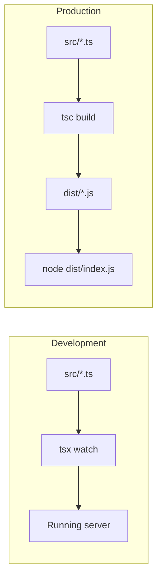

---

## Build order

```
Ch1 Bootstrap
 └─ Ch2 Database
     └─ Ch3 Auth
         └─ Ch4 Workspaces
             └─ Ch5 Sources CRUD (TEXT/MARKDOWN)
                 └─ Ch6 Import channels
                     └─ Ch7 Indexing pipeline
                         ├─ Ch8 RAG Chat
                         ├─ Ch9 Memory + web search
                         └─ Ch10 Artifacts
```

---

## Chapter 1 — Project bootstrap

| Item | Detail |
| --- | --- |
| **Goal** | Runnable Express server |
| **Student outcome** | Server starts, health check works |

# TypeScript + Express Setup Notes

These notes match how your **Chaibook server** is set up, plus a minimal from-scratch version.

---

## 1. Project structure

```
server/
├── package.json
├── tsconfig.json
├── .env
├── src/
│   └── index.ts          ← entry point
└── dist/                 ← compiled JS (generated)
    └── index.js
```

---

## 2. Initialize the project

```bash
mkdir my-api && cd my-api
npm init -y
```

Set `"type": "module"` in `package.json` if you want ESM (your project uses this):

```json
{
  "type": "module"
}
```

---

## 3. Install dependencies

```bash
# Runtime
npm install express dotenv

# Dev / types
npm install -D typescript tsx @types/node @types/express
```

| Package | Purpose |
| --- | --- |
| `express` | HTTP server |
| `dotenv` | Load `.env` |
| `typescript` | Type checker + compiler (`tsc`) |
| `tsx` | Run TS directly in dev (no manual compile) |
| `@types/express` | TypeScript types for Express |

---

## 4. `tsconfig.json`

Your server uses this (good default for Node + ESM):

```json
{
  "compilerOptions": {
    "target": "ES2022",
    "module": "NodeNext",
    "moduleResolution": "NodeNext",
    "lib": ["ES2022"],
    "outDir": "dist",
    "rootDir": "src",
    "strict": true,
    "esModuleInterop": true,
    "skipLibCheck": true,
    "forceConsistentCasingInFileNames": true,
    "resolveJsonModule": true
  },
  "include": ["src/**/*"],
  "exclude": ["node_modules", "dist"]
}
```

Important bits:

- **`outDir: "dist"`** — compiled JS goes here
- **`rootDir: "src"`** — TypeScript source lives here
- **`module: "NodeNext"`** — matches `"type": "module"` in package.json
- **`strict: true`** — full type checking

---

## 5. Minimal Express entry (`src/index.ts`)

```tsx
import "dotenv/config";
import express from "express";

const app = express();
const port = process.env.PORT ?? 8080;

app.use(express.json());

app.get("/", (_req, res) => {
  res.json({ message: "Hello" });
});

app.get("/health", (_req, res) => {
  res.json({ status: "ok" });
});

app.listen(port, () => {
  console.log(`Server running on <http://localhost>:${port}`);
});
```

---

## 6. ESM import rule (`.js` extensions)

With `"module": "NodeNext"`, local imports use **`.js`** even in `.ts` files:

```tsx
import { auth } from "./lib/auth.js";   // ✅
import { auth } from "./lib/auth";     // ❌ may fail at runtime
```

TypeScript resolves `./lib/auth.js` to `./lib/auth.ts` at compile time; Node loads the compiled `.js` file.

---

## 7. Scripts in `package.json`

Same pattern as your Chaibook server:

```json
{
  "main": "dist/index.js",
  "scripts": {
    "dev": "tsx watch src/index.ts",
    "build": "tsc",
    "start": "node dist/index.js"
  }
}
```

| Script | What it does |
| --- | --- |
| `npm run dev` | Run TS directly, auto-restart on save |
| `npm run build` | Compile `src/` → `dist/` |
| `npm start` | Run compiled JS in production |

Your project also runs `prisma generate` before dev:

```json
"dev": "prisma generate && tsx watch src/index.ts"
```

---

## 8. How to run

### Development (recommended)

```bash
npm run dev
```

- No manual compile
- `tsx watch` restarts on file changes
- Hit `http://localhost:8080/health`

### Production build + run

```bash
npm run build    # tsc → writes dist/
npm start        # node dist/index.js
```

Flow:

```
src/index.ts  ──tsc──►  dist/index.js  ──node──►  running server
```

---

## 9. Environment variables

Create `server/.env`:

```
PORT=8080
DATABASE_URL=postgresql://...
OPENAI_API_KEY=sk-...
```

Load at the top of entry:

```tsx
import "dotenv/config";
```

---

## 10. Dev vs production



|  | Dev | Production |
| --- | --- | --- |
| Tool | `tsx watch` | `tsc` then `node` |
| Speed | Fast iteration | Optimized for deploy |
| Output | In memory | `dist/` folder |

---

## 11. Your Chaibook server (quick reference)

From `server/`:

```bash
npm install
npm run dev      # dev with hot reload
npm run build    # compile
npm start        # run compiled output
```

Entry: `src/index.ts` → compiles to `dist/index.js`.

---

## 12. Common issues

**`Cannot find module './foo.js'`**

→ Add `.js` to local imports when using `NodeNext`.

**`tsc` succeeds but `node dist/index.js` fails**

→ Check ESM/CJS mismatch; ensure `"type": "module"` matches `module: "NodeNext"`.

**Port in use**

→ Change `PORT` in `.env` or stop the other process.

**Types missing**

→ Install `@types/<package>` for libraries without built-in types.

---

## 

| File | Purpose |
| --- | --- |
| `package.json` | Scripts + dependencies |
| `tsconfig.json` | TypeScript config |
| `.env` / `.env.example` | `PORT`, `CLIENT_URL` |
| `src/index.ts` | Express, CORS, health routes |

### Routes

| Method | Full path | Route code |
| --- | --- | --- |
| `GET` | `/` | `app.get("/", (_req, res) => res.json({ message: "Hello from Chaibook API" }));` |
| `GET` | `/health` | `app.get("/health", (_req, res) => res.json({ status: "ok" }));` |

### Do NOT add yet

Prisma, auth, routes folder, AI libs

---

## Chapter 2 — Database foundation

| Item | Detail |
| --- | --- |
| **Goal** | Postgres connected via Prisma |
| **Student outcome** | Migrate runs, client generates |

### Files to create

| File | Purpose |
| --- | --- |
| `prisma/schema.prisma` | Auth models only (`User`, `Session`, `Account`, `Verification`) |
| `src/lib/db.ts` | Prisma client |

### Env

| Variable | Required |
| --- | --- |
| `DATABASE_URL` | Yes |

### Do NOT add yet

Business models, auth routes, API routes

---

## Chapter 3 — Authentication

| Item | Detail |
| --- | --- |
| **Goal** | Google login + protected routes |
| **Student outcome** | User can sign in, session cookie works |

### Files to create

| File | Purpose |
| --- | --- |
| `src/lib/auth.ts` | Better Auth + Prisma adapter + Google |
| `src/lib/session.ts` | Session type |
| `src/middleware/require-auth.middleware.ts` | `req.session` or 401 |

### Touch

| File | Change |
| --- | --- |
| `src/index.ts` | Mount auth **before** `express.json()` |

### Routes

| Method | Full path | Route code |
| --- | --- | --- |
| `ALL` | `/api/auth/*` | `app.all("/api/auth/{*any}", toNodeHandler(auth));` |

### Env

| Variable | Required |
| --- | --- |
| `BETTER_AUTH_SECRET` | Yes |
| `BETTER_AUTH_URL` | Yes |
| `GOOGLE_CLIENT_ID` | Yes |
| `GOOGLE_CLIENT_SECRET` | Yes |
| `CLIENT_URL` | Yes |

### Do NOT add yet

Workspaces, sources, business routes

---

## Chapter 4 — App skeleton + Workspaces

| Item | Detail |
| --- | --- |
| **Goal** | First full feature + shared HTTP patterns |
| **Student outcome** | CRUD workspaces for logged-in user |

### Files to create

| File | Purpose |
| --- | --- |
| `src/types/app-error.ts` | Error classes |
| `src/utils/async-handler.ts` | Async route wrapper |
| `src/utils/zod-error.ts` | Zod → field errors |
| `src/middleware/error-handler.middleware.ts` | Global error handler |
| `src/validators/workspace.validator.ts` | Zod schemas |
| `src/repositories/workspace.repository.ts` | Prisma access |
| `src/services/workspace.service.ts` | Business logic |
| `src/controllers/workspace.controller.ts` | HTTP handlers |
| `src/routes/workspace.routes.ts` | Routes |
| `src/routes/index.ts` | Route registry |

### Touch

| File | Change |
| --- | --- |
| `prisma/schema.prisma` | Add `Workspace` model |
| `src/index.ts` | `registerRoutes(app)` + error handler |

### Mount

```tsx
// src/routes/index.ts
app.use("/api/workspaces", workspaceRoutes);
```

### Routes

| Method | Full path | Route code |
| --- | --- | --- |
| `GET` | `/api/workspaces` | `workspaceRoutes.get("/", asyncHandler(listWorkspaces));` |
| `POST` | `/api/workspaces` | `workspaceRoutes.post("/", asyncHandler(createWorkspace));` |
| `GET` | `/api/workspaces/:workspaceId` | `workspaceRoutes.get("/:workspaceId", asyncHandler(getWorkspace));` |
| `PATCH` | `/api/workspaces/:workspaceId` | `workspaceRoutes.patch("/:workspaceId", asyncHandler(updateWorkspace));` |
| `DELETE` | `/api/workspaces/:workspaceId` | `workspaceRoutes.delete("/:workspaceId", asyncHandler(deleteWorkspace));` |

**Auth on all workspace routes:**

```tsx
workspaceRoutes.use(requireAuth);
```

### Do NOT add yet

Sources, Pinecone, Inngest

---

## Chapter 5 — Sources: save TEXT & MARKDOWN

| Item | Detail |
| --- | --- |
| **Goal** | Save knowledge to DB — no AI |
| **Student outcome** | Create/list/get/delete notes; all stay `PENDING` |

### Files to create

| File | Purpose |
| --- | --- |
| `src/validators/source.validator.ts` | TEXT/MARKDOWN + list/delete schemas |
| `src/repositories/source.repository.ts` | Prisma CRUD |
| `src/services/source.service.ts` | Ownership + CRUD |
| `src/controllers/source.controller.ts` | 5 handlers |
| `src/routes/source.routes.ts` | Routes |
|  |  |

### Touch

| File | Change |
| --- | --- |
| `prisma/schema.prisma` | `Source`, `SourceChunk`, enums |
| `src/routes/index.ts` | Mount sources under workspace |

### Mount

```tsx
workspaceRoutes.use("/:workspaceId/sources", sourceRoutes);
```

### Routes

| Method | Full path | Route code |
| --- | --- | --- |
| `GET` | `/api/workspaces/:workspaceId/sources` | `sourceRoutes.get("/", asyncHandler(listSources));` |
| `POST` | `/api/workspaces/:workspaceId/sources` | `sourceRoutes.post("/", asyncHandler(createSource));` |
| `POST` | `/api/workspaces/:workspaceId/sources/bulk-delete` | `sourceRoutes.post("/bulk-delete", asyncHandler(bulkDeleteSources));` |
| `GET` | `/api/workspaces/:workspaceId/sources/:sourceId` | `sourceRoutes.get("/:sourceId", asyncHandler(getSource));` |
| `DELETE` | `/api/workspaces/:workspaceId/sources/:sourceId` | `sourceRoutes.delete("/:sourceId", asyncHandler(deleteSource));` |

### Service rule

```tsx
createSourceRecord({ ...data, status: "PENDING" })  // direct save, no jobs
```

### Do NOT add yet

Imports, chunking, OpenAI, Pinecone, Inngest, `SourceChunk` API

---

---

# Chapter 6 — Source Import Channels

All imported sources must be saved with `status: "PENDING"`.

## Step 0 — Shared source creation

### `src/repositories/source.repository.ts`

```tsx
createSourceRecord(data)
```

### `src/services/source.service.ts`

```tsx
createSourceInWorkspace(workspaceId, userId, data)
```

Responsibilities:

- Verify workspace ownership.
- Call `createSourceRecord()`.
- Force status to `PENDING`.

---

## 6A — Website import

### `src/lib/firecrawl.ts`

```tsx
scrapeWebsite(url)
```

### `src/services/source.service.ts`

```tsx
importWebsiteSource(workspaceId, userId, input)
```

### `src/controllers/source.controller.ts`

```tsx
importWebsite(req, res)
```

### `src/validators/source.validator.ts`

```tsx
importWebsiteSchema
```

### `src/routes/source.routes.ts`

```tsx
sourceRoutes.post(
  "/import/website",
  asyncHandler(importWebsite),
);
```

Environment:

```
FIRECRAWL_API_KEY=
```

---

## 6B — YouTube import

### `src/lib/youtube.ts`

```tsx
fetchYoutubeTranscript(url)
```

### `src/services/source.service.ts`

```tsx
importYoutubeSource(workspaceId, userId, input)
```

### `src/controllers/source.controller.ts`

```tsx
importYoutube(req, res)
```

### `src/validators/source.validator.ts`

```tsx
importYoutubeSchema
```

### `src/routes/source.routes.ts`

```tsx
sourceRoutes.post(
  "/import/youtube",
  asyncHandler(importYoutube),
);
```

---

## 6C — PDF upload

### `src/middleware/upload.middleware.ts`

```tsx
uploadSinglePdf
```

### `src/lib/cloudinary.ts`

```tsx
uploadPdfToCloudinary(buffer, filename)
```

`pdf.ts` is not required yet because PDF extraction belongs to the processing chapter.

### `src/services/source.service.ts`

```tsx
uploadPdfSource(workspaceId, userId, file, title)
```

### `src/controllers/source.controller.ts`

```tsx
uploadPdf(req, res)
```

### `src/routes/source.routes.ts`

```tsx
sourceRoutes.post(
  "/upload",
  uploadSinglePdf,
  asyncHandler(uploadPdf),
);
```

Environment:

```
CLOUDINARY_CLOUD_NAME=
CLOUDINARY_UPLOAD_PRESET=
```

---

## 6D — Save web-search result

### `src/services/source.service.ts`

```tsx
importWebSearchSource(workspaceId, userId, input)
```

### `src/controllers/source.controller.ts`

```tsx
importWebSearch(req, res)
```

### `src/validators/source.validator.ts`

```tsx
importWebSearchSchema
```

### `src/routes/source.routes.ts`

```tsx
sourceRoutes.post(
  "/import/web-search",
  asyncHandler(importWebSearch),
);
```

---

## Functions created in this chapter

```
source.repository.ts
└── createSourceRecord

source.service.ts
├── createSourceInWorkspace
├── importWebsiteSource
├── importYoutubeSource
├── uploadPdfSource
└── importWebSearchSource

source.controller.ts
├── importWebsite
├── importYoutube
├── uploadPdf
└── importWebSearch

firecrawl.ts
└── scrapeWebsite

youtube.ts
└── fetchYoutubeTranscript

cloudinary.ts
└── uploadPdfToCloudinary

upload.middleware.ts
└── uploadSinglePdf
```

Do not add Inngest, chunking, indexing, reprocessing, or chunk APIs yet.

## Chapter 7 — Source indexing & pipeline

| Item | Detail |
| --- | --- |
| **Goal** | `PENDING → PROCESSING → READY` for any source type |
| **Student outcome** | Sources become searchable; failures can retry |

---

### 7A — Chunking + config

| File | Exports |
| --- | --- |
| `src/lib/ai-config.ts` | `CHUNK_SIZE`, `EMBEDDING_*` |
| `src/lib/chunking.ts` | `chunkText()`, `chunkPages()` |
| `src/repositories/source-chunk.repository.ts` | chunk CRUD |

---

### 7B — Embeddings + vectors

| File | Exports |
| --- | --- |
| `src/lib/openai.ts` | `embedTexts()` |
| `src/lib/pinecone.ts` | `upsertSourceVectors()`, `deleteSourceVectors()` |

**Env:** `OPENAI_API_KEY`, `PINECONE_API_KEY`, `PINECONE_INDEX`

---

### 7C — Processing service

| File | Key functions |
| --- | --- |
| `src/services/source-processing.service.ts` | , `extractSourceContent()`, `chunkSourceContent()`, `embedAndIndexSource()`, `markSourceProcessing()`, `markSourceFailed()`, `removeSourceFromIndex()`, `listChunksForSource()` |

**Teach sync first:** call `processSourceById()` manually before Inngest.

---

### 7D — Inngest worker

| File | Purpose |
| --- | --- |
| `src/inngest/client.ts` | Inngest client |
| `src/inngest/index.ts` | `processSource` function |
| `src/lib/source-events.ts` | `enqueueSourceProcessing()` |

**Touch `src/index.ts`:**

```tsx
app.use("/api/inngest", serve({ client: inngest, functions }));
```

**Refactor service:**

```tsx
createAndProcessSource(data)  // save + enqueue — replaces createSourceInWorkspace for all creates
```

**Env:** `INNGEST_DEV=1`

---

### 7E — Reprocess, inspect, cleanup

| File | Changes |
| --- | --- |
| `source.repository.ts` | add `updateSourceRecord()` |
| `source.service.ts` | reprocess + chunks + delete clears Pinecone |
| `workspace.service.ts` | delete workspace clears Pinecone namespace |

### Routes

| Method | Full path | Route code |
| --- | --- | --- |
| `GET` | `/api/workspaces/:workspaceId/sources/:sourceId/chunks` | `sourceRoutes.get("/:sourceId/chunks", asyncHandler(getSourceChunks));` |
| `POST` | `/api/workspaces/:workspaceId/sources/reprocess` | `sourceRoutes.post("/reprocess", asyncHandler(reprocessSources));` |
| `POST` | `/api/workspaces/:workspaceId/sources/:sourceId/reprocess` | `sourceRoutes.post("/:sourceId/reprocess", asyncHandler(reprocessSource));` |

### Route order rule

Specific paths (`/import/*`, `/upload`, `/bulk-delete`, `/reprocess`) **before** `/:sourceId`.

### Do NOT add yet

Chat, artifacts, Mem0 summarization jobs

---

## Chapter 8 — Conversations & RAG chat

| Item | Detail |
| --- | --- |
| **Goal** | Stream answers grounded in indexed sources |
| **Student outcome** | Chat with citations over `READY` sources |

### Files to create

| File | Purpose |
| --- | --- |
| `src/validators/chat.validator.ts` | Chat + conversation schemas |
| `src/repositories/conversation.repository.ts` | Conversation CRUD |
| `src/repositories/message.repository.ts` | Message CRUD |
| `src/utils/chat-message.ts` | UI message helpers |
| `src/lib/rag/retrieve.ts` | Pinecone retrieve + system prompt |
| `src/services/chat.service.ts` | Streaming RAG chat |
| `src/controllers/chat.controller.ts` | Handlers |
| `src/routes/chat.routes.ts` | Routes |

### Touch

| File | Change |
| --- | --- |
| `prisma/schema.prisma` | `Conversation`, `Message` |
| `src/routes/index.ts` | Mount conversation + chat routes |

### Mount

```tsx
workspaceRoutes.use("/:workspaceId/conversations", conversationRoutes);
workspaceRoutes.use("/:workspaceId/chat", chatRoutes);
```

### Routes

| Method | Full path | Route code |
| --- | --- | --- |
| `GET` | `/api/workspaces/:workspaceId/conversations` | `conversationRoutes.get("/", asyncHandler(listConversations));` |
| `POST` | `/api/workspaces/:workspaceId/conversations` | `conversationRoutes.post("/", asyncHandler(createConversation));` |
| `GET` | `/api/workspaces/:workspaceId/conversations/:conversationId/messages` | `conversationRoutes.get("/:conversationId/messages", asyncHandler(listConversationMessages));` |
| `DELETE` | `/api/workspaces/:workspaceId/conversations/:conversationId` | `conversationRoutes.delete("/:conversationId", asyncHandler(deleteConversation));` |
| `POST` | `/api/workspaces/:workspaceId/chat` | `chatRoutes.post("/", asyncHandler(streamChat));` |

### Do NOT add yet

Mem0, Tavily, conversation summarization

---

## Chapter 9 — Memory, summarization & web search

| Item | Detail |
| --- | --- |
| **Goal** | Personal memory + long-chat context + live web in chat |
| **Student outcome** | Memories persist; chat uses Mem0 + optional Tavily |

### Files to create

| File | Purpose |
| --- | --- |
| `src/lib/mem0.ts` | Mem0 CRUD + search |
| `src/lib/tavily.ts` | Web search tool |
| `src/lib/conversation-events.ts` | Enqueue summarize |
| `src/validators/memory.validator.ts` | Memory schemas |
| `src/services/memory.service.ts` | Manual memory API |
| `src/services/conversation-memory.service.ts` | Rolling summary |
| `src/controllers/memory.controller.ts` | Handlers |
| `src/routes/memory.routes.ts` | Routes |

### Touch

| File | Change |
| --- | --- |
| `src/inngest/index.ts` | add `summarizeConversation` |
| `src/services/chat.service.ts` | Mem0 + Tavily + enqueue summarize |
| `prisma/schema.prisma` | summary fields on `Conversation` |
| `src/routes/index.ts` | mount memory |

### Mount

```tsx
app.use("/api/memory", memoryRoutes);
memoryRoutes.use(requireAuth);
```

### Routes

| Method | Full path | Route code |
| --- | --- | --- |
| `GET` | `/api/memory` | `memoryRoutes.get("/", asyncHandler(listMemories));` |
| `POST` | `/api/memory` | `memoryRoutes.post("/", asyncHandler(createMemory));` |
| `PATCH` | `/api/memory/:memoryId` | `memoryRoutes.patch("/:memoryId", asyncHandler(updateMemory));` |
| `DELETE` | `/api/memory/:memoryId` | `memoryRoutes.delete("/:memoryId", asyncHandler(deleteMemory));` |

**Env:** `MEM0_API_KEY`, `TAVILY_API_KEY` (optional)

### Do NOT add yet

Artifacts

---

## Chapter 10 — Learning artifacts

| Item | Detail |
| --- | --- |
| **Goal** | Generate study materials from READY sources |
| **Student outcome** | Create summary, quiz, flashcards, etc. async |

### Files to create

| File | Purpose |
| --- | --- |
| `src/validators/artifact.validator.ts` | Schemas |
| `src/repositories/artifact.repository.ts` | Prisma CRUD |
| `src/services/artifact-generation.service.ts` | LLM generation by type |
| `src/services/artifact.service.ts` | CRUD + enqueue |
| `src/lib/artifact-events.ts` | Enqueue generate |
| `src/controllers/artifact.controller.ts` | Handlers |
| `src/routes/artifact.routes.ts` | Routes |

### Touch

| File | Change |
| --- | --- |
| `prisma/schema.prisma` | `LearningArtifact` + enums |
| `src/inngest/index.ts` | add `generateArtifact` |
| `src/routes/index.ts` | mount artifacts |

### Mount

```tsx
workspaceRoutes.use("/:workspaceId/artifacts", artifactRoutes);
```

### Routes

| Method | Full path | Route code |
| --- | --- | --- |
| `GET` | `/api/workspaces/:workspaceId/artifacts` | `artifactRoutes.get("/", asyncHandler(listArtifacts));` |
| `POST` | `/api/workspaces/:workspaceId/artifacts` | `artifactRoutes.post("/", asyncHandler(createArtifact));` |
| `GET` | `/api/workspaces/:workspaceId/artifacts/:artifactId` | `artifactRoutes.get("/:artifactId", asyncHandler(getArtifact));` |
| `DELETE` | `/api/workspaces/:workspaceId/artifacts/:artifactId` | `artifactRoutes.delete("/:artifactId", asyncHandler(deleteArtifact));` |

---

## Full API map (end state)

| Domain | Base path |
| --- | --- |
| Health | `/`, `/health` |
| Auth | `/api/auth/*` |
| Inngest | `/api/inngest` |
| Workspaces | `/api/workspaces` |
| Sources | `/api/workspaces/:workspaceId/sources` |
| Conversations | `/api/workspaces/:workspaceId/conversations` |
| Chat | `/api/workspaces/:workspaceId/chat` |
| Artifacts | `/api/workspaces/:workspaceId/artifacts` |
| Memory | `/api/memory` |

---

## Layering pattern (every chapter after Ch4)

```
Route → Controller → Service → Repository → Prisma
                  ↘ Lib (external APIs)
```

---

## Inngest jobs by chapter

| Chapter | Job | Event |
| --- | --- | --- |
| 7 | `processSource` | `source/created` |
| 9 | `summarizeConversation` | `conversation/summarize` |
| 10 | `generateArtifact` | `artifact/generate` |