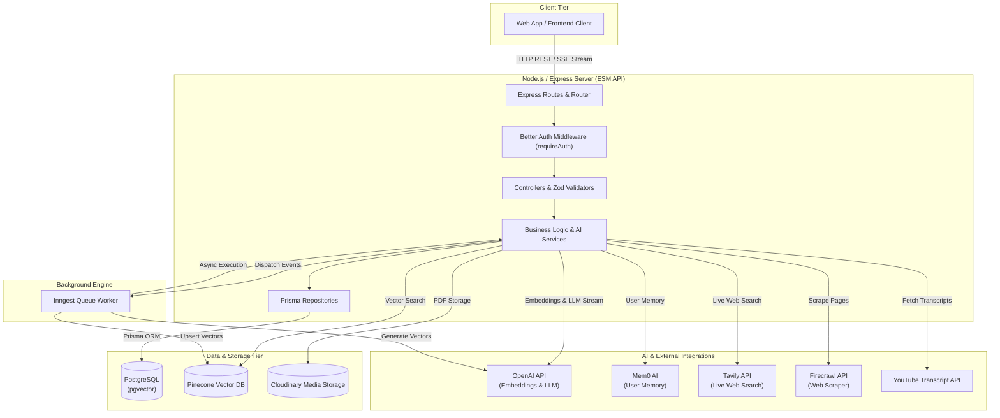
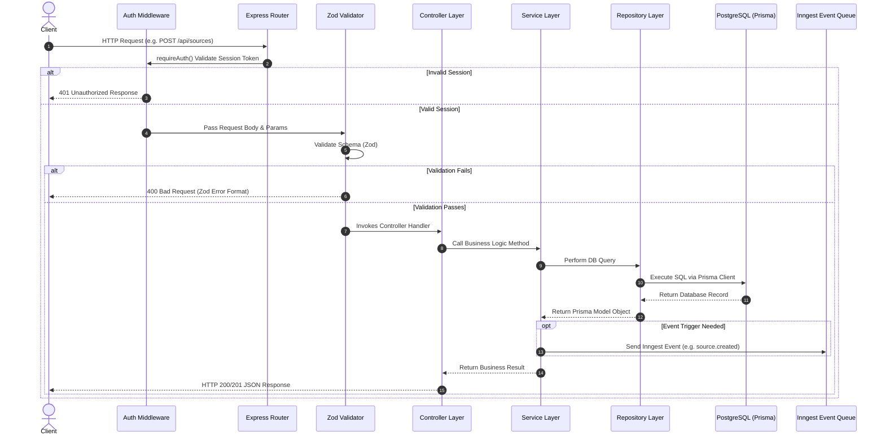
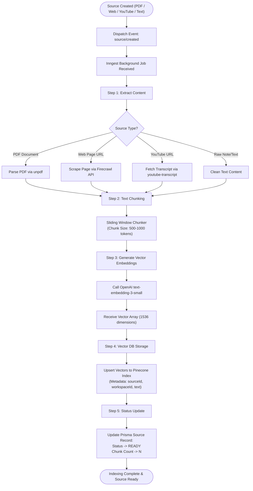
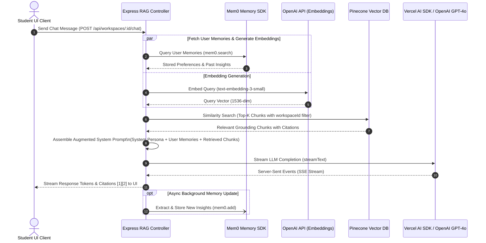

# Server Track Master Index — Chaibook LLM Sir Backend API

Welcome to the **Server Track** for **Chaibook LLM Sir**! This guide takes backend developers step-by-step through building the Node.js/Express ESM API server, PostgreSQL database with Prisma ORM, Better Auth session middleware, vector embeddings pipeline with Pinecone and OpenAI, background queues with Inngest, and AI integrations (Mem0, Tavily).

---

## 📁 Server Folder Structure Map

All server code should be created inside `week05/chaibook-llm-sir/server/`:

```text
server/
├── prisma/
│   └── schema.prisma                # Prisma ORM database models
├── prisma.config.ts                 # Prisma CLI config
├── package.json                     # NPM dependencies ("type": "module")
├── tsconfig.json                    # NodeNext ESM TypeScript resolution
├── .env                             # Server environment variables
└── src/
    ├── index.ts                     # Express server entry point
    ├── routes/                      # API router modules
    ├── controllers/                 # Request & HTTP status controllers
    ├── services/                    # Business rules & AI logic
    ├── repositories/                # Prisma database queries
    ├── validators/                  # Zod schema validation
    ├── middleware/                  # Auth & error handling middlewares
    ├── inngest/                     # Inngest background event jobs
    ├── lib/                         # External SDK clients (OpenAI, Pinecone, Better Auth)
    └── utils/                       # Chunking & helper utilities
```

---

## 🏗 System Architecture & Service Ecosystem

The server operates as a modular, event-driven Node.js ESM backend connecting multiple data storage engines, asynchronous job runners, and external AI models.



---

## 🔄 5-Layer Backend Architecture & Request Flow

All API endpoints follow a strict, decoupled **5-Layer Architecture** (`Route` → `Validator` → `Controller` → `Service` → `Repository`).



---

## ⚙️ Async Background Vector Indexing Pipeline

When a user imports content (PDF, Web URL, YouTube video, or text note), processing occurs asynchronously using **Inngest** to maintain zero request blocking.



---

## 💬 RAG Chat Stream & User Memory Pipeline

When a student queries the assistant, the server coordinates **Mem0** (long-term memory retrieval), **Pinecone** (workspace semantic context search), and **OpenAI** (LLM streaming with Server-Sent Events).



---

## 📚 Server Track Chapters

| Chapter | Title | Focus & Core Components | Guide File |
| :--- | :--- | :--- | :--- |
| **Ch 0** | **Overview & Setup** | System architecture, PostgreSQL `pgvector:pg16` container, environment setup | [Chapter 00](chapter-00-overview-setup.md) |
| **Ch 1** | **Express Bootstrap** | Express ESM server, `package.json`, `tsconfig.json`, CORS & `/health` endpoint | [Chapter 01](chapter-01-bootstrap.md) |
| **Ch 2** | **Database & Prisma** | PostgreSQL schema, Prisma ORM models, migrations & singleton `db.ts` client | [Chapter 02](chapter-02-database.md) |
| **Ch 3** | **Authentication** | Better Auth server setup, Google OAuth 2.0 & `requireAuth` Express middleware | [Chapter 03](chapter-03-authentication.md) |
| **Ch 4** | **Workspaces CRUD** | 5-Layer Pattern (`routes` → `controller` → `service` → `repository` → `validator`) | [Chapter 04](chapter-04-workspaces.md) |
| **Ch 5** | **Sources CRUD** | Text & Markdown notes CRUD, Zod validator, status lifecycle (`PENDING` → `READY`) | [Chapter 05](chapter-05-sources-crud.md) |
| **Ch 6** | **Import Channels** | Firecrawl web scraper, YouTube transcript extractor, Multer + Cloudinary PDF upload | [Chapter 06](chapter-06-import-channels.md) |
| **Ch 7** | **Vector Indexing** | Sliding window chunker, OpenAI `text-embedding-3-small`, Pinecone DB & Inngest jobs | [Chapter 07](chapter-07-indexing-pipeline.md) |
| **Ch 8** | **RAG Chat Stream** | Pinecone similarity retrieval, grounded prompts with citations `[1]`, AI SDK SSE stream | [Chapter 08](chapter-08-rag-chat.md) |
| **Ch 9** | **Memory & Search** | Mem0 personal user memory SDK, Tavily live web search API & memory routes | [Chapter 09](chapter-09-memory-search.md) |
| **Ch 10** | **Async Artifacts** | OpenAI structured outputs (`generateObject`), Flashcards, Quizzes & Inngest workers | [Chapter 10](chapter-10-learning-artifacts.md) |

---

## ⚡ Server Quick Start

```bash
# 1. Launch PostgreSQL Container
cd week05/chaibook-llm-sir
docker compose up -d

# 2. Setup Server
cd week05/chaibook-llm-sir/server
npm install
npx prisma migrate dev
npm run dev

# 3. Start Inngest Worker Engine (in separate terminal)
npx inngest-cli@latest dev -u http://localhost:8080/api/inngest
```
