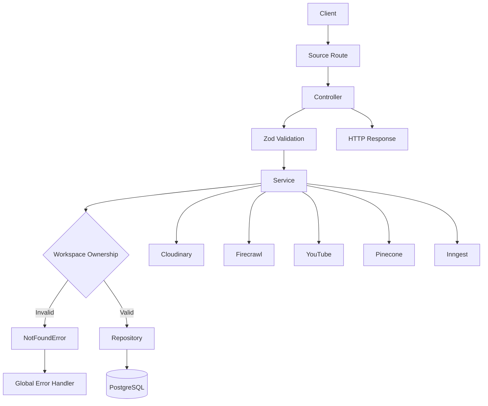

# Server Chapter 5 — Knowledge Sources CRUD

## 1. Goal & Outcome

### 🎯 Goal

Implement a **Knowledge Sources management API** that allows authenticated users to manage different types of knowledge inside their workspaces:

* 📄 PDF documents
* 🌐 Website content
* ▶️ YouTube transcripts
* 📝 Plain-text notes
* 📘 Markdown documents
* 🔎 Web-search results

The implementation follows the server's layered architecture:

```text
Routes
   ↓
Controller
   ↓
Validator
   ↓
Service
   ↓
Repository
   ↓
PostgreSQL / Prisma
```

The Service Layer additionally coordinates external systems and asynchronous processing:

```text
Service
 ├── Repository → PostgreSQL
 ├── Cloudinary → File storage
 ├── Firecrawl → Website scraping
 ├── YouTube    → Transcript extraction
 ├── Pinecone   → Vector index
 └── Inngest    → Background processing
```

### 🎓 Student Outcome

After completing this chapter, you should understand how to build a production-style source-management API with:

* Runtime request validation using Zod
* Type-safe source models
* Workspace ownership checks
* CRUD operations
* Search and filtering
* PDF uploads
* Website importing
* YouTube transcript importing
* Web-search result importing
* Background RAG processing
* Source reprocessing
* Bulk deletion
* Vector-index cleanup
* Chunk retrieval
* PostgreSQL persistence through Prisma

---

# 2. Server Installation

From:

```bash
week05/chaibook-llm-sir/server
```

install Zod:

```bash
cd week05/chaibook-llm-sir/server

npm install zod
```

> **Note:** If Zod was already installed in the previous chapter, running `npm install zod` again is unnecessary. The important requirement is that Zod is available in the server project.

---

# 3. Architecture Overview

Knowledge Sources are more complex than basic Workspace CRUD because a source can originate from several external systems.

For example:

```text
                ┌─────────────────────┐
                │      Client         │
                └──────────┬──────────┘
                           │
                           ▼
                ┌─────────────────────┐
                │   Source Routes     │
                └──────────┬──────────┘
                           │
                           ▼
                ┌─────────────────────┐
                │     Controller      │
                │ HTTP → Application  │
                └──────────┬──────────┘
                           │
                    Zod Validation
                           │
                           ▼
                ┌─────────────────────┐
                │      Service        │
                │ Business / Use Case │
                └──────┬─────┬────────┘
                       │     │
             ┌─────────┘     └──────────────┐
             ▼                              ▼
   ┌──────────────────┐             ┌───────────────┐
   │    Repository    │             │ External APIs │
   │ Prisma / Postgres│             │ Cloudinary    │
   └────────┬─────────┘             │ Firecrawl     │
            │                       │ YouTube       │
            ▼                       │ Pinecone      │
      ┌────────────┐                │ Inngest       │
      │ PostgreSQL │                └───────────────┘
      └────────────┘
```

The key design principle is:

> **Controllers handle HTTP. Services handle use cases. Repositories handle database access.**

---

# 4. Source Validator

## File

```text
server/src/validators/source.validator.ts
```

## Code

```typescript
import { z } from "zod";

export const sourceTypeSchema = z.enum([
    "PDF",
    "WEBSITE",
    "YOUTUBE",
    "TEXT",
    "MARKDOWN",
]);

export const sourceStatusSchema = z.enum([
    "PENDING",
    "PROCESSING",
    "READY",
    "FAILED",
]);

export const workspaceIdParamSchema = z.object({
    workspaceId: z.string().trim().min(1),
});

export const sourceIdParamSchema = z.object({
    workspaceId: z.string().trim().min(1),
    sourceId: z.string().trim().min(1),
});

export const listSourcesQuerySchema = z.object({
    q: z.string().trim().optional(),
    type: sourceTypeSchema.optional(),
    status: sourceStatusSchema.optional(),
});

export const createTextSourceSchema = z.object({
    type: z.literal("TEXT"),
    title: z.string().trim().min(1, "Title is required").max(200),
    content: z.string().trim().min(1, "Content is required"),
});

export const createMarkdownSourceSchema = z.object({
    type: z.literal("MARKDOWN"),
    title: z.string().trim().min(1, "Title is required").max(200),
    content: z.string().trim().min(1, "Content is required"),
});

export const createSourceSchema = z.discriminatedUnion("type", [
    createTextSourceSchema,
    createMarkdownSourceSchema,
]);

export const importWebsiteSchema = z.object({
    url: z.string().trim().url("Enter a valid URL"),
    title: z.string().trim().max(200).optional(),
});

export const importYoutubeSchema = z.object({
    url: z.string().trim().min(1, "YouTube URL is required"),
    title: z.string().trim().max(200).optional(),
});

export const bulkDeleteSourcesSchema = z.object({
    sourceIds: z.array(z.string().trim().min(1)).min(1),
});

export const reprocessSourcesSchema = z.object({
    sourceIds: z.array(z.string().trim().min(1)).optional(),
});

export const importWebSearchSchema = z.object({
    title: z.string().trim().min(1).max(200),
    content: z.string().trim().min(1),
    url: z.string().trim().url(),
});

export type CreateSourceInput = z.infer<typeof createSourceSchema>;
export type ListSourcesQuery = z.infer<typeof listSourcesQuerySchema>;
export type ImportWebsiteInput = z.infer<typeof importWebsiteSchema>;
export type ImportYoutubeInput = z.infer<typeof importYoutubeSchema>;
export type BulkDeleteSourcesInput = z.infer<typeof bulkDeleteSourcesSchema>;
export type ReprocessSourcesInput = z.infer<typeof reprocessSourcesSchema>;
export type ImportWebSearchInput = z.infer<typeof importWebSearchSchema>;
```

---

## 4.1 Architectural Role

This file belongs to the **Validation Layer**.

Its responsibility is to validate untrusted HTTP input before that input reaches business logic or database operations.

This distinction is important:

```text
TypeScript
    ↓
Compile-time safety

Zod
    ↓
Runtime validation
```

TypeScript types disappear at runtime, so they cannot protect the server from malformed JSON sent by a client.

---

# 4.2 Imports

```typescript
import { z } from "zod";
```

Imports the Zod validation library.

The imported `z` namespace provides APIs such as:

```typescript
z.object()
z.string()
z.enum()
z.literal()
z.array()
z.discriminatedUnion()
z.infer
```

---

# 4.3 Source Type Validation

```typescript
export const sourceTypeSchema = z.enum([
    "PDF",
    "WEBSITE",
    "YOUTUBE",
    "TEXT",
    "MARKDOWN",
]);
```

Defines the allowed source types.

A source can only have one of these values:

```text
PDF
WEBSITE
YOUTUBE
TEXT
MARKDOWN
```

For example:

```json
{
  "type": "PDF"
}
```

is valid.

But:

```json
{
  "type": "IMAGE"
}
```

is rejected.

This prevents arbitrary source types from entering the application.

---

# 4.4 Source Status Validation

```typescript
export const sourceStatusSchema = z.enum([
    "PENDING",
    "PROCESSING",
    "READY",
    "FAILED",
]);
```

Defines the supported processing lifecycle.

A typical source moves through:

```text
PENDING
   ↓
PROCESSING
   ↓
READY
```

If processing fails:

```text
PENDING
   ↓
PROCESSING
   ↓
FAILED
```

This status is particularly useful for RAG pipelines because indexing is asynchronous.

---

# 4.5 Workspace Route Parameter

```typescript
export const workspaceIdParamSchema = z.object({
    workspaceId: z.string().trim().min(1),
});
```

Validates a route containing:

```text
/workspaces/:workspaceId/sources
```

The value must:

1. Be a string
2. Be trimmed
3. Contain at least one character

This prevents empty workspace identifiers from reaching the service layer.

---

# 4.6 Workspace + Source Parameters

```typescript
export const sourceIdParamSchema = z.object({
    workspaceId: z.string().trim().min(1),
    sourceId: z.string().trim().min(1),
});
```

Used for nested routes such as:

```text
/workspaces/:workspaceId/sources/:sourceId
```

Both identifiers are validated.

This is important because source authorization depends on the relationship:

```text
User
 ↓ owns
Workspace
 ↓ contains
Source
```

---

# 4.7 Listing and Filtering

```typescript
export const listSourcesQuerySchema = z.object({
    q: z.string().trim().optional(),
    type: sourceTypeSchema.optional(),
    status: sourceStatusSchema.optional(),
});
```

Supports query parameters such as:

```text
?q=machine
```

```text
?type=PDF
```

```text
?status=READY
```

or combinations:

```text
?q=machine&type=PDF&status=READY
```

### `q`

Optional search text.

### `type`

Optional source-type filter.

Because it reuses:

```typescript
sourceTypeSchema
```

only valid source types are accepted.

### `status`

Optional processing-status filter.

Again, it reuses the existing enum rather than duplicating the allowed values.

---

# 4.8 Text Source Validation

```typescript
export const createTextSourceSchema = z.object({
    type: z.literal("TEXT"),
    title: z.string().trim().min(1, "Title is required").max(200),
    content: z.string().trim().min(1, "Content is required"),
});
```

This schema specifically describes a plain-text source.

The important part is:

```typescript
z.literal("TEXT")
```

The type must be exactly:

```text
TEXT
```

The title:

```typescript
z.string()
    .trim()
    .min(1, "Title is required")
    .max(200)
```

means:

* Must be a string
* Leading/trailing whitespace is removed
* Cannot be empty
* Maximum length is 200 characters

The content must also be a non-empty string after trimming.

---

# 4.9 Markdown Source Validation

```typescript
export const createMarkdownSourceSchema = z.object({
    type: z.literal("MARKDOWN"),
    title: z.string().trim().min(1, "Title is required").max(200),
    content: z.string().trim().min(1, "Content is required"),
});
```

This is almost identical to the text schema.

The key difference is:

```typescript
z.literal("MARKDOWN")
```

which ensures that this branch represents Markdown content.

---

# 4.10 Discriminated Union

```typescript
export const createSourceSchema = z.discriminatedUnion("type", [
    createTextSourceSchema,
    createMarkdownSourceSchema,
]);
```

This combines the two schemas into a single input schema.

The discriminator is:

```text
type
```

Therefore:

```json
{
  "type": "TEXT",
  "title": "My Notes",
  "content": "..."
}
```

matches:

```typescript
createTextSourceSchema
```

while:

```json
{
  "type": "MARKDOWN",
  "title": "Documentation",
  "content": "# Introduction"
}
```

matches:

```typescript
createMarkdownSourceSchema
```

This gives the API a type-aware input model.

> **Important:** The current `createSourceSchema` intentionally supports only `TEXT` and `MARKDOWN`. PDFs, websites, YouTube sources, and web-search sources use their own dedicated service/controller flows.

---

# 4.11 Website Import Validation

```typescript
export const importWebsiteSchema = z.object({
    url: z.string().trim().url("Enter a valid URL"),
    title: z.string().trim().max(200).optional(),
});
```

Validates website-import requests.

The URL must pass Zod's URL validation.

The title is optional.

If no title is provided, the service can use the scraped page title or URL as a fallback.

---

# 4.12 YouTube Import Validation

```typescript
export const importYoutubeSchema = z.object({
    url: z.string().trim().min(1, "YouTube URL is required"),
    title: z.string().trim().max(200).optional(),
});
```

Requires a non-empty URL string.

### Production consideration

This validates that a value exists, but it does **not** prove that the URL is actually a YouTube URL.

A stricter implementation could validate supported YouTube URL formats if required.

---

# 4.13 Bulk Delete Validation

```typescript
export const bulkDeleteSourcesSchema = z.object({
    sourceIds: z.array(z.string().trim().min(1)).min(1),
});
```

Requires an object containing a non-empty array of source IDs.

Valid:

```json
{
  "sourceIds": ["source-1", "source-2"]
}
```

Invalid:

```json
{
  "sourceIds": []
}
```

This prevents a bulk-delete request with no targets.

---

# 4.14 Reprocessing Validation

```typescript
export const reprocessSourcesSchema = z.object({
    sourceIds: z.array(z.string().trim().min(1)).optional(),
});
```

The array is optional.

That creates two possible behaviors:

### Specific sources

```json
{
  "sourceIds": ["source-1", "source-2"]
}
```

### All failed sources

```json
{}
```

The service interprets the second case as:

```text
Reprocess all FAILED sources
```

---

# 4.15 Web Search Import

```typescript
export const importWebSearchSchema = z.object({
    title: z.string().trim().min(1).max(200),
    content: z.string().trim().min(1),
    url: z.string().trim().url(),
});
```

Validates content produced by a web-search workflow.

The server expects:

* A title
* Search-result content
* A valid source URL

The source is eventually persisted as a `WEBSITE` source.

---

# 4.16 Type Inference

```typescript
export type CreateSourceInput =
    z.infer<typeof createSourceSchema>;
```

`z.infer` derives a TypeScript type from the runtime Zod schema.

The important architectural benefit is:

```text
One schema
   ↓
Runtime validation
   +
TypeScript type
```

instead of maintaining separate validation rules and TypeScript interfaces.

The same pattern is used for:

```typescript
ListSourcesQuery
ImportWebsiteInput
ImportYoutubeInput
BulkDeleteSourcesInput
ReprocessSourcesInput
ImportWebSearchInput
```

---

# 5. Source Repository

## File

```text
server/src/repositories/source.repository.ts
```

## Code

```typescript
import type { Prisma } from "../generated/prisma/client.js";
import prisma from "../lib/db.js";
import type { ListSourcesQuery } from "../validators/source.validator.js";

export const sourceSelect = {
    id: true,
    workspaceId: true,
    type: true,
    title: true,
    content: true,
    url: true,
    status: true,
    metadata: true,
    createdAt: true,
    updatedAt: true,
} as const;

export type SourceRecord = Prisma.SourceGetPayload<{
    select: typeof sourceSelect;
}>;

export type CreateSourceData = {
    workspaceId: string;
    type: SourceRecord["type"];
    title: string;
    content?: string | null;
    url?: string | null;
    status?: SourceRecord["status"];
    metadata?: Prisma.InputJsonValue;
};

export function findSourcesByWorkspaceId(
    workspaceId: string,
    filters: ListSourcesQuery = {},
) {
    const where: Prisma.SourceWhereInput = { workspaceId };

    if (filters.type) {
        where.type = filters.type;
    }

    if (filters.status) {
        where.status = filters.status;
    }

    if (filters.q) {
        where.OR = [
            {
                title: {
                    contains: filters.q,
                    mode: "insensitive",
                },
            },
            {
                content: {
                    contains: filters.q,
                    mode: "insensitive",
                },
            },
        ];
    }

    return prisma.source.findMany({
        where,
        select: sourceSelect,
        orderBy: { createdAt: "desc" },
    });
}

export function findSourceByIdAndWorkspaceId(
    sourceId: string,
    workspaceId: string,
) {
    return prisma.source.findFirst({
        where: {
            id: sourceId,
            workspaceId,
        },
        select: sourceSelect,
    });
}

export function createSourceRecord(data: CreateSourceData) {
    return prisma.source.create({
        data: {
            workspaceId: data.workspaceId,
            type: data.type,
            title: data.title,
            content: data.content ?? null,
            url: data.url ?? null,
            status: data.status ?? "PENDING",
            metadata: data.metadata,
        },
        select: sourceSelect,
    });
}

export function findSourceById(sourceId: string) {
    return prisma.source.findUnique({
        where: { id: sourceId },
        select: sourceSelect,
    });
}

export function updateSourceRecord(
    sourceId: string,
    data: {
        content?: string | null;
        status?: SourceRecord["status"];
        metadata?: Prisma.InputJsonValue;
    },
) {
    return prisma.source.update({
        where: { id: sourceId },
        data,
        select: sourceSelect,
    });
}

export async function deleteSourceRecord(sourceId: string) {
    await prisma.source.delete({
        where: { id: sourceId },
    });
}
```

---

# 5.1 Architectural Role

The Repository Layer is responsible for **database access**.

It knows about:

* Prisma
* `Source`
* database filters
* database projections
* database queries

It does not know about:

* Express `Request`
* Express `Response`
* HTTP status codes
* authentication sessions
* Cloudinary
* Firecrawl
* YouTube
* business workflows

That separation keeps persistence logic isolated.

---

# 5.2 Prisma Import

```typescript
import type { Prisma } from "../generated/prisma/client.js";
```

Imports Prisma's generated TypeScript types.

Because this is a type-only import:

```typescript
import type
```

it is used by TypeScript during compilation and is not required as a runtime JavaScript import.

---

# 5.3 Prisma Client

```typescript
import prisma from "../lib/db.js";
```

Imports the application's shared Prisma client.

The repository uses this client to communicate with PostgreSQL.

---

# 5.4 Query Type

```typescript
import type { ListSourcesQuery }
    from "../validators/source.validator.js";
```

Reuses the validator-derived query type.

This keeps the repository's filter parameter synchronized with the validation schema.

---

# 5.5 Shared Select Projection

```typescript
export const sourceSelect = {
    id: true,
    workspaceId: true,
    type: true,
    title: true,
    content: true,
    url: true,
    status: true,
    metadata: true,
    createdAt: true,
    updatedAt: true,
} as const;
```

Defines the fields returned from source queries.

Instead of repeatedly writing:

```typescript
select: {
    id: true,
    title: true,
    ...
}
```

the application can reuse:

```typescript
select: sourceSelect
```

This creates a consistent database projection.

The `as const` assertion preserves the literal values and allows Prisma's type system to infer the selected shape accurately.

---

# 5.6 SourceRecord

```typescript
export type SourceRecord = Prisma.SourceGetPayload<{
    select: typeof sourceSelect;
}>;
```

This is an important type-safety pattern.

Instead of manually defining:

```typescript
type SourceRecord = {
    id: string;
    ...
}
```

the type is derived directly from Prisma's selected fields.

Therefore:

```text
Prisma schema
      ↓
Prisma generated types
      ↓
sourceSelect
      ↓
SourceRecord
```

If the selected database fields change, the TypeScript type can update accordingly.

---

# 5.7 CreateSourceData

```typescript
export type CreateSourceData = {
    workspaceId: string;
    type: SourceRecord["type"];
    title: string;
    content?: string | null;
    url?: string | null;
    status?: SourceRecord["status"];
    metadata?: Prisma.InputJsonValue;
};
```

Defines the data required to create a source.

Notice that:

```typescript
type: SourceRecord["type"]
```

reuses Prisma's generated source type.

Likewise:

```typescript
status: SourceRecord["status"]
```

keeps the status aligned with the database model.

---

# 5.8 Listing Sources

```typescript
export function findSourcesByWorkspaceId(
    workspaceId: string,
    filters: ListSourcesQuery = {},
)
```

This function retrieves sources belonging to a specific workspace.

The default:

```typescript
filters: ListSourcesQuery = {}
```

allows the function to be called without filters.

---

## Base Ownership Filter

```typescript
const where: Prisma.SourceWhereInput = {
    workspaceId,
};
```

Every query starts by restricting results to one workspace.

This is an important authorization boundary:

```text
Workspace A
   ↓
Only Source rows belonging to Workspace A
```

The service verifies that the authenticated user owns the workspace before calling this repository method.

---

## Type Filter

```typescript
if (filters.type) {
    where.type = filters.type;
}
```

If the client sends:

```text
?type=PDF
```

the query becomes conceptually:

```sql
WHERE workspace_id = ?
AND type = 'PDF'
```

---

## Status Filter

```typescript
if (filters.status) {
    where.status = filters.status;
}
```

Allows filtering by:

```text
PENDING
PROCESSING
READY
FAILED
```

---

## Search Filter

```typescript
if (filters.q) {
    where.OR = [
        {
            title: {
                contains: filters.q,
                mode: "insensitive",
            },
        },
        {
            content: {
                contains: filters.q,
                mode: "insensitive",
            },
        },
    ];
}
```

This implements a simple source search.

The query checks both:

```text
title
```

and:

```text
content
```

The `OR` means a match in either field is sufficient.

`mode: "insensitive"` requests case-insensitive matching where supported by the database/provider.

### Production consideration

For very large source collections, substring search using `contains` may become expensive.

A production-scale implementation may eventually use:

* PostgreSQL full-text search
* Trigram indexes
* Dedicated search infrastructure
* Search/vector retrieval systems

---

# 5.9 Returning Sources

```typescript
return prisma.source.findMany({
    where,
    select: sourceSelect,
    orderBy: { createdAt: "desc" },
});
```

The query:

1. Applies workspace/filter conditions
2. Selects only approved fields
3. Sorts newest sources first

The repository returns the Prisma Promise directly.

It does not need to `await` the query because callers can await the returned Promise.

---

# 5.10 Find Source by Workspace

```typescript
export function findSourceByIdAndWorkspaceId(
    sourceId: string,
    workspaceId: string,
)
```

Uses both identifiers:

```typescript
where: {
    id: sourceId,
    workspaceId,
}
```

This is safer than querying only by:

```typescript
id: sourceId
```

because the relationship is explicitly enforced:

```text
Source ID
+
Workspace ID
       ↓
Must match the same source
```

If the source exists but belongs to another workspace, this returns `null`.

That prevents accidental cross-workspace access.

---

# 5.11 Creating a Source

```typescript
export function createSourceRecord(data: CreateSourceData)
```

Creates a new database record.

The important ownership field is:

```typescript
workspaceId: data.workspaceId
```

The service determines the workspace after authenticating the user.

The client should never be trusted to decide another user's ownership relationship.

---

## Default Status

```typescript
status: data.status ?? "PENDING",
```

If no status is supplied, the source starts as:

```text
PENDING
```

This matches the asynchronous processing architecture.

---

## Nullable Content and URL

```typescript
content: data.content ?? null,
url: data.url ?? null,
```

Converts `undefined` into explicit database `null`.

This is useful when a source does not have one of these fields.

For example:

```text
TEXT
→ content exists
→ url may be null

WEBSITE
→ content exists
→ url exists

PDF
→ content may initially be null
→ file URL is stored in metadata
```

---

# 5.12 Find Source by ID

```typescript
export function findSourceById(sourceId: string)
```

Uses:

```typescript
findUnique()
```

because `id` is unique.

Unlike:

```typescript
findSourceByIdAndWorkspaceId()
```

this method does not enforce workspace ownership.

Therefore, it should only be used in contexts where authorization has already been established.

This distinction is important:

```text
findUnique(id)
    ↓
Database lookup

findFirst(id + workspaceId)
    ↓
Database lookup + relationship constraint
```

---

# 5.13 Updating a Source

```typescript
export function updateSourceRecord(
    sourceId: string,
    data: {
        content?: string | null;
        status?: SourceRecord["status"];
        metadata?: Prisma.InputJsonValue;
    },
)
```

Updates processing-related fields.

Notice that the update does not accept:

```text
workspaceId
type
```

This is intentional in the current design.

The service controls which fields can change.

---

## Important Authorization Detail

The update itself uses:

```typescript
where: {
    id: sourceId,
}
```

There is no workspace condition here.

Therefore:

> **The Service Layer must verify that the source belongs to the authenticated user's workspace before calling this function.**

That is exactly why the service calls:

```typescript
getSourceForWorkspace(...)
```

first.

---

# 5.14 Deleting a Source

```typescript
export async function deleteSourceRecord(sourceId: string) {
    await prisma.source.delete({
        where: { id: sourceId },
    });
}
```

Performs the database deletion.

The repository does not:

* verify the user
* delete Pinecone vectors
* delete external files
* enqueue jobs

Those are application-level responsibilities handled by the service.

---

# 6. Source Service

## File

```text
server/src/services/source.service.ts
```

This is the most important layer in this chapter.

The Service Layer coordinates:

```text
Authorization
      +
Business rules
      +
Database operations
      +
External integrations
      +
Background processing
```

---

## Code

```typescript
import type { Prisma } from "../generated/prisma/client.js";
import { uploadPdfToCloudinary } from "../lib/cloudinary.js";
import { extractPdfFromBuffer } from "../lib/pdf.js";
import { scrapeWebsite } from "../lib/firecrawl.js";
import { enqueueSourceProcessing } from "../lib/source-events.js";
import { fetchYoutubeTranscript } from "../lib/youtube.js";

import {
    createSourceRecord,
    deleteSourceRecord,
    findSourceByIdAndWorkspaceId,
    findSourcesByWorkspaceId,
    updateSourceRecord,
    type SourceRecord,
} from "../repositories/source.repository.js";

import { getWorkspaceByIdForUser } from "./workspace.service.js";
import { NotFoundError } from "../types/app-error.js";

import type {
    CreateSourceInput,
    ImportWebsiteInput,
    ImportWebSearchInput,
    ImportYoutubeInput,
    ListSourcesQuery,
    ReprocessSourcesInput,
} from "../validators/source.validator.js";

import {
    listChunksForSource,
    removeSourceFromIndex,
} from "./source-processing.service.js";
```

---

# 6.1 External Dependencies

The service communicates with several external systems.

### Cloudinary

```typescript
uploadPdfToCloudinary
```

Stores uploaded PDF files.

### PDF utility

```typescript
extractPdfFromBuffer
```

Attempts to extract text and page count from a PDF.

### Firecrawl

```typescript
scrapeWebsite
```

Retrieves website content, including Markdown.

### Inngest / Source Events

```typescript
enqueueSourceProcessing
```

Starts the asynchronous RAG-processing workflow.

### YouTube

```typescript
fetchYoutubeTranscript
```

Retrieves transcript content.

### Source processing service

```typescript
listChunksForSource
removeSourceFromIndex
```

Provides chunk/index-management operations.

---

# 6.2 Workspace Ownership

```typescript
import { getWorkspaceByIdForUser }
    from "./workspace.service.js";
```

The service reuses the Workspace service created in the previous chapter.

This centralizes the rule:

```text
workspaceId
     +
authenticated userId
     ↓
workspace must belong to user
```

Instead of duplicating that query throughout source operations.

---

# 6.3 createAndProcessSource

```typescript
async function createAndProcessSource(
    data: Parameters<typeof createSourceRecord>[0],
) {
    const source = await createSourceRecord(data);

    await enqueueSourceProcessing({
        sourceId: source.id,
        workspaceId: source.workspaceId,
    });

    return source;
}
```

This is a private helper that centralizes:

```text
Create database row
       ↓
Enqueue RAG processing
       ↓
Return source
```

The type:

```typescript
Parameters<typeof createSourceRecord>[0]
```

automatically extracts the first parameter type of `createSourceRecord`.

This avoids manually repeating `CreateSourceData`.

---

## Processing Flow

When a source is created:

```text
Create Source
     ↓
status = PENDING
     ↓
Enqueue processing
     ↓
Background worker
     ↓
Parse / Chunk
     ↓
Embed
     ↓
Store vectors
     ↓
status = READY
```

This keeps expensive RAG processing out of the immediate HTTP request.

---

# 6.4 listSourcesForWorkspace

```typescript
export async function listSourcesForWorkspace(
    workspaceId: string,
    userId: string,
    filters: ListSourcesQuery = {},
) {
    await getWorkspaceByIdForUser(workspaceId, userId);

    return findSourcesByWorkspaceId(workspaceId, filters);
}
```

The first operation is authorization:

```typescript
await getWorkspaceByIdForUser(workspaceId, userId);
```

Only after successful ownership verification does the service query sources.

This produces:

```text
Authenticated User
       ↓
Workspace ownership check
       ↓
Source query
```

If the workspace does not belong to the user, the source list is never queried.

---

# 6.5 getSourceForWorkspace

```typescript
export async function getSourceForWorkspace(
    workspaceId: string,
    sourceId: string,
    userId: string,
): Promise<SourceRecord> {
    await getWorkspaceByIdForUser(workspaceId, userId);

    const source = await findSourceByIdAndWorkspaceId(
        sourceId,
        workspaceId,
    );

    if (!source) {
        throw new NotFoundError("Source not found");
    }

    return source;
}
```

This function performs two authorization checks:

### Check 1 — Workspace ownership

```typescript
getWorkspaceByIdForUser(...)
```

Confirms:

```text
User → owns → Workspace
```

### Check 2 — Source relationship

```typescript
findSourceByIdAndWorkspaceId(...)
```

Confirms:

```text
Workspace → contains → Source
```

Together:

```text
User
 ↓ owns
Workspace
 ↓ contains
Source
```

This is a strong nested-resource authorization pattern.

---

# 6.6 Why Return 404?

```typescript
throw new NotFoundError("Source not found");
```

If the source doesn't belong to the specified workspace, the API treats it as not found.

This avoids unnecessarily revealing whether a source exists in another workspace.

That is generally safer than returning different responses such as:

```text
403 → source exists but belongs to someone else
404 → source does not exist
```

because the distinction can leak information.

---

# 6.7 Creating Text or Markdown

```typescript
export async function createTextOrMarkdownSource(
    workspaceId: string,
    userId: string,
    input: CreateSourceInput,
) {
    await getWorkspaceByIdForUser(workspaceId, userId);

    return createAndProcessSource({
        workspaceId,
        type: input.type,
        title: input.title,
        content: input.content,
        status: "PENDING",
    });
}
```

The service:

1. Verifies workspace ownership
2. Accepts validated source input
3. Creates the source
4. Sets status to `PENDING`
5. Queues background processing

Because `CreateSourceInput` comes from the discriminated union, `input.type` can only be:

```text
TEXT
MARKDOWN
```

---

# 6.8 PDF Upload

```typescript
export async function uploadPdfSource(
    workspaceId: string,
    userId: string,
    file: Express.Multer.File,
    title?: string,
)
```

This use case receives a Multer file.

The flow is:

```text
HTTP multipart/form-data
          ↓
Multer
          ↓
file.buffer
          ↓
Cloudinary
          ↓
Optional PDF extraction
          ↓
Source record
          ↓
Background processing
```

---

## Ownership Check

```typescript
await getWorkspaceByIdForUser(workspaceId, userId);
```

Prevents a user from uploading into another user's workspace.

---

## Cloudinary Upload

```typescript
const upload = await uploadPdfToCloudinary(
    file.buffer,
    file.originalname,
);
```

The PDF is uploaded to Cloudinary before the source row is created.

The service receives metadata such as:

```text
secureUrl
originalFilename
bytes
publicId
resourceType
```

---

# 6.9 Best-Effort PDF Extraction

```typescript
let content: string | null = null;
let pageCount: number | undefined;

try {
    const extracted = await extractPdfFromBuffer(file.buffer);

    content = extracted.text;
    pageCount = extracted.pageCount;
} catch {
    // Inngest will retry extraction from Cloudinary if upload-time parse fails.
}
```

PDF extraction is intentionally best-effort.

If extraction succeeds:

```text
content = extracted.text
pageCount = extracted.pageCount
```

If it fails:

```text
content = null
```

but the upload can still continue because the PDF itself has already been stored.

The background processing pipeline can later retrieve the file from Cloudinary and retry extraction.

This is a useful resilience pattern:

```text
Upload failure
     ≠
Entire source creation failure
```

---

# 6.10 PDF Metadata

```typescript
metadata: {
    fileUrl: upload.secureUrl,
    fileName: upload.originalFilename,
    fileSize: upload.bytes,
    publicId: upload.publicId,
    resourceType: upload.resourceType,
    pageCount,
},
```

Stores file-specific metadata as JSON.

This avoids adding many PDF-specific columns to the `Source` table.

Conceptually:

```text
Source
 ├── id
 ├── type = PDF
 ├── title
 ├── content
 └── metadata
      ├── fileUrl
      ├── fileName
      ├── fileSize
      ├── publicId
      └── pageCount
```

---

# 6.11 Website Import

```typescript
export async function importWebsiteSource(
    workspaceId: string,
    userId: string,
    input: ImportWebsiteInput,
) {
    await getWorkspaceByIdForUser(workspaceId, userId);

    const scraped = await scrapeWebsite(input.url);

    return createAndProcessSource({
        workspaceId,
        type: "WEBSITE",
        title: input.title || scraped.title || input.url,
        content: scraped.markdown,
        url: scraped.sourceUrl,
        status: "PENDING",
        metadata: {
            importedFrom: scraped.sourceUrl,
        },
    });
}
```

The flow is:

```text
Website URL
    ↓
Firecrawl
    ↓
Markdown
    ↓
Source row
    ↓
PENDING
    ↓
RAG processing
```

Title selection follows:

```text
Custom title
    ↓ if unavailable
Scraped title
    ↓ if unavailable
URL
```

---

# 6.12 YouTube Import

```typescript
export async function importYoutubeSource(
    workspaceId: string,
    userId: string,
    input: ImportYoutubeInput,
) {
    await getWorkspaceByIdForUser(workspaceId, userId);

    const transcript = await fetchYoutubeTranscript(input.url);

    return createAndProcessSource({
        workspaceId,
        type: "YOUTUBE",
        title:
            input.title ||
            `YouTube: ${transcript.videoId}`,
        content: transcript.content,
        url: input.url,
        status: "PENDING",
        metadata: {
            videoId: transcript.videoId,
        },
    });
}
```

The flow becomes:

```text
YouTube URL
     ↓
Transcript extraction
     ↓
Transcript text
     ↓
Source record
     ↓
PENDING
     ↓
RAG processing
```

---

# 6.13 Deleting a Source

```typescript
export async function deleteSourceForWorkspace(
    workspaceId: string,
    sourceId: string,
    userId: string,
) {
    await getSourceForWorkspace(
        workspaceId,
        sourceId,
        userId,
    );

    await removeSourceFromIndex(
        workspaceId,
        sourceId,
    );

    await deleteSourceRecord(sourceId);
}
```

Deletion has multiple storage locations:

```text
Source
 ├── PostgreSQL
 ├── Chunks
 └── Pinecone vectors
```

The service coordinates cleanup before deleting the relational source record.

---

## Delete Flow

```text
Authenticated User
       ↓
Verify Workspace
       ↓
Verify Source
       ↓
Remove vectors/index data
       ↓
Delete PostgreSQL source
```

If the database schema uses cascading deletes for source chunks, deleting the source can also remove related relational chunk records.

---

# 6.14 Important Cross-System Consistency Issue

Pinecone and PostgreSQL are separate systems.

There is no normal single ACID transaction covering:

```text
PostgreSQL
+
Pinecone
```

Therefore:

```text
Pinecone deletion succeeds
        ↓
PostgreSQL deletion fails
```

could leave the system with a database source but no vectors.

The reverse can also occur if database deletion happens first.

For a production system, reliable cleanup can eventually be implemented using:

* Retryable background jobs
* Outbox pattern
* Idempotent cleanup operations
* Scheduled reconciliation jobs

The current synchronous implementation is simple and understandable, but cross-system consistency should be considered as the application scales.

---

# 6.15 Getting Source Chunks

```typescript
export async function getSourceChunksForWorkspace(
    workspaceId: string,
    sourceId: string,
    userId: string,
) {
    await getSourceForWorkspace(
        workspaceId,
        sourceId,
        userId,
    );

    return listChunksForSource(sourceId);
}
```

Authorization happens first.

Only after confirming:

```text
User → Workspace → Source
```

does the service retrieve chunks.

This prevents a user from querying another user's source chunks.

---

# 6.16 Bulk Delete

```typescript
export async function bulkDeleteSourcesForWorkspace(
    workspaceId: string,
    userId: string,
    sourceIds: string[],
) {
    await getWorkspaceByIdForUser(
        workspaceId,
        userId,
    );

    for (const sourceId of sourceIds) {
        await deleteSourceForWorkspace(
            workspaceId,
            sourceId,
            userId,
        );
    }
}
```

First verifies workspace ownership.

Then processes each source sequentially.

Conceptually:

```text
sourceIds
   ↓
source 1 → delete
   ↓
source 2 → delete
   ↓
source 3 → delete
```

### Production consideration

This is intentionally simple but potentially slow for large arrays because each deletion waits for the previous deletion.

A future optimized implementation could:

* batch database operations
* process independent vector deletions concurrently
* use a background job
* limit concurrency

However, concurrency must be controlled carefully to avoid API rate limits and partial-failure problems.

---

# 6.17 Reprocessing Failed Sources

```typescript
export async function reprocessSourcesForWorkspace(
    workspaceId: string,
    userId: string,
    input: ReprocessSourcesInput = {},
) {
    await getWorkspaceByIdForUser(
        workspaceId,
        userId,
    );

    const sources = await findSourcesByWorkspaceId(
        workspaceId,
        {
            status: "FAILED",
        },
    );

    const targets = input.sourceIds?.length
        ? sources.filter((source) =>
              input.sourceIds?.includes(source.id),
          )
        : sources;

    for (const source of targets) {
        await reprocessSourceForWorkspace(
            workspaceId,
            source.id,
            userId,
        );
    }

    return {
        reprocessed: targets.length,
    };
}
```

This implements two modes.

### Mode 1 — All failed sources

Request:

```json
{}
```

Results in:

```text
Find all FAILED sources
        ↓
Reprocess each
```

### Mode 2 — Specific failed sources

Request:

```json
{
  "sourceIds": [
    "source-1",
    "source-3"
  ]
}
```

The service first retrieves failed sources and then selects only those requested IDs.

This means a source that is:

```text
READY
```

will not accidentally be reprocessed by this bulk endpoint.

---

# 6.18 Reprocessing One Source

```typescript
export async function reprocessSourceForWorkspace(
    workspaceId: string,
    sourceId: string,
    userId: string,
) {
    const source = await getSourceForWorkspace(
        workspaceId,
        sourceId,
        userId,
    );

    await removeSourceFromIndex(
        workspaceId,
        sourceId,
    );

    const metadata =
        source.metadata &&
        typeof source.metadata === "object" &&
        !Array.isArray(source.metadata)
            ? {
                  ...(
                      source.metadata as Record<
                          string,
                          unknown
                      >
                  ),
              }
            : {};

    delete metadata.processingError;

    await updateSourceRecord(sourceId, {
        status: "PENDING",
        metadata:
            metadata as Prisma.InputJsonValue,
    });

    await enqueueSourceProcessing({
        sourceId,
        workspaceId,
    });
}
```

The reprocessing workflow is:

```text
Verify ownership
      ↓
Remove old vectors
      ↓
Preserve metadata
      ↓
Remove processingError
      ↓
Set status = PENDING
      ↓
Enqueue processing
```

---

## Why Remove the Old Index?

If the old vectors remain, a re-index could produce duplicate vector entries.

Therefore:

```text
Old vectors
    ↓
Delete
    ↓
Re-index source
    ↓
Fresh vectors
```

This keeps the vector index cleaner.

---

# 6.19 Metadata Handling

```typescript
const metadata =
    source.metadata &&
    typeof source.metadata === "object" &&
    !Array.isArray(source.metadata)
```

Because Prisma JSON fields can contain different JSON values, the code checks that metadata is actually an object before spreading it.

Then:

```typescript
{
    ...source.metadata
}
```

creates a new object rather than mutating the original object.

---

# 6.20 Removing Processing Errors

```typescript
delete metadata.processingError;
```

A previous failed processing attempt may have stored:

```json
{
  "processingError": "Embedding failed"
}
```

Before retrying, that stale error is removed.

The source is then reset to:

```text
PENDING
```

---

# 6.21 Re-Queueing

```typescript
await enqueueSourceProcessing({
    sourceId,
    workspaceId,
});
```

The source enters the background processing pipeline again.

This creates a retry mechanism without forcing the HTTP request to perform the complete RAG indexing operation.

---

# 6.22 Web Search Import

```typescript
export async function importWebSearchSource(
    workspaceId: string,
    userId: string,
    input: ImportWebSearchInput,
) {
    await getWorkspaceByIdForUser(
        workspaceId,
        userId,
    );

    return createAndProcessSource({
        workspaceId,
        type: "WEBSITE",
        title: input.title,
        content: input.content,
        url: input.url,
        status: "PENDING",
        metadata: {
            importedFrom: "web-search",
            sourceUrl: input.url,
        },
    });
}
```

A web-search result is persisted as:

```text
type = WEBSITE
```

while metadata records:

```text
importedFrom = web-search
```

This allows the application to distinguish website imports from search-derived website sources.

---

# 7. Source Controller

## File

```text
server/src/controllers/source.controller.ts
```

The Controller Layer translates:

```text
HTTP request
      ↓
Application/service call
      ↓
HTTP response
```

Controllers should remain thin.

They should not contain:

* Prisma queries
* Cloudinary logic
* Pinecone logic
* scraping logic
* transcript extraction
* RAG processing logic

---

## Controller Responsibilities

```text
Request
 ↓
Read params/query/body
 ↓
Validate with Zod
 ↓
Read authenticated user ID
 ↓
Call service
 ↓
Set HTTP status
 ↓
Return JSON
```

---

# 7.1 Imports

```typescript
import type { Request, Response } from "express";
```

Provides Express request/response types.

The remaining imports bring in:

* Service use cases
* Validation schemas
* Validation error types

The controller therefore acts as the boundary between HTTP and application logic.

---

# 7.2 List Sources

```typescript
export async function listSources(
    req: Request,
    res: Response,
) {
    const { workspaceId } =
        workspaceIdParamSchema.parse(req.params);

    const filters =
        listSourcesQuerySchema.parse(req.query);

    const sources =
        await listSourcesForWorkspace(
            workspaceId,
            req.session.user.id,
            filters,
        );

    res.json(sources);
}
```

Flow:

```text
GET request
   ↓
Validate workspaceId
   ↓
Validate query filters
   ↓
Read authenticated user ID
   ↓
Service
   ↓
Repository
   ↓
JSON response
```

---

# 7.3 Get One Source

```typescript
const { workspaceId, sourceId } =
    sourceIdParamSchema.parse(req.params);
```

Validates both nested identifiers.

Then:

```typescript
await getSourceForWorkspace(
    workspaceId,
    sourceId,
    req.session.user.id,
);
```

The service performs authorization.

The controller does not need to know how ownership is checked.

---

# 7.4 Get Source Chunks

```typescript
const result =
    await getSourceChunksForWorkspace(
        workspaceId,
        sourceId,
        req.session.user.id,
    );
```

The controller delegates the entire operation.

The service first verifies access and then retrieves the chunks.

---

# 7.5 Create Text/Markdown Source

```typescript
const input =
    createSourceSchema.parse(req.body);
```

Zod validates the request body.

Then:

```typescript
const source =
    await createTextOrMarkdownSource(
        workspaceId,
        req.session.user.id,
        input,
    );
```

The authenticated user ID comes from the server-side session.

It does **not** come from:

```json
{
  "userId": "..."
}
```

This is an important security rule:

> Never trust a client-provided user ID for ownership decisions.

---

# 7.6 HTTP 201

```typescript
res.status(201).json(source);
```

`201 Created` communicates that a new resource has been created.

---

# 7.7 PDF Upload

```typescript
if (!req.file) {
    throw new ValidationError(
        "PDF file is required",
    );
}
```

Unlike JSON requests, multipart uploads may fail before reaching normal body validation.

Therefore the controller explicitly checks whether Multer produced a file.

Then:

```typescript
const title =
    typeof req.body.title === "string"
        ? req.body.title
        : undefined;
```

reads an optional multipart form field safely.

The file itself is passed to the service:

```typescript
await uploadPdfSource(
    workspaceId,
    req.session.user.id,
    req.file,
    title,
);
```

---

# 7.8 Website Import

```typescript
const input =
    importWebsiteSchema.parse(req.body);
```

Validates:

```text
URL
+
optional title
```

Then delegates website scraping to the service.

---

# 7.9 YouTube Import

The controller follows the same pattern:

```text
Validate params
      ↓
Validate body
      ↓
Authenticated user
      ↓
Service
```

The actual transcript retrieval remains outside the controller.

---

# 7.10 Delete Source

```typescript
await deleteSourceForWorkspace(
    workspaceId,
    sourceId,
    req.session.user.id,
);

res.status(204).send();
```

The service performs:

```text
Authorization
     ↓
Index cleanup
     ↓
Database deletion
```

The controller only communicates the result through HTTP.

`204 No Content` indicates successful deletion without a response body.

---

# 7.11 Bulk Delete

```typescript
const input =
    bulkDeleteSourcesSchema.parse(req.body);
```

Validates the list of source IDs.

Then:

```typescript
await bulkDeleteSourcesForWorkspace(
    workspaceId,
    req.session.user.id,
    input.sourceIds,
);
```

The service handles each deletion.

---

# 7.12 Reprocess Sources

```typescript
const input =
    reprocessSourcesSchema.parse(
        req.body ?? {},
    );
```

If the body is missing, it becomes:

```typescript
{}
```

which matches the service's "all failed sources" behavior.

The response:

```typescript
res.json(result);
```

can return:

```json
{
  "reprocessed": 3
}
```

---

# 7.13 Reprocess One Source

```typescript
await reprocessSourceForWorkspace(
    workspaceId,
    sourceId,
    req.session.user.id,
);

res.status(202).json({
    reprocessed: true,
});
```

`202 Accepted` is appropriate because reprocessing is asynchronous.

The request accepts the reprocessing request, while actual indexing happens through the background processing system.

---

# 7.14 Web Search Import

```typescript
const input =
    importWebSearchSchema.parse(req.body);
```

Validates the search result payload before passing it to the service.

The service stores it as a `WEBSITE` source and queues it for RAG processing.

---

# 8. Source Routes

## File

```text
server/src/routes/source.routes.ts
```

## Code

```typescript
import { Router } from "express";

import {
    bulkDeleteSources,
    createSource,
    deleteSource,
    getSource,
    getSourceChunks,
    importWebSearch,
    importWebsite,
    importYoutube,
    listSources,
    reprocessSource,
    reprocessSources,
    uploadPdf,
} from "../controllers/source.controller.js";

import { uploadSinglePdf }
    from "../middleware/upload.middleware.js";

import { asyncHandler }
    from "../utils/async-handler.js";

export const sourceRoutes =
    Router({ mergeParams: true });

sourceRoutes.get(
    "/",
    asyncHandler(listSources),
);

sourceRoutes.post(
    "/",
    asyncHandler(createSource),
);

sourceRoutes.post(
    "/upload",
    uploadSinglePdf,
    asyncHandler(uploadPdf),
);

sourceRoutes.post(
    "/import/website",
    asyncHandler(importWebsite),
);

sourceRoutes.post(
    "/import/youtube",
    asyncHandler(importYoutube),
);

sourceRoutes.post(
    "/import/web-search",
    asyncHandler(importWebSearch),
);

sourceRoutes.post(
    "/bulk-delete",
    asyncHandler(bulkDeleteSources),
);

sourceRoutes.post(
    "/reprocess",
    asyncHandler(reprocessSources),
);

sourceRoutes.get(
    "/:sourceId/chunks",
    asyncHandler(getSourceChunks),
);

sourceRoutes.get(
    "/:sourceId",
    asyncHandler(getSource),
);

sourceRoutes.post(
    "/:sourceId/reprocess",
    asyncHandler(reprocessSource),
);

sourceRoutes.delete(
    "/:sourceId",
    asyncHandler(deleteSource),
);
```

---

# 8.1 Router

```typescript
export const sourceRoutes =
    Router({ mergeParams: true });
```

Creates an Express router.

The important option is:

```typescript
mergeParams: true
```

This allows the router to access parameters defined by a parent router.

For example, if the parent route is:

```text
/workspaces/:workspaceId/sources
```

then nested source routes can access:

```typescript
req.params.workspaceId
```

inside this router.

---

# 8.2 List Sources

```typescript
sourceRoutes.get(
    "/",
    asyncHandler(listSources),
);
```

Maps:

```text
GET /
```

to:

```typescript
listSources
```

If mounted under a workspace route, this becomes conceptually:

```text
GET /workspaces/:workspaceId/sources
```

---

# 8.3 Create Source

```typescript
sourceRoutes.post(
    "/",
    asyncHandler(createSource),
);
```

Handles text/Markdown source creation.

---

# 8.4 PDF Upload

```typescript
sourceRoutes.post(
    "/upload",
    uploadSinglePdf,
    asyncHandler(uploadPdf),
);
```

This route has two middleware stages:

```text
Request
  ↓
uploadSinglePdf
  ↓
uploadPdf controller
```

Multer parses the multipart upload before the controller executes.

---

# 8.5 Website Import

```typescript
sourceRoutes.post(
    "/import/website",
    asyncHandler(importWebsite),
);
```

Starts a website import workflow.

---

# 8.6 YouTube Import

```typescript
sourceRoutes.post(
    "/import/youtube",
    asyncHandler(importYoutube),
);
```

Starts YouTube transcript importing.

---

# 8.7 Web Search Import

```typescript
sourceRoutes.post(
    "/import/web-search",
    asyncHandler(importWebSearch),
);
```

Persists a selected web-search result as a source.

---

# 8.8 Bulk Delete

```typescript
sourceRoutes.post(
    "/bulk-delete",
    asyncHandler(bulkDeleteSources),
);
```

Uses `POST` with a request body containing multiple source IDs.

For example:

```json
{
  "sourceIds": [
    "source-1",
    "source-2"
  ]
}
```

---

# 8.9 Bulk Reprocessing

```typescript
sourceRoutes.post(
    "/reprocess",
    asyncHandler(reprocessSources),
);
```

Supports:

```text
POST /reprocess
```

with either:

```json
{}
```

or:

```json
{
  "sourceIds": ["source-1"]
}
```

---

# 8.10 Source Chunks

```typescript
sourceRoutes.get(
    "/:sourceId/chunks",
    asyncHandler(getSourceChunks),
);
```

Returns chunks associated with a source.

The route is defined before:

```typescript
/:sourceId
```

to make the intended nested resource route explicit.

---

# 8.11 Get Source

```typescript
sourceRoutes.get(
    "/:sourceId",
    asyncHandler(getSource),
);
```

Retrieves one source.

---

# 8.12 Reprocess One Source

```typescript
sourceRoutes.post(
    "/:sourceId/reprocess",
    asyncHandler(reprocessSource),
);
```

Requests reprocessing of one source.

The response uses:

```text
202 Accepted
```

because indexing occurs asynchronously.

---

# 8.13 Delete Source

```typescript
sourceRoutes.delete(
    "/:sourceId",
    asyncHandler(deleteSource),
);
```

Deletes a source and coordinates associated index cleanup.

---

# 9. End-to-End API Flow

The complete request lifecycle looks like this:



---

# 10. Knowledge Source Creation Flow

## Text / Markdown

```text
POST /sources
       ↓
Route
       ↓
Controller
       ↓
Zod validation
       ↓
Workspace ownership check
       ↓
Create Source
       ↓
status = PENDING
       ↓
Enqueue processing
       ↓
201 Created
```

---

## PDF

```text
POST /sources/upload
       ↓
Multer
       ↓
Controller
       ↓
Workspace ownership
       ↓
Cloudinary upload
       ↓
Best-effort PDF extraction
       ↓
Create Source
       ↓
Enqueue processing
       ↓
201 Created
```

---

## Website

```text
POST /sources/import/website
       ↓
Validate URL
       ↓
Workspace ownership
       ↓
Firecrawl
       ↓
Markdown content
       ↓
Create Source
       ↓
Enqueue processing
       ↓
201 Created
```

---

## YouTube

```text
POST /sources/import/youtube
       ↓
Validate request
       ↓
Workspace ownership
       ↓
Fetch transcript
       ↓
Create Source
       ↓
Enqueue processing
       ↓
201 Created
```

---

# 11. RAG Processing Lifecycle

The source CRUD API does not perform the complete RAG indexing pipeline synchronously.

Instead:

```text
Source Created
      ↓
PENDING
      ↓
Background Job
      ↓
PROCESSING
      ↓
Parse / Extract
      ↓
Chunk
      ↓
Generate Embeddings
      ↓
Store Vectors
      ↓
READY
```

If something fails:

```text
PROCESSING
      ↓
FAILED
      ↓
User requests reprocess
      ↓
Remove old index
      ↓
PENDING
      ↓
Background Job
```

This architecture keeps long-running operations outside the HTTP request lifecycle.

---

# 12. API Endpoint Summary

Assuming this router is mounted under a workspace source path such as:

```text
/workspaces/:workspaceId/sources
```

the resulting endpoints are conceptually:

| Method | Endpoint               | Purpose                               |
| ------ | ---------------------- | ------------------------------------- |
| GET    | `/`                    | List sources                          |
| POST   | `/`                    | Create TEXT/MARKDOWN source           |
| POST   | `/upload`              | Upload PDF                            |
| POST   | `/import/website`      | Import website                        |
| POST   | `/import/youtube`      | Import YouTube transcript             |
| POST   | `/import/web-search`   | Save web-search result                |
| POST   | `/bulk-delete`         | Delete multiple sources               |
| POST   | `/reprocess`           | Reprocess failed/all selected sources |
| GET    | `/:sourceId`           | Get one source                        |
| GET    | `/:sourceId/chunks`    | Get source chunks                     |
| POST   | `/:sourceId/reprocess` | Reprocess one source                  |
| DELETE | `/:sourceId`           | Delete source                         |

---

# 13. Security Model

The most important security rule in this chapter is:

```text
Authenticated User
        ↓
Workspace Ownership
        ↓
Source Ownership
        ↓
Source Operation
```

Never trust:

```text
userId
```

from the request body.

Instead use:

```typescript
req.session.user.id
```

from the authenticated session.

---

## Nested Resource Authorization

For:

```text
/workspaces/:workspaceId/sources/:sourceId
```

the application should conceptually verify:

```text
Does user own workspace?
        ↓
Does source belong to workspace?
        ↓
Allow operation
```

This prevents:

```text
User A
  ↓
Workspace A
  ↓
attempts Source B
  ↓
DENY
```

---

# 14. Error Handling

The controllers use:

```typescript
schema.parse(...)
```

When validation fails, Zod throws an error.

The controller does not manually catch it.

Instead, the project's existing async/error-handling architecture should forward rejected promises to the global error middleware.

The resulting flow is:

```text
ZodError
   ↓
asyncHandler
   ↓
Global Error Handler
   ↓
HTTP 400
```

Likewise:

```text
NotFoundError
   ↓
Global Error Handler
   ↓
HTTP 404
```

This keeps individual controllers small.

---

# 15. Important Production Considerations

## 15.1 Pagination

The current:

```typescript
findMany()
```

returns all matching sources.

For a workspace with thousands of sources, this can become inefficient.

A production API should eventually support:

```text
cursor
limit
```

or another pagination strategy.

---

## 15.2 Search Performance

The current:

```typescript
contains
```

search is suitable for a simple implementation.

For large datasets, consider PostgreSQL full-text search or a dedicated search mechanism.

---

## 15.3 Bulk Delete Performance

Current implementation:

```typescript
for (...)
    await deleteSourceForWorkspace(...)
```

is sequential.

This provides simple control flow but can become slow for large batches.

A production implementation should consider controlled concurrency or background jobs.

---

## 15.4 External-System Consistency

Source deletion touches:

```text
PostgreSQL
+
Pinecone
```

These cannot normally participate in one database transaction.

Therefore cleanup should eventually become retryable and idempotent.

---

## 15.5 PDF Upload Failure Handling

Cloudinary upload and database creation are separate operations.

For example:

```text
Cloudinary upload succeeds
        ↓
Database insert fails
```

could leave an orphaned Cloudinary file.

A production implementation may eventually need:

* cleanup jobs
* retry mechanisms
* reconciliation
* lifecycle policies

---

## 15.6 Logging

The current architecture should use the application's structured logger rather than scattered `console.log` statements for production observability.

Useful fields include:

```text
userId
workspaceId
sourceId
sourceType
operation
processingStatus
error
```

---

# 16. Architecture Review

This chapter follows the logical structure:

```text
Routes
   ↓
Controller
   ↓
Validator
   ↓
Service
   ↓
Repository
```

However, the layers are not literally a mandatory linear chain for every function.

For example:

```text
Controller
    ↓
Service
    ↓
Repository
```

is the normal request flow.

Validation occurs at the HTTP boundary:

```text
Controller
    ↓
Zod
```

while external integrations are orchestrated by the service:

```text
Service
 ├── Repository
 ├── Cloudinary
 ├── Firecrawl
 ├── YouTube
 ├── Pinecone
 └── Inngest
```

This is more accurately described as a **layered architecture with validation as a boundary concern**, rather than saying every request must pass through exactly five sequential layers.

---

# 17. Why the Service Layer Is Critical

Without the service layer, controllers would quickly become responsible for everything:

```text
Controller
 ├── Validate
 ├── Check user
 ├── Query database
 ├── Upload files
 ├── Scrape websites
 ├── Fetch transcripts
 ├── Delete vectors
 ├── Update status
 └── Queue jobs
```

That creates large, difficult-to-test controllers.

Instead:

```text
Controller
    ↓
Use Case
    ↓
Repository / External Services
```

keeps responsibilities separated.

---

# 18. Final Mental Model

Think of the complete source system as five major responsibilities:

```text
┌──────────────────────────────────────────────┐
│ 1. ROUTES                                    │
│ HTTP endpoint mapping                        │
├──────────────────────────────────────────────┤
│ 2. CONTROLLER                                │
│ Request parsing + response formatting        │
├──────────────────────────────────────────────┤
│ 3. VALIDATOR                                 │
│ Runtime input validation                     │
├──────────────────────────────────────────────┤
│ 4. SERVICE                                   │
│ Authorization + business workflows           │
├──────────────────────────────────────────────┤
│ 5. REPOSITORY                                │
│ PostgreSQL / Prisma persistence               │
└──────────────────────────────────────────────┘
```

And for RAG-specific operations:

```text
                 SOURCE
                    │
       ┌────────────┼────────────┐
       │            │            │
       ▼            ▼            ▼
   PostgreSQL   External File   Vector Index
       │            │            │
       │        Cloudinary     Pinecone
       │
       ▼
     Chunks
       │
       ▼
   RAG Retrieval
```

The source service acts as the coordinator between these systems.

---

# 19. Chapter Summary

In this chapter, you implemented a complete **Knowledge Sources management layer**.

### Validation

You learned how to use Zod for:

* Source type validation
* Source status validation
* Route parameter validation
* Search/filter validation
* Text/Markdown validation
* Website imports
* YouTube imports
* Bulk deletion
* Reprocessing
* Web-search imports

### Repository

You learned how to:

* Centralize Prisma queries
* Define reusable `select` projections
* Derive types from Prisma
* Filter by workspace
* Search source content
* Create/update/delete source records
* Keep database concerns out of controllers

### Service

You implemented workflows for:

* Text sources
* Markdown sources
* PDF uploads
* Website scraping
* YouTube transcripts
* Web-search imports
* Source deletion
* Chunk retrieval
* Bulk deletion
* Failed-source reprocessing

### Controller

You learned how to:

* Parse route parameters
* Validate query parameters
* Validate request bodies
* Access authenticated users
* Delegate work to services
* Return correct HTTP status codes

### Routes

You created endpoints for:

```text
CRUD
+
Upload
+
Import
+
Bulk Delete
+
Reprocess
+
Chunk Retrieval
```

### Production Architecture

The most important concept is:

```text
HTTP Request
     ↓
Authentication
     ↓
Validation
     ↓
Workspace Ownership
     ↓
Source Operation
     ↓
Database / External Systems
     ↓
Background RAG Processing
```

This structure provides a strong foundation for the next stages of the application, where these sources can be transformed into chunks, embeddings, and searchable knowledge for the RAG pipeline.

