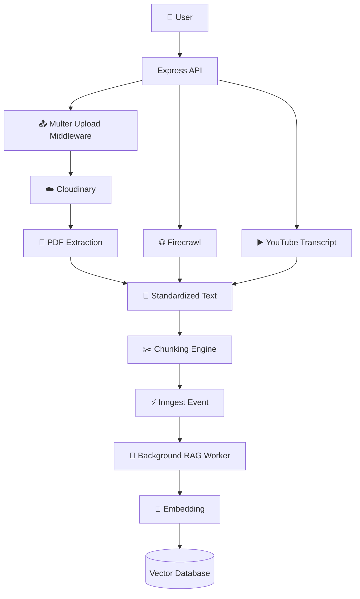
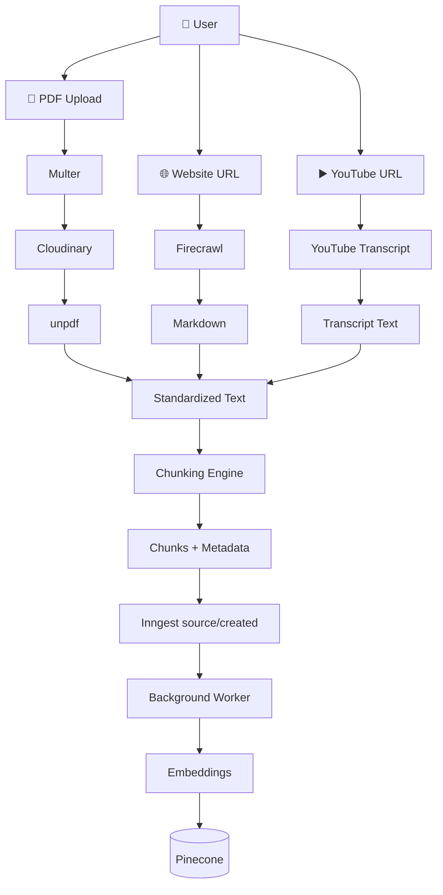

# Server Chapter 6 — Multi-Channel File & Content Ingestion

## 1. Goal & Outcome

### 🎯 Goal

Build the **content-ingestion foundation** for the RAG system by supporting multiple source types:

* 📄 **PDF files** uploaded through Cloudinary
* 🌐 **Web pages** scraped through Firecrawl
* ▶️ **YouTube videos** converted into transcript text
* ✂️ **Text chunking** using a recursive separator strategy
* ⚡ **Asynchronous processing** triggered through Inngest

The main objective is to transform different forms of unstructured content into a **standardized text representation** that can later be chunked, embedded, and stored in the vector database.

### 🎓 Student Outcome

After this chapter, you should understand how to build an ingestion layer that can:

1. Validate and accept PDF uploads.
2. Store uploaded files in Cloudinary.
3. Extract text from PDFs.
4. Scrape public web pages into Markdown.
5. Fetch YouTube transcripts.
6. Split large documents into retrieval-friendly chunks.
7. Preserve page-level metadata for PDFs.
8. Trigger background RAG processing asynchronously.

The resulting architecture separates **file handling, external integrations, text extraction, chunking, and background processing** into independent modules.

---

# 2. Server Installation Commands

From the server directory:

```bash
cd week05/chaibook-llm-sir/server

npm install multer cloudinary pdf-parse @firecrawl/sdk youtube-transcript
```

### Package Responsibilities

| Package              | Purpose                                                                    |
| -------------------- | -------------------------------------------------------------------------- |
| `multer`             | Parses `multipart/form-data` uploads in Express                            |
| `cloudinary`         | Generates signed Cloudinary URLs and provides Cloudinary SDK functionality |
| `pdf-parse`          | PDF-related dependency used by the project/tooling                         |
| `@firecrawl/sdk`     | Scrapes web pages and returns structured content such as Markdown          |
| `youtube-transcript` | Fetches available YouTube caption/transcript segments                      |

> **Important:** The supplied `pdf.ts` implementation actually imports PDF functionality from `unpdf`. Therefore, `pdf-parse` is not used directly by the shown `pdf.ts` source code. If `pdf-parse` is not used elsewhere in the project, it can be removed from the dependency list.

---

# 3. Ingestion Architecture

The ingestion pipeline can be understood as several independent stages:



The important architectural idea is:

> **Different source types should converge into a common text-processing pipeline.**

For example:

```text
PDF
 └── extract text
       ↓
     text
       ↓
    chunking
       ↓
    embeddings
       ↓
 vector database
```

while:

```text
Website
 └── Firecrawl → Markdown
                  ↓
               chunking
                  ↓
              embeddings
```

and:

```text
YouTube
 └── Transcript → text
                    ↓
                 chunking
                    ↓
                embeddings
```

This prevents the downstream RAG system from needing to understand how the original content was obtained.

---

# 4. PDF Upload Middleware

## File Path

`server/src/middleware/upload.middleware.ts`

```typescript
import multer from "multer";

const MAX_PDF_SIZE_BYTES = 10 * 1024 * 1024;

export const pdfUpload = multer({
    storage: multer.memoryStorage(),

    limits: {
        fileSize: MAX_PDF_SIZE_BYTES,
    },

    fileFilter: (_req, file, callback) => {
        if (file.mimetype === "application/pdf") {
            callback(null, true);
            return;
        }

        callback(new Error("Only PDF files are allowed"));
    },
});

export const uploadSinglePdf = pdfUpload.single("file");
```

## Architectural Role

This module sits at the **HTTP upload boundary**.

Its responsibility is intentionally narrow:

* accept a multipart upload,
* keep the file in memory,
* enforce a maximum file size,
* reject files whose declared MIME type is not `application/pdf`,
* expose a reusable middleware for one PDF field.

It does **not** upload the file to Cloudinary or extract PDF text. Those responsibilities belong to other modules.

---

## Detailed Code Breakdown

### 4.1 Importing Multer

```typescript
import multer from "multer";
```

Imports Multer, the Express middleware used to process `multipart/form-data`.

A normal JSON request can be parsed with `express.json()`, but file uploads use multipart encoding, which requires a multipart parser such as Multer.

---

### 4.2 Maximum Upload Size

```typescript
const MAX_PDF_SIZE_BYTES = 10 * 1024 * 1024;
```

Defines the maximum accepted file size.

The calculation is:

```text
10 × 1024 × 1024
= 10,485,760 bytes
≈ 10 MB
```

Keeping the value in a named constant makes the upload limit easy to change and avoids scattering magic numbers through the code.

---

### 4.3 Memory Storage

```typescript
storage: multer.memoryStorage(),
```

Multer stores the uploaded file directly in memory instead of writing it to disk.

This is useful when the next processing stage immediately needs the file bytes, for example:

```text
HTTP Upload
    ↓
Buffer
    ↓
Cloudinary
    ↓
PDF Extraction
```

The uploaded file becomes available through:

```typescript
req.file.buffer
```

### Production consideration

Memory storage means the server temporarily holds the entire uploaded file in RAM.

With a 10 MB limit, a single request is bounded, but multiple concurrent uploads can still consume significant memory.

Therefore, production systems should also consider:

* request concurrency,
* rate limiting,
* server memory limits,
* streaming uploads,
* direct client-to-cloud uploads for larger files.

---

### 4.4 File Size Limit

```typescript
limits: {
    fileSize: MAX_PDF_SIZE_BYTES,
},
```

Tells Multer to reject files larger than the configured limit.

This protects the application from unnecessarily processing oversized uploads.

---

### 4.5 MIME-Type Filter

```typescript
fileFilter: (_req, file, callback) => {
```

Multer calls this function when a file is received.

The parameters are:

* `_req` — Express request object; unused here.
* `file` — uploaded file metadata.
* `callback` — tells Multer whether to accept or reject the file.

---

### 4.6 Accepting PDF Files

```typescript
if (file.mimetype === "application/pdf") {
    callback(null, true);
    return;
}
```

Only files whose declared MIME type is:

```text
application/pdf
```

are accepted.

`callback(null, true)` means:

```text
No error + accept file
```

The `return` prevents execution from reaching the rejection branch.

### Important security note

MIME type comes from the incoming request and should not be treated as a cryptographic guarantee that the file is actually a PDF.

For stronger production validation, inspect the file signature/magic bytes as well.

A PDF normally begins with:

```text
%PDF-
```

---

### 4.7 Rejecting Other File Types

```typescript
callback(new Error("Only PDF files are allowed"));
```

Rejects files that do not report the expected MIME type.

The error can then flow into the application's centralized Express error-handling middleware.

---

### 4.8 Single File Middleware

```typescript
export const uploadSinglePdf = pdfUpload.single("file");
```

Creates a reusable middleware expecting exactly one uploaded file under the multipart field:

```text
file
```

A route can therefore use:

```text
uploadSinglePdf
```

without repeating Multer configuration.

---

# 5. Firecrawl Web Scraping Integration

## File Path

`server/src/lib/firecrawl.ts`

```typescript
/**
 * Firecrawl integration for scraping website content into markdown sources.
 *
 * Requires `FIRECRAWL_API_KEY` in the environment.
 */

import Firecrawl from "@mendable/firecrawl-js";
import { ValidationError } from "../types/app-error.js";

/**
 * Scrapes a public URL and returns clean markdown suitable for RAG indexing.
 *
 * @param url - Page URL to scrape (must be reachable by Firecrawl)
 * @returns Markdown content, optional page title, and canonical source URL
 * @throws {ValidationError} When Firecrawl is not configured or extraction fails
 */
export async function scrapeWebsite(url: string) {
    const apiKey = process.env.FIRECRAWL_API_KEY;

    if (!apiKey) {
        throw new ValidationError("Firecrawl is not configured on the server");
    }

    const client = new Firecrawl({ apiKey });

    const result = await client.scrape(url, {
        formats: ["markdown"],
    });

    const markdown = result.markdown?.trim();

    if (!markdown) {
        throw new ValidationError("Could not extract content from this URL");
    }

    return {
        markdown,
        title: result.metadata?.title,
        sourceUrl: result.metadata?.sourceURL ?? url,
    };
}
```

## Architectural Role

This module isolates the external **Firecrawl integration** from the rest of the application.

Instead of allowing controllers or services to know how Firecrawl works, they can simply call:

```typescript
scrapeWebsite(url)
```

and receive:

```typescript
{
    markdown,
    title,
    sourceUrl
}
```

That creates a clean abstraction:

```text
Application
    ↓
scrapeWebsite()
    ↓
Firecrawl SDK
    ↓
Web Page
    ↓
Markdown
```

---

## 5.1 Firecrawl Import

```typescript
import Firecrawl from "@mendable/firecrawl-js";
```

Imports the Firecrawl SDK used to communicate with the Firecrawl service.

---

## 5.2 Application Error

```typescript
import { ValidationError } from "../types/app-error.js";
```

Imports the application's typed validation error.

The module uses this when:

* Firecrawl configuration is missing.
* No useful content could be extracted.

This allows the global error middleware to convert application errors into standardized HTTP responses.

---

## 5.3 API Key Lookup

```typescript
const apiKey = process.env.FIRECRAWL_API_KEY;
```

Reads the Firecrawl API key from the server environment.

The API key should remain server-side and should never be exposed to the browser.

---

## 5.4 Configuration Guard

```typescript
if (!apiKey) {
    throw new ValidationError(
        "Firecrawl is not configured on the server",
    );
}
```

Fails early when the required environment variable is missing.

This is preferable to allowing the SDK call to fail later with a less meaningful configuration error.

---

## 5.5 Creating the Client

```typescript
const client = new Firecrawl({ apiKey });
```

Creates a Firecrawl client using the server-side API key.

---

## 5.6 Requesting Markdown

```typescript
const result = await client.scrape(url, {
    formats: ["markdown"],
});
```

Requests the target URL to be scraped and asks Firecrawl to return Markdown.

Markdown is particularly useful for RAG because it provides a cleaner textual representation than raw HTML.

For example:

```html
<h1>Introduction</h1>
<p>RAG combines retrieval and generation...</p>
```

can become conceptually:

```markdown
# Introduction

RAG combines retrieval and generation...
```

---

## 5.7 Normalizing Extracted Content

```typescript
const markdown = result.markdown?.trim();
```

Safely accesses the Markdown result and removes leading/trailing whitespace.

The optional chaining:

```typescript
?. 
```

prevents an exception if `markdown` is missing.

---

## 5.8 Empty Content Protection

```typescript
if (!markdown) {
    throw new ValidationError(
        "Could not extract content from this URL",
    );
}
```

Prevents the system from creating an empty source.

This is important because empty content would later produce:

```text
No useful chunks
→ no embeddings
→ useless source
```

---

## 5.9 Standardized Return Object

```typescript
return {
    markdown,
    title: result.metadata?.title,
    sourceUrl: result.metadata?.sourceURL ?? url,
};
```

Normalizes Firecrawl's result into the application's own structure.

The fallback:

```typescript
result.metadata?.sourceURL ?? url
```

means:

> Use Firecrawl's canonical URL when available; otherwise use the original URL.

This creates a stable source representation for downstream indexing.

---

# 6. YouTube Transcript Extraction

## File Path

`server/src/lib/youtube.ts`

```typescript
/**
 * YouTube transcript extraction for YOUTUBE source imports.
 */

import { YoutubeTranscript } from "youtube-transcript";
import { ValidationError } from "../types/app-error.js";

/**
 * Fetches caption transcript text for a YouTube video.
 *
 * @param url - YouTube page URL
 * @returns Video id and concatenated transcript text
 * @throws {ValidationError} When the URL is invalid, captions are missing, or fetch fails
 */
export async function fetchYoutubeTranscript(url: string) {
    const videoId =
        url.match(
            /(?:youtube\.com\/watch\?v=|youtu\.be\/|youtube\.com\/embed\/)([\w-]{11})/,
        )?.[1] ??
        url.match(/youtube\.com\/shorts\/([\w-]{11})/)?.[1];

    if (!videoId) {
        throw new ValidationError("Enter a valid YouTube URL");
    }

    try {
        const segments = await YoutubeTranscript.fetchTranscript(videoId);

        const content = segments
            .map((segment) => segment.text)
            .join(" ")
            .trim();

        if (!content) {
            throw new ValidationError(
                "No transcript found for this video",
            );
        }

        return {
            videoId,
            content,
        };
    } catch {
        throw new ValidationError(
            "Could not fetch transcript. The video may not have captions.",
        );
    }
}
```

## Architectural Role

This module converts a YouTube video from:

```text
YouTube URL
     ↓
Video ID
     ↓
Caption segments
     ↓
Plain text
```

The rest of the RAG pipeline does not need to know anything about YouTube's URL structure or transcript API.

---

## 6.1 YouTube URL Parsing

```typescript
const videoId =
    url.match(
        /(?:youtube\.com\/watch\?v=|youtu\.be\/|youtube\.com\/embed\/)([\w-]{11})/,
    )?.[1] ??
    url.match(/youtube\.com\/shorts\/([\w-]{11})/)?.[1];
```

Attempts to extract the standard 11-character YouTube video ID.

It supports URLs such as:

```text
youtube.com/watch?v=VIDEO_ID
youtu.be/VIDEO_ID
youtube.com/embed/VIDEO_ID
youtube.com/shorts/VIDEO_ID
```

The first regular expression is attempted first.

If it doesn't match, the nullish coalescing operator:

```typescript
??
```

causes the Shorts expression to be attempted.

---

## 6.2 Invalid URL Handling

```typescript
if (!videoId) {
    throw new ValidationError("Enter a valid YouTube URL");
}
```

Stops processing when no recognizable video ID can be extracted.

---

## 6.3 Fetching Transcript Segments

```typescript
const segments =
    await YoutubeTranscript.fetchTranscript(videoId);
```

Requests the available transcript/caption segments.

The result is not necessarily one large string. It is a collection of segments containing text.

Conceptually:

```text
[
    { text: "Welcome..." },
    { text: "Today we..." },
    { text: "will learn..." }
]
```

---

## 6.4 Combining Segments

```typescript
const content = segments
    .map((segment) => segment.text)
    .join(" ")
    .trim();
```

Transforms the segment array into one continuous text string.

Pipeline:

```text
segments
   ↓
map(text)
   ↓
["Welcome...", "Today...", "will learn..."]
   ↓
join(" ")
   ↓
"Welcome... Today... will learn..."
```

This standardized text can then enter the normal chunking pipeline.

---

## 6.5 Missing Transcript

```typescript
if (!content) {
    throw new ValidationError(
        "No transcript found for this video",
    );
}
```

Prevents an empty transcript from being indexed.

---

## 6.6 Error Normalization

```typescript
} catch {
    throw new ValidationError(
        "Could not fetch transcript. The video may not have captions.",
    );
}
```

Converts lower-level transcript-fetching failures into the application's error type.

### Important implementation detail

This `catch` also catches the `ValidationError` created by the empty-content check above.

Therefore, the specific:

```text
"No transcript found for this video"
```

error will ultimately be replaced by:

```text
"Could not fetch transcript. The video may not have captions."
```

If preserving the original error is important, the implementation should distinguish known application errors from unexpected external failures.

---

# 7. Cloudinary Integration

## File Path

`server/src/lib/cloudinary.ts`

```typescript
import { v2 as cloudinary } from "cloudinary";
import { ValidationError } from "../types/app-error.js";

const cloudName = process.env.CLOUDINARY_CLOUD_NAME;
const uploadPreset =
    process.env.CLOUDINARY_UPLOAD_PRESET ?? "dt2jgaj48";
const apiKey = process.env.CLOUDINARY_API_KEY;
const apiSecret = process.env.CLOUDINARY_API_SECRET;

/** Normalized result returned after a successful Cloudinary upload. */
export type CloudinaryUploadResult = {
    secureUrl: string;
    publicId: string;
    bytes: number;
    originalFilename: string;
    resourceType: "raw" | "image";
};

type CloudinaryUploadResponse = {
    secure_url: string;
    public_id: string;
    bytes: number;
    resource_type?: string;
    error?: { message: string };
};

export function getSignedCloudinaryDownloadUrl(
    publicId: string,
    resourceType: "raw" | "image" = "raw",
) {
    if (!cloudName || !apiKey || !apiSecret) {
        return null;
    }

    cloudinary.config({
        cloud_name: cloudName,
        api_key: apiKey,
        api_secret: apiSecret,
        secure: true,
    });

    return cloudinary.url(publicId, {
        resource_type: resourceType,
        type: "upload",
        sign_url: true,
        secure: true,
    });
}

/**
 * Uploads a PDF buffer to Cloudinary using an unsigned upload preset.
 *
 * @param buffer - PDF file bytes from Multer
 * @param filename - Original filename (used in the multipart form)
 * @returns Upload metadata including secure URL and public id
 * @throws {ValidationError} When Cloudinary is not configured or upload is rejected
 */
export async function uploadPdfToCloudinary(
    buffer: Buffer,
    filename: string,
): Promise<CloudinaryUploadResult> {
    if (!cloudName) {
        throw new ValidationError(
            "Cloudinary is not configured on the server",
        );
    }

    const form = new FormData();

    form.append(
        "file",
        new Blob(
            [new Uint8Array(buffer)],
            { type: "application/pdf" },
        ),
        filename,
    );

    form.append("upload_preset", uploadPreset);
    form.append("folder", "chaibook/pdfs");

    const response = await fetch(
        `https://api.cloudinary.com/v1_1/${cloudName}/raw/upload`,
        {
            method: "POST",
            body: form,
        },
    );

    const result =
        (await response.json()) as CloudinaryUploadResponse;

    if (!response.ok) {
        const message =
            result.error?.message ??
            `Cloudinary upload failed (${response.status})`;

        if (response.status === 403) {
            throw new ValidationError(
                "Cloudinary rejected the upload. Check CLOUDINARY_UPLOAD_PRESET in server/.env matches an unsigned preset in your dashboard.",
            );
        }

        throw new ValidationError(message);
    }

    return {
        secureUrl: result.secure_url,
        publicId: result.public_id,
        bytes: result.bytes,
        originalFilename: filename,
        resourceType:
            result.resource_type === "image"
                ? "image"
                : "raw",
    };
}
```

## Architectural Role

This module isolates Cloudinary-specific functionality.

It performs two different jobs:

### Download URL generation

```text
Cloudinary public ID
        ↓
signed URL
        ↓
authenticated download
```

### PDF upload

```text
Buffer
  ↓
multipart FormData
  ↓
Cloudinary
  ↓
normalized upload result
```

---

## 7.1 Environment Configuration

```typescript
const cloudName =
    process.env.CLOUDINARY_CLOUD_NAME;
```

Reads the Cloudinary cloud name from the environment.

Other configuration values include:

```typescript
CLOUDINARY_UPLOAD_PRESET
CLOUDINARY_API_KEY
CLOUDINARY_API_SECRET
```

Secrets such as the API secret must remain server-side.

---

## 7.2 Default Upload Preset

```typescript
const uploadPreset =
    process.env.CLOUDINARY_UPLOAD_PRESET ?? "dt2jgaj48";
```

Uses the environment-provided upload preset when available.

Otherwise, it falls back to:

```text
dt2jgaj48
```

### Production recommendation

A hard-coded production credential/configuration value should generally be avoided.

Prefer requiring:

```text
CLOUDINARY_UPLOAD_PRESET
```

through environment configuration so deployments are explicit and environment-specific.

---

# 8. Cloudinary Result Types

## Upload Result

```typescript
export type CloudinaryUploadResult = {
    secureUrl: string;
    publicId: string;
    bytes: number;
    originalFilename: string;
    resourceType: "raw" | "image";
};
```

Defines the application's normalized representation of a successful Cloudinary upload.

Instead of exposing Cloudinary's complete response structure throughout the application, the module returns only the fields the application needs.

This is an important abstraction boundary.

---

## Cloudinary Response Type

```typescript
type CloudinaryUploadResponse = {
    secure_url: string;
    public_id: string;
    bytes: number;
    resource_type?: string;
    error?: { message: string };
};
```

Represents the subset of the Cloudinary HTTP response used by this module.

The `as CloudinaryUploadResponse` assertion provides TypeScript's compile-time view of the parsed JSON.

It does **not** perform runtime validation.

If stronger runtime guarantees are required, the response should also be validated with Zod.

---

# 9. Signed Cloudinary Download URLs

```typescript
export function getSignedCloudinaryDownloadUrl(
    publicId: string,
    resourceType: "raw" | "image" = "raw",
)
```

Generates a signed Cloudinary URL for authenticated access.

---

## Configuration Guard

```typescript
if (!cloudName || !apiKey || !apiSecret) {
    return null;
}
```

A signed URL requires Cloudinary credentials.

If the credentials are incomplete, the function returns `null` rather than generating an invalid URL.

The caller can then provide a more useful error.

---

## Cloudinary SDK Configuration

```typescript
cloudinary.config({
    cloud_name: cloudName,
    api_key: apiKey,
    api_secret: apiSecret,
    secure: true,
});
```

Configures the Cloudinary SDK.

`secure: true` ensures HTTPS URLs are generated.

---

## Signed URL Generation

```typescript
return cloudinary.url(publicId, {
    resource_type: resourceType,
    type: "upload",
    sign_url: true,
    secure: true,
});
```

Generates a signed URL using the Cloudinary public ID.

The important setting is:

```typescript
sign_url: true
```

which causes the generated URL to contain the required signature for authenticated access.

---

# 10. PDF Upload to Cloudinary

```typescript
export async function uploadPdfToCloudinary(
    buffer: Buffer,
    filename: string,
): Promise<CloudinaryUploadResult>
```

The function receives:

* `buffer` — PDF bytes supplied by Multer.
* `filename` — original uploaded filename.

It returns:

```typescript
Promise<CloudinaryUploadResult>
```

because the upload is asynchronous.

---

## Creating FormData

```typescript
const form = new FormData();
```

Creates a multipart form body for the Cloudinary HTTP upload API.

---

## Converting Buffer to Blob

```typescript
new Blob(
    [new Uint8Array(buffer)],
    { type: "application/pdf" },
)
```

Converts the Node.js `Buffer` into data suitable for the multipart request.

The declared MIME type is:

```text
application/pdf
```

---

## Cloudinary Folder

```typescript
form.append("folder", "chaibook/pdfs");
```

Places the uploaded resource into the configured Cloudinary folder.

This provides organizational separation between uploaded assets.

---

## Direct HTTP Upload

```typescript
const response = await fetch(
    `https://api.cloudinary.com/v1_1/${cloudName}/raw/upload`,
    {
        method: "POST",
        body: form,
    },
);
```

Uses Cloudinary's HTTP upload endpoint directly rather than the SDK's upload method.

This is a valid architectural choice, but it means the module is mixing:

* Cloudinary SDK functionality for signed URLs.
* raw HTTP `fetch` for uploads.

A future refactor could standardize on one approach for consistency.

---

# 11. Cloudinary Error Handling

```typescript
if (!response.ok) {
```

Checks the HTTP status.

Any non-2xx response enters this branch.

---

## Extracting Cloudinary Error

```typescript
const message =
    result.error?.message ??
    `Cloudinary upload failed (${response.status})`;
```

Uses Cloudinary's returned error message when available.

Otherwise, it constructs a fallback message from the HTTP status.

---

## Handling HTTP 403

```typescript
if (response.status === 403) {
```

Handles the common case where Cloudinary rejects the upload due to configuration or authorization.

The application throws a clearer `ValidationError` instructing the developer to verify the upload preset.

---

# 12. PDF Extraction

## File Path

`server/src/lib/pdf.ts`

```typescript
/**
 * PDF text extraction utilities using `unpdf`.
 *
 * Supports in-memory buffers and Cloudinary-hosted PDFs with signed URL
 * fallback when public access returns 401.
 */

import {
    extractText,
    getDocumentProxy,
} from "unpdf";

import {
    getSignedCloudinaryDownloadUrl,
} from "./cloudinary.js";

export type PdfExtractResult = {
    text: string;
    pages: string[];
    pageCount: number;
};

export async function extractPdfFromBuffer(
    buffer: ArrayBuffer | Buffer,
): Promise<PdfExtractResult> {
    const arrayBuffer =
        buffer instanceof Buffer
            ? (buffer.buffer.slice(
                  buffer.byteOffset,
                  buffer.byteOffset + buffer.byteLength,
              ) as ArrayBuffer)
            : buffer;

    const pdf =
        await getDocumentProxy(
            new Uint8Array(arrayBuffer),
        );

    const { totalPages, text } =
        await extractText(pdf, {
            mergePages: false,
        });

    const pages = Array.isArray(text)
        ? text.map((page) => page.trim())
        : [String(text).trim()];

    const joined =
        pages
            .filter(Boolean)
            .join("\n\n");

    if (!joined) {
        throw new Error(
            "No text could be extracted from the PDF",
        );
    }

    return {
        text: joined,
        pages,
        pageCount: totalPages,
    };
}
```

The remaining Cloudinary-download portion:

```typescript
async function downloadPdf(url: string) {
    const response = await fetch(url);

    if (!response.ok) {
        throw new Error(
            `Failed to download PDF (${response.status})`,
        );
    }

    return response.arrayBuffer();
}

export async function extractPdfFromCloudinary(input: {
    fileUrl: string;
    publicId?: string;
    resourceType?: "raw" | "image";
}): Promise<PdfExtractResult> {
    try {
        const buffer =
            await downloadPdf(input.fileUrl);

        return await extractPdfFromBuffer(buffer);
    } catch (error) {
        const isUnauthorized =
            error instanceof Error &&
            error.message.includes("(401)");

        if (!isUnauthorized || !input.publicId) {
            throw error;
        }

        const signedUrl =
            getSignedCloudinaryDownloadUrl(
                input.publicId,
                input.resourceType ?? "raw",
            );

        if (!signedUrl) {
            throw new Error(
                "PDF download requires authentication. Add CLOUDINARY_API_KEY and CLOUDINARY_API_SECRET to server/.env, or re-upload the PDF.",
            );
        }

        const buffer =
            await downloadPdf(signedUrl);

        return extractPdfFromBuffer(buffer);
    }
}
```

---

# 13. PDF Extraction Architecture

The module supports two input paths.

### Path A — Buffer

```text
Multer
  ↓
Buffer
  ↓
extractPdfFromBuffer()
  ↓
unpdf
  ↓
page text
```

### Path B — Cloudinary

```text
Cloudinary URL
      ↓
downloadPdf()
      ↓
401?
 ┌────┴────┐
No         Yes
 ↓          ↓
extract    signed URL
           ↓
        download
           ↓
        extract
```

This allows the application to process PDFs both:

* immediately after upload, and
* later from Cloudinary storage.

---

# 14. PDF Extraction Result

```typescript
export type PdfExtractResult = {
    text: string;
    pages: string[];
    pageCount: number;
};
```

The result deliberately contains both:

### Complete text

```typescript
text: string
```

Useful for general processing.

### Individual pages

```typescript
pages: string[]
```

Useful when metadata such as page numbers must be preserved during chunking.

### Page count

```typescript
pageCount: number
```

Useful for source metadata, validation, and UI display.

---

# 15. Converting Buffer to ArrayBuffer

```typescript
const arrayBuffer =
    buffer instanceof Buffer
        ? (buffer.buffer.slice(
              buffer.byteOffset,
              buffer.byteOffset + buffer.byteLength,
          ) as ArrayBuffer)
        : buffer;
```

This handles both:

```text
Node.js Buffer
```

and:

```text
ArrayBuffer
```

The conversion respects the Buffer's:

* `byteOffset`
* `byteLength`

rather than blindly using the entire underlying `ArrayBuffer`.

That distinction matters because a Node.js Buffer can represent only a slice of a larger underlying memory allocation.

---

# 16. Loading the PDF

```typescript
const pdf =
    await getDocumentProxy(
        new Uint8Array(arrayBuffer),
    );
```

Converts the PDF bytes into a `Uint8Array` and creates a PDF document proxy using `unpdf`.

---

# 17. Extracting Page-Level Text

```typescript
const { totalPages, text } =
    await extractText(pdf, {
        mergePages: false,
    });
```

The important option is:

```typescript
mergePages: false
```

This preserves page-level text rather than combining all pages into one string.

That is important for RAG because later chunks can retain metadata such as:

```json
{
    "page": 7
}
```

---

# 18. Normalizing Page Results

```typescript
const pages = Array.isArray(text)
    ? text.map((page) => page.trim())
    : [String(text).trim()];
```

Normalizes the extracted result into a predictable:

```typescript
string[]
```

representation.

Every page is trimmed individually.

---

# 19. Joining the Complete Document

```typescript
const joined =
    pages
        .filter(Boolean)
        .join("\n\n");
```

Creates a single document-level text representation while preserving paragraph-like separation between pages.

The `filter(Boolean)` removes empty page strings.

---

# 20. Empty PDF Protection

```typescript
if (!joined) {
    throw new Error(
        "No text could be extracted from the PDF",
    );
}
```

Prevents the system from indexing an empty document.

### Important limitation

Text extraction alone does not mean every PDF is supported.

A scanned/image-only PDF may contain no machine-readable text.

In that situation, OCR would be required for meaningful extraction.

---

# 21. Downloading a Cloudinary PDF

```typescript
async function downloadPdf(url: string) {
    const response = await fetch(url);

    if (!response.ok) {
        throw new Error(
            `Failed to download PDF (${response.status})`,
        );
    }

    return response.arrayBuffer();
}
```

This helper:

1. sends an HTTP request,
2. checks the status,
3. throws when downloading fails,
4. returns the PDF bytes as an `ArrayBuffer`.

It deliberately does not know anything about Cloudinary.

That keeps downloading separate from Cloudinary-specific URL generation.

---

# 22. Cloudinary PDF Extraction with Signed Fallback

```typescript
try {
    const buffer =
        await downloadPdf(input.fileUrl);

    return await extractPdfFromBuffer(buffer);
}
```

The first attempt uses the supplied URL directly.

This is the simplest path when the URL is publicly accessible.

---

## Handling Unauthorized Access

```typescript
const isUnauthorized =
    error instanceof Error &&
    error.message.includes("(401)");
```

Detects an HTTP 401 response encoded in the download error.

If the URL requires authentication, the code attempts a signed Cloudinary URL.

---

## Generating Signed URL

```typescript
const signedUrl =
    getSignedCloudinaryDownloadUrl(
        input.publicId,
        input.resourceType ?? "raw",
    );
```

Uses the Cloudinary public ID to generate an authenticated download URL.

---

## Signed Download

```typescript
const buffer =
    await downloadPdf(signedUrl);

return extractPdfFromBuffer(buffer);
```

The signed URL is downloaded and then passed through the exact same extraction function.

This is good modular design because there is only one PDF extraction implementation.

---

# 23. Text Chunking Engine

## File Path

`server/src/lib/chunking.ts`

The chunking module converts large text into smaller retrieval units.

Its public abstraction is:

```typescript
TextChunk
```

```typescript
export type TextChunk = {
    index: number;
    content: string;
    metadata?: Record<string, unknown>;
};
```

A chunk therefore contains:

* `index` — position of the chunk.
* `content` — actual text.
* `metadata` — optional source/page/custom information.

Example:

```json
{
    "index": 4,
    "content": "Retrieval augmented generation...",
    "metadata": {
        "page": 7,
        "sourceId": "abc123"
    }
}
```

This metadata later becomes extremely useful during retrieval and citation generation.

---

# 24. Chunking Defaults

```typescript
const DEFAULT_CHUNK_SIZE = 1000;
const DEFAULT_CHUNK_OVERLAP = 100;
```

Default chunk size:

```text
1000 characters
```

Default overlap:

```text
100 characters
```

The overlap is intended to preserve context around boundaries when character-level splitting is required.

### Important implementation detail

In the supplied implementation, `chunkOverlap` is used only by the final raw-character fallback.

It does **not** create overlap between normal paragraph, line, sentence, or word-based chunks.

Therefore:

> This implementation is a recursive/separator-based splitter with character overlap only as its final fallback, rather than a universally overlapping chunker.

---

# 25. Separator Strategy

```typescript
const SEPARATORS = [
    "\n\n",
    "\n",
    ". ",
    " ",
    "",
];
```

The splitter tries boundaries from the most structurally meaningful to the most aggressive:

```text
1. Paragraph
2. Line
3. Sentence
4. Word
5. Character
```

This is a useful strategy for RAG because splitting at semantic boundaries generally produces better chunks than blindly slicing every N characters.

---

# 26. Merging Splits

```typescript
function mergeSplits(
    splits: string[],
    separator: string,
    chunkSize: number,
) {
```

This helper combines smaller pieces into larger chunks without exceeding the configured character limit whenever possible.

Conceptually:

```text
Small pieces:

[A]
[B]
[C]
[D]

↓

Pack into chunks:

[A + B]
[C + D]
```

---

## Current Chunk State

```typescript
const docs: string[] = [];
let current: string[] = [];
let total = 0;
```

Three pieces of state are maintained:

* `docs` — completed chunks.
* `current` — pieces currently being assembled.
* `total` — current character count.

---

## Iterating Through Splits

```typescript
for (const split of splits) {
```

Processes each paragraph, line, sentence, or word segment.

---

## Calculating Size

```typescript
const len = split.length;
const sepLen =
    current.length > 0
        ? separator.length
        : 0;
```

Calculates the size contribution of:

* the current split,
* the separator required between multiple splits.

The separator is counted only when there is already content in the current chunk.

---

## Sealing a Chunk

```typescript
if (
    total + len + sepLen > chunkSize &&
    current.length > 0
) {
    docs.push(current.join(separator));

    total = 0;
    current = [];
}
```

When adding the next split would exceed the target size, the current chunk is finalized.

For example:

```text
chunkSize = 1000

current = 850 chars
next split = 200 chars

850 + separator + 200 > 1000

→ finalize current chunk
→ start a new chunk
```

---

## Adding the Split

```typescript
current.push(split);
total += len + sepLen;
```

Adds the current piece to the active chunk and updates its size.

---

## Final Chunk

```typescript
if (current.length > 0) {
    docs.push(current.join(separator));
}
```

After the loop finishes, any remaining text is added as the final chunk.

---

# 27. Recursive Separator Splitting

```typescript
function splitText(
    text: string,
    chunkSize: number,
    chunkOverlap: number,
) {
```

This function chooses the first separator that actually divides the document into multiple pieces.

---

## Trying Separators

```typescript
for (const separator of SEPARATORS) {
```

The algorithm starts with:

```text
\n\n
```

and progressively falls back toward:

```text
""
```

---

## Splitting on a Separator

```typescript
const splits =
    text
        .split(separator)
        .filter(Boolean);
```

For example:

```text
Paragraph 1

Paragraph 2

Paragraph 3
```

using:

```text
"\n\n"
```

produces separate paragraph pieces.

---

## Skip Ineffective Separators

```typescript
if (splits.length === 1) {
    continue;
}
```

If the separator did not actually split the text, there is no benefit in using it.

The algorithm therefore moves to the next separator.

---

## Merge the Pieces

```typescript
chunks.push(
    ...mergeSplits(
        splits,
        separator,
        chunkSize,
    ),
);
```

The pieces are packed back into chunks that respect the configured size.

---

# 28. Character-Level Fallback

```typescript
else {
    for (
        let i = 0;
        i < text.length;
        i += chunkSize - chunkOverlap
    ) {
        chunks.push(
            text.slice(i, i + chunkSize),
        );
    }
}
```

The empty-string separator:

```typescript
""
```

means there is no meaningful textual boundary left to use.

The implementation therefore falls back to character slicing.

For example:

```text
chunkSize = 1000
overlap = 100
```

means the next chunk begins:

```text
1000 - 100 = 900
```

characters after the previous start.

Therefore:

```text
Chunk 1: 0 → 1000
Chunk 2: 900 → 1900
Chunk 3: 1800 → 2800
```

This produces the intended 100-character overlap.

---

# 29. Selecting the First Useful Strategy

```typescript
if (chunks.length > 0) {
    break;
}
```

Once a separator produces chunks, the algorithm stops trying later separators.

So the strategy is:

```text
Paragraph split works?
    ↓ yes
Use it.

No?
    ↓
Line split works?
    ↓ yes
Use it.

No?
    ↓
Sentence split...
```

This keeps the splitting hierarchy simple and predictable.

---

# 30. Removing Empty Chunks

```typescript
return chunks.filter(
    (chunk) => chunk.trim().length > 0,
);
```

Ensures whitespace-only chunks are not returned.

This prevents useless embedding operations later in the pipeline.

---

# 31. Public `chunkText()` API

```typescript
export function chunkText(
    text: string,
    options: {
        chunkSize?: number;
        chunkOverlap?: number;
        metadata?: Record<string, unknown>;
    } = {},
): TextChunk[] {
```

This is the main public chunking function.

It provides configurable:

* chunk size,
* chunk overlap,
* metadata.

The default:

```typescript
= {}
```

allows callers to simply write:

```typescript
chunkText(text)
```

without providing options.

---

## Applying Defaults

```typescript
const chunkSize =
    options.chunkSize ??
    DEFAULT_CHUNK_SIZE;

const chunkOverlap =
    options.chunkOverlap ??
    DEFAULT_CHUNK_OVERLAP;
```

The nullish coalescing operator:

```typescript
??
```

uses the default only when the option is:

```text
null
```

or:

```text
undefined
```

---

## Splitting Input

```typescript
const parts =
    splitText(
        text.trim(),
        chunkSize,
        chunkOverlap,
    );
```

The document is trimmed before chunking.

This avoids leading and trailing whitespace affecting the output.

---

## Creating `TextChunk` Objects

```typescript
return parts.map(
    (content, index) => ({
        index,
        content,
        metadata: options.metadata,
    }),
);
```

Transforms:

```text
string[]
```

into:

```text
TextChunk[]
```

Each chunk receives a sequential index:

```text
0
1
2
3
...
```

---

# 32. Page-Aware Chunking

```typescript
export function chunkPages(
    pages: string[],
    options: {
        chunkSize?: number;
        chunkOverlap?: number;
    } = {},
): TextChunk[] {
```

This function is specifically designed for multi-page documents such as PDFs.

Unlike `chunkText()`, it preserves page information.

---

## Processing Each Page

```typescript
for (
    let pageIndex = 0;
    pageIndex < pages.length;
    pageIndex++
) {
```

Iterates through every page.

---

## Skipping Empty Pages

```typescript
const pageText =
    pages[pageIndex].trim();

if (!pageText) {
    continue;
}
```

Empty pages are ignored.

---

## Chunking a Page

```typescript
const pageChunks =
    chunkText(pageText, {
        ...options,
        metadata: {
            page: pageIndex + 1,
        },
    });
```

The page is passed through the normal chunking function.

The important addition is:

```typescript
metadata: {
    page: pageIndex + 1,
}
```

Page numbers are **1-based**, meaning:

```text
Array index 0 → page 1
Array index 1 → page 2
Array index 2 → page 3
```

---

# 33. Global Chunk Indexing

```typescript
for (const chunk of pageChunks) {
    chunks.push({
        index,
        content: chunk.content,
        metadata: chunk.metadata,
    });

    index += 1;
}
```

Each page's chunks are added to one global array.

The global index continues across pages.

Example:

```text
Page 1:
  chunk 0
  chunk 1

Page 2:
  chunk 2
  chunk 3

Page 3:
  chunk 4
```

This makes chunk IDs deterministic within the processed document.

---

# 34. Why Page-Aware Chunking Matters for RAG

Consider a PDF:

```text
Page 7:
"Vector databases store embeddings..."

Page 8:
"Similarity search retrieves..."
```

After chunking:

```json
{
    "index": 12,
    "content": "Vector databases store embeddings...",
    "metadata": {
        "page": 7
    }
}
```

This metadata can later be used to produce citations such as:

```text
Source: architecture.pdf
Page: 7
```

Therefore, metadata is not just decorative information.

It becomes part of the **retrieval and citation layer** of the RAG system.

---

# 35. Asynchronous Source Processing

## File Path

`server/src/lib/source-events.ts`

```typescript
/**
 * Inngest event helpers for background source processing (RAG indexing).
 */

import { inngest } from "../inngest/client.js";

/**
 * Enqueues a source processing job to run asynchronously via Inngest.
 *
 * The worker runs extract → chunk → embed → Pinecone upsert.
 */
export async function enqueueSourceProcessing(input: {
    sourceId: string;
    workspaceId: string;
}) {
    await inngest.send({
        name: "source/created",
        data: input,
    });
}
```

## Architectural Role

This module connects the synchronous API with the asynchronous indexing pipeline.

Instead of making the HTTP request wait for:

```text
PDF extraction
    ↓
chunking
    ↓
embedding
    ↓
vector database upsert
```

the API can publish an event:

```text
source/created
```

and allow a background worker to perform the expensive processing.

---

# 36. Why Background Processing Is Important

Without asynchronous processing:

```text
POST /sources
      ↓
Upload
      ↓
Extract PDF
      ↓
Chunk
      ↓
Generate embeddings
      ↓
Pinecone upsert
      ↓
HTTP response
```

The user may wait for the entire indexing process.

With Inngest:

```text
POST /sources
      ↓
Create source
      ↓
Send event
      ↓
Return response
      ↓
       └───────────────→ Background worker
                              ↓
                           Extract
                              ↓
                           Chunk
                              ↓
                          Embedding
                              ↓
                        Pinecone upsert
```

This produces a much more scalable ingestion architecture.

---

# 37. Event Payload

```typescript
input: {
    sourceId: string;
    workspaceId: string;
}
```

The worker receives identifiers rather than the entire file or document content.

This is a good design choice because the background worker can retrieve the source and associated file metadata when it begins processing.

The event contains enough information to establish context:

```text
sourceId
workspaceId
```

---

# 38. Sending the Inngest Event

```typescript
await inngest.send({
    name: "source/created",
    data: input,
});
```

Publishes the event:

```text
source/created
```

with:

```json
{
    "sourceId": "...",
    "workspaceId": "..."
}
```

The actual extraction and indexing work happens in the consumer/worker registered for this event.

---

# 39. Complete Multi-Channel Ingestion Flow

The chapter's modules combine into the following architecture:



---

# 40. Standardized Internal Representation

The major architectural benefit is that multiple external formats eventually become the same internal concept:

```text
                ┌─────────────┐
                │    PDF      │
                └──────┬──────┘
                       │
                       ↓
                ┌─────────────┐
                │ PDF Extract │
                └──────┬──────┘
                       │
                       │
┌─────────────┐        │        ┌─────────────────┐
│   Website   │──→ Markdown ───→│                 │
└─────────────┘                 │  Standard Text  │
                                │                 │
┌─────────────┐                 │                 │
│   YouTube   │──→ Transcript ─→│                 │
└─────────────┘                 └────────┬────────┘
                                         │
                                         ↓
                                  ┌─────────────┐
                                  │  Chunking   │
                                  └──────┬──────┘
                                         │
                                         ↓
                                  ┌─────────────┐
                                  │ TextChunk[] │
                                  └─────────────┘
```

This is one of the most important design patterns in a multi-source RAG system:

> **Normalize different ingestion channels before applying shared downstream processing.**

---

# 41. End-to-End Example

Suppose a user uploads:

```text
machine-learning.pdf
```

The flow becomes:

```text
1. Client uploads PDF
        ↓
2. Multer validates multipart upload
        ↓
3. PDF stored in Cloudinary
        ↓
4. Source record stores file metadata
        ↓
5. Inngest receives source/created
        ↓
6. Worker downloads PDF
        ↓
7. unpdf extracts page text
        ↓
8. chunkPages() creates chunks
        ↓
9. Each chunk receives page metadata
        ↓
10. Embeddings are generated
        ↓
11. Vectors are stored in Pinecone
```

For a website:

```text
Website URL
    ↓
Firecrawl
    ↓
Markdown
    ↓
chunkText()
    ↓
Embeddings
    ↓
Pinecone
```

For YouTube:

```text
YouTube URL
    ↓
Video ID
    ↓
Transcript segments
    ↓
Combined text
    ↓
chunkText()
    ↓
Embeddings
    ↓
Pinecone
```

---

# 42. Production & Security Considerations

## 42.1 Validate Actual PDF Content

The upload middleware currently checks:

```typescript
file.mimetype === "application/pdf"
```

That is useful but not sufficient as a security boundary because MIME type can be spoofed.

For stronger validation:

```text
MIME check
+
PDF magic-byte check
+
maximum file size
```

should be considered.

---

## 42.2 Memory Uploads

Because Multer uses:

```typescript
memoryStorage()
```

large concurrent uploads can increase RAM usage.

For higher-scale workloads, consider:

```text
Browser
   ↓
Direct Cloudinary Upload
   ↓
Server receives metadata
```

This removes the PDF bytes from the API server's memory path.

---

## 42.3 SSRF Protection for Web Scraping

A production URL ingestion endpoint should carefully validate URLs before passing them to a remote scraper.

Otherwise, arbitrary URL ingestion can potentially become an SSRF-related risk.

At minimum, consider:

* allow only `http`/`https`,
* block localhost/internal addresses where applicable,
* validate redirects,
* restrict unsupported schemes,
* apply request limits.

---

## 42.4 YouTube URL Validation

The current regex handles common YouTube URL formats but is intentionally simple.

It does not attempt to model every possible YouTube URL variation.

For a production system, normalize and validate URLs at the API boundary before invoking the transcript service.

---

## 42.5 OCR for Scanned PDFs

Text extraction cannot recover text from a PDF that consists only of images.

For scanned documents:

```text
PDF
 ↓
OCR
 ↓
Text
 ↓
Chunking
```

would be required.

---

## 42.6 Chunk Size Should Eventually Be Token-Aware

The current implementation uses:

```text
characters
```

rather than:

```text
tokens
```

For modern embedding/LLM pipelines, token-aware chunking can provide more predictable behavior because model limits are token-based.

Character chunking is a reasonable learning implementation, but production systems may benefit from tokenizer-aware limits.

---

## 42.7 Chunk Overlap Behavior

The current implementation does **not** apply overlap to ordinary paragraph/sentence chunks.

Overlap occurs only in the final character-slicing fallback.

If the intended architecture requires overlap between all neighboring chunks, the chunking algorithm should explicitly implement that behavior.

---

## 42.8 External-Service Failures

The ingestion pipeline depends on multiple external systems:

```text
Cloudinary
Firecrawl
YouTube transcript provider
Inngest
Embedding provider
Pinecone
```

Any one of them can fail.

Production systems should therefore consider:

* retries,
* exponential backoff,
* idempotency,
* job status tracking,
* structured logging,
* dead-letter/retry workflows,
* timeout handling.

---

## 42.9 Runtime Validation of External Responses

This code uses TypeScript assertions such as:

```typescript
const result =
    (await response.json()) as CloudinaryUploadResponse;
```

This gives TypeScript a compile-time type assumption.

It does **not** verify the actual runtime JSON.

For high-confidence integrations, external responses can be validated with Zod:

```text
External API
    ↓
JSON
    ↓
Zod validation
    ↓
Trusted application object
```

---

# 43. Important Architecture Observations

This chapter introduces an important architectural separation:

### Upload layer

```text
Multer
```

Handles HTTP multipart files.

### Storage layer

```text
Cloudinary
```

Stores uploaded files.

### Extraction layer

```text
unpdf
Firecrawl
YouTube transcript
```

Converts different source types into text.

### Transformation layer

```text
chunking.ts
```

Converts text into retrieval units.

### Background orchestration

```text
Inngest
```

Moves expensive indexing work outside the request-response cycle.

### Vector layer

```text
Embeddings → Pinecone
```

Stores searchable representations.

This separation keeps the system modular and makes individual integrations easier to replace.

---

# 44. Chapter Summary

Chapter 6 establishes the **multi-channel ingestion foundation** of the RAG application.

The major flow is:

```text
┌──────────────┐
│ PDF Upload   │
└──────┬───────┘
       ↓
   Cloudinary
       ↓
   PDF Extract
       │
       │
┌──────┴────────┐
│               │
│ Standard Text │ ← Firecrawl
│               │ ← YouTube
└──────┬────────┘
       ↓
    Chunking
       ↓
TextChunk + Metadata
       ↓
 Inngest Event
       ↓
Background Worker
       ↓
  Embeddings
       ↓
   Pinecone
```

### Key concepts learned

* **Multer** handles multipart file uploads.
* **Cloudinary** provides persistent file storage.
* **Firecrawl** converts web pages into RAG-friendly Markdown.
* **YouTube transcript extraction** converts videos into text.
* **unpdf** extracts machine-readable PDF text.
* **Chunking** converts large documents into smaller retrieval units.
* **Page metadata** preserves document location for citations.
* **Inngest** decouples expensive indexing work from HTTP requests.
* **Pinecone** becomes the downstream vector-storage destination.

The core architectural principle is:

> **Ingest many source formats → normalize to text → chunk with metadata → process asynchronously → embed → store for retrieval.**

