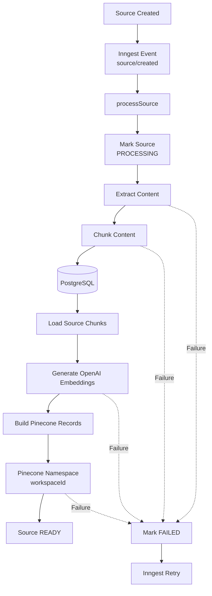
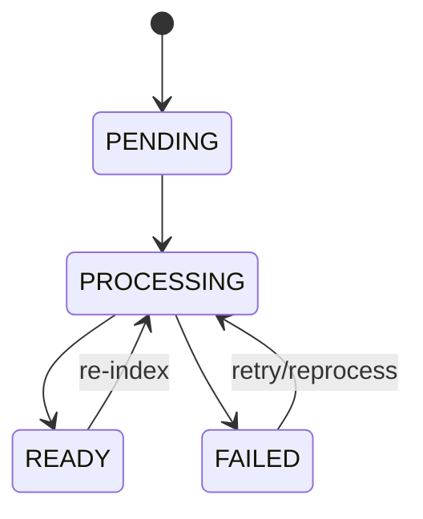
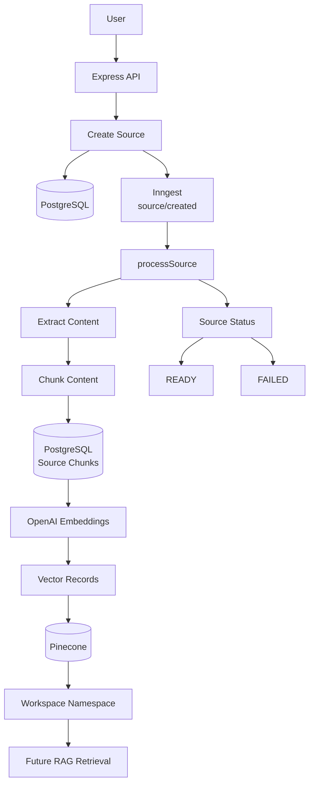

# 🚀 Server Chapter 7 — Inngest Indexing & Pinecone Vector Pipeline

## 1. Goal & Outcome

### 🎯 Goal

Build an **event-driven background indexing pipeline** that transforms previously extracted source content into searchable vector embeddings.

The pipeline connects:

* **Inngest** → background job orchestration and durable execution
* **PostgreSQL + Prisma** → source and chunk persistence
* **OpenAI Embeddings** → convert text chunks into numerical vectors
* **Pinecone** → vector storage and similarity search
* **Source-processing service** → coordinates extraction → chunking → embedding → indexing

### 🎓 Student Outcome

After completing this chapter, you should understand how to build a production-style RAG indexing workflow:

```text
Source Created
     ↓
Inngest Event
     ↓
Background Function
     ↓
Extract Content
     ↓
Chunk Content
     ↓
Save Chunks in PostgreSQL
     ↓
Generate Embeddings
     ↓
Upsert Vectors into Pinecone
     ↓
Source = READY
```

If any processing step fails:

```text
Processing Error
      ↓
Mark Source = FAILED
      ↓
Store Error Metadata
      ↓
Throw Error
      ↓
Inngest Retry
```

The important architectural idea is that **heavy indexing work does not need to block the original source-creation request**.

---

# 2. Server Installation

From:

```bash
cd week05/chaibook-llm-sir/server
```

Install the required packages:

```bash
npm install inngest openai @pinecone-database/pinecone
```

### Dependencies

| Package                       | Responsibility                                      |
| ----------------------------- | --------------------------------------------------- |
| `inngest`                     | Event-driven background functions and durable steps |
| `openai`                      | Generate text embeddings                            |
| `@pinecone-database/pinecone` | Store and query vectors                             |

This chapter builds on the ingestion and chunking utilities from **Chapter 6**.

---

# 3. Overall Architecture

The indexing architecture can be represented as:



### Three Major Layers

```text
Inngest
   ↓
Orchestration Layer

Source Processing Service
   ↓
Business Logic Layer

OpenAI + Pinecone + Prisma
   ↓
Infrastructure / Data Layer
```

This separation keeps the background worker relatively thin while placing the actual indexing logic inside reusable service and library modules.

---

# 4. Inngest Client

## File

```text
server/src/inngest/client.ts
```

```typescript
import { Inngest } from "inngest";

export const inngest = new Inngest({ id: "chaibook" });

export type SourceCreatedEvent = {
    name: "source/created";
    data: {
        sourceId: string;
        workspaceId: string;
    };
};

export type InngestEvents = SourceCreatedEvent;
```

---

## 4.1 Architectural Role

This module creates the application's **Inngest client** and defines the TypeScript shape of the `source/created` event.

It is intentionally small because it should primarily provide:

1. A reusable Inngest client.
2. Event type definitions.
3. A stable event contract between the API and background functions.

---

## 4.2 Inngest Client

```typescript
export const inngest = new Inngest({
    id: "chaibook",
});
```

This creates the Inngest client used throughout the server.

The identifier:

```text
chaibook
```

acts as the application identifier for this Inngest integration.

Other modules can import the same instance:

```typescript
import { inngest } from "./client.js";
```

---

## 4.3 `SourceCreatedEvent`

```typescript
export type SourceCreatedEvent = {
    name: "source/created";
    data: {
        sourceId: string;
        workspaceId: string;
    };
};
```

This describes the expected structure of the event.

The event name is:

```text
source/created
```

and its payload contains:

```text
sourceId
workspaceId
```

### Why send IDs instead of the actual content?

Instead of putting an entire PDF, transcript, or document inside the event:

```text
❌ source/created
   └── entire document content
```

the system sends only identifiers:

```text
✅ source/created
   ├── sourceId
   └── workspaceId
```

The worker can then retrieve the authoritative source record from PostgreSQL.

This keeps the event small and reduces coupling between the API and worker.

---

## 4.4 `InngestEvents`

```typescript
export type InngestEvents = SourceCreatedEvent;
```

This creates a central event type that can later be expanded:

```typescript
export type InngestEvents =
    | SourceCreatedEvent
    | ArtifactGenerateEvent
    | ConversationSummarizeEvent;
```

The current implementation contains only the source-created event.

---

# 5. Inngest Functions

## File

```text
server/src/inngest/index.ts
```

This module defines the background functions that respond to application events.

It currently contains three functions:

```text
processSource
generateArtifact
summarizeConversation
```

---

# 6. `processSource` — Main RAG Indexing Worker

The most important function in this chapter is:

```typescript
export const processSource = inngest.createFunction(
```

Its responsibility is:

```text
source/created
      ↓
extract
      ↓
chunk
      ↓
embed
      ↓
Pinecone
      ↓
READY
```

---

## 6.1 Function Configuration

```typescript
{
    id: "process-source",
    retries: 3,
    triggers: [{ event: "source/created" }],
}
```

### `id`

```text
process-source
```

Uniquely identifies this background function.

### `retries`

```text
3
```

The function is configured to retry when execution fails.

This is important because external services such as:

* OpenAI
* Pinecone
* Cloudinary
* PostgreSQL

can temporarily fail.

### `triggers`

```typescript
triggers: [{ event: "source/created" }]
```

This tells Inngest:

> Execute this function whenever the `source/created` event is received.

---

# 7. Extracting the Event Payload

```typescript
const { sourceId } = event.data;
```

The worker extracts the source identifier from the event.

The source record remains in PostgreSQL, while the event carries the identifier required to locate it.

Conceptually:

```text
event
 └── data
      ├── sourceId
      └── workspaceId
```

The current worker uses `sourceId` directly because the processing service can retrieve the complete source record from the database.

---

# 8. Mark Source as `PROCESSING`

```typescript
await step.run(
    "mark-processing",
    () => markSourceProcessing(sourceId),
);
```

Before expensive work begins, the source status changes to:

```text
PROCESSING
```

This allows the application to expose meaningful processing state:

```text
PENDING
   ↓
PROCESSING
   ↓
READY
```

or:

```text
PROCESSING
   ↓
FAILED
```

### Why use `step.run()`?

The operation is wrapped inside an Inngest step so the workflow can treat it as a distinct durable unit of work.

The step name:

```text
mark-processing
```

also makes the workflow easier to inspect and reason about.

---

# 9. Step 1 — Extract Content

```typescript
const extracted = await step.run(
    "extract-content",
    () => extractSourceContent(sourceId),
);
```

This delegates extraction to the source-processing service.

The service determines where the content comes from.

For example:

```text
PDF
 ↓
Cloudinary
 ↓
PDF extraction
```

or:

```text
Website
 ↓
Previously stored markdown
```

or:

```text
YouTube
 ↓
Transcript
```

The result contains:

```typescript
{
    sourceId,
    workspaceId,
    text,
    pages,
    source
}
```

For PDFs, `pages` can preserve page-level information.

---

# 10. Step 2 — Chunk Content

```typescript
await step.run(
    "chunk-content",
    () =>
        chunkSourceContent(
            sourceId,
            extracted.text,
            extracted.pages,
        ),
);
```

The extracted text is passed into the chunking stage.

The service:

1. Deletes existing chunks.
2. Splits the content.
3. Preserves PDF page metadata where available.
4. Estimates token count.
5. Saves chunks to PostgreSQL.

The result is conceptually:

```text
Document
   ↓
Chunk 0
Chunk 1
Chunk 2
Chunk 3
...
```

These chunks become the units that will later be embedded.

---

# 11. Step 3 — Embed & Index

```typescript
const result = await step.run(
    "embed-and-index",
    async () => {
        const source = await findSourceById(sourceId);

        if (!source) {
            throw new Error("Source not found");
        }

        const chunks = await findChunksBySourceId(sourceId);

        await embedAndIndexSource(source, chunks);

        return {
            chunkCount: chunks.length,
        };
    },
);
```

This step performs the vector indexing stage.

### First: reload the source

```typescript
const source = await findSourceById(sourceId);
```

The worker obtains the current database record.

### Second: verify it exists

```typescript
if (!source) {
    throw new Error("Source not found");
}
```

Without the source record, there is no reliable workspace, title, source type, or metadata for building vector records.

### Third: load persisted chunks

```typescript
const chunks = await findChunksBySourceId(sourceId);
```

The worker reads the chunks created during the previous step.

### Fourth: embed and index

```typescript
await embedAndIndexSource(source, chunks);
```

This service:

```text
Chunks
  ↓
OpenAI Embeddings
  ↓
Pinecone Records
  ↓
Pinecone Upsert
  ↓
Source READY
```

---

# 12. Successful Processing

After indexing succeeds:

```typescript
return {
    sourceId,
    status: "READY",
    ...result,
};
```

Example:

```json
{
    "sourceId": "source_123",
    "status": "READY",
    "chunkCount": 42
}
```

The important state transition is:

```text
PROCESSING → READY
```

---

# 13. Failure Handling

The entire source pipeline is wrapped in:

```typescript
try {
    ...
} catch (error) {
    ...
    throw error;
}
```

If extraction, chunking, embedding, or Pinecone indexing fails:

```typescript
await step.run(
    "mark-failed",
    async () => {
        const source = await findSourceById(sourceId);

        if (source) {
            await markSourceFailed(
                sourceId,
                error,
                source.metadata,
            );
        }
    },
);
```

The source is updated to:

```text
FAILED
```

and the error message is stored in metadata.

Finally:

```typescript
throw error;
```

re-throws the original error so the Inngest function execution is still considered failed and its configured retry behavior can apply.

### Important distinction

`mark-failed` records the failure.

It does **not** mean the workflow should be considered successful.

That is why the original error is re-thrown afterward.

---

# 14. Artifact Generation Function

```typescript
export const generateArtifact = inngest.createFunction(
    {
        id: "generate-artifact",
        retries: 2,
        triggers: [{ event: "artifact/generate" }],
    },
    async ({ event, step }) => {
        const { artifactId } = event.data;

        await step.run(
            "generate",
            () => processArtifactById(artifactId),
        );

        return {
            artifactId,
            status: "READY",
        };
    },
);
```

This is another independent background workflow.

Its flow is:

```text
artifact/generate
       ↓
generate-artifact
       ↓
processArtifactById()
       ↓
READY
```

It has:

```text
2 retries
```

and its own event trigger.

The important architectural point is that artifact generation is separated from source indexing rather than being placed inside the source worker.

---

# 15. Conversation Summarization Function

```typescript
export const summarizeConversation =
    inngest.createFunction(
        {
            id: "summarize-conversation",
            retries: 2,
            triggers: [
                { event: "conversation/summarize" },
            ],
        },
        async ({ event, step }) => {
            const { conversationId, userId } =
                event.data;

            await step.run(
                "summarize",
                () =>
                    summarizeConversationById(
                        conversationId,
                        userId,
                    ),
            );

            return {
                conversationId,
                status: "SUMMARIZED",
            };
        },
    );
```

This creates a separate background workflow for conversation memory summarization.

Flow:

```text
conversation/summarize
          ↓
summarize-conversation
          ↓
summarizeConversationById()
          ↓
SUMMARIZED
```

This keeps conversation-memory work independent from RAG source indexing.

---

# 16. Exporting All Functions

```typescript
export const functions = [
    processSource,
    generateArtifact,
    summarizeConversation,
];
```

This creates a single collection containing all registered Inngest functions.

The application's Inngest endpoint can use this collection when exposing the functions to the Inngest runtime.

---

# 17. Source Chunk Repository

## File

```text
server/src/repositories/source-chunk.repository.ts
```

This repository provides the database access layer for `SourceChunk` records.

Its responsibilities are intentionally limited to:

```text
Create chunks
Delete chunks
Read chunks
```

It does not perform:

* embedding generation
* Pinecone operations
* business workflow orchestration

That separation keeps database access isolated from business logic.

---

# 18. Selecting Chunk Fields

```typescript
export const sourceChunkSelect = {
    id: true,
    sourceId: true,
    index: true,
    content: true,
    tokenCount: true,
    metadata: true,
    createdAt: true,
} as const;
```

This defines the exact fields returned from Prisma queries.

The selected fields include:

| Field        | Purpose                 |
| ------------ | ----------------------- |
| `id`         | Unique chunk identifier |
| `sourceId`   | Parent source           |
| `index`      | Chunk ordering          |
| `content`    | Text used for embedding |
| `tokenCount` | Estimated token count   |
| `metadata`   | Page/source metadata    |
| `createdAt`  | Persistence timestamp   |

Using a shared select object also keeps returned records consistent across repository functions.

---

# 19. Prisma-Derived Chunk Type

```typescript
export type SourceChunkRecord =
    Prisma.SourceChunkGetPayload<{
        select: typeof sourceChunkSelect;
    }>;
```

Instead of manually duplicating the database model in TypeScript, Prisma derives the type from the selected fields.

This means if the selection changes, TypeScript can reflect that change.

---

# 20. Creating Chunk Data

```typescript
export type CreateSourceChunkData = {
    sourceId: string;
    index: number;
    content: string;
    tokenCount?: number | null;
    metadata?: Prisma.InputJsonValue;
};
```

This represents the data required to create a chunk.

Notice that `id` is not required because the database can generate it.

---

# 21. Deleting Existing Chunks

```typescript
export function deleteChunksBySourceId(
    sourceId: string,
) {
    return prisma.sourceChunk.deleteMany({
        where: { sourceId },
    });
}
```

This removes all chunks associated with a source.

It is especially useful during re-processing:

```text
Old chunks
    ↓
DELETE
    ↓
Generate new chunks
    ↓
SAVE new chunks
```

This prevents stale chunk records from remaining in PostgreSQL.

---

# 22. Creating Chunks Transactionally

```typescript
export function createSourceChunks(
    chunks: CreateSourceChunkData[],
) {
    if (chunks.length === 0) {
        return Promise.resolve([]);
    }

    return prisma.$transaction(
        chunks.map((chunk) =>
            prisma.sourceChunk.create({
                data: {
                    sourceId: chunk.sourceId,
                    index: chunk.index,
                    content: chunk.content,
                    tokenCount:
                        chunk.tokenCount ?? null,
                    metadata: chunk.metadata,
                },
                select: sourceChunkSelect,
            }),
        ),
    );
}
```

### Empty input

```typescript
if (chunks.length === 0) {
    return Promise.resolve([]);
}
```

Avoids creating an unnecessary database transaction when there is nothing to insert.

### Transaction

```typescript
prisma.$transaction(...)
```

groups the chunk creation operations into one transaction.

The intention is:

```text
Create Chunk 1
Create Chunk 2
Create Chunk 3
...
       ↓
Transaction
```

If the transaction fails, the database can roll back the transaction rather than leaving a partially created batch.

---

# 23. Reading Chunks

```typescript
export function findChunksBySourceId(
    sourceId: string,
) {
    return prisma.sourceChunk.findMany({
        where: { sourceId },
        select: sourceChunkSelect,
        orderBy: { index: "asc" },
    });
}
```

The chunks are returned in their original document order.

That is important because:

```text
Chunk 0
Chunk 1
Chunk 2
...
```

must remain ordered when debugging, reconstructing content, or displaying source context.

---

# 24. Source Processing Service

## File

```text
server/src/services/source-processing.service.ts
```

This is the **central business-logic layer** of the indexing pipeline.

Its responsibilities include:

```text
Source retrieval
      ↓
Content extraction
      ↓
Chunk creation
      ↓
Embedding generation
      ↓
Pinecone indexing
      ↓
Source status management
```

The Inngest function orchestrates the workflow, while this service contains the actual domain operations.

---

# 25. Service Dependencies

The service connects several components:

```text
chunking.ts
     ↓
Text chunking

openai.ts
     ↓
Embedding generation

pdf.ts
     ↓
PDF extraction

pinecone.ts
     ↓
Vector storage

source-chunk.repository.ts
     ↓
Chunk persistence

source.repository.ts
     ↓
Source persistence
```

This is a good example of **separation of concerns**.

---

# 26. `SourceMetadata`

```typescript
type SourceMetadata = {
    fileUrl?: string;
    fileName?: string;
    fileSize?: number;
    publicId?: string;
    resourceType?: "raw" | "image";
    importedFrom?: string;
    videoId?: string;
    processingError?: string;
    chunkCount?: number;
    pageCount?: number;
    indexedAt?: string;
};
```

The source metadata object stores additional information that does not necessarily belong in dedicated relational columns.

Examples:

```text
PDF
 ├── fileUrl
 ├── fileName
 ├── fileSize
 ├── publicId
 └── pageCount

YouTube
 └── videoId

Processing
 ├── processingError
 ├── chunkCount
 └── indexedAt
```

---

# 27. Extracting Source Text

The private helper:

```typescript
async function extractSourceText(
    source: SourceRecord,
)
```

supports two major paths.

### Path 1 — Content already exists

```typescript
const text = source.content?.trim();

if (text) {
    return {
        text,
        pageCount: undefined,
        pages: undefined,
    };
}
```

For sources where content has already been extracted, the service reuses it.

Examples:

```text
Website markdown
YouTube transcript
Plain text source
```

This avoids unnecessary extraction.

---

# 28. PDF Extraction Path

If there is no existing content and:

```typescript
source.type === "PDF"
```

the service reads PDF metadata.

It requires:

```text
fileUrl
```

and optionally:

```text
publicId
resourceType
```

Then:

```typescript
const extracted =
    await extractPdfFromCloudinary({
        fileUrl: metadata.fileUrl,
        publicId: metadata.publicId,
        resourceType:
            metadata.resourceType ?? "image",
    });
```

The PDF utility downloads the file and extracts:

```text
full text
page text
page count
```

---

# 29. Extracted Content Persistence

## `extractSourceContent()`

```typescript
export async function extractSourceContent(
    sourceId: string,
)
```

This function:

1. Loads the source.
2. Extracts content.
3. Saves the extracted text to `source.content`.
4. Updates page metadata.
5. Returns the extracted content to the next pipeline step.

Conceptually:

```text
PostgreSQL Source
       ↓
Extraction
       ↓
source.content
       ↓
Next Inngest Step
```

Persisting the extracted text also means later operations do not always need to repeat the external extraction process.

---

# 30. Marking a Source as Processing

```typescript
export function markSourceProcessing(
    sourceId: string,
) {
    return updateSourceRecord(
        sourceId,
        {
            status: "PROCESSING",
        },
    );
}
```

This is intentionally a thin service wrapper around the repository.

The state becomes:

```text
PENDING → PROCESSING
```

---

# 31. Marking a Source as Failed

```typescript
export async function markSourceFailed(
    sourceId: string,
    error: unknown,
    existingMetadata: SourceRecord["metadata"],
)
```

The function converts an unknown thrown value into a safe error message:

```typescript
const message =
    error instanceof Error
        ? error.message
        : "Source processing failed";
```

Then it preserves existing metadata:

```typescript
{
    ...metadata,
    processingError: message,
}
```

and changes the status:

```text
FAILED
```

This is useful for debugging and displaying processing failures in the application.

---

# 32. Step 1 — `extractSourceContent`

The first pipeline operation is:

```text
Source ID
   ↓
Find source
   ↓
Extract text
   ↓
Persist content
   ↓
Return extracted data
```

If the source does not exist:

```typescript
throw new Error("Source not found");
```

For PDFs, the resulting metadata can also contain:

```text
pageCount
```

The returned object contains:

```typescript
{
    sourceId,
    workspaceId,
    text,
    pages,
    source
}
```

This becomes the input for chunking.

---

# 33. Step 2 — `chunkSourceContent`

```typescript
export async function chunkSourceContent(
    sourceId: string,
    text: string,
    pages?: string[],
)
```

The function first removes old chunks:

```typescript
await deleteChunksBySourceId(sourceId);
```

This is important for re-indexing.

Then it chooses the appropriate chunking strategy:

```typescript
const chunks = pages?.length
    ? chunkPages(pages)
    : chunkText(text);
```

### PDF

```text
pages available
    ↓
chunkPages()
    ↓
page metadata preserved
```

### Other source

```text
full text
    ↓
chunkText()
```

---

# 34. Estimated Token Count

Each chunk receives:

```typescript
Math.ceil(
    chunk.content.length / 4,
)
```

This provides a rough token estimate.

For example:

```text
400 characters
      ↓
≈ 100 estimated tokens
```

This is only a heuristic.

It should not be treated as an exact tokenizer measurement because actual token counts depend on the tokenizer and the text itself.

The value is useful for:

* monitoring
* debugging
* approximate usage calculations
* metadata

---

# 35. Persisting Chunks

Each chunk is transformed into:

```typescript
{
    sourceId,
    index: chunk.index,
    content: chunk.content,
    tokenCount: ...,
    metadata: ...
}
```

and saved through:

```typescript
createSourceChunks(...)
```

The resulting database records become the canonical chunk representation used during embedding.

---

# 36. Step 3 — Embedding and Pinecone Indexing

The final major operation is:

```typescript
embedAndIndexSource(
    source,
    chunks,
)
```

The pipeline is:

```text
PostgreSQL chunks
       ↓
Batch 50
       ↓
OpenAI Embeddings
       ↓
Pinecone Records
       ↓
Batch 100
       ↓
Pinecone
```

There are two different batch sizes:

```text
OpenAI embedding batch = 50
Pinecone upsert batch  = 100
```

These limits are controlled independently.

---

# 37. Embedding Chunks

```typescript
const batchSize = 50;

for (
    let i = 0;
    i < chunks.length;
    i += batchSize
) {
    const batch = chunks.slice(
        i,
        i + batchSize,
    );

    const embeddings = await embedTexts(
        batch.map((chunk) => chunk.content),
    );
}
```

Instead of embedding every chunk individually:

```text
❌ Chunk 1 → API
❌ Chunk 2 → API
❌ Chunk 3 → API
```

the system sends batches:

```text
Chunk 1
Chunk 2
...
Chunk 50
     ↓
OpenAI Embeddings API
```

This reduces unnecessary request overhead.

---

# 38. Mapping Embeddings Back to Chunks

For every chunk:

```typescript
const chunk = batch[j]!;
const embedding = embeddings[j]!;
```

the generated embedding is paired with the original chunk.

Conceptually:

```text
Chunk A → Embedding A
Chunk B → Embedding B
Chunk C → Embedding C
```

The embedding order returned by `embedTexts()` is aligned with the input ordering after sorting by the API response index.

---

# 39. Pinecone Vector Record

Each chunk becomes a Pinecone record:

```typescript
{
    id: chunk.id,
    values: embedding,
    metadata: {
        workspaceId,
        sourceId,
        chunkId,
        chunkIndex,
        sourceTitle,
        sourceType,
        text,
        page,
    },
}
```

This produces the fundamental RAG mapping:

```text
PostgreSQL Chunk
      ↓
chunk.id
      ↓
Pinecone Vector ID
```

The same chunk can therefore be traced across both storage systems.

---

# 40. Why Store Metadata in Pinecone?

The vector contains the semantic representation, but metadata provides context.

Stored metadata includes:

```text
workspaceId
sourceId
chunkId
chunkIndex
sourceTitle
sourceType
text
page
```

This means a retrieval result can contain enough information to build an answer citation without immediately querying PostgreSQL again.

For example:

```text
Similarity Search
      ↓
Pinecone Match
      ↓
sourceTitle
chunkIndex
page
text
```

---

# 41. Text Metadata Truncation

```typescript
text: chunk.content.slice(0, 35000)
```

The complete chunk remains in PostgreSQL.

Pinecone receives only the first 35,000 characters as metadata.

This prevents excessively large metadata values from being stored in the vector record.

The database therefore has different responsibilities:

```text
PostgreSQL
→ canonical complete chunk data

Pinecone
→ vector + retrieval-oriented metadata
```

---

# 42. Updating Source to `READY`

After all vectors have been successfully upserted:

```typescript
return updateSourceRecord(
    source.id,
    {
        status: "READY",
        metadata: {
            ...metadata,
            chunkCount: chunks.length,
            indexedAt:
                new Date().toISOString(),
            processingError: undefined,
        },
    },
);
```

The source state becomes:

```text
PROCESSING
     ↓
READY
```

Metadata records:

```text
chunkCount
indexedAt
```

and the previous processing error is cleared.

---

# 43. Source Removal

```typescript
export async function removeSourceFromIndex(
    workspaceId: string,
    sourceId: string,
)
```

This performs cleanup in two systems:

```text
Pinecone
   ↓
Delete source vectors

PostgreSQL
   ↓
Delete source chunks
```

The order is:

```typescript
await deleteSourceVectors(
    workspaceId,
    sourceId,
);

await deleteChunksBySourceId(
    sourceId,
);
```

This is required when:

* deleting a source
* rebuilding an index
* replacing source content

---

# 44. Listing Source Chunks

```typescript
export async function listChunksForSource(
    sourceId: string,
) {
    const chunks =
        await findChunksBySourceId(sourceId);

    return {
        chunks,
        count: chunks.length,
    };
}
```

This helper is useful for:

* debugging
* admin interfaces
* verification
* development tooling

It returns both:

```text
chunks
count
```

---

# 45. OpenAI Embedding Client

## File

```text
server/src/lib/openai.ts
```

This module provides the OpenAI client used specifically for embeddings.

The architecture intentionally separates:

```text
OpenAI SDK
→ embeddings

AI SDK
→ chat generation
```

This allows different libraries to be used for different LLM responsibilities.

---

# 46. Lazy OpenAI Client Initialization

```typescript
let client: OpenAI | null = null;
```

The client is initially empty.

Later:

```typescript
if (!client) {
    client = new OpenAI({
        apiKey: process.env.OPENAI_API_KEY,
    });
}
```

This creates the client only when it is first required.

After initialization, subsequent calls reuse the same client instance within that server process.

Conceptually:

```text
First request
    ↓
Create OpenAI client
    ↓
Cache client

Later requests
    ↓
Reuse client
```

---

# 47. `embedTexts()`

```typescript
export async function embedTexts(
    texts: string[],
): Promise<number[][]>
```

The function accepts multiple strings and returns one vector per input string.

Example:

```text
[
    "Chunk A",
    "Chunk B",
    "Chunk C"
]
```

becomes:

```text
[
    [0.12, ...],
    [0.08, ...],
    [0.31, ...]
]
```

---

# 48. Empty Input Optimization

```typescript
if (texts.length === 0) {
    return [];
}
```

There is no reason to call the OpenAI API when there are no texts.

This is a small but useful defensive optimization.

---

# 49. API Key Validation

```typescript
if (!process.env.OPENAI_API_KEY) {
    throw new Error(
        "OPENAI_API_KEY is not configured",
    );
}
```

The function refuses to create an embedding request without the required API key.

---

# 50. Creating the Embedding Request

```typescript
const response =
    await client.embeddings.create({
        model: EMBEDDING_MODEL,
        input: texts,
        dimensions: EMBEDDING_DIMENSIONS,
    });
```

The embedding configuration comes from:

```text
ai-config.ts
```

This centralizes important vector configuration.

The three important values are:

```text
EMBEDDING_MODEL
EMBEDDING_DIMENSIONS
input
```

---

# 51. Preserving Embedding Order

```typescript
return response.data
    .sort(
        (a, b) => a.index - b.index,
    )
    .map(
        (item) => item.embedding,
    );
```

The API response is explicitly sorted using the returned `index`.

This ensures:

```text
texts[0] → embedding[0]
texts[1] → embedding[1]
texts[2] → embedding[2]
```

That mapping is critical because each embedding must be assigned to the correct chunk.

---

# 52. Pinecone Integration

## File

```text
server/src/lib/pinecone.ts
```

This module isolates Pinecone-specific operations from the rest of the application.

Its responsibilities include:

```text
Create Pinecone client
      ↓
Ensure index exists
      ↓
Wait for index readiness
      ↓
Return index handle
      ↓
Upsert vectors
      ↓
Delete vectors
      ↓
Query vectors
```

---

# 53. Pinecone Client Singleton

```typescript
let pineconeClient: Pinecone | null = null;
```

The client is cached so the application can reuse the same instance.

```typescript
if (!pineconeClient) {
    pineconeClient = new Pinecone({
        apiKey: process.env.PINECONE_API_KEY,
    });
}
```

This avoids repeatedly constructing the SDK client during the lifetime of the server process.

---

# 54. Pinecone API Key Validation

```typescript
if (!process.env.PINECONE_API_KEY) {
    throw new Error(
        "PINECONE_API_KEY is not configured",
    );
}
```

Without the API key, the client cannot communicate with Pinecone.

---

# 55. Pinecone Index Configuration

```typescript
const indexName =
    process.env.PINECONE_INDEX ?? "chaibook";
```

The index name is configurable through the environment.

If no environment value exists, the current implementation falls back to:

```text
chaibook
```

For production deployments, explicit environment configuration is generally preferable to relying on defaults.

---

# 56. Waiting for Index Readiness

```typescript
async function waitForIndexReady(
    name: string,
)
```

When an index is newly created, it may not immediately be ready for operations.

The function polls:

```typescript
const description =
    await client.describeIndex(name);
```

and checks:

```typescript
description.status?.ready
```

If the index is not ready:

```text
wait 2 seconds
     ↓
check again
```

The implementation performs up to:

```text
30 attempts
```

with a 2-second delay.

That gives approximately:

```text
30 × 2 seconds ≈ 60 seconds
```

of waiting.

---

# 57. Ensuring the Pinecone Index Exists

```typescript
export async function ensurePineconeIndex()
```

The function first checks:

```typescript
if (indexReady) {
    return;
}
```

This prevents repeated initialization within the same process after the index has already been confirmed.

Then:

```typescript
const indexes =
    await client.listIndexes();
```

The code checks whether the configured index exists.

If not:

```typescript
await client.createIndex({
    name: indexName,
    dimension: EMBEDDING_DIMENSIONS,
    metric: "cosine",
    spec: {
        serverless: {
            cloud: "aws",
            region: "us-east-1",
        },
    },
});
```

---

# 58. Embedding Dimension Must Match Pinecone

One of the most important RAG configuration rules is:

```text
Embedding dimension
        =
Pinecone index dimension
```

The implementation uses:

```typescript
dimension: EMBEDDING_DIMENSIONS
```

This is important because Pinecone vectors must have the expected dimensionality.

Conceptually:

```text
Embedding model
      ↓
1536-dimensional vector
      ↓
Pinecone index
dimension = 1536
```

The exact dimension should come from the configured embedding model rather than being assumed independently.

---

# 59. Cosine Similarity

The index is configured with:

```typescript
metric: "cosine"
```

Cosine similarity measures how closely two vectors point in the same direction.

For semantic search:

```text
User Query
    ↓
Query Embedding
    ↓
Compare against document embeddings
    ↓
Highest semantic similarity
```

This is the core operation behind vector retrieval.

---

# 60. Getting the Pinecone Index

```typescript
export async function getPineconeIndex():
    Promise<Index>
```

The function first guarantees that the index exists:

```typescript
await ensurePineconeIndex();
```

Then returns the configured index handle:

```typescript
return getPineconeClient().index({
    name: indexName,
});
```

This creates a clean abstraction for the rest of the application.

Other services do not need to know how the Pinecone client is initialized.

---

# 61. Vector Metadata Type

```typescript
export type VectorMetadata = {
    workspaceId: string;
    sourceId: string;
    chunkId: string;
    chunkIndex: number;
    sourceTitle: string;
    sourceType: string;
    text: string;
    page?: number;
};
```

This defines the metadata attached to each vector.

The relationship is:

```text
Vector
 ├── ID
 ├── values
 └── metadata
      ├── workspaceId
      ├── sourceId
      ├── chunkId
      ├── chunkIndex
      ├── sourceTitle
      ├── sourceType
      ├── text
      └── page
```

---

# 62. Workspace Namespaces

The indexing code uses:

```typescript
const namespace =
    index.namespace(workspaceId);
```

This means each workspace gets its own Pinecone namespace.

Conceptually:

```text
Pinecone Index
│
├── workspace-A
│    ├── vector-1
│    ├── vector-2
│    └── vector-3
│
├── workspace-B
│    ├── vector-4
│    └── vector-5
│
└── workspace-C
     ├── vector-6
     └── vector-7
```

This provides logical tenant isolation at the vector-storage layer.

The application can search only the namespace associated with the current workspace.

---

# 63. Upserting Vectors

```typescript
export async function upsertSourceVectors(
    workspaceId: string,
    records: PineconeRecord<VectorMetadata>[],
)
```

If there are no records:

```typescript
if (records.length === 0) {
    return;
}
```

Otherwise:

```typescript
const index =
    await getPineconeIndex();

const namespace =
    index.namespace(workspaceId);
```

The vectors are written into the workspace namespace.

---

# 64. Pinecone Batch Upserts

The implementation uses:

```typescript
const batchSize = 100;
```

and processes:

```typescript
records.slice(
    i,
    i + batchSize,
)
```

This produces:

```text
Records
   ↓
Batch 1: 100
Batch 2: 100
Batch 3: 100
...
```

Each batch is sent sequentially:

```typescript
await namespace.upsert({
    records: ...
});
```

This keeps the request size bounded.

---

# 65. Deleting Source Vectors

```typescript
export async function deleteSourceVectors(
    workspaceId: string,
    sourceId: string,
)
```

The implementation deletes vectors using metadata filtering:

```typescript
filter: {
    sourceId: {
        $eq: sourceId,
    },
}
```

Because the search occurs inside:

```typescript
namespace(workspaceId)
```

the operation is scoped to one workspace.

Conceptually:

```text
workspace namespace
       ↓
filter sourceId
       ↓
delete matching vectors
```

---

# 66. Deleting an Entire Workspace Namespace

```typescript
export async function deleteWorkspaceVectors(
    workspaceId: string,
)
```

This removes all vectors from that workspace namespace:

```typescript
await index
    .namespace(workspaceId)
    .deleteAll();
```

This is appropriate when the entire workspace is being removed.

It is much broader than deleting a single source.

---

# 67. Querying Workspace Vectors

```typescript
export async function queryWorkspaceVectors(
    workspaceId: string,
    vector: number[],
    topK: number,
)
```

The query uses:

```typescript
index
    .namespace(workspaceId)
    .query({
        vector,
        topK,
        includeMetadata: true,
    });
```

The flow is:

```text
User Query
    ↓
Query Embedding
    ↓
Pinecone Namespace
    ↓
Similarity Search
    ↓
Top K Matches
```

The returned metadata allows the application to identify the source and chunk associated with each match.

---

# 68. End-to-End Indexing Flow

The complete pipeline built in this chapter is:


---

# 69. Data Flow Across Storage Systems

A source exists in multiple representations during indexing.

### PostgreSQL

Stores the application-level source:

```text
Source
 ├── id
 ├── workspaceId
 ├── title
 ├── type
 ├── content
 ├── status
 └── metadata
```

And its chunks:

```text
SourceChunk
 ├── id
 ├── sourceId
 ├── index
 ├── content
 ├── tokenCount
 └── metadata
```

### OpenAI

Transforms:

```text
Chunk text
   ↓
Embedding vector
```

### Pinecone

Stores:

```text
Vector
 ├── id = chunk.id
 ├── values = embedding
 └── metadata = retrieval context
```

The resulting architecture is:

```text
PostgreSQL
   │
   │ source + chunks
   ↓
OpenAI
   │
   │ embeddings
   ↓
Pinecone
   │
   │ similarity search
   ↓
RAG Retrieval
```

---

# 70. Why PostgreSQL and Pinecone Both Exist

The two systems have different responsibilities.

| System     | Responsibility                        |
| ---------- | ------------------------------------- |
| PostgreSQL | Source of truth for application data  |
| PostgreSQL | Complete chunk content                |
| PostgreSQL | Source status and processing metadata |
| Pinecone   | Vector similarity search              |
| Pinecone   | Embedding vectors                     |
| Pinecone   | Retrieval-oriented metadata           |

Therefore, Pinecone should not replace PostgreSQL.

Instead:

```text
PostgreSQL = authoritative application database

Pinecone = specialized vector search index
```

---

# 71. Processing State Machine

The source status can be understood as:



This gives the application a clear way to communicate processing progress.

For example:

```text
Uploading...
Processing...
Indexed successfully
```

or:

```text
Processing failed
```

---

# 72. Retry Architecture

The `processSource` function specifies:

```typescript
retries: 3
```

This means transient failures can be retried.

A typical failure scenario:

```text
Source
  ↓
PROCESSING
  ↓
OpenAI request fails
  ↓
Function fails
  ↓
Retry
  ↓
OpenAI succeeds
  ↓
Pinecone
  ↓
READY
```

However, retries do not automatically make every operation idempotent.

The application should still design processing steps so repeated execution does not produce inconsistent state or duplicate data.

The current implementation helps with this by:

```text
delete existing chunks
        ↓
recreate chunks
        ↓
upsert vectors using stable chunk IDs
```

---

# 73. Important Production Considerations

## 73.1 Idempotency

Background jobs can be retried.

Therefore, this:

```text
source/created
```

should be safe to process more than once.

The use of stable:

```text
chunk.id
```

as the Pinecone vector ID is useful because Pinecone upsert semantics can overwrite the same vector rather than creating a new random vector every time.

---

## 73.2 Database and Vector Index Consistency

PostgreSQL and Pinecone are separate systems.

There is no single transaction covering:

```text
PostgreSQL
+
OpenAI
+
Pinecone
```

Therefore, partial failure is possible.

Example:

```text
PostgreSQL chunks saved
        ↓
OpenAI embeddings succeed
        ↓
Pinecone fails
```

At this point:

```text
PostgreSQL = updated
Pinecone = incomplete
```

The retry/re-index strategy is therefore important.

---

## 73.3 External Service Failures

The pipeline depends on several external systems:

```text
Cloudinary
OpenAI
Pinecone
Inngest
PostgreSQL
```

Any of them can fail independently.

The architecture should therefore provide:

* retries
* useful error messages
* processing status
* logging
* idempotent reprocessing

---

## 73.4 Embedding Dimension Consistency

The same embedding configuration must be used for:

```text
Indexing
+
Query embedding
```

For example:

```text
Document chunk
   ↓
Embedding model
   ↓
1536 dimensions
```

and later:

```text
User query
   ↓
Same embedding model
   ↓
1536 dimensions
```

The query vector and stored vectors must be compatible.

---

## 73.5 Chunking Strategy

The current implementation uses character-based chunking.

Therefore:

```text
chunkSize
```

is not necessarily equivalent to a precise token count.

For more advanced RAG systems, token-aware chunking can provide more predictable context sizes.

The current:

```typescript
Math.ceil(content.length / 4)
```

should also be treated as an estimate rather than an exact tokenizer result.

---

## 73.6 Metadata Size

The Pinecone record stores:

```typescript
text: chunk.content.slice(0, 35000)
```

while PostgreSQL retains the complete chunk.

This is a deliberate separation:

```text
PostgreSQL
→ complete content

Pinecone
→ retrieval-oriented content
```

---

# 74. Complete Chapter Architecture

The architecture developed through Chapters 6 and 7 now looks like:



---

# 75. Final Mental Model

The most important concept from this chapter is not a particular SDK call.

It is the **separation of responsibilities**:

```text
Inngest
→ When should the job run?

Source Processing Service
→ What should happen?

PostgreSQL Repository
→ Where is application data stored?

Chunking Utility
→ How should documents be divided?

OpenAI
→ How should text become vectors?

Pinecone
→ How should vectors be searched?
```

The complete RAG indexing pipeline becomes:

```text
                    ┌──────────────┐
                    │    Source    │
                    └──────┬───────┘
                           │
                           ▼
                  ┌─────────────────┐
                  │     Inngest     │
                  │ source/created  │
                  └────────┬────────┘
                           │
                           ▼
                  ┌─────────────────┐
                  │ Extract Content │
                  └────────┬────────┘
                           │
                           ▼
                  ┌─────────────────┐
                  │     Chunk       │
                  └────────┬────────┘
                           │
                           ▼
                  ┌─────────────────┐
                  │   PostgreSQL    │
                  │ Source Chunks   │
                  └────────┬────────┘
                           │
                           ▼
                  ┌─────────────────┐
                  │ OpenAI Embedder │
                  └────────┬────────┘
                           │
                           ▼
                  ┌─────────────────┐
                  │    Pinecone     │
                  │ Vector Index    │
                  └────────┬────────┘
                           │
                           ▼
                  ┌─────────────────┐
                  │ Future Retrieval│
                  │      + RAG      │
                  └─────────────────┘
```

---

# 76. Chapter Summary

By the end of Chapter 7, the application has a complete asynchronous indexing pipeline:

### ✅ Inngest

* Defines background functions.
* Reacts to application events.
* Separates long-running processing from API requests.
* Provides retries and durable workflow steps.

### ✅ Source Processing

* Extracts source content.
* Persists normalized text.
* Creates chunks.
* Stores chunk metadata.
* Tracks processing state.

### ✅ OpenAI

* Converts chunks into embeddings.
* Processes chunks in batches.
* Preserves chunk-to-vector ordering.
* Reuses a cached client.

### ✅ Pinecone

* Creates/ensures the vector index.
* Uses the configured embedding dimension.
* Organizes vectors by workspace namespace.
* Upserts vectors in batches.
* Deletes vectors by source.
* Supports similarity queries.

### ✅ PostgreSQL

* Remains the source of truth.
* Stores complete source content.
* Stores chunk records.
* Stores processing metadata and status.

### 🔥 Final Pipeline

```text
Source Created
      ↓
Inngest Event
      ↓
Background Worker
      ↓
Extract
      ↓
Chunk
      ↓
PostgreSQL
      ↓
OpenAI Embeddings
      ↓
Pinecone
      ↓
READY
```

This chapter establishes the **indexing half of the RAG system**.

The next stage is the retrieval side:

```text
User Query
    ↓
Query Embedding
    ↓
Pinecone Similarity Search
    ↓
Top-K Chunks
    ↓
Context Construction
    ↓
LLM
    ↓
Grounded Answer
```

That retrieval flow is what turns the stored vector index into an actual **Retrieval-Augmented Generation system**.

