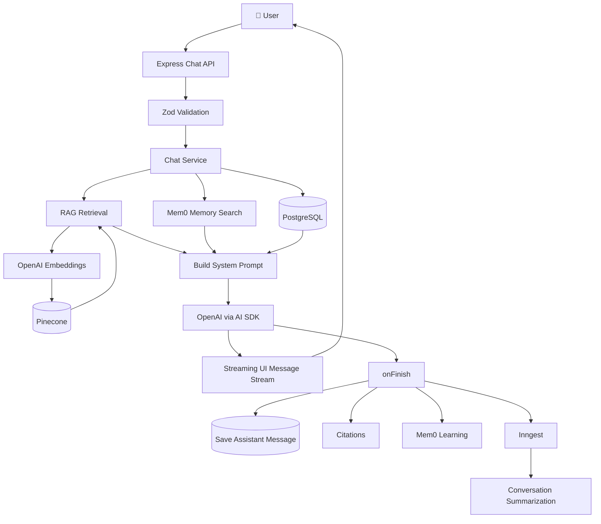
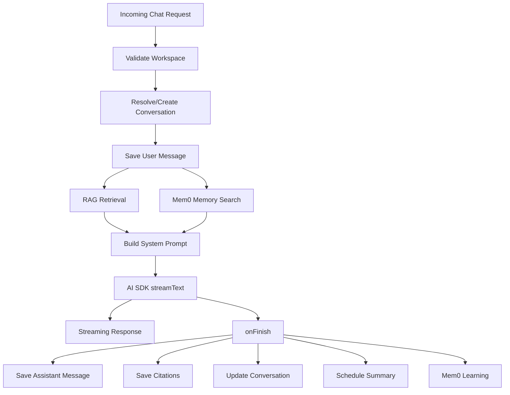
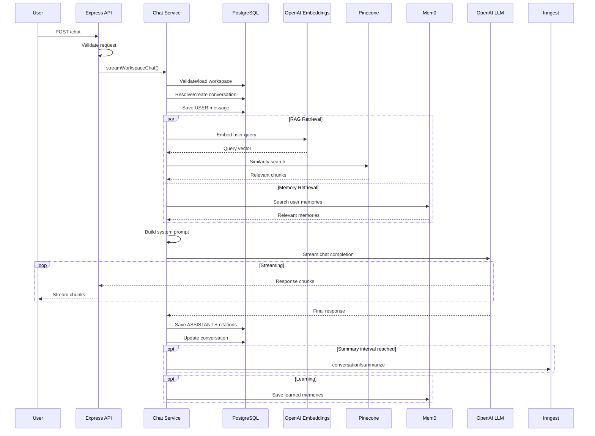
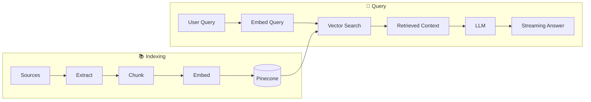
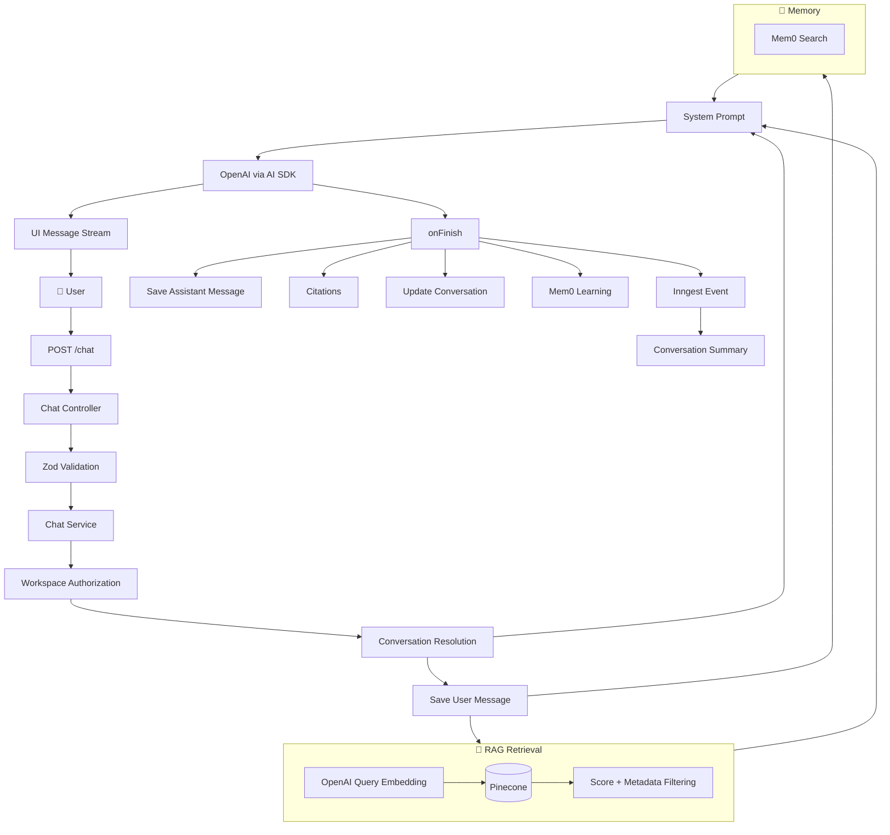

# 🚀 Server Chapter 8 — RAG Similarity Search & Streaming AI Chat

## 1. Goal & Outcome

### 🎯 Goal

Implement the **Retrieval-Augmented Generation (RAG)** chat layer using:

* **Pinecone** for vector similarity search
* **OpenAI Embeddings** for query embedding
* **Context injection** into the LLM system prompt
* **AI SDK streaming** for real-time responses
* **SSE/UI message streaming** through Express
* **Citation tracking** for retrieved workspace sources
* **Mem0** for user memory retrieval and learning
* **Inngest** for asynchronous conversation summarization
* **Tavily** for optional up-to-date web search

### ✅ Student Outcome

By the end of this chapter, the backend can:

1. Accept a user's chat message.
2. Validate the request.
3. Resolve or create a conversation.
4. Persist the user message.
5. Convert the query into an embedding.
6. Search the workspace's Pinecone namespace.
7. Filter irrelevant vector matches.
8. Build a grounded system prompt.
9. Retrieve relevant user memories.
10. Stream an LLM response to the client.
11. Track source and web citations.
12. Persist the assistant response.
13. Trigger conversation summarization when required.
14. Send useful interaction data to Mem0.

---

# 2. High-Level Architecture

The complete request flow is:



The important idea is that **RAG retrieval happens before generation**:

```text
User Query
   ↓
Embedding
   ↓
Pinecone Similarity Search
   ↓
Relevant Chunks
   ↓
System Prompt + Context
   ↓
LLM
   ↓
Streaming Response
```

---

# 3. Server Installation

From:

```bash
week05/chaibook-llm-sir/server
```

install the required AI/vector dependencies:

```bash
npm install openai @pinecone-database/pinecone
```

The chapter also uses the AI SDK, Zod, Mem0, Tavily, Prisma and Inngest components already established elsewhere in the project.

---

# 4. AI Configuration

## File

```text
server/src/lib/ai-config.ts
```

```typescript
/** Default chat model when the client or workspace does not specify one. */
export const CHAT_MODEL = "gpt-4o-mini";

/** Allowed chat models exposed to the client and workspace settings. */
export const CHAT_MODELS = ["gpt-4o-mini", "gpt-4o"] as const;

/** OpenAI embedding model used for RAG vector indexing and query embedding. */
export const EMBEDDING_MODEL = "text-embedding-3-small";

/** Vector dimension count — must match Pinecone index configuration. */
export const EMBEDDING_DIMENSIONS = 1536;

/** Target max characters per text chunk during source processing. */
export const CHUNK_SIZE = 1000;

/** Character overlap between consecutive chunks at split boundaries. */
export const CHUNK_OVERLAP = 100;

/** Number of Pinecone chunks to retrieve per chat query. */
export const RAG_TOP_K = 6;

/** Minimum similarity score required for a retrieved chunk. */
export const RAG_MIN_SCORE = 0.35;

/** Enqueue a conversation summary job every N persisted messages. */
export const CONVERSATION_SUMMARY_INTERVAL = 8;

/** Maximum recent messages sent when a rolling summary exists. */
export const RECENT_MESSAGE_WINDOW = 12;
```

## Why centralize these values?

Instead of scattering model names and RAG parameters throughout the project, the application keeps them in one configuration module.

For example:

```typescript
RAG_TOP_K = 6
```

means the retriever asks Pinecone for up to six relevant chunks.

```typescript
RAG_MIN_SCORE = 0.35
```

then removes matches whose similarity score is below the configured threshold.

### Important

The embedding dimension and Pinecone index dimension **must match**.

```text
OpenAI Embedding
      ↓
1536 dimensions
      ↓
Pinecone index
      ↓
1536 dimensions
```

If these dimensions differ, vector insertion/querying will fail.

---

# 5. Chat Request Validation

## File

```text
server/src/validators/chat.validator.ts
```

```typescript
import { z } from "zod";
import { CHAT_MODELS } from "../lib/ai-config.js";
import { workspaceIdParamSchema } from "./workspace.validator.js";

export const conversationIdParamSchema =
    workspaceIdParamSchema.extend({
        conversationId: z
            .string()
            .trim()
            .min(1, "Conversation id is required"),
    });

export const chatBodySchema = z.object({
    conversationId: z.string().trim().min(1).optional(),

    messages: z
        .array(z.record(z.string(), z.unknown()))
        .min(1),

    model: z.enum(CHAT_MODELS).optional(),

    webSearch: z.boolean().optional(),
});

export type ChatBody = z.infer<typeof chatBodySchema>;

export const createConversationSchema = z.object({
    title: z
        .string()
        .trim()
        .min(1)
        .max(120)
        .optional(),
});

export type CreateConversationInput =
    z.infer<typeof createConversationSchema>;
```

## Responsibilities

This validator defines the external API contract.

### `conversationIdParamSchema`

Extends the existing workspace parameter schema and requires:

```text
workspaceId
conversationId
```

### `chatBodySchema`

Accepts:

```text
conversationId → optional
messages       → required
model          → optional
webSearch      → optional
```

### `CHAT_MODELS`

The model is constrained to the configured model list:

```typescript
z.enum(CHAT_MODELS)
```

This prevents arbitrary model names from being passed directly from the client.

### Type inference

```typescript
export type ChatBody = z.infer<typeof chatBodySchema>;
```

Zod therefore provides both:

```text
Runtime validation
       +
TypeScript type inference
```

> **Important:** TypeScript types disappear at runtime. Zod is what actually validates incoming HTTP data.

---

# 6. Chat Message Utilities

## File

```text
server/src/utils/chat-message.ts
```

### Extract text from a UI message

```typescript
export function getTextFromUIMessage(message: UIMessage) {
    return message.parts
        .filter((part) => part.type === "text")
        .map((part) => part.text)
        .join("");
}
```

A UI message can contain multiple parts.

For example:

```text
UIMessage
 ├── text
 ├── tool
 ├── text
 └── ...
```

This helper extracts only text parts and combines them.

---

## Find the latest user message

```typescript
export function getLastUserMessageText(
    messages: UIMessage[],
) {
    for (
        let index = messages.length - 1;
        index >= 0;
        index -= 1
    ) {
        const message = messages[index];

        if (message.role === "user") {
            const text = getTextFromUIMessage(message).trim();

            if (text) {
                return text;
            }
        }
    }

    return null;
}
```

The array is traversed backwards:

```text
latest message
      ↓
previous message
      ↓
previous message
      ↓
...
```

This is useful because the latest user message is normally the query that should trigger RAG retrieval.

---

## Build conversation title

```typescript
export function buildConversationTitle(text: string) {
    const normalized = text
        .replace(/\s+/g, " ")
        .trim();

    if (!normalized) {
        return "New chat";
    }

    return normalized.length > 72
        ? `${normalized.slice(0, 72).trim()}…`
        : normalized;
}
```

Example:

```text
User:
Explain how RAG works with Pinecone and OpenAI embeddings...
```

becomes a short conversation title suitable for a sidebar.

---

# 7. Conversation Events

## File

```text
server/src/lib/conversation-events.ts
```

```typescript
import { inngest } from "../inngest/client.js";

export async function enqueueConversationSummarize(input: {
    conversationId: string;
    userId: string;
}) {
    await inngest.send({
        name: "conversation/summarize",
        data: input,
    });
}
```

This helper separates event publishing from the main chat service.

The chat service does not directly execute summarization.

Instead:

```text
Chat Service
     ↓
Inngest Event
     ↓
Background Worker
     ↓
Conversation Summary
```

This keeps the user-facing chat request focused on the actual response.

---

# 8. RAG Retrieval Layer

## File

```text
server/src/lib/rag/retrieve.ts
```

This is one of the most important files in Chapter 8.

Its responsibilities are:

1. Embed the user's query.
2. Search Pinecone.
3. Filter weak matches.
4. Validate returned metadata.
5. Convert matches into application-level chunks.
6. Build the final system prompt.

---

## Retrieved Chunk Type

```typescript
export type RetrievedChunk = {
    sourceId: string;
    sourceTitle: string;
    sourceType: string;
    chunkId: string;
    chunkIndex: number;
    page?: number;
    text: string;
    score: number;
};
```

This creates a normalized representation of retrieved vector data.

---

# 9. Query → Embedding → Pinecone

```typescript
export async function retrieveWorkspaceContext(
    workspaceId: string,
    query: string,
): Promise<RetrievedChunk[]> {
    const [embedding] = await embedTexts([query]);

    const matches = await queryWorkspaceVectors(
        workspaceId,
        embedding,
        RAG_TOP_K,
    );

    const chunks: RetrievedChunk[] = [];

    for (const match of matches) {
        const score = match.score ?? 0;

        if (score < RAG_MIN_SCORE) {
            continue;
        }

        const metadata =
            match.metadata as
                | Record<string, unknown>
                | undefined;

        if (
            !metadata ||
            typeof metadata.sourceId !== "string" ||
            typeof metadata.sourceTitle !== "string" ||
            typeof metadata.sourceType !== "string" ||
            typeof metadata.chunkId !== "string" ||
            typeof metadata.text !== "string"
        ) {
            continue;
        }

        chunks.push({
            sourceId: metadata.sourceId,
            sourceTitle: metadata.sourceTitle,
            sourceType: metadata.sourceType,
            chunkId: metadata.chunkId,
            chunkIndex: Number(metadata.chunkIndex ?? 0),

            ...(typeof metadata.page === "number"
                ? { page: metadata.page }
                : {}),

            text: metadata.text,
            score,
        });
    }

    return chunks;
}
```

The pipeline is:

```text
User query
    ↓
embedTexts()
    ↓
Query embedding
    ↓
Pinecone namespace(workspaceId)
    ↓
Top K matches
    ↓
Similarity threshold
    ↓
Metadata validation
    ↓
RetrievedChunk[]
```

---

# 10. Why Use a Similarity Threshold?

Suppose Pinecone returns:

```text
Chunk A → 0.91
Chunk B → 0.82
Chunk C → 0.71
Chunk D → 0.21
```

With:

```typescript
RAG_MIN_SCORE = 0.35
```

the result becomes:

```text
Chunk A ✓
Chunk B ✓
Chunk C ✓
Chunk D ✗
```

This prevents obviously weak matches from being injected into the LLM context.

### Important

`0.35` is a configuration choice, not a universal value.

The optimal threshold depends on:

* embedding model
* chunking strategy
* dataset
* query distribution
* desired recall/precision tradeoff

It should eventually be evaluated using real retrieval benchmarks.

---

# 11. Metadata Validation

Pinecone metadata is external data from the vector store, so the application should not blindly assume its shape.

The code checks:

```typescript
typeof metadata.sourceId === "string"
typeof metadata.sourceTitle === "string"
typeof metadata.sourceType === "string"
typeof metadata.chunkId === "string"
typeof metadata.text === "string"
```

Invalid records are skipped.

This protects the prompt-building layer from malformed vector metadata.

> A TypeScript cast such as `as Record<string, unknown>` does not validate runtime data. The explicit `typeof` checks are what provide the runtime protection here.

---

# 12. Building the RAG System Prompt

```typescript
export type UserMemoryContext = string;

export function buildChatSystemPrompt(input: {
    chunks: RetrievedChunk[];
    conversationSummary?: string | null;
    userMemories?: UserMemoryContext[];
    webSearchEnabled?: boolean;
}) {
    const sections: string[] = [
        "You are Chaibook, an assistant that helps users learn from their workspace sources.",
    ];

    if (input.webSearchEnabled) {
        sections.push(
            "You have access to a web_search tool for up-to-date information outside the workspace.",
            "Use it when the user asks about recent events or topics not covered by their sources.",
            "Cite web results inline using [W1], [W2], etc. matching the web result blocks.",
        );
    }

    if (input.userMemories?.length) {
        const memoryBlock = input.userMemories
            .map((memory) => `- ${memory}`)
            .join("\n");

        sections.push(
            "Known facts about this user (use when relevant):",
            memoryBlock,
        );
    }

    const summary = input.conversationSummary?.trim();

    if (summary) {
        sections.push(
            "Earlier conversation summary:",
            summary,
        );
    }

    if (input.chunks.length === 0) {
        sections.push(
            "This workspace has no indexed source content yet, or nothing relevant was retrieved.",

            input.webSearchEnabled
                ? "Use web search when needed, or answer from general knowledge."
                : "Answer helpfully from general knowledge and suggest adding or processing sources when appropriate.",

            "Do not invent citations.",
        );

        return sections.join("\n");
    }

    const context = input.chunks
        .map((chunk, index) => {
            const label =
                `[${index + 1}] ${chunk.sourceTitle} ` +
                `(${chunk.sourceType})` +
                `${chunk.page ? `, page ${chunk.page}` : ""}`;

            return `${label}\n${chunk.text}`;
        })
        .join("\n\n");

    sections.push(
        "Use ONLY the retrieved context below when making factual claims about their materials.",
        "If the context is insufficient, say so clearly.",
        "Cite sources inline using [1], [2], etc. matching the numbered context blocks.",
        "Keep answers concise, accurate, and educational.",
        "",
        "Retrieved context:",
        context,
    );

    return sections.join("\n");
}
```

The resulting prompt conceptually looks like:

```text
System Instructions

Known user memories
        ↓
Conversation summary
        ↓
Retrieved workspace context
        ↓
Citation instructions
```

For example:

```text
Retrieved context:

[1] RAG Architecture (PDF), page 4
RAG combines retrieval with generation...

[2] Pinecone Notes (Website)
Pinecone stores vectors...
```

The model can then answer:

```text
RAG first retrieves relevant information from the knowledge base [1].
Pinecone is used to perform vector similarity search [2].
```

---

# 13. Conversation Repository

## File

```text
server/src/repositories/conversation.repository.ts
```

The repository isolates Prisma database operations from business logic.

```typescript
export const conversationSelect = {
    id: true,
    workspaceId: true,
    title: true,
    summary: true,
    summaryMessageCount: true,
    summarizedAt: true,
    createdAt: true,
    updatedAt: true,
} as const;
```

This avoids fetching unnecessary fields.

The derived type:

```typescript
export type ConversationRecord =
    Prisma.ConversationGetPayload<{
        select: typeof conversationSelect;
    }>;
```

keeps the TypeScript type synchronized with the Prisma selection.

---

## Workspace-scoped lookup

```typescript
export function findConversationByIdAndWorkspaceId(
    conversationId: string,
    workspaceId: string,
) {
    return prisma.conversation.findFirst({
        where: {
            id: conversationId,
            workspaceId,
        },
        select: conversationSelect,
    });
}
```

This is particularly important for multi-tenant applications.

Instead of only asking:

```text
Does this conversation ID exist?
```

the service asks:

```text
Does this conversation exist inside this workspace?
```

That prevents accidentally returning a conversation belonging to another workspace.

---

# 14. Message Repository

## File

```text
server/src/repositories/message.repository.ts
```

```typescript
export const messageSelect = {
    id: true,
    conversationId: true,
    role: true,
    content: true,
    citations: true,
    createdAt: true,
} as const;
```

Messages contain:

```text
id
conversationId
role
content
citations
createdAt
```

The repository provides:

```typescript
findMessagesByConversationId()
countMessagesByConversationId()
createMessageRecord()
```

The service layer therefore does not need to know how Prisma queries are constructed.

Architecture:

```text
Controller
    ↓
Service
    ↓
Repository
    ↓
Prisma
    ↓
PostgreSQL
```

---

# 15. Main Chat Service

## File

```text
server/src/services/chat.service.ts
```

This is the orchestration layer.

The main chat pipeline is:



---

# 16. Workspace Authorization

The service starts by validating workspace access:

```typescript
const workspace =
    await getWorkspaceByIdForUser(
        workspaceId,
        userId,
    );
```

This establishes the user's access to the workspace before retrieving or modifying its data.

The important security boundary is:

```text
Authenticated User
        ↓
Workspace Authorization
        ↓
Workspace Data
        ↓
RAG Search
```

RAG retrieval should never be performed solely from an arbitrary client-provided `workspaceId`.

---

# 17. Selecting the Chat Model

```typescript
const requestedModel =
    input.model ?? workspace.defaultModel;

const chatModel =
    CHAT_MODELS.find(
        (model) => model === requestedModel,
    ) ?? CHAT_MODEL;
```

The selection order is:

```text
Client model
     ↓
Workspace default model
     ↓
Global fallback model
```

The `CHAT_MODELS` allowlist prevents unsupported model names from being passed directly to the AI provider.

---

# 18. Extracting the User Query

```typescript
const userText =
    getLastUserMessageText(input.messages);

if (!userText) {
    throw new ValidationError(
        "A user message is required",
    );
}
```

The latest non-empty user message becomes the RAG query.

Example:

```text
Conversation history:
  User: What is RAG?
  Assistant: ...
  User: How does Pinecone fit into it?

Latest user message:
  "How does Pinecone fit into it?"
```

Only the latest query is embedded for retrieval.

---

# 19. Conversation Resolution

```typescript
const conversation = await resolveConversation(
    workspaceId,
    input.conversationId,
    userText,
);
```

If a conversation ID exists:

```text
Find existing conversation
        ↓
Verify workspace
        ↓
Use conversation
```

Otherwise:

```text
First user message
        ↓
buildConversationTitle()
        ↓
Create conversation
```

This allows the frontend to start a chat without first making a separate conversation-creation request.

---

# 20. Persisting the User Message

```typescript
await createMessageRecord({
    conversationId: conversation.id,
    role: "USER",
    content: userText,
});
```

The message is persisted before generation.

Therefore:

```text
User message
    ↓
PostgreSQL
    ↓
RAG
    ↓
LLM
```

If the model later fails, the original user message still exists in the conversation history.

---

# 21. Parallel RAG + Memory Retrieval

One of the important performance decisions is:

```typescript
const [retrievedChunks, userMemories] =
    await Promise.all([
        retrieveWorkspaceContext(
            workspaceId,
            userText,
        ),

        searchUserMemories(
            userId,
            userText,
        ),
    ]);
```

Instead of:

```text
RAG → wait → Mem0
```

the server performs:

```text
             ┌→ Pinecone RAG
User Query ──┤
             └→ Mem0 Search
```

Both operations execute concurrently.

This reduces total waiting time because the operations are independent.

---

# 22. Citation Construction

Workspace citations are created from retrieved chunks:

```typescript
const citations = retrievedChunks.map((chunk) => ({
    sourceId: chunk.sourceId,
    sourceTitle: chunk.sourceTitle,
    sourceType: chunk.sourceType,
    chunkId: chunk.chunkId,
    chunkIndex: chunk.chunkIndex,
    page: chunk.page,
    excerpt: chunk.text.slice(0, 280),
    score: chunk.score,
}));
```

The citation stores metadata rather than the entire chunk.

This allows the frontend to display something like:

```text
📄 RAG Architecture
Page 4
Similarity: 0.82
"RAG combines retrieval with..."
```

---

# 23. Conversation Summary as Context

The existing conversation summary is injected into the system prompt:

```typescript
const systemPrompt =
    buildChatSystemPrompt({
        chunks: retrievedChunks,
        conversationSummary:
            conversation.summary,
        userMemories:
            userMemories.map(
                (memory) => memory.memory,
            ),
        webSearchEnabled,
    });
```

This gives the model three forms of contextual information:

```text
1. Workspace knowledge
2. User memory
3. Conversation history summary
```

---

# 24. Recent Message Window

When a conversation already has a summary:

```typescript
const contextMessages =
    conversation.summary &&
    input.messages.length >
        RECENT_MESSAGE_WINDOW
        ? input.messages.slice(
              -RECENT_MESSAGE_WINDOW,
          )
        : input.messages;
```

The model does not need the entire historical conversation if an older summary already represents it.

Conceptually:

```text
Old messages
     ↓
Conversation Summary
     ↓
Recent messages
     ↓
LLM
```

This helps control prompt size as conversations become longer.

---

# 25. Optional Web Search Tool

If web search is enabled:

```typescript
const tools = {
    web_search: tool({
        description:
            "Search the web for up-to-date information outside the workspace sources.",

        inputSchema: z.object({
            query: z
                .string()
                .describe(
                    "The search query for current web information",
                ),
        }),

        execute: async ({ query }) => {
            const results = await searchWeb(query);

            webSearchResults = results;

            return formatTavilyResultsForPrompt(
                results,
            );
        },
    }),
};
```

This creates a controlled tool that the LLM can invoke when appropriate.

Architecture:

```text
LLM
 ↓
web_search tool
 ↓
Tavily
 ↓
Search results
 ↓
LLM
```

Web search is different from RAG:

```text
Workspace RAG
→ Search user's indexed knowledge

Web Search
→ Search external/current information
```

---

# 26. Streaming the AI Response

The response uses the AI SDK:

```typescript
const result = streamText({
    model: openai(chatModel),

    system: systemPrompt,

    messages:
        await convertToModelMessages(
            contextMessages,
        ),

    tools,

    stopWhen:
        webSearchEnabled
            ? isStepCount(3)
            : undefined,
});
```

The model can generate incrementally rather than waiting for the entire response.

Instead of:

```text
Request
   ↓
Wait 8 seconds
   ↓
Complete response
```

the client receives:

```text
Request
   ↓
Token/chunk
   ↓
Token/chunk
   ↓
Token/chunk
   ↓
...
   ↓
Complete response
```

This significantly improves perceived responsiveness.

---

# 27. UI Message Streaming

```typescript
writer.merge(
    toUIMessageStream({
        stream: result.stream,
    }),
);
```

The AI SDK stream is converted into a UI-compatible message stream.

Then:

```typescript
await pipeUIMessageStreamToResponse({
    response: res,
    stream,
    headers: {
        "X-Conversation-Id":
            conversation.id,
    },
});
```

The Express response is connected directly to the stream.

The client can therefore render the answer while it is being generated.

---

# 28. What Happens After Generation?

The `onFinish` callback handles persistence and background operations.

```typescript
onFinish: async ({
    responseMessage,
    isAborted,
}) => {
    ...
}
```

First:

```typescript
if (isAborted) {
    return;
}
```

If the user cancels generation, the normal assistant-message persistence path is skipped.

Then:

```typescript
const assistantText =
    getTextFromUIMessage(
        responseMessage,
    ).trim();

if (!assistantText) {
    return;
}
```

An empty assistant response is not persisted.

---

# 29. Combining Workspace + Web Citations

Web citations are converted into the same general citation structure:

```typescript
const webCitations =
    webSearchResults
        ? webSearchResults.results.map(
              (result) => ({
                  sourceType: "WEB" as const,
                  sourceTitle:
                      result.title,
                  url: result.url,
                  excerpt:
                      result.content.slice(
                          0,
                          280,
                      ),
              }),
          )
        : [];
```

Then:

```typescript
const allCitations = [
    ...citations,
    ...webCitations,
];
```

The assistant message therefore records both:

```text
Workspace citations
        +
Web citations
```

---

# 30. Persisting the Assistant Response

```typescript
await createMessageRecord({
    conversationId: conversation.id,
    role: "ASSISTANT",
    content: assistantText,
    citations: allCitations,
});
```

Now the conversation has:

```text
USER
 ↓
ASSISTANT + citations
```

This enables the frontend to reconstruct chat history later.

---

# 31. Updating Conversation Activity

```typescript
await touchConversation(
    conversation.id,
);
```

This updates:

```text
updatedAt
```

so the conversation can appear at the top of the sidebar/history list.

If the conversation has no title:

```typescript
if (!conversation.title) {
    await updateConversationRecord(
        conversation.id,
        {
            title:
                buildConversationTitle(
                    userText,
                ),
        },
    );
}
```

The first user query becomes the initial title.

---

# 32. Asynchronous Conversation Summarization

After counting messages:

```typescript
const messageCount =
    await countMessagesByConversationId(
        conversation.id,
    );
```

the service checks:

```typescript
if (
    messageCount %
        CONVERSATION_SUMMARY_INTERVAL ===
    0
) {
    await enqueueConversationSummarize({
        conversationId:
            conversation.id,
        userId,
    });
}
```

With:

```typescript
CONVERSATION_SUMMARY_INTERVAL = 8
```

summarization is triggered at:

```text
8 messages
16 messages
24 messages
32 messages
...
```

The chat request does **not** perform the summarization itself.

Instead:

```text
Chat finishes
    ↓
Send Inngest event
    ↓
Return/continue chat flow
    ↓
Background summarization
```

This keeps expensive work away from the main response path.

---

# 33. Mem0 Learning

The service also sends the interaction to Mem0:

```typescript
void addMemoriesFromMessages(
    userId,
    [
        {
            role: "user",
            content: userText,
        },
        {
            role: "assistant",
            content: assistantText,
        },
    ],
    {
        source: "learned",
        conversationId:
            conversation.id,
    },
).catch((error) => {
    console.error(
        "Mem0 add failed:",
        error,
    );
});
```

The use of:

```typescript
void ...
```

means the operation is intentionally not awaited.

The chat response does not have to wait for Mem0 learning.

Errors are explicitly caught so a Mem0 failure does not become an unhandled rejection.

---

# 34. Controller Layer

## File

```text
server/src/controllers/chat.controller.ts
```

The controller is intentionally thin.

Its responsibilities are:

```text
HTTP Request
    ↓
Validate parameters/body
    ↓
Get authenticated user
    ↓
Call service
    ↓
Return HTTP response
```

Example:

```typescript
export async function listConversations(
    req: Request,
    res: Response,
) {
    const { workspaceId } =
        workspaceIdParamSchema.parse(
            req.params,
        );

    const conversations =
        await listConversationsForWorkspace(
            workspaceId,
            req.session.user.id,
        );

    res.json(conversations);
}
```

The controller does not contain RAG logic.

That belongs to the service/retrieval layers.

---

# 35. Streaming Controller

The chat controller validates the request:

```typescript
const { workspaceId } =
    workspaceIdParamSchema.parse(
        req.params,
    );

const body =
    chatBodySchema.parse(req.body);
```

Then delegates:

```typescript
await streamWorkspaceChat(
    res,
    workspaceId,
    req.session.user.id,
    {
        conversationId:
            body.conversationId,

        messages:
            body.messages as unknown as UIMessage[],

        model: body.model,

        webSearch:
            body.webSearch,
    },
);
```

The controller therefore acts as an HTTP adapter rather than a business-logic container.

---

# 36. Routes

## File

```text
server/src/routes/chat.routes.ts
```

```typescript
export const conversationRoutes =
    Router({
        mergeParams: true,
    });

conversationRoutes.get(
    "/",
    asyncHandler(listConversations),
);

conversationRoutes.post(
    "/",
    asyncHandler(createConversation),
);

conversationRoutes.get(
    "/:conversationId/messages",
    asyncHandler(
        listConversationMessages,
    ),
);

conversationRoutes.delete(
    "/:conversationId",
    asyncHandler(
        deleteConversation,
    ),
);

export const chatRoutes =
    Router({
        mergeParams: true,
    });

chatRoutes.post(
    "/",
    asyncHandler(streamChat),
);
```

The route layer maps HTTP endpoints to controllers.

Conceptually:

```text
GET    /conversations
POST   /conversations
GET    /conversations/:id/messages
DELETE /conversations/:id
POST   /chat
```

`asyncHandler()` centralizes asynchronous error forwarding to Express error middleware.

---

# 37. Complete RAG Request Flow

The complete system can now be understood as:



---

# 38. Data Flow Across the RAG System

The complete RAG system now has two major pipelines.

## Indexing Pipeline

Built in earlier chapters:

```text
PDF / Website / YouTube
        ↓
Content Extraction
        ↓
Chunking
        ↓
PostgreSQL source_chunks
        ↓
OpenAI Embeddings
        ↓
Pinecone
```

## Query Pipeline

Implemented in this chapter:

```text
User Question
        ↓
OpenAI Embedding
        ↓
Pinecone Similarity Search
        ↓
Relevant Chunks
        ↓
Prompt Construction
        ↓
LLM
        ↓
Streaming Answer
```

Together:



This is the core architecture of Retrieval-Augmented Generation.

---

# 39. Why Pinecone Uses Workspace Namespaces

The vector store is queried using:

```typescript
workspaceId
```

as the namespace.

Conceptually:

```text
Pinecone
│
├── workspace-A
│   ├── vector-1
│   ├── vector-2
│   └── vector-3
│
├── workspace-B
│   ├── vector-4
│   └── vector-5
│
└── workspace-C
    ├── vector-6
    └── vector-7
```

A query for:

```text
workspace-A
```

searches only that namespace.

This is an important multi-tenant isolation mechanism.

However, **namespace isolation is not a replacement for application authorization**.

The service must still verify that the authenticated user has access to the workspace.

---

# 40. Citation Architecture

There are two citation sources:

### Workspace citations

```text
[1]
[2]
[3]
```

These correspond to retrieved Pinecone chunks.

### Web citations

```text
[W1]
[W2]
[W3]
```

These correspond to Tavily web results.

The system therefore distinguishes:

```text
Workspace Knowledge
        ↓
[1], [2], [3]

External Web Knowledge
        ↓
[W1], [W2], [W3]
```

This makes the final answer easier to audit.

---

# 41. Production Considerations

The implementation is a strong application-level RAG pipeline, but several areas should be handled carefully in a production deployment.

## 41.1 Retrieval Threshold Needs Evaluation

```typescript
RAG_MIN_SCORE = 0.35
```

should not be considered universally correct.

Measure retrieval quality using representative queries and adjust the threshold accordingly.

---

## 41.2 Prompt Injection from Retrieved Documents

Retrieved content is untrusted data.

A malicious source could contain instructions such as:

```text
Ignore the system prompt...
```

The application should treat retrieved chunks as **data**, not instructions.

The prompt already attempts to establish this boundary:

```text
Use ONLY the retrieved context...
```

For higher-security systems, stronger prompt-injection defenses should be added.

---

## 41.3 Query Length Limits

The current validator requires at least one message but does not show a strict maximum message length.

Production APIs should consider limits for:

* number of messages
* individual message size
* total conversation payload
* model context size

Otherwise, clients can send unnecessarily large requests.

---

## 41.4 Tool Invocation Limits

When web search is enabled:

```typescript
stopWhen: isStepCount(3)
```

limits the number of model/tool steps.

This prevents uncontrolled tool loops.

---

## 41.5 Citation Data Should Remain Bounded

The code intentionally stores only:

```typescript
excerpt: chunk.text.slice(0, 280)
```

rather than the entire chunk.

This helps keep message records smaller.

---

## 41.6 Streaming Has Different Failure Semantics

Once streaming has started, the HTTP response may already contain data.

Therefore, an error after partial streaming cannot always be represented like a normal:

```http
500 Internal Server Error
```

Production clients should be prepared for interrupted streams.

---

## 41.7 External Services Can Fail Independently

This chapter depends on:

```text
OpenAI
Pinecone
Mem0
Tavily
PostgreSQL
Inngest
```

Any of these can fail independently.

The application should distinguish between:

```text
Transient failure
    ↓
Retry

Permanent validation failure
    ↓
Return error

Optional-service failure
    ↓
Log/degrade gracefully
```

For example, Mem0 learning is intentionally non-blocking.

---

# 42. Important Architectural Insight

This chapter does **not** simply implement:

```text
User → LLM
```

It implements:

```text
User
 ↓
Authentication
 ↓
Workspace Authorization
 ↓
Conversation Management
 ↓
Message Persistence
 ↓
┌───────────────────────┐
│ RAG Retrieval         │
│ Mem0 Memory Retrieval │
└───────────────────────┘
 ↓
Prompt Construction
 ↓
LLM + Optional Tools
 ↓
Streaming
 ↓
Citations
 ↓
Persistence
 ↓
Background Memory/Summary
```

That is much closer to a production AI application than a basic chatbot.

---

# 43. Chapter 8 Final Architecture



---

# 44. Chapter Summary

### Core concepts learned

| Component             | Responsibility                           |
| --------------------- | ---------------------------------------- |
| **Zod**               | Runtime request validation               |
| **AI SDK**            | LLM interaction and streaming            |
| **OpenAI Embeddings** | Convert queries into vectors             |
| **Pinecone**          | Similarity search over indexed chunks    |
| **RAG Retriever**     | Retrieve and filter relevant context     |
| **Prompt Builder**    | Combine context, memory and instructions |
| **PostgreSQL**        | Persist conversations/messages           |
| **Mem0**              | User memory retrieval and learning       |
| **Tavily**            | Optional current web search              |
| **Inngest**           | Background conversation summarization    |
| **SSE/UI Stream**     | Real-time AI response delivery           |

### The most important mental model

```text
INDEXING

Documents
   ↓
Chunks
   ↓
Embeddings
   ↓
Pinecone


QUERY

Question
   ↓
Embedding
   ↓
Pinecone Search
   ↓
Relevant Context
   ↓
Prompt
   ↓
LLM
   ↓
Streaming Answer
```

### Final architecture

> **RAG is not just vector search.**

A production RAG application combines:

```text
Retrieval
+
Authorization
+
Prompt Construction
+
Conversation State
+
Memory
+
Tool Use
+
Streaming
+
Citations
+
Persistence
+
Background Processing
```

That combination is what turns a simple LLM API call into a complete **production-oriented AI chat system**.

