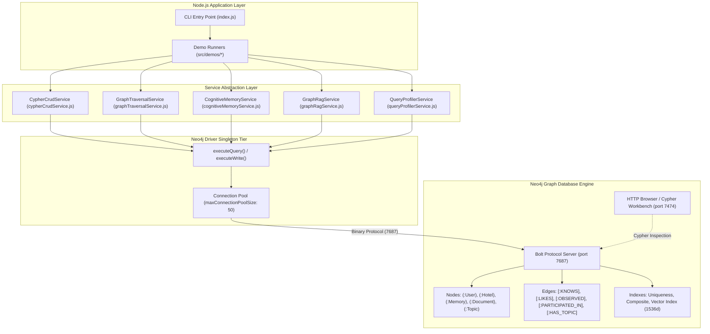
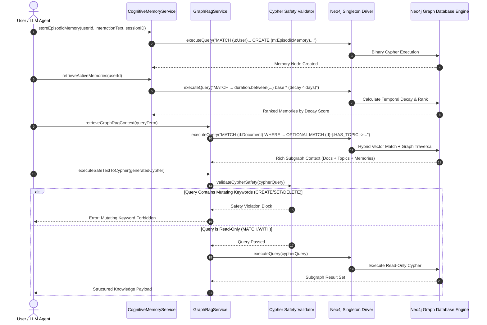

# 📚 Technical Implementation Guide — Week 06 Day 12: Graph Databases, Cypher, Cognitive Memory & GraphRAG

Welcome to the **Master Implementation Guide for Week 06 Day 12**. This guide provides an in-depth, publication-grade technical breakdown of native graph databases (Neo4j), Cypher query language, driver integration, cognitive AI agent memory systems with temporal decay, GraphRAG hybrid retrieval, and query profiling.

---

## 📁 Codebase Architecture & File Location Map

All source code and implementation logic for this module are located inside [`week06/learning/day12/code/`](../):

```text
week06/learning/day12/code/
├── 📄 .env                                 # Environment credentials (NEO4J_URI, NEO4J_USER, etc.)
├── 📄 .env.example                         # Environment variable configuration template
├── 🐳 docker-compose.yml                  # Neo4j 5.x container service setup (Ports 7687 & 7474)
├── 📄 package.json                         # Dependencies (neo4j-driver, dotenv) & execution scripts
├── 📄 index.js                             # Main CLI runner for interactive and batch demos
├── 📄 README.md                            # Primary project documentation
├── 📄 explanations code.md                 # Detailed module & service code walkthroughs
├── 📁 implementation guide/               # Comprehensive step-by-step implementation guide suite
│   ├── 📖 README.md                        # Master Index & Architecture Overview (this file)
│   ├── 📖 chapter-00-overview-setup.md     # Architecture foundations, Docker, environment & seeding
│   ├── 📖 chapter-01-graph-fundamentals.md # Property Graph Model & Index-Free Adjacency mechanics
│   ├── 📖 chapter-02-cypher-syntax-and-crud.md # Cypher syntax, ASCII notation & CRUD operations
│   ├── 📖 chapter-03-neo4j-driver-and-architecture.md # Driver pooling, transactions & graph algorithms
│   ├── 📖 chapter-04-cognitive-memory-system.md # Factual/Episodic memory networks & temporal decay
│   └── 📖 chapter-05-graphrag-and-profiling.md # GraphRAG hybrid retrieval, safety & EXPLAIN/PROFILE
└── 📁 src/
    ├── 🔌 config/
    │   └── neo4j.js                        # Singleton Driver configuration, pool & executeQuery helper
    ├── 🗄️ db/
    │   ├── constraintsAndIndexes.js        # Schema uniqueness constraints & vector/composite indexes
    │   └── seed.js                         # Idempotent Cypher seed script for knowledge graph
    ├── 🧠 services/
    │   ├── cypherCrudService.js            # Parameterized Cypher CRUD & managed transaction service
    │   ├── graphTraversalService.js        # Multi-hop traversals, shortestPath & BFS simulation
    │   ├── cognitiveMemoryService.js       # Memory storage, temporal decay formula & context builder
    │   ├── graphRagService.js              # Vector search + graph traversal, Text-to-Cypher & safety
    │   └── queryProfilerService.js         # EXPLAIN & PROFILE query planning & execution analysis
    └── 🚀 demos/
        ├── demo-01-fundamentals.js         # Basic graph connectivity verification demo
        ├── demo-02-cypher-crud.js            # Cypher MATCH/CREATE/MERGE/SET/DELETE demo
        ├── demo-03-traversals.js             # Multi-hop network reach & shortest path demo
        ├── demo-04-agent-memory.js           # Agent memory storage & temporal decay retrieval demo
        ├── demo-05-graphrag.js               # GraphRAG hybrid context retrieval demo
        └── demo-06-profiling.js              # EXPLAIN & PROFILE performance benchmarking demo
```

### Direct Links to Source Files:
- 🔌 [`src/config/neo4j.js`](../src/config/neo4j.js) — Neo4j singleton driver configuration & lifecycle management
- 🗄️ [`src/db/constraintsAndIndexes.js`](../src/db/constraintsAndIndexes.js) — Schema constraints, property indexes & vector index initialization
- 🗄️ [`src/db/seed.js`](../src/db/seed.js) — Seed script populating sample knowledge graph nodes & relationships
- 🧠 [`src/services/cypherCrudService.js`](../src/services/cypherCrudService.js) — Cypher query execution, parameters & transactions
- 🧠 [`src/services/graphTraversalService.js`](../src/services/graphTraversalService.js) — Multi-hop paths, shortest path & BFS algorithm
- 🧠 [`src/services/cognitiveMemoryService.js`](../src/services/cognitiveMemoryService.js) — Cognitive memory architecture & decay engine
- 🧠 [`src/services/graphRagService.js`](../src/services/graphRagService.js) — GraphRAG hybrid retrieval & Text-to-Cypher safety validator
- 🧠 [`src/services/queryProfilerService.js`](../src/services/queryProfilerService.js) — Cypher query plan inspection (`EXPLAIN` & `PROFILE`)
- 📄 [`index.js`](../index.js) — Main entry point for executing interactive system demonstrations

---

## 🏗️ System Architecture & Workflow Topology

The system connects Node.js services through the Neo4j JavaScript Driver (`neo4j-driver`) via the high-performance **Bolt protocol** (`bolt://localhost:7687`), organizing graph entities into connected factual networks, episodic memory structures, and vector-searchable documents.



---

## 🔄 Cognitive Memory & GraphRAG Interaction Flow



---

## 📚 Master Chapter Reference Table

| Chapter | Focus Area | Guide Link | Relevant Source Files |
| :--- | :--- | :--- | :--- |
| **Ch 00** | **Overview & Setup** | [Chapter 00 Guide](chapter-00-overview-setup.md) | 🐳 [`docker-compose.yml`](../docker-compose.yml), 🗄️ [`src/db/seed.js`](../src/db/seed.js), 🗄️ [`src/db/constraintsAndIndexes.js`](../src/db/constraintsAndIndexes.js) |
| **Ch 01** | **Graph Fundamentals** | [Chapter 01 Guide](chapter-01-graph-fundamentals.md) | 🚀 [`src/demos/demo-01-fundamentals.js`](../src/demos/demo-01-fundamentals.js) |
| **Ch 02** | **Cypher Syntax & CRUD** | [Chapter 02 Guide](chapter-02-cypher-syntax-and-crud.md) | 🧠 [`src/services/cypherCrudService.js`](../src/services/cypherCrudService.js), 🚀 [`src/demos/demo-02-cypher-crud.js`](../src/demos/demo-02-cypher-crud.js) |
| **Ch 03** | **Driver & Architecture** | [Chapter 03 Guide](chapter-03-neo4j-driver-and-architecture.md) | 🔌 [`src/config/neo4j.js`](../src/config/neo4j.js), 🧠 [`src/services/graphTraversalService.js`](../src/services/graphTraversalService.js), 🚀 [`src/demos/demo-03-traversals.js`](../src/demos/demo-03-traversals.js) |
| **Ch 04** | **Cognitive Memory** | [Chapter 04 Guide](chapter-04-cognitive-memory-system.md) | 🧠 [`src/services/cognitiveMemoryService.js`](../src/services/cognitiveMemoryService.js), 🚀 [`src/demos/demo-04-agent-memory.js`](../src/demos/demo-04-agent-memory.js) |
| **Ch 05** | **GraphRAG & Profiling** | [Chapter 05 Guide](chapter-05-graphrag-and-profiling.md) | 🧠 [`src/services/graphRagService.js`](../src/services/graphRagService.js), 🧠 [`src/services/queryProfilerService.js`](../src/services/queryProfilerService.js), 🚀 [`src/demos/demo-05-graphrag.js`](../src/demos/demo-05-graphrag.js) |

---

## 🚀 Quick Start Sequence

Follow these steps to run the complete Neo4j Graph Database and AI Cognitive Memory codebase locally:

### 1. Install Node.js Dependencies
Navigate to the module directory and install required NPM packages:
```bash
cd week06/learning/day12/code
npm install
```

### 2. Launch Neo4j Container Service via Docker Compose
Start the Neo4j 5.x database container in detached mode:
```bash
docker compose up -d
```
> **Ports Exposed**:
> - `7687` — Bolt Protocol (Binary RPC database connection)
> - `7474` — Neo4j Browser Web UI (`http://localhost:7474`)
>   * **Username**: `neo4j`
>   * **Password**: `password123`

### 3. Seed the Graph Database
Run the idempotent seed script to create uniqueness constraints, indexes, nodes, and relationships:
```bash
npm run seed
```

### 4. Execute Demonstration Suites
Run all feature demos sequentially or trigger specific sub-modules:

```bash
# Run all interactive demonstrations in sequence
npm run demo:all

# Run specific functional sub-demos:
npm run demo:cypher      # Demo 02: Cypher CRUD Operations & Parameterization
npm run demo:traversals  # Demo 03: Multi-hop Network Reach & Shortest Paths
npm run demo:memory      # Demo 04: Cognitive Agent Memory & Decay Retrieval
npm run demo:graphrag    # Demo 05: GraphRAG Hybrid Context Retrieval & Safety Check
npm run demo:profiling   # Demo 06: EXPLAIN and PROFILE Cypher Performance Analysis
```
