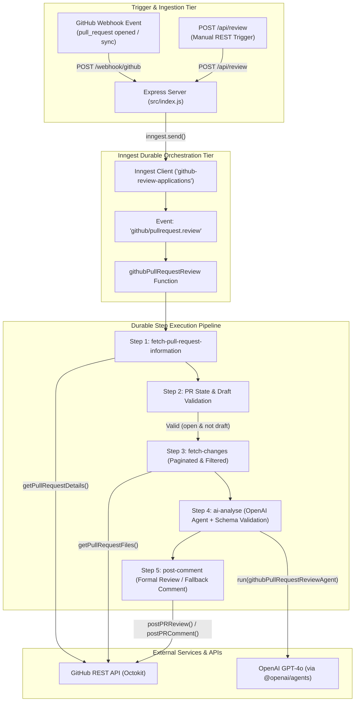
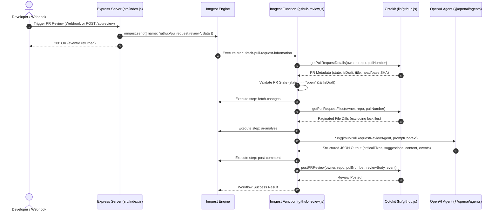

# GitHub AI Pull Request Reviewer — Implementation Guide Master Index

Welcome to the **GitHub AI Pull Request Reviewer Implementation Guide**! This guide provides an exhaustive, step-by-step technical walkthrough of building an enterprise-grade, event-driven **AI PR Review Automation Bot** using **Inngest (Durable Execution)**, the **OpenAI Agents SDK (`@openai/agents`)**, **Octokit (`@octokit/rest`)**, and **Express.js**.

---

## 📁 Project Folder Structure & Relevant Paths Map

All source code for this framework is located inside [`week07/learning/day14/code/`](../):

```text
week07/learning/day14/code/
├── 📄 .env.example                       # Environment variable template
├── 📄 package.json                       # NPM dependencies & ES Module config ("type": "module")
├── 📁 implementation guide/              # Step-by-step implementation chapters & documentation
│   ├── 📖 README.md                      # Master index & system architecture (this file)
│   ├── 📖 chapter-00-overview-setup.md   # Setup, dependencies, and environment configuration
│   ├── 📖 chapter-01-github-api-integration.md # Octokit GitHub REST API integration & diff parsing
│   ├── 📖 chapter-02-agent-definition-and-zod-schemas.md # OpenAI Agents SDK & Zod structured output schema
│   ├── 📖 chapter-03-inngest-durable-workflow-engine.md # Inngest 5-step durable workflow pipeline
│   ├── 📖 chapter-04-webhooks-and-api-triggers.md # Express endpoints, Inngest serve handler & webhooks
│   └── 📖 chapter-05-testing-execution-and-production.md # Testing with Inngest CLI, webhooks & deployment
├── 🤖 agents/
│   └── github-pr-review-agents.js     # OpenAI Agent definition & Zod structured output schema
├── 🛠 lib/
│   └── github.js                      # Octokit wrapper (PR details, diffs, comments, reviews)
└── ⚡ src/
    ├── index.js                       # Express HTTP server & Inngest serve endpoint
    └── inngest/
        ├── client.js                  # Inngest client initialization
        └── functions/
            ├── github-review.js       # Main Inngest durable function (`githubPullRequestReview`)
            └── index.js               # Exported Inngest function array
```

### Direct Links to Source Files:
- 📄 [`.env.example`](../.env.example) — Environment configuration template
- 📄 [`package.json`](../package.json) — Dependencies & scripts
- 🤖 [`agents/github-pr-review-agents.js`](../agents/github-pr-review-agents.js) — Agent definition & Zod schemas
- 🛠 [`lib/github.js`](../lib/github.js) — Octokit REST API client wrapper
- ⚡ [`src/index.js`](../src/index.js) — Express HTTP server & endpoints
- 🔌 [`src/inngest/client.js`](../src/inngest/client.js) — Inngest singleton client configuration
- 🔄 [`src/inngest/functions/github-review.js`](../src/inngest/functions/github-review.js) — 5-step durable workflow execution
- 📦 [`src/inngest/functions/index.js`](../src/inngest/functions/index.js) — Inngest functions array exporter

---

## 🏗 System Architecture & Workflow Pipeline

The system combines Express server entry points, GitHub Webhook listeners, Inngest event queues, Octokit REST client calls, and OpenAI Agent reasoning into a durable 5-step background workflow.



---

## 🔄 End-to-End Sequence Diagram



---

## 📚 Master Chapter Reference Table

| Chapter | Focus Area | Guide Link | Relevant Source File |
| :--- | :--- | :--- | :--- |
| **Ch 0** | **Overview & Setup** | [Chapter 00 Guide](chapter-00-overview-setup.md) | 📄 [`package.json`](../package.json), [`.env.example`](../.env.example) |
| **Ch 1** | **GitHub API Integration** | [Chapter 01 Guide](chapter-01-github-api-integration.md) | 🛠 [`lib/github.js`](../lib/github.js) |
| **Ch 2** | **Agent & Schemas** | [Chapter 02 Guide](chapter-02-agent-definition-and-zod-schemas.md) | 🤖 [`agents/github-pr-review-agents.js`](../agents/github-pr-review-agents.js) |
| **Ch 3** | **Durable Workflow Engine**| [Chapter 03 Guide](chapter-03-inngest-durable-workflow-engine.md) | 🔌 [`src/inngest/client.js`](../src/inngest/client.js), 🔄 [`src/inngest/functions/github-review.js`](../src/inngest/functions/github-review.js) |
| **Ch 4** | **Webhooks & API Triggers** | [Chapter 04 Guide](chapter-04-webhooks-and-api-triggers.md) | ⚡ [`src/index.js`](../src/index.js) |
| **Ch 5** | **Testing & Production** | [Chapter 05 Guide](chapter-05-testing-execution-and-production.md) | ⚡ [`src/index.js`](../src/index.js), 🔄 [`src/inngest/functions/github-review.js`](../src/inngest/functions/github-review.js) |

---

## ⚡ Quick Start Sequence

### 1. Install Dependencies
Navigate to the project directory and install Node.js dependencies:

```bash
cd week07/learning/day14/code
npm install
```

### 2. Configure Environment Variables
Copy `.env.example` to `.env` and configure your credentials:

```bash
cp .env.example .env
```

Edit `.env`:
```env
PORT=3000
GITHUB_PAT=your_github_personal_access_token
OPENAI_API_KEY=your_openai_api_key
```

> **Note**: If `OPENAI_API_KEY` is omitted, the bot runs in **Simulated AI Review Mode**, outputting mock reviews without breaking workflow execution.

### 3. Start the Express Server
```bash
npm run dev
```

### 4. Start the Inngest Dev Server (In a separate terminal)
```bash
npx inngest-cli@latest dev -u http://localhost:3000/api/inngest
```

### 5. Trigger a PR Review Manually
Send a POST request to test the workflow:

```bash
curl -X POST http://localhost:3000/api/review \
  -H "Content-Type: application/json" \
  -d '{"owner": "octocat", "repo": "Hello-World", "pull_number": 1}'
```
