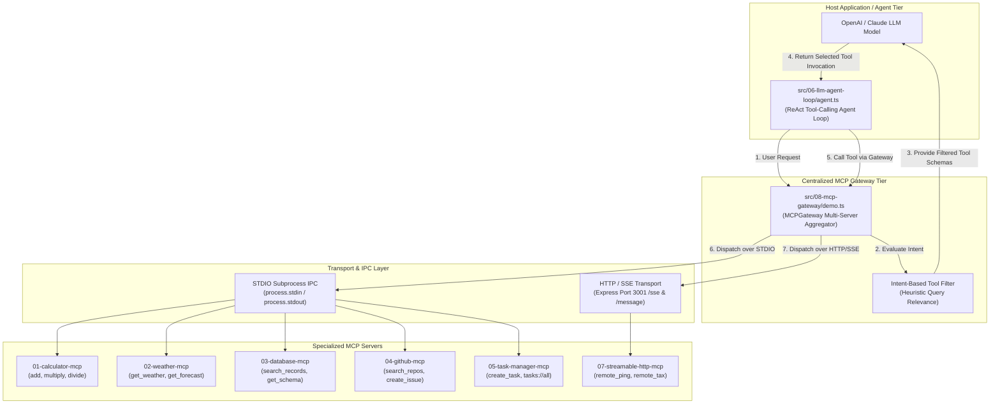
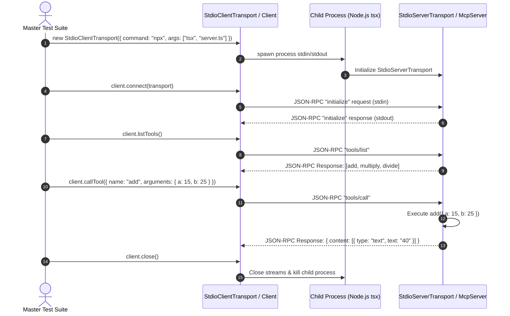

# Model Context Protocol (MCP) TypeScript Master Implementation Guide

Welcome to the **Model Context Protocol (MCP) Master TypeScript Implementation Guide**! This comprehensive, production-grade guide provides AI engineers and TypeScript developers with a complete, step-by-step walkthrough of building, testing, deploying, and gateway-orchestrating **Model Context Protocol (MCP)** servers, clients, and autonomous LLM agents.

Built using Node.js, standard ES Modules (NodeNext), TypeScript, Zod schema validation, Express HTTP/SSE streaming, and `@modelcontextprotocol/sdk`, this master codebase demonstrates 8 production-ready modules covering **STDIO process transports**, **HTTP / Server-Sent Events (SSE) remote streaming**, **SQL-safe database interfaces**, **stateful task managers**, **autonomous LLM agent execution loops**, and **Centralized MCP Gateways** designed to eliminate **Tool Context Poisoning**.

---

## 📁 Project Folder Structure Map

All source code for this master TypeScript implementation is located inside `week08/learning/day15/code/mcp-master/`:

```text
mcp-master/
├── package.json                       # NPM dependencies & scripts (@modelcontextprotocol/sdk, express, zod, tsx, typescript)
├── tsconfig.json                      # TS Compiler configuration (NodeNext ESM, strict mode)
├── implementation guide/              # Master implementation guide chapters & architecture documentation
│   ├── README.md                      # Master index & architecture overview (this file)
│   ├── chapter-00-overview-setup.md   # MCP Architecture, JSON-RPC 2.0 & TypeScript ESM Setup
│   ├── chapter-01-calculator-mcp.md   # STDIO StdioServerTransport & Client (Tools, Resources, Prompts)
│   ├── chapter-02-weather-mcp.md      # Weather Domain Service & Error-Bounded MCP Tool Handlers
│   ├── chapter-03-database-mcp.md     # SQL-Safe Database MCP Server (Parameterized Filters & Schema Inspection)
│   ├── chapter-04-github-mcp.md      # GitHub Integration MCP Server (Repos, Issues, Pull Requests, Code Review)
│   ├── chapter-05-task-manager-mcp.md # Stateful Task Manager MCP Server (Dynamic State, Resources & Prompts)
│   ├── chapter-06-llm-agent-loop.md   # Autonomous LLM ReAct Agent Tool Selection & Execution Loop
│   ├── chapter-07-streamable-http-mcp.md # Remote Express HTTP + SSE Streaming Server & Client
│   └── chapter-08-mcp-gateway.md      # Centralized MCP Gateway, Server Aggregator & Context Poisoning Guard
└── src/
    ├── 01-calculator-mcp/             # Basic Stdio Calculator Server & Client
    │   ├── server.ts                  # McpServer instance with add, multiply, divide tools
    │   └── client.ts                  # StdioClientTransport test runner
    ├── 02-weather-mcp/                # Weather MCP Service & Handlers
    │   ├── weather.service.ts         # Mock weather database service
    │   ├── server.ts                  # get_weather & get_forecast MCP tools
    │   └── client.ts                  # Weather MCP client execution test
    ├── 03-database-mcp/               # Safe Database Querying MCP Server
    │   ├── db.service.ts              # In-memory relational tables & schema lookup
    │   ├── server.ts                  # Safe search_records, schema & record tools
    │   └── client.ts                  # Safe DB client execution test
    ├── 04-github-mcp/                 # GitHub API Integration MCP Server
    │   ├── github.service.ts          # Repository, Issue & PR domain service
    │   ├── server.ts                  # search_repositories, get_issue, create_issue, create_pull_request
    │   └── client.ts                  # GitHub MCP client execution test
    ├── 05-task-manager-mcp/           # Task State Management MCP Server
    │   ├── task.service.ts            # Stateful task creation, search, update & completion
    │   ├── server.ts                  # Task tools, tasks://all resource, daily-plan prompt
    │   └── client.ts                  # Task manager client test runner
    ├── 06-llm-agent-loop/             # Autonomous LLM Agent Loop
    │   └── agent.ts                   # Tool discovery, LLM intent reasoning, call dispatch & synthesis
    ├── 07-streamable-http-mcp/        # Express Remote HTTP / SSE Transport
    │   ├── server.ts                  # Express App on Port 3001, /sse & /message endpoints
    │   └── client.ts                  # SSEClientTransport remote invoker
    └── 08-mcp-gateway/                # Centralized Gateway & Tool Router
        └── demo.ts                    # MCPGateway class multi-server router & context poisoning test
```

---

## 🏗 System Architecture & Ecosystem Overview

The Model Context Protocol establishes a standardized context interface between Large Language Models (Hosts) and external tools, databases, APIs, and file systems.



---

## 🔄 Interaction Sequence Flows

### 1. STDIO Transport Subprocess Communication Flow

In STDIO transport, the MCP Client spawns the server as a background child process using `npx tsx` and communicates using JSON-RPC 2.0 over standard input and output streams.



---

## 🛡️ Tool Context Poisoning & Gateway Solution

When an LLM agent is provided with dozens or hundreds of raw tool definitions, three major failure modes occur:

1. **Context Bloat**: Thousands of input schema tokens consume LLM context window limits and raise costs.
2. **Context Poisoning / Hallucination**: The LLM confuses parameter requirements between unrelated tools.
3. **Execution Vulnerabilities**: Unfiltered tool sets allow unauthorized API invocations.

### Gateway Filtering & Routing Architecture

```text
               ┌──────────────────────────────────────────────────┐
               │                   USER PROMPT                    │
               │   "Check current weather condition in Paris"     │
               └────────────────────────┬─────────────────────────┘
                                        │
                                        ▼
               ┌──────────────────────────────────────────────────┐
               │                   MCP GATEWAY                    │
               │  Aggregates: 15 tools across 3 registered servers│
               │  Runs intent filter: matches "weather" keyword   │
               └────────────────────────┬─────────────────────────┘
                                        │ Filtered down to 2 tools
                                        ▼
               ┌──────────────────────────────────────────────────┐
               │             LLM CONTEXT PROMPT                   │
               │  - get_weather  (WeatherServer)                  │
               │  - get_forecast (WeatherServer)                  │
               └────────────────────────┬─────────────────────────┘
                                        │ Selected Tool Call: get_weather
                                        ▼
               ┌──────────────────────────────────────────────────┐
               │               GATEWAY CALL ROUTER                │
               │  1. Maps get_weather -> WeatherServer client      │
               │  2. Dispatches JSON-RPC callTool request         │
               │  3. Formats and returns response payload         │
               └──────────────────────────────────────────────────┘
```

---

## 📚 Master Chapter Reference Table

| Chapter | Module / Topic | Guide File | Key Technical Concepts Covered |
| :--- | :--- | :--- | :--- |
| **Ch 0** | **Overview & Setup** | [Chapter 00 Guide](chapter-00-overview-setup.md) | MCP Specification, JSON-RPC 2.0 schemas, NodeNext ESM, `package.json`, `tsconfig.json`. |
| **Ch 1** | **Calculator MCP** | [Chapter 01 Guide](chapter-01-calculator-mcp.md) | `McpServer`, `StdioServerTransport`, Zod tool schema validation, resources (`docs://`), prompts (`code-review`). |
| **Ch 2** | **Weather MCP** | [Chapter 02 Guide](chapter-02-weather-mcp.md) | Encapsulating `WeatherService`, error-bounded handlers, structured JSON output, forecast tools. |
| **Ch 3** | **Database MCP** | [Chapter 03 Guide](chapter-03-database-mcp.md) | Relational `DatabaseService`, SQL-safe parameterized filtering (`search_records`), schema reflection (`get_schema`). |
| **Ch 4** | **GitHub MCP** | [Chapter 04 Guide](chapter-04-github-mcp.md) | `GitHubService`, searching repos, issue tracking, pull request automation, PR review prompt. |
| **Ch 5** | **Task Manager MCP** | [Chapter 05 Guide](chapter-05-task-manager-mcp.md) | Dynamic task mutation (`create`, `update`, `complete`), `tasks://all` resource subscription, daily-plan prompt. |
| **Ch 6** | **LLM Agent Loop** | [Chapter 06 Guide](chapter-06-llm-agent-loop.md) | 7-step autonomous LLM ReAct agent loop, tool discovery, schema matching, invocation & answer synthesis. |
| **Ch 7** | **Streamable HTTP MCP**| [Chapter 07 Guide](chapter-07-streamable-http-mcp.md) | Express HTTP server, Server-Sent Events (`/sse`), POST endpoint (`/message`), session map & `SSEClientTransport`. |
| **Ch 8** | **MCP Gateway** | [Chapter 08 Guide](chapter-08-mcp-gateway.md) | `MCPGateway` class, multi-server registration, heuristic tool filtering for Context Poisoning, cross-server routing. |

---

## ⚡ Quick Start & Execution Commands

### 1. Install Project Dependencies
Navigate to the root directory and install node modules:

```bash
cd week08/learning/day15/code/mcp-master
npm install
```

### 2. Run Module Demonstrations via NPM Scripts

Run any of the 8 module test runners directly using `tsx`:

```bash
# 1. Stdio Calculator Server & Client
npm run dev:01-calculator

# 2. Weather MCP Server & Client
npm run dev:02-weather

# 3. SQL-Safe Database MCP Server & Client
npm run dev:03-database

# 4. GitHub API Integration Server & Client
npm run dev:04-github

# 5. Stateful Task Manager MCP Server & Client
npm run dev:05-task-manager

# 6. Autonomous LLM Agent Execution Loop
npm run dev:06-agent-loop

# 7. Remote Express HTTP + SSE Server & Client (2 Terminals required)
# Terminal 1: Start Express SSE Server
npm run dev:07-http-server
# Terminal 2: Run SSE Client Test
npm run dev:07-http-client

# 8. Centralized MCP Gateway & Multi-Server Router Demo
npm run dev:08-gateway
```

### 3. Verify TypeScript Build Compilation

Ensure all project files pass strict TypeScript type checks:

```bash
npm run build
```
