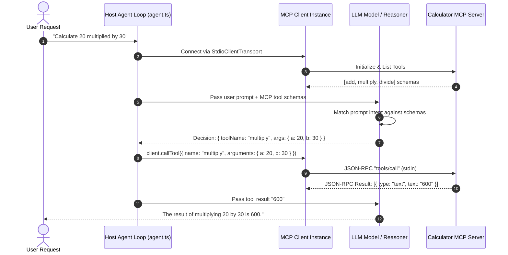

# Chapter 6: Autonomous LLM Agent Execution Loop

## 1. Overview & ReAct Tool Loop Concept

Up to this point, our MCP clients manually invoked tools by hardcoding tool names and arguments (e.g., `client.callTool({ name: "add", arguments: { a: 15, b: 25 } })`).

In real-world AI applications, a Large Language Model (e.g. GPT-4o or Claude 3.5 Sonnet) autonomously decides **which tool to execute** and **what arguments to construct** based on a natural language user query.

Module 6 demonstrates the 7-step **Autonomous MCP Agent Loop** (`src/06-llm-agent-loop/agent.ts`), showing how an LLM inspects MCP tool schemas, formats a JSON tool invocation request, receives execution results over JSON-RPC, and synthesizes the final response.

---

## 2. The 7-Step MCP Agent Execution Lifecycle



---

## 3. Agent Implementation Breakdown (`agent.ts`)

Source file: [agent.ts](file:///home/aminul/development/gen-ai-cohort/week08/learning/day15/code/mcp-master/src/06-llm-agent-loop/agent.ts)

```typescript
import { Client } from "@modelcontextprotocol/sdk/client/index.js";
import { StdioClientTransport } from "@modelcontextprotocol/sdk/client/stdio.js";
import path from "path";
import { fileURLToPath } from "url";

const __dirname = path.dirname(fileURLToPath(import.meta.url));

// Mock LLM function simulating tool selection based on MCP schemas
async function mockLLMCall(userPrompt: string, availableTools: any[]) {
  console.log(`\n🤖 [LLM Thinking] User prompt: "${userPrompt}"`);
  console.log(`🤖 [LLM Context] Evaluated ${availableTools.length} tools provided by MCP server.`);

  const promptLower = userPrompt.toLowerCase();
  if (promptLower.includes("calculate") || promptLower.includes("multiply") || promptLower.includes("multiplied") || promptLower.includes("*")) {
    if (userPrompt.includes("20") && userPrompt.includes("30")) {
      return {
        type: "tool_call",
        toolName: "multiply",
        arguments: { a: 20, b: 30 },
      };
    }
  }

  if (userPrompt.toLowerCase().includes("weather")) {
    return {
      type: "tool_call",
      toolName: "get_weather",
      arguments: { city: "Tokyo" },
    };
  }

  return {
    type: "text",
    content: "I can answer your prompt directly without tool calls.",
  };
}

async function runAgentLoop() {
  console.log("🤖 Starting MCP + LLM Agent Tool-Calling Loop Simulation...\n");

  // Step 1: Connect to Calculator MCP Server
  const calcServerPath = path.join(__dirname, "../01-calculator-mcp/server.ts");
  const transport = new StdioClientTransport({
    command: "npx",
    args: ["tsx", calcServerPath],
  });

  const client = new Client(
    { name: "agent-mcp-client", version: "1.0.0" },
    { capabilities: {} }
  );

  await client.connect(transport);
  console.log("✅ Step 1: MCP Client connected to MCP Server.");

  // Step 2: Tool Discovery via MCP
  const toolsResponse = await client.listTools();
  const mcpTools = toolsResponse.tools;
  console.log(`✅ Step 2: Discovered ${mcpTools.length} MCP tools:`, mcpTools.map((t) => t.name).join(", "));

  // Step 3: Send User Prompt to Agent
  const userPrompt = "Calculate 20 multiplied by 30 using the available server tools.";
  console.log(`\n👤 User Request: "${userPrompt}"`);

  // Step 4: LLM Decides Tool Call
  const llmDecision = await mockLLMCall(userPrompt, mcpTools);

  if (llmDecision.type === "tool_call" && llmDecision.toolName) {
    console.log(`\n⚙️ Step 5: LLM output tool invocation request:`);
    console.log(`   Tool: ${llmDecision.toolName}`);
    console.log(`   Arguments:`, llmDecision.arguments);

    // Step 6: MCP Client Executes Tool Call on Server
    console.log("\n📡 Step 6: Executing tool call on MCP Server via JSON-RPC transport...");
    const toolResult = await client.callTool({
      name: llmDecision.toolName,
      arguments: llmDecision.arguments,
    });

    console.log("📥 MCP Server Result received:", toolResult.content);

    // Step 7: LLM Formulates Final Response
    const finalResultText = (toolResult.content as any[])?.[0]?.text;
    console.log(`\n💬 Step 7: Final LLM Answer to User:`);
    console.log(`   "The result of multiplying 20 by 30 is ${finalResultText}."`);
  } else {
    console.log("\n💬 LLM Response:", llmDecision.content);
  }

  await client.close();
  console.log("\n👋 Agent loop simulation completed successfully.");
}

runAgentLoop().catch((err) => {
  console.error("❌ Agent loop error:", err);
  process.exit(1);
});
```

---

## 4. Execution & Verification

Run the agent loop demo:

```bash
npm run dev:06-agent-loop
```

### Expected Output Terminal Log
```text
🤖 Starting MCP + LLM Agent Tool-Calling Loop Simulation...

✅ Step 1: MCP Client connected to MCP Server.
✅ Step 2: Discovered 3 MCP tools: add, multiply, divide

👤 User Request: "Calculate 20 multiplied by 30 using the available server tools."

🤖 [LLM Thinking] User prompt: "Calculate 20 multiplied by 30 using the available server tools."
🤖 [LLM Context] Evaluated 3 tools provided by MCP server.

⚙️ Step 5: LLM output tool invocation request:
   Tool: multiply
   Arguments: { a: 20, b: 30 }

📡 Step 6: Executing tool call on MCP Server via JSON-RPC transport...
📥 MCP Server Result received: [ { type: 'text', text: '600' } ]

💬 Step 7: Final LLM Answer to User:
   "The result of multiplying 20 by 30 is 600."

👋 Agent loop simulation completed successfully.
```
