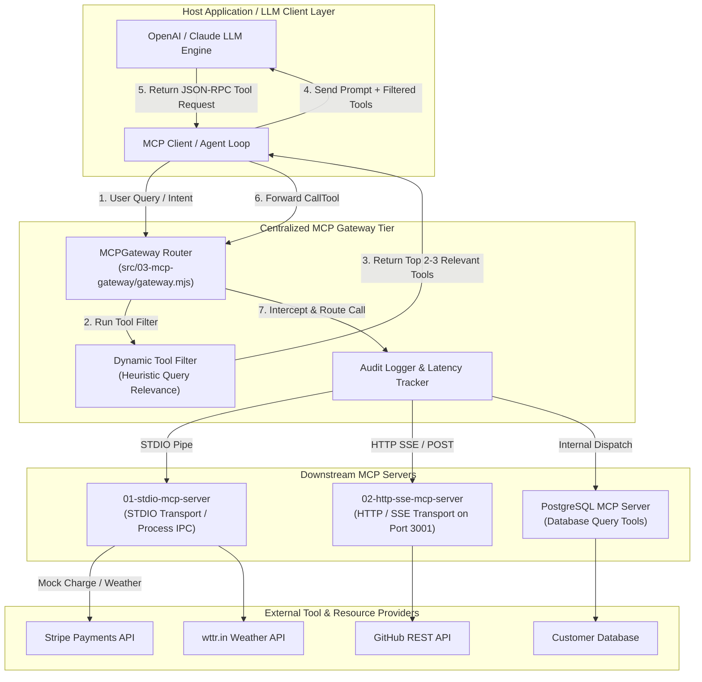
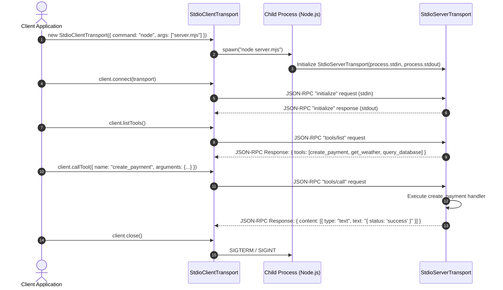
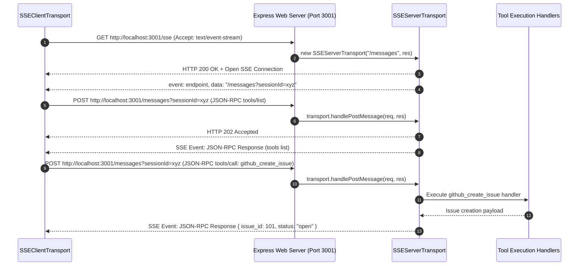

# Model Context Protocol (MCP) Master Implementation Guide

Welcome to the **Model Context Protocol (MCP) Implementation Guide**! This master guide provides AI engineers and TypeScript/JavaScript developers with a comprehensive, step-by-step technical walkthrough of building, deploying, and gateway-orchestrating **Model Context Protocol (MCP)** servers and clients.

Built using Node.js, standard ES Modules (MJS), TypeScript, Express, and `@modelcontextprotocol/sdk`, this codebase demonstrates production-ready implementations of **STDIO transports**, **HTTP / Server-Sent Events (SSE) remote transports**, **dynamic tool filtering**, and **Centralized MCP Gateways** designed to prevent **Tool Context Poisoning**.

---

## 📁 Project Folder Structure Map

All source code for the MCP learning suite is located inside `week08/learning/day15/code/`:

```text
week08/learning/day15/code/
├── mcp/                                # Node.js / ES Module (MJS) Implementations
│   ├── package.json                    # NPM dependencies & scripts (@modelcontextprotocol/sdk, express, eventsource)
│   ├── 01-stdio-mcp-server/            # Local Subprocess MCP Server & Client over STDIO
│   │   ├── server.mjs                  # StdioServerTransport, ListTools & CallTool handlers
│   │   └── client.mjs                  # StdioClientTransport, child process spawner & tool invoker
│   ├── 02-http-sse-mcp-server/         # Remote HTTP / SSE MCP Server & Client
│   │   ├── server.mjs                  # Express App, SSEServerTransport (/sse & /messages)
│   │   └── client.mjs                  # SSEClientTransport, EventSource polyfill & remote invoker
│   ├── 03-mcp-gateway/                 # Centralized MCP Gateway & Tool Router
│   │   ├── gateway.mjs                 # MCPGateway class, tool filtering, routing & audit logging
│   │   └── demo.mjs                    # Multi-server registration & Context Poisoning prevention demo
│   └── implementation guide/           # Step-by-step implementation chapters & documentation
│       ├── README.md                   # Master index & architecture overview (this file)
│       ├── chapter-00-overview-setup.md # MCP Specification, JSON-RPC 2.0 & Protocol Fundamentals
│       ├── chapter-01-stdio-mcp-server.md # STDIO Transport Architecture & Subprocess IPC
│       ├── chapter-02-http-sse-mcp-server.md # Remote HTTP/SSE Transport & Express Streaming
│       ├── chapter-03-mcp-gateway-router.md # MCP Gateway, Tool Filtering & Poisoning Mitigation
│       └── chapter-04-typescript-mcp-suite.md # Enterprise TypeScript MCP Ecosystem (mcp-master)
└── mcp-master/                         # Production TypeScript Multi-Server Ecosystem
    ├── package.json                    # TypeScript dependencies & build configurations
    ├── tsconfig.json                   # TS Compiler options
    └── src/
        ├── 01-calculator-mcp/          # TS Stdio Calculator Server & Client
        ├── 02-weather-mcp/             # TS Weather Server with Resources & Prompt Templates
        ├── 03-database-mcp/            # TS PostgreSQL Server with SQL Safety Guardrails
        ├── 04-github-mcp/              # TS GitHub API Integration Server
        ├── 05-task-manager-mcp/        # TS Task State Management Server with Dynamic Resources
        ├── 06-llm-agent-loop/          # OpenAI LLM ReAct Agent Loop executing MCP Tools
        ├── 07-streamable-http-mcp/     # Enterprise Express + TS HTTP/SSE MCP Server
        └── 08-mcp-gateway/             # Advanced TS MCP Gateway with Multi-Tenant Routing
```

---

## 🏗 System Architecture & MCP Ecosystem

The Model Context Protocol establishes a standardized, client-host-server communication layer separating Large Language Model orchestrators from external tools, data sources, and APIs.



---

## 🔄 Interaction Sequence Flows

### 1. STDIO Transport Lifecycle (Subprocess IPC)

In STDIO transport, the MCP Client spawns the MCP Server as a child process and communicates bidirectionally via standard I/O streams (`stdin` and `stdout`).



---

### 2. HTTP / Server-Sent Events (SSE) Transport Lifecycle

In remote setups, the server opens a long-lived HTTP SSE stream on `/sse` for server-to-client events, while client requests are transmitted via HTTP POST payloads to `/messages`.



---

## 🛡️ The Context Poisoning Problem & Gateway Solution

When an LLM agent is given hundreds of raw tool definitions directly in its system prompt, three critical failures occur:

1. **Context Bloat & Token Overhead**: Exposing 500+ tool JSON schemas can consume tens of thousands of tokens per request.
2. **Context Poisoning / Hallucination**: The LLM confuses tool parameter schemas, calling wrong tools or inventing invalid arguments.
3. **Security Vulnerability**: Downstream APIs are directly exposed to untrusted LLM tool invocations without central oversight.

### Gateway Filter & Routing Flow

```text
    ┌──────────────────────────────────────────────────────────┐
    │                      USER QUERY                          │
    │        "Refund transaction pay_88921 for customer"       │
    └────────────────────────────┬─────────────────────────────┘
                                 │
                                 ▼
    ┌──────────────────────────────────────────────────────────┐
    │                   MCP GATEWAY FILTER                     │
    │  Raw Tool Registry: 14 tools across 3 servers           │
    │  Heuristic Keyword & Domain Scoring engine              │
    └────────────────────────────┬─────────────────────────────┘
                                 │ Filtered down to top 2 tools
                                 ▼
    ┌──────────────────────────────────────────────────────────┐
    │               LLM AGENT SYSTEM PROMPT                    │
    │  - stripe_refund_payment (Stripe Server)                 │
    │  - stripe_create_charge  (Stripe Server)                 │
    └────────────────────────────┬─────────────────────────────┘
                                 │ Selected Tool Call
                                 ▼
    ┌──────────────────────────────────────────────────────────┐
    │                  GATEWAY CALL ROUTER                     │
    │  1. Resolves target server: stripe-server                │
    │  2. Logs latency & payload audit log                     │
    │  3. Invokes target server executor                       │
    └──────────────────────────────────────────────────────────┘
```

---

## 📚 Master Chapter Reference Table

| Chapter | Focus Area | Guide File | Key Topics Covered |
| :--- | :--- | :--- | :--- |
| **Ch 0** | **Protocol Overview & Setup** | [Chapter 00 Guide](chapter-00-overview-setup.md) | MCP architectural spec, JSON-RPC 2.0 schemas, capabilities, package setup. |
| **Ch 1** | **STDIO Transport Server** | [Chapter 01 Guide](chapter-01-stdio-mcp-server.md) | `01-stdio-mcp-server`, stdio IPC pipes, `ListTools`, `CallTool`, child process spawning. |
| **Ch 2** | **HTTP / SSE Transport Server** | [Chapter 02 Guide](chapter-02-http-sse-mcp-server.md) | `02-http-sse-mcp-server`, Express streaming, `/sse` & `/messages`, `EventSource` polyfill. |
| **Ch 3** | **MCP Gateway & Routing** | [Chapter 03 Guide](chapter-03-mcp-gateway-router.md) | `03-mcp-gateway`, dynamic tool filtering, preventing Tool Context Poisoning, audit logging. |
| **Ch 4** | **TypeScript Master Suite** | [Chapter 04 Guide](chapter-04-typescript-mcp-suite.md) | Deep dive into `mcp-master` (TS Calculator, Weather Resources, Database Safety Guardrails, LLM Loop). |

---

## ⚡ Quick Start Sequence

### 1. Install Dependencies
Navigate to the `week08/learning/day15/code/mcp` directory and install dependencies:

```bash
cd week08/learning/day15/code/mcp
npm install
```

### 2. Execute Local STDIO MCP Server & Client Demo
Run the STDIO client demonstration to see process spawning and tool execution:

```bash
npm run demo:stdio
```

### 3. Execute Remote HTTP / SSE Server & Client Demo
In one terminal, start the HTTP/SSE Express server:

```bash
npm run server:sse
```

In a second terminal, run the remote SSE client:

```bash
npm run client:sse
```

### 4. Execute MCP Gateway Tool Filtering Demo
Run the MCP Gateway demonstration to see intent-based tool filtering and context poisoning mitigation:

```bash
npm run demo:gateway
```
