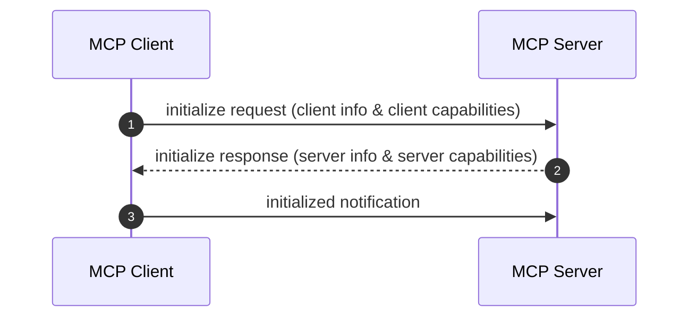

# Chapter 0 — MCP Specification, JSON-RPC 2.0 & Protocol Fundamentals

## 1. Chapter Overview

Welcome to **Chapter 0**! Before diving into server implementations or building MCP Gateways, we must establish a clear foundation of what the **Model Context Protocol (MCP)** is, how it operates under the hood, and how messages are formatted and exchanged.

In this chapter, we will cover:

1. 🌐 What is the **Model Context Protocol (MCP)**?
2. 🔄 Client-Host-Server Architecture pattern.
3. 📩 **JSON-RPC 2.0** message envelope specification.
4.  handshake capability negotiation (Tools, Resources, Prompts, Logging).
5. 📦 Node.js ES Module (MJS) and TypeScript dependency setup.

---

## 2. What Is Model Context Protocol (MCP)?

### The N-to-M Integration Problem

Before MCP, connecting AI applications (like Claude Desktop, custom LLM agents, VS Code extensions) to external tools and context required custom, bespoke integrations for every single service.

If you had **N** AI clients and **M** tool providers (Stripe, GitHub, PostgreSQL, Weather APIs), building direct connectors required **N × M** separate implementations.

```text
WITHOUT MCP: N × M Fragmented Custom Codebase
[Claude Desktop] ───────► Custom Stripe Code ───────► Stripe API
[VS Code Extension] ───► Custom GitHub Code ───────► GitHub API
[Custom LLM Agent]  ───► Custom SQL Driver  ───────► PostgreSQL DB
```

### The MCP Solution

MCP standardizes how applications provide context and tools to LLMs. It acts like **USB-C for AI Applications**.

```text
WITH MCP: N + M Standardized Protocol Interfaces
[Claude Desktop]    ┐                   ┌──► [Stripe MCP Server]   ──► Stripe API
[VS Code Extension] ┼──► [MCP PROTOCOL] ┼──► [GitHub MCP Server]   ──► GitHub API
[Custom Agent]      ┘                   └──► [PostgreSQL MCP Server]──► Database
```

---

## 3. Core Architectural Roles

MCP defines three primary actors:

1. **Host**: The container application that runs the AI interface (e.g., Claude Desktop, VS Code, or an enterprise agent loop).
2. **Client**: The protocol participant inside the Host that maintains 1-to-1 connection pairs with downstream MCP Servers.
3. **Server**: A lightweight process or remote service providing **Tools**, **Resources**, and **Prompts** via standard protocol schemas.

```mermaid
graph LR
    subgraph HostApplication["Host Container Application"]
        UI["User Interface"]
        LLMEngine["LLM Model Engine"]
        MCPClient["MCP Client Instance"]
    end

    subgraph MCPServerProcess["MCP Server"]
        Transport["Server Transport"]
        Handler["Request Handlers"]
        Tools["Tools / Resources Provider"]
    end

    UI --> LLMEngine
    LLMEngine --> MCPClient
    MCPClient <===="JSON-RPC 2.0 Over Transport (STDIO / SSE)"====> Transport
    Transport --> Handler
    Handler --> Tools
```

---

## 4. MCP JSON-RPC 2.0 Message Envelope

All communication in MCP uses **JSON-RPC 2.0**. There are three message categories:

### A. Requests (Client to Server or Server to Client)

Requests expect a corresponding response and contain a unique `id`.

```json
{
  "jsonrpc": "2.0",
  "id": 1,
  "method": "tools/call",
  "params": {
    "name": "create_payment",
    "arguments": {
      "amount": 49.99,
      "customer_email": "alice@example.com"
    }
  }
}
```

### B. Responses (Success or Error)

A successful response contains the matching `id` and a `result` payload:

```json
{
  "jsonrpc": "2.0",
  "id": 1,
  "result": {
    "content": [
      {
        "type": "text",
        "text": "{\n  \"status\": \"success\",\n  \"payment_id\": \"pay_98213\"\n}"
      }
    ]
  }
}
```

An error response contains an `error` object with standard JSON-RPC codes:

```json
{
  "jsonrpc": "2.0",
  "id": 1,
  "error": {
    "code": -32601,
    "message": "Tool 'invalid_tool' not found on this MCP server."
  }
}
```

### C. Notifications (One-Way Messages)

Notifications are fire-and-forget messages without an `id` field (e.g., progress updates, logging, list changed events):

```json
{
  "jsonrpc": "2.0",
  "method": "notifications/tools/list_changed"
}
```

---

## 5. Protocol Handshake & Capability Negotiation

When an MCP Client connects to an MCP Server, the connection begins with a **Capability Negotiation Handshake**:



### Handshake Payload Example

Client sends `initialize`:

```json
{
  "jsonrpc": "2.0",
  "id": 1,
  "method": "initialize",
  "params": {
    "protocolVersion": "2024-11-05",
    "capabilities": {},
    "clientInfo": {
      "name": "example-stdio-client",
      "version": "1.0.0"
    }
  }
}
```

Server responds with its advertised capabilities (`tools`, `resources`, `prompts`):

```json
{
  "jsonrpc": "2.0",
  "id": 1,
  "result": {
    "protocolVersion": "2024-11-05",
    "capabilities": {
      "tools": {
        "listChanged": true
      }
    },
    "serverInfo": {
      "name": "payment-and-weather-stdio-mcp-server",
      "version": "1.0.0"
    }
  }
}
```

---

## 6. Project Setup & Package Configuration

In `week08/learning/day15/code/mcp/package.json`, we configure Node.js with native ES Modules (`"type": "module"`) and install the official Anthropic `@modelcontextprotocol/sdk`:

```json
{
  "name": "mcp-learning-code",
  "version": "1.0.0",
  "description": "Model Context Protocol (MCP) code examples - STDIO, HTTP/SSE, and Gateway",
  "type": "module",
  "main": "01-stdio-mcp-server/server.mjs",
  "scripts": {
    "demo:stdio": "node 01-stdio-mcp-server/client.mjs",
    "server:sse": "node 02-http-sse-mcp-server/server.mjs",
    "client:sse": "node 02-http-sse-mcp-server/client.mjs",
    "demo:gateway": "node 03-mcp-gateway/demo.mjs"
  },
  "dependencies": {
    "@modelcontextprotocol/sdk": "^1.6.1",
    "eventsource": "^3.0.5",
    "express": "^4.21.2"
  }
}
```

---

## 7. Summary & Next Steps

In this chapter, we explored:
- The core Client-Host-Server roles of MCP.
- JSON-RPC 2.0 message schemas (`requests`, `responses`, `notifications`).
- Capability negotiation during initialization.
- Project setup with ES Modules and `@modelcontextprotocol/sdk`.

In [Chapter 1](chapter-01-stdio-mcp-server.md), we will build our first **STDIO MCP Server & Client** to execute tools over child process inter-process communication (IPC).
