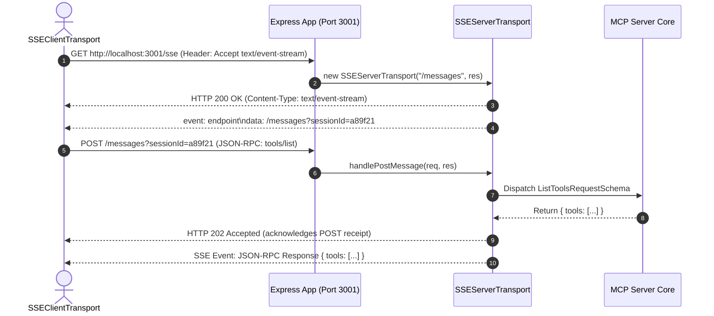

# Chapter 2 — Remote HTTP / SSE Transport & Express Streaming

## 1. Chapter Overview

While STDIO transport is ideal for local subprocesses (like desktop apps), remote MCP servers deployed in microservices, cloud containers, or serverless infrastructure require a network protocol.

MCP solves this using **HTTP with Server-Sent Events (SSE)**.

In this chapter, we will examine:
1. 🌐 The HTTP/SSE dual-channel transport pattern.
2. 📡 Server-Sent Events (`/sse`) vs HTTP POST payload endpoints (`/messages`).
3. 🛠️ Line-by-line breakdown of [server.mjs](file:///home/aminul/development/gen-ai-cohort/week08/learning/day15/code/mcp/02-http-sse-mcp-server/server.mjs).
4. 💻 Line-by-line breakdown of [client.mjs](file:///home/aminul/development/gen-ai-cohort/week08/learning/day15/code/mcp/02-http-sse-mcp-server/client.mjs) (including Node.js `EventSource` polyfilling).
5. 🚀 Execution walkthrough and network lifecycle.

---

## 2. HTTP / SSE Dual-Channel Architecture

Unlike WebSockets (which provide full-duplex TCP framing over a single socket), HTTP/SSE uses two separate HTTP channels to maximize firewall and proxy compatibility:

1. **Downstream Unidirectional Channel (`GET /sse`)**:
   - The client initiates an HTTP GET request with header `Accept: text/event-stream`.
   - The server leaves the HTTP connection open, streaming JSON-RPC response frames down to the client via SSE events.
   - Upon connection, the server sends an initial SSE event declaring the POST endpoint URL (e.g., `/messages?sessionId=...`).

2. **Upstream Command Channel (`POST /messages`)**:
   - For every request (`tools/list`, `tools/call`, `initialize`), the client sends an HTTP POST request carrying JSON-RPC payloads in the request body.
   - The server accepts the POST request and streams the corresponding response back over the open SSE connection.



---

## 3. Remote Server Walkthrough ([server.mjs](file:///home/aminul/development/gen-ai-cohort/week08/learning/day15/code/mcp/02-http-sse-mcp-server/server.mjs))

Let's examine how Express and `SSEServerTransport` are set up in `02-http-sse-mcp-server/server.mjs`.

### Step 1: Server Instantiation & Express Setup

```javascript
import express from "express";
import { Server } from "@modelcontextprotocol/sdk/server/index.js";
import { SSEServerTransport } from "@modelcontextprotocol/sdk/server/sse.js";
import {
  ListToolsRequestSchema,
  CallToolRequestSchema,
} from "@modelcontextprotocol/sdk/types.js";

const app = express();
const PORT = 3001;

// Initialize MCP Server instance
const server = new Server(
  {
    name: "http-sse-remote-mcp-server",
    version: "1.0.0",
  },
  {
    capabilities: {
      tools: {},
    },
  }
);
```

### Step 2: Defining Tools (`github_create_issue`, `stripe_refund_payment`)

```javascript
const TOOLS = [
  {
    name: "github_create_issue",
    description: "Creates a new issue in a specified GitHub repository",
    inputSchema: {
      type: "object",
      properties: {
        repo: { type: "string", description: "Repository full name e.g. owner/repo" },
        title: { type: "string", description: "Issue title" },
        body: { type: "string", description: "Issue body content" },
      },
      required: ["repo", "title"],
    },
  },
  {
    name: "stripe_refund_payment",
    description: "Processes a refund for a transaction ID",
    inputSchema: {
      type: "object",
      properties: {
        payment_id: { type: "string", description: "Target payment transaction ID" },
        reason: { type: "string", description: "Reason for refund" },
      },
      required: ["payment_id"],
    },
  },
];
```

### Step 3: Tool Execution Handlers

```javascript
server.setRequestHandler(ListToolsRequestSchema, async () => {
  return { tools: TOOLS };
});

server.setRequestHandler(CallToolRequestSchema, async (request) => {
  const { name, arguments: args } = request.params;
  console.log(`[HTTP/SSE Server] Call tool '${name}':`, args);

  if (name === "github_create_issue") {
    return {
      content: [
        {
          type: "text",
          text: JSON.stringify({
            issue_id: Math.floor(Math.random() * 1000) + 1,
            repo: args.repo,
            title: args.title,
            status: "open",
            url: `https://github.com/${args.repo}/issues/101`,
          }, null, 2),
        },
      ],
    };
  }

  if (name === "stripe_refund_payment") {
    return {
      content: [
        {
          type: "text",
          text: JSON.stringify({
            refund_id: `re_${Math.random().toString(36).substring(2, 8)}`,
            payment_id: args.payment_id,
            status: "succeeded",
            amount_refunded: "$49.99",
          }, null, 2),
        },
      ],
    };
  }

  throw new Error(`Tool '${name}' not recognized.`);
});
```

### Step 4: Express Endpoint Binding

```javascript
let transport;

// 1. SSE Stream Endpoint
app.get("/sse", async (req, res) => {
  console.log("[HTTP/SSE Server] New client connected to SSE endpoint.");
  transport = new SSEServerTransport("/messages", res);
  await server.connect(transport);
});

// 2. HTTP POST Message Endpoint
app.post("/messages", async (req, res) => {
  console.log("[HTTP/SSE Server] Received message on /messages endpoint.");
  if (transport) {
    await transport.handlePostMessage(req, res);
  } else {
    res.status(400).send("No active SSE connection.");
  }
});

app.listen(PORT, () => {
  console.log(`🌐 HTTP/SSE MCP Server running at http://localhost:${PORT}/sse`);
});
```

---

## 4. Remote Client Walkthrough ([client.mjs](file:///home/aminul/development/gen-ai-cohort/week08/learning/day15/code/mcp/02-http-sse-mcp-server/client.mjs))

In Node.js, standard runtime environments lack native browser `EventSource`. We polyfill `EventSource` using the `eventsource` package before connecting:

```javascript
import { Client } from "@modelcontextprotocol/sdk/client/index.js";
import { SSEClientTransport } from "@modelcontextprotocol/sdk/client/sse.js";
import { EventSource } from "eventsource";

// Polyfill EventSource if not in global scope
if (typeof globalThis.EventSource === "undefined") {
  globalThis.EventSource = EventSource;
}

async function runSSEClient() {
  console.log("🌐 Connecting to Remote HTTP/SSE MCP Server at http://localhost:3001/sse...");

  const serverUrl = new URL("http://localhost:3001/sse");
  const transport = new SSEClientTransport(serverUrl);

  const client = new Client(
    { name: "example-http-sse-client", version: "1.0.0" },
    { capabilities: {} }
  );

  // Connect via SSE Transport
  await client.connect(transport);
  console.log("✅ Connected via HTTP/SSE Transport.");

  // 1. Discover tools over HTTP/SSE
  console.log("\n📋 Requesting tools list...");
  const toolsResponse = await client.listTools();
  console.log("Available Remote Tools:", toolsResponse.tools.map((t) => t.name));

  // 2. Call remote tool 'github_create_issue'
  console.log("\n🐙 Invoking 'github_create_issue' over HTTP/SSE...");
  const issueResult = await client.callTool({
    name: "github_create_issue",
    arguments: {
      repo: "Amie-dev/Gen-AI-Cohort-2026",
      title: "Fix transport connection timeout",
      body: "Investigating SSE event listener persistence.",
    },
  });
  console.log("Remote Tool Result:\n", issueResult.content[0].text);

  await client.close();
  console.log("👋 HTTP/SSE Client session closed.");
  process.exit(0);
}

runSSEClient().catch((err) => {
  console.error("❌ HTTP/SSE Client Error:", err);
  process.exit(1);
});
```

---

## 5. Execution Demo

### Step 1: Start Remote Server
In Terminal 1:

```bash
cd week08/learning/day15/code/mcp
npm run server:sse
```

Server output:
```text
🌐 HTTP/SSE MCP Server running at http://localhost:3001/sse
```

### Step 2: Run Remote Client
In Terminal 2:

```bash
cd week08/learning/day15/code/mcp
npm run client:sse
```

Client output:
```text
🌐 Connecting to Remote HTTP/SSE MCP Server at http://localhost:3001/sse...
✅ Connected via HTTP/SSE Transport.

📋 Requesting tools list...
Available Remote Tools: [ 'github_create_issue', 'stripe_refund_payment' ]

🐙 Invoking 'github_create_issue' over HTTP/SSE...
Remote Tool Result:
 {
  "issue_id": 482,
  "repo": "Amie-dev/Gen-AI-Cohort-2026",
  "title": "Fix transport connection timeout",
  "status": "open",
  "url": "https://github.com/Amie-dev/Gen-AI-Cohort-2026/issues/101"
}
👋 HTTP/SSE Client session closed.
```

---

## 6. Summary & Next Steps

In this chapter, we learned:
- How HTTP/SSE decouples server streaming (`/sse`) from client request posting (`/messages`).
- How `SSEServerTransport` manages session routing in Express.
- How to connect Node.js clients using `SSEClientTransport` and `EventSource` polyfilling.

In [Chapter 3](chapter-03-mcp-gateway-router.md), we will tackle enterprise scale by building a **Centralized MCP Gateway** that aggregates tools, filters out irrelevant schemas, and prevents **Tool Context Poisoning**.
