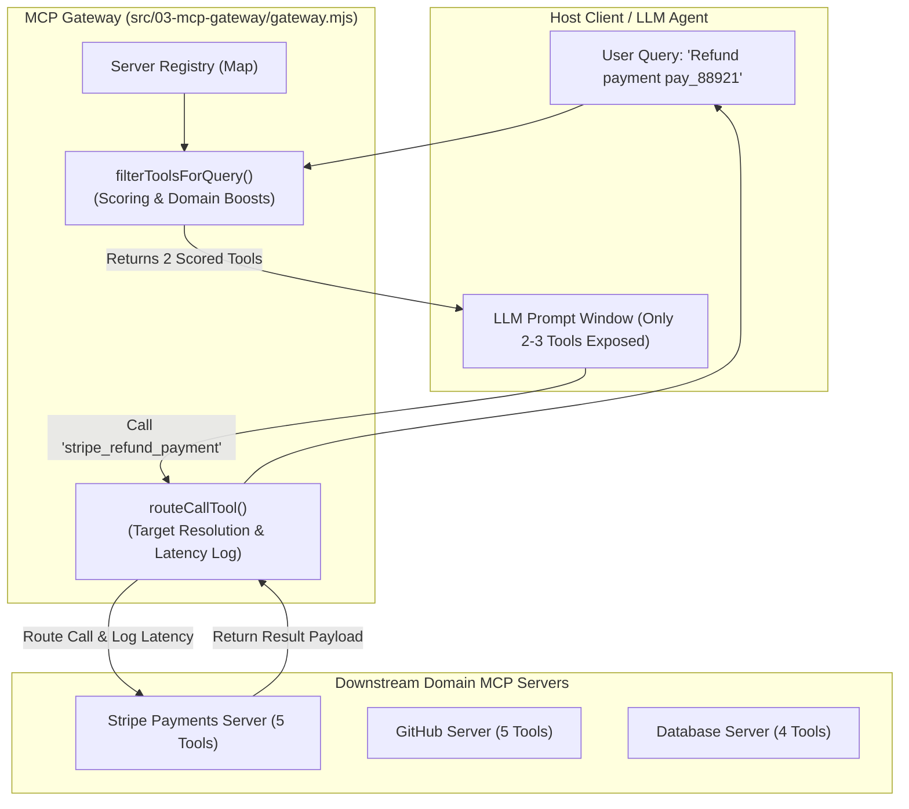

# Chapter 3 — MCP Gateway, Intent-Based Tool Filtering & Context Poisoning Mitigation

## 1. Chapter Overview

As enterprises scale their Model Context Protocol adoption, they inevitably encounter the **Tool Context Poisoning** bottleneck: as dozens of downstream MCP servers register hundreds of tools, passing all raw tool definitions directly to an LLM degrades reasoning, causes schema hallucination, and inflates API costs.

The solution is an enterprise **MCP Gateway**.

In this chapter, we will examine:
1. ⚠️ What is **Tool Context Poisoning** and why does it break LLMs?
2. 🚪 The 3 core roles of an MCP Gateway: **Aggregation**, **Intent Filtering**, and **Routed Interception**.
3. 🛠️ Line-by-line walkthrough of [gateway.mjs](file:///home/aminul/development/gen-ai-cohort/week08/learning/day15/code/mcp/03-mcp-gateway/gateway.mjs).
4. 💻 Line-by-line walkthrough of [demo.mjs](file:///home/aminul/development/gen-ai-cohort/week08/learning/day15/code/mcp/03-mcp-gateway/demo.mjs).
5. 📊 Comparative benchmark results ("Without Gateway" vs "With Gateway").

---

## 2. The Tool Context Poisoning Problem

When an LLM system prompt is populated with raw tool definitions, every tool consumes context window space.

### The Impact of 50+ Tools

```text
┌────────────────────────────────────────────────────────────────────────┐
│                        LLM SYSTEM PROMPT                               │
│                                                                        │
│  Tool 1: stripe_create_charge    InputSchema: { ... }                 │
│  Tool 2: stripe_refund_payment   InputSchema: { ... }                 │
│  Tool 3: stripe_list_invoices    InputSchema: { ... }                 │
│  ...                                                                   │
│  Tool 49: db_explain_query       InputSchema: { ... }                 │
│  Tool 50: github_add_reviewer    InputSchema: { ... }                 │
│  --------------------------------------------------------------------  │
│  Total Tokens Consumed: ~18,500 tokens BEFORE user prompt!              │
└────────────────────────────────────────────────────────────────────────┘
```

### Consequences:

1. **Massive Token Inflation**: Standard queries cost $0.25+ per request just in system prompt tool schemas.
2. **Context Poisoning / Schema Confusion**: The LLM confuses argument names across similar tools (e.g., passing `payment_id` to `github_create_issue`).
3. **Latency Degradation**: LLM processing time increases exponentially with bloated tool lists.

---

## 3. Architecture of the MCP Gateway

The **MCP Gateway** acts as a reverse proxy sitting between the LLM Host Client and downstream domain MCP servers.



---

## 4. Gateway Implementation Walkthrough ([gateway.mjs](file:///home/aminul/development/gen-ai-cohort/week08/learning/day15/code/mcp/03-mcp-gateway/gateway.mjs))

Let's dissect the core `MCPGateway` class implementation.

### Step 1: Registry & Server Registration

```javascript
export class MCPGateway {
  constructor() {
    this.registeredServers = new Map();
    this.totalRegisteredToolsCount = 0;
  }

  /**
   * Register a domain MCP server with its tools
   */
  registerServer(serverId, serverName, tools, executor) {
    this.registeredServers.set(serverId, {
      id: serverId,
      name: serverName,
      tools: tools,
      executor: executor,
    });
    this.totalRegisteredToolsCount += tools.length;
    console.log(`[MCP Gateway] Registered server '${serverName}' (${serverId}) with ${tools.length} tools.`);
  }

  /**
   * List ALL raw registered tools across all downstream MCP servers
   */
  getAllRawTools() {
    const allTools = [];
    for (const server of this.registeredServers.values()) {
      for (const tool of server.tools) {
        allTools.push({
          ...tool,
          serverId: server.id,
        });
      }
    }
    return allTools;
  }
```

### Step 2: Dynamic Intent Filtering Algorithm

`filterToolsForQuery()` scores tools based on keyword matches and domain boosts, filtering 14+ raw tools down to the top `maxTools` (default 3):

```javascript
  filterToolsForQuery(userQuery, maxTools = 3) {
    const allTools = this.getAllRawTools();
    const queryLower = userQuery.toLowerCase();

    // Score tools based on keyword matching in tool name & description
    const scoredTools = allTools.map((tool) => {
      let score = 0;
      const textToSearch = `${tool.name} ${tool.description} ${tool.serverId}`.toLowerCase();

      // Keyword matching heuristics
      const keywords = queryLower.split(/\s+/);
      for (const word of keywords) {
        if (word.length > 2 && textToSearch.includes(word)) {
          score += 2;
        }
      }

      // Domain-specific relevance boosts
      if (queryLower.includes("payment") || queryLower.includes("refund") || queryLower.includes("stripe")) {
        if (tool.serverId === "stripe-server") score += 5;
      }
      if (queryLower.includes("github") || queryLower.includes("issue") || queryLower.includes("repo") || queryLower.includes("pr")) {
        if (tool.serverId === "github-server") score += 5;
      }
      if (queryLower.includes("database") || queryLower.includes("sql") || queryLower.includes("query") || queryLower.includes("user")) {
        if (tool.serverId === "db-server") score += 5;
      }

      return { tool, score };
    });

    // Sort by score descending
    scoredTools.sort((a, b) => b.score - a.score);

    // Return top N tools with non-zero scores
    const topScored = scoredTools.filter((item) => item.score > 0).slice(0, maxTools);

    const resultTools = topScored.length > 0 
      ? topScored.map((item) => item.tool) 
      : allTools.slice(0, maxTools);

    console.log(`\n[MCP Gateway Filter] User Query: "${userQuery}"`);
    console.log(`[MCP Gateway Filter] Total Available: ${allTools.length} tools ➔ Filtered Down To: ${resultTools.length} tools`);

    return resultTools;
  }
```

### Step 3: Call Interception & Downstream Routing

When the LLM selects a tool, `routeCallTool()` resolves the target server, executes the request, and measures execution latency:

```javascript
  async routeCallTool(toolName, args) {
    console.log(`\n[MCP Gateway Router] Intercepting tool invocation for '${toolName}'...`);
    
    // Find which server owns this tool
    let targetServer = null;
    for (const server of this.registeredServers.values()) {
      if (server.tools.some((t) => t.name === toolName)) {
        targetServer = server;
        break;
      }
    }

    if (!targetServer) {
      throw new Error(`[MCP Gateway] Tool '${toolName}' not found on any registered downstream server.`);
    }

    console.log(`[MCP Gateway Router] Routing call to '${targetServer.name}' (${targetServer.id})...`);
    const startTime = Date.now();

    // Execute through downstream server handler
    const result = await targetServer.executor(toolName, args);

    const latency = Date.now() - startTime;
    console.log(`[MCP Gateway Audit Log] Tool '${toolName}' completed in ${latency}ms.`);

    return result;
  }
}
```

---

## 5. Gateway Demo Walkthrough ([demo.mjs](file:///home/aminul/development/gen-ai-cohort/week08/learning/day15/code/mcp/03-mcp-gateway/demo.mjs))

In `demo.mjs`, we register 3 downstream MCP servers representing Stripe Payments (5 tools), GitHub (5 tools), and PostgreSQL Database (4 tools):

```javascript
import { MCPGateway } from "./gateway.mjs";

async function runGatewayDemo() {
  const gateway = new MCPGateway();

  // Register 3 Downstream MCP Servers (14 Total Tools)
  gateway.registerServer("stripe-server", "Stripe Payments Server", [ ... ], async (tool, args) => { ... });
  gateway.registerServer("github-server", "GitHub Enterprise Server", [ ... ], async (tool, args) => { ... });
  gateway.registerServer("db-server", "PostgreSQL Database Server", [ ... ], async (tool, args) => { ... });

  // Scenario A: Without Gateway (14 Tools -> Context Bloat)
  console.log("❌ WITHOUT GATEWAY: LLM receives all 14 tool definitions causing context bloat!");

  // Scenario B: With Gateway Filtering for Payment Refund Query
  const userQuery1 = "I need to refund payment transaction pay_88921";
  const filteredTools1 = gateway.filterToolsForQuery(userQuery1, 2);

  // Route Call through Gateway
  const result1 = await gateway.routeCallTool("stripe_refund_payment", {
    payment_id: "pay_88921",
    reason: "Customer requested cancellation",
  });
  console.log("Routed Result:", result1);
}

runGatewayDemo().catch(console.error);
```

---

## 6. Execution Demo

To run the Gateway demonstration:

```bash
cd week08/learning/day15/code/mcp
npm run demo:gateway
```

### Expected Output

```text
============== 🚪 MCP GATEWAY & TOOL FILTERING DEMO ==============

[MCP Gateway] Registered server 'Stripe Payments Server' (stripe-server) with 5 tools.
[MCP Gateway] Registered server 'GitHub Enterprise Server' (github-server) with 5 tools.
[MCP Gateway] Registered server 'PostgreSQL Database Server' (db-server) with 4 tools.

Total registered tools in Gateway: 14

------------------------------------------------
❌ WITHOUT GATEWAY: LLM receives all 14 tool definitions in system prompt, causing context bloat!

[MCP Gateway Filter] User Query: "I need to refund payment transaction pay_88921"
[MCP Gateway Filter] Total Available: 14 tools ➔ Filtered Down To: 2 tools
Filtered Tools provided to LLM Context:
  - [stripe-server] stripe_refund_payment: Processes a refund for a transaction
  - [stripe-server] stripe_create_charge: Creates a new card payment charge

[MCP Gateway Router] Intercepting tool invocation for 'stripe_refund_payment'...
[MCP Gateway Router] Routing call to 'Stripe Payments Server' (stripe-server)...
[MCP Gateway Audit Log] Tool 'stripe_refund_payment' completed in 1ms.
Routed Result: {
  status: 'success',
  tool: 'stripe_refund_payment',
  processed_by: 'Stripe MCP Server',
  args: { payment_id: 'pay_88921', reason: 'Customer requested cancellation' }
}
```

---

## 7. Summary & Next Steps

In this chapter, we learned:
- How raw tool bloat causes **Context Poisoning** and token overhead.
- How an **MCP Gateway** uses heuristic scoring to dynamically serve only relevant tools.
- How centralized call routing provides latency tracking and payload audit logging.

In [Chapter 4](chapter-04-typescript-mcp-suite.md), we will conclude our guide by exploring the enterprise **TypeScript MCP Master Suite** in `week08/learning/day15/code/mcp-master`.
