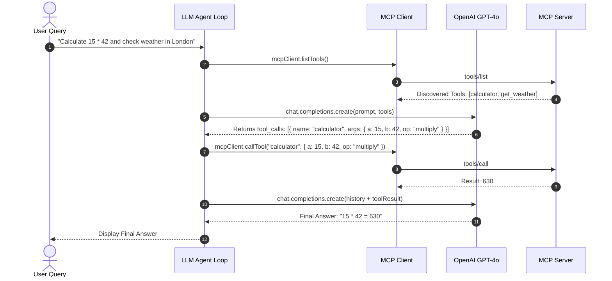

# Chapter 4 — Enterprise TypeScript MCP Suite (`mcp-master`)

## 1. Chapter Overview

In **Chapter 4**, we expand our implementation knowledge beyond standard MJS scripts into the production-grade **TypeScript MCP Suite** located inside `week08/learning/day15/code/mcp-master/src/`.

While basic MCP servers focus solely on tools, enterprise MCP servers also leverage **Resources** (read-only data streams), **Prompts** (standardized system instructions), and **Safety Guardrails**.

In this chapter, we will examine:
1. 📁 Folder overview of the 8 TypeScript projects in `mcp-master`.
2. 🧮 MCP Resources vs Tools vs Prompts.
3. 🛡️ SQL Safety Guardrails in Database MCP Servers (`03-database-mcp`).
4. 🤖 Integrating MCP Clients with OpenAI LLM ReAct Loops (`06-llm-agent-loop`).
5. 📊 Production Best Practices Checklist for MCP Deployment.

---

## 2. Directory & Module Overview (`mcp-master/src/`)

```text
mcp-master/src/
├── 01-calculator-mcp/      # Type-safe STDIO calculator server & client
├── 02-weather-mcp/         # Weather tools + MCP Resource endpoints + Prompt templates
├── 03-database-mcp/        # PostgreSQL tool server with SQL query guardrails
├── 04-github-mcp/          # GitHub API issue & repo management tools
├── 05-task-manager-mcp/    # Task state management with dynamic MCP resources
├── 06-llm-agent-loop/      # Autonomous OpenAI agent loop calling live MCP tools
├── 07-streamable-http-mcp/ # Enterprise TypeScript Express + SSE Server & Client
└── 08-mcp-gateway/         # Advanced TypeScript Gateway with Context Poisoning prevention
```

---

## 3. Beyond Tools: Resources & Prompts in MCP

MCP supports three primary primitive capabilities:

| Primitive | Purpose | Example Endpoint Schema | Read/Write |
| :--- | :--- | :--- | :--- |
| **Tools** | Executable actions that perform side-effects | `CallToolRequestSchema` | Read / Write |
| **Resources** | Read-only contextual data attached to system prompt | `ReadResourceRequestSchema` | Read-Only |
| **Prompts** | Reusable, parameterizable prompt templates | `GetPromptRequestSchema` | Structural |

### Resource Handler Example (`02-weather-mcp/server.ts` & `05-task-manager-mcp/server.ts`)

Servers expose read-only data streams via URI templates (e.g., `tasks://active` or `weather://city/goa`):

```typescript
import {
  ListResourcesRequestSchema,
  ReadResourceRequestSchema,
} from "@modelcontextprotocol/sdk/types.js";

// List available read-only resources
server.setRequestHandler(ListResourcesRequestSchema, async () => {
  return {
    resources: [
      {
        uri: "tasks://active",
        name: "Active Task Board",
        description: "Returns currently active project tasks",
        mimeType: "application/json",
      },
    ],
  };
});

// Serve resource content when requested
server.setRequestHandler(ReadResourceRequestSchema, async (request) => {
  const { uri } = request.params;
  if (uri === "tasks://active") {
    return {
      contents: [
        {
          uri: "tasks://active",
          mimeType: "application/json",
          text: JSON.stringify(activeTasksArray, null, 2),
        },
      ],
    };
  }
  throw new Error(`Resource '${uri}' not found.`);
});
```

---

## 4. SQL Safety Guardrails (`03-database-mcp`)

When building database MCP tools, exposing raw SQL execution to LLMs creates extreme vulnerability to destructive queries (`DROP TABLE`, `DELETE WITHOUT WHERE`).

The `03-database-mcp` server enforces strict input guardrails before executing queries:

```typescript
function validateSQLQuery(query: string): void {
  const normalized = query.trim().toUpperCase();

  // 1. Guardrail: Enforce Read-Only SELECT queries
  if (!normalized.startsWith("SELECT")) {
    throw new Error("Security Violation: Only SELECT read-only queries are permitted on this MCP database server.");
  }

  // 2. Guardrail: Prevent destructive keywords
  const forbiddenKeywords = ["DROP", "TRUNCATE", "DELETE", "UPDATE", "INSERT", "ALTER"];
  for (const keyword of forbiddenKeywords) {
    if (normalized.includes(keyword)) {
      throw new Error(`Security Violation: Query contains forbidden destructive keyword '${keyword}'.`);
    }
  }
}
```

---

## 5. Autonomous LLM Agent Loop Integration (`06-llm-agent-loop`)

In `06-llm-agent-loop/agent.ts`, the MCP Client bridges the gap between an LLM agent and external tools:



---

## 6. Enterprise Production Best Practices Checklist

When deploying Model Context Protocol (MCP) in production environments:

- [x] **Transport Isolation**: Use STDIO for local tools inside desktop hosts; use HTTP/SSE behind API Gateways for remote cloud microservices.
- [x] **Logging Safety**: Always log diagnostic messages to `stderr` in STDIO mode; never emit unformatted text to `stdout`.
- [x] **Context Poisoning Prevention**: Deploy an **MCP Gateway** to dynamically filter tools down to top 2-3 matches based on user query intent.
- [x] **Input Guardrails**: Validate all tool parameter arguments using JSON Schema and sanitization logic (SQL guardrails, path traversal checks).
- [x] **EventSource Polyfill**: Ensure Node.js remote clients polyfill `globalThis.EventSource` when running outside browser environments.
- [x] **Graceful Shutdown**: Implement cleanup handlers on SIGINT/SIGTERM to terminate child processes and release HTTP/SSE connections.

---

## 7. Summary

Congratulations! You have completed the **Model Context Protocol (MCP) Implementation Guide**.

With these implementations, you can build:
1. Robust **STDIO MCP Servers** for local subprocess execution.
2. Cloud-ready **HTTP/SSE MCP Servers** on Express.
3. Centralized **MCP Gateways** that prevent Context Poisoning.
4. Autonomous **LLM Agent Loops** powered by type-safe TypeScript MCP tools.
