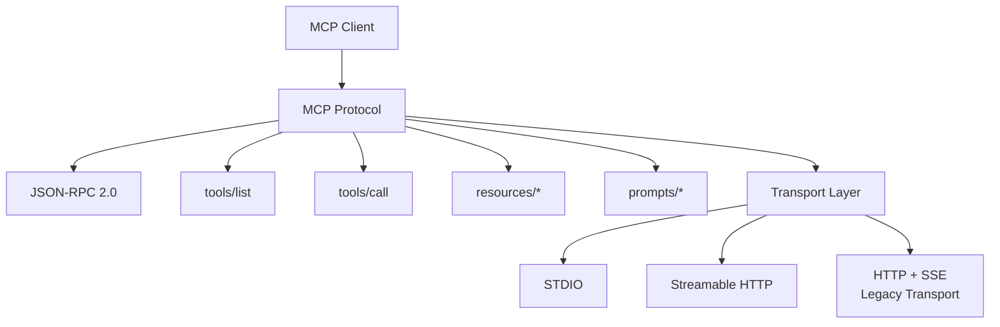
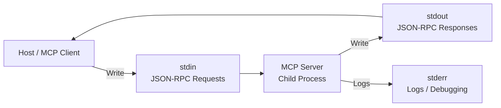
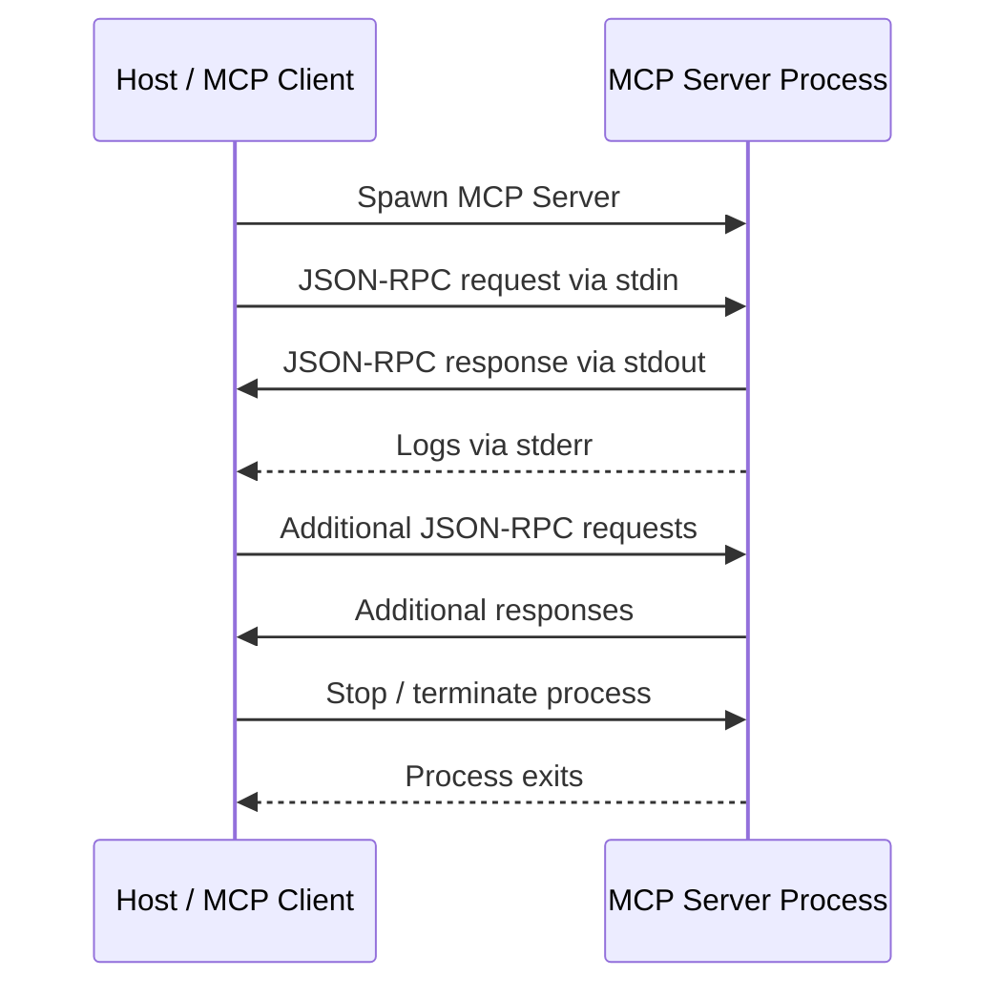
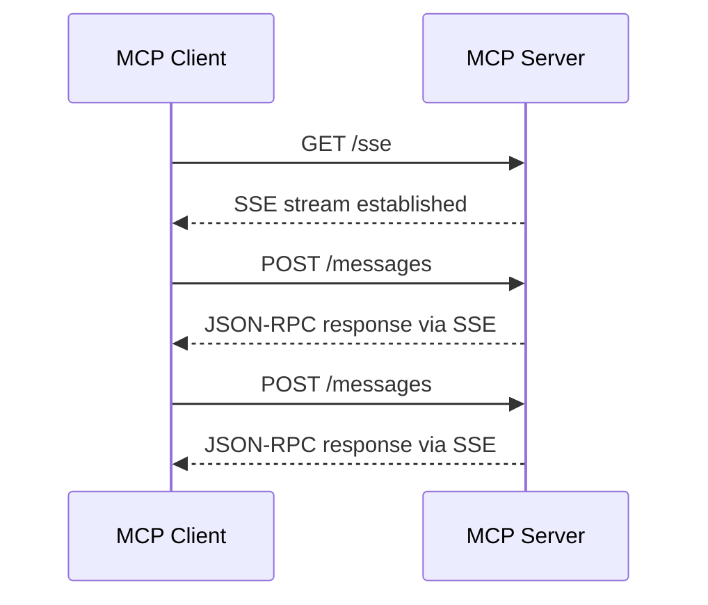
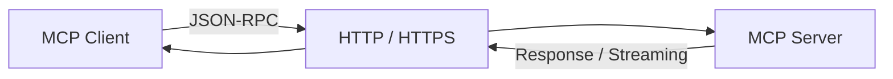
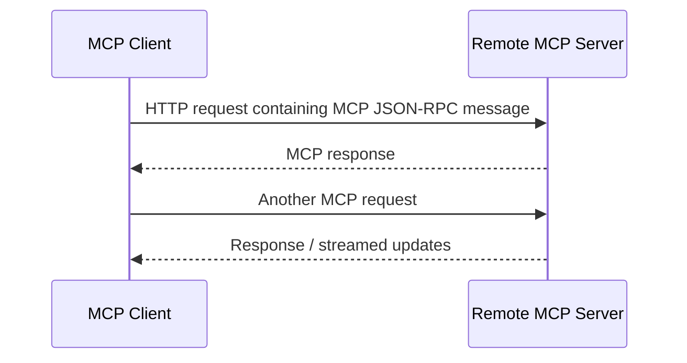
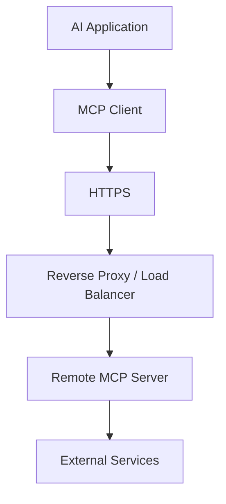
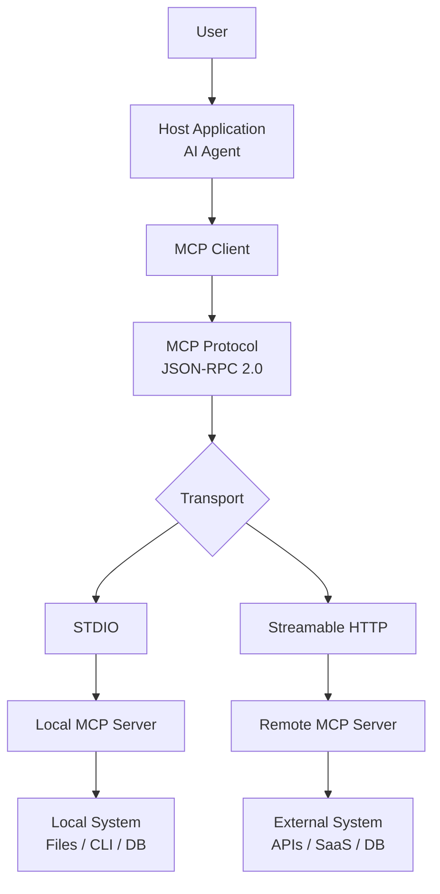

# 🚚 Chapter 3: MCP Transports — STDIO & HTTP

---

## 🎯 Learning Objectives

By the end of this chapter, you will understand:

* What a **Transport** means in MCP.
* How **STDIO Transport** enables communication with local MCP servers.
* How **HTTP-based transports** enable communication with remote MCP servers.
* The difference between **legacy HTTP + SSE** and modern **Streamable HTTP**.
* How JSON-RPC messages travel between an MCP Client and MCP Server.
* The architectural differences between STDIO and HTTP.
* When to choose each transport for your application.

---

# 1. 🚚 What Is a Transport in MCP?

In MCP, the **protocol** defines *what* messages are exchanged, while the **transport** defines *how those messages are delivered* between the MCP Client and MCP Server.

MCP uses **JSON-RPC 2.0** for its protocol messages.



### Simple mental model

> **Protocol = What is being communicated**
> **Transport = How it is communicated**

For example:

```text
tools/call
     ↓
JSON-RPC message
     ↓
Transport
     ↓
MCP Server
```

The same MCP protocol concepts can therefore be carried over different transport mechanisms.

---

# 2. 🖥️ STDIO Transport

**STDIO** stands for:

> **Standard Input / Standard Output**

STDIO is designed primarily for **local MCP servers**.

With STDIO, the MCP Client launches the MCP Server as a local process and communicates with it through operating-system pipes.

For example:

```text
node server.js
python server.py
```

The MCP Server runs as a child process of the Host/Application.

---

## 🔄 How STDIO Works

The basic flow is:



### Step-by-step

### 1. Client starts the server

The Host/MCP Client launches the MCP Server.

```text
MCP Client
    ↓
spawn
    ↓
node server.js
```

### 2. Client sends requests through `stdin`

The client writes JSON-RPC messages to the server's standard input.

```text
Client
   │
   │ JSON-RPC Request
   ▼
stdin
   │
   ▼
MCP Server
```

### 3. Server sends responses through `stdout`

The server writes protocol responses to standard output.

```text
MCP Server
   │
   │ JSON-RPC Response
   ▼
stdout
   │
   ▼
MCP Client
```

### 4. Logs go to `stderr`

This is extremely important.

```text
stdout → MCP protocol messages
stderr → Logs / debugging
```

For example, in Node.js:

```javascript
console.error("MCP server started");
```

rather than:

```javascript
console.log("MCP server started");
```

when using a STDIO MCP server.

Why?

Because `stdout` is reserved for MCP protocol communication. Arbitrary logs written there can interfere with the client's JSON-RPC message parsing.

---

# 3. 🔄 STDIO Lifecycle



---

# 4. ✅ Advantages of STDIO

### 1. Local communication

No network connection is required.

```text
Host
 ↓
OS Pipe
 ↓
MCP Server
```

### 2. Low communication overhead

Communication happens through local operating-system pipes rather than a network connection.

This can make STDIO very efficient for local tools.

### 3. No network port required

A local STDIO server does not need to expose an HTTP endpoint.

### 4. Simple process lifecycle

The Host can start and stop the MCP Server process.

### 5. Excellent for local development

Typical use cases include:

* Local files
* Local CLI tools
* Development tools
* Local databases
* Desktop AI applications

---

# 5. ❌ Limitations of STDIO

STDIO is primarily designed for **local process communication**.

Therefore:

* The server normally needs to run on the same machine as the Host.
* It is not naturally designed for shared remote access.
* Multiple remote users cannot directly connect to the same STDIO process over the network.
* Remote access would require additional mechanisms such as SSH or another intermediary.

### Mental model

```text
STDIO

Same machine
┌────────────────────────────┐
│ Host                       │
│   │                        │
│   ▼                        │
│ MCP Client                 │
│   │                        │
│   ▼                        │
│ MCP Server Process         │
└────────────────────────────┘
```

---

# 6. 🌐 HTTP-Based MCP Transport

When an MCP Server needs to be accessed remotely, an HTTP-based transport can be used.


This allows the MCP Server to run on:

* Cloud infrastructure
* A remote server
* A container
* Enterprise infrastructure
* A hosted SaaS platform

---

# 7. 📡 HTTP + SSE — Legacy Transport

Older MCP implementations commonly used **HTTP + Server-Sent Events (SSE)**.

SSE allows a server to maintain a long-lived HTTP connection and send events to the client.

A simplified historical flow looks like this:



The important idea is:

```text
Client
   │
   ├── HTTP request ──────────► Server
   │
   │◄──── SSE stream ───────── Server
   │
   └── JSON-RPC messages
```

### ⚠️ Important

If you are learning from older MCP tutorials, you may see:

```text
HTTP + SSE
/sse
/message
```

This is why understanding SSE is still useful.

However, **modern MCP uses Streamable HTTP for HTTP-based transport**, so new implementations should generally follow the current MCP specification rather than older SSE-only tutorials.

---

# 8. 🚀 Streamable HTTP

**Streamable HTTP** is the modern HTTP-based MCP transport.

It allows MCP communication to take place over HTTP while supporting both ordinary request/response communication and streaming when needed.

Conceptually:



This makes MCP suitable for remote deployments.

For example:

```text
AI Application
      ↓
MCP Client
      ↓
HTTPS
      ↓
Cloud MCP Server
      ↓
Stripe / GitHub / Database / Internal API
```

---

# 9. 🔄 Streamable HTTP Request Flow

A simplified interaction can look like:



Unlike STDIO, the communication is now happening across a network.

Therefore, normal web infrastructure becomes relevant:

```text
Client
  ↓
HTTPS
  ↓
Load Balancer / Proxy
  ↓
MCP Server
  ↓
External Services
```

---

# 10. 🏢 Remote MCP Architecture

A typical cloud deployment might look like:



This architecture can support centralized MCP services used by multiple clients, subject to the server's authentication, authorization, session, and deployment design.

---

# 11. ⚖️ STDIO vs HTTP

| Feature                | STDIO                                 | Streamable HTTP                  |
| ---------------------- | ------------------------------------- | -------------------------------- |
| **Typical location**   | Local machine                         | Remote / Cloud                   |
| **Communication**      | OS stdin/stdout                       | HTTP / HTTPS                     |
| **Network required**   | No                                    | Yes                              |
| **Process management** | Host can launch process               | External deployment              |
| **Remote access**      | Not native                            | Yes                              |
| **Shared service**     | Not the typical use case              | Well suited                      |
| **Authentication**     | Usually local OS/process controls     | HTTP auth/security mechanisms    |
| **Typical use**        | Local tools, files, CLI, desktop apps | SaaS, enterprise, cloud services |
| **Latency**            | Local IPC overhead                    | Depends on network and server    |
| **Infrastructure**     | Simple                                | Web/server infrastructure        |

### Important correction

Avoid hard-coding values such as:

```text
STDIO = <1ms
HTTP = 10–200ms
```

These are not universal MCP guarantees.

Actual latency depends on:

* Machine
* Network
* Region
* Server workload
* Proxy
* Database/API calls
* Processing time

---

# 12. 🧠 When Should You Use STDIO?

Use **STDIO** when the MCP Server is intended to run locally with the Host.

Examples:

```text
Local file system
       ↓
STDIO MCP Server

Local CLI
       ↓
STDIO MCP Server

Local development tool
       ↓
STDIO MCP Server
```

Typical scenario:

> "I want my desktop AI application to access tools installed on my computer."

STDIO is a natural fit.

---

# 13. 🌍 When Should You Use Streamable HTTP?

Use **Streamable HTTP** when the MCP Server needs to be accessed through a network.

Examples:

```text
Company API
     ↓
Remote MCP Server
     ↓
HTTPS
     ↓
AI Applications
```

Typical scenarios:

* Cloud-hosted MCP servers
* Enterprise integrations
* Shared internal services
* SaaS integrations
* Remote databases/services
* Multi-user applications

---

# 14. 🔐 Security Considerations

Transport choice also affects security architecture.

### STDIO

Security is primarily influenced by:

* Local OS permissions
* Process isolation
* File permissions
* Which commands the server can execute
* What credentials are available to the process

### HTTP

Remote MCP servers need proper network security.

Common considerations include:

* HTTPS/TLS
* Authentication
* Authorization
* Credential management
* Rate limiting
* Input validation
* Access control
* Logging and monitoring

A remote MCP server should **not** be exposed publicly without appropriate security controls.

---

# 15. 🧩 Complete MCP Communication Model



---

# 📌 Key Rules to Remember

### Rule 1 — Protocol ≠ Transport

```text
JSON-RPC
   ↓
defines MCP messages

Transport
   ↓
moves those messages
```

---

### Rule 2 — STDIO is primarily local

```text
Host
 ↓
MCP Client
 ↓
stdin/stdout
 ↓
Local MCP Server
```

---

### Rule 3 — Streamable HTTP is for network communication

```text
Host
 ↓
MCP Client
 ↓
HTTPS
 ↓
Remote MCP Server
```

---

### Rule 4 — Keep STDIO stdout clean

```text
stdout → MCP JSON-RPC
stderr → Logs
```

Do not print arbitrary debugging information to `stdout` in a STDIO MCP server.

---

### Rule 5 — Know the SSE terminology

```text
Older MCP implementations
        ↓
HTTP + SSE

Modern HTTP transport
        ↓
Streamable HTTP
```

So if you see `/sse` and `/message` in an old tutorial, don't confuse it with the current Streamable HTTP architecture.

---

# 🧠 Interview Questions

### Q1. What is an MCP Transport?

A transport defines how MCP protocol messages are exchanged between an MCP Client and MCP Server.

### Q2. What protocol does MCP use for messages?

**JSON-RPC 2.0.**

### Q3. What is STDIO?

A local transport where the MCP Client communicates with a server process through standard input and standard output.

### Q4. Why should STDIO servers avoid logging to stdout?

Because stdout carries protocol messages. Arbitrary logs can interfere with JSON-RPC message parsing.

### Q5. Where should STDIO logs go?

Typically **stderr**.

### Q6. What is Streamable HTTP?

The modern HTTP-based MCP transport designed for communication with remote MCP servers.

### Q7. What is SSE?

**Server-Sent Events.** It was used by earlier MCP HTTP transport implementations and may appear in older MCP examples.

### Q8. Can STDIO communicate with a remote MCP server?

Not directly as its normal operating model. STDIO is intended for local process communication.

### Q9. Why use HTTP for MCP?

It enables MCP Servers to run remotely and be accessed through network infrastructure.

### Q10. Which transport should you choose?

```text
Local MCP Server
      ↓
    STDIO

Remote MCP Server
      ↓
Streamable HTTP
```

---

# 🎯 Chapter 3 Summary

MCP separates **protocol logic from transport**.

The protocol uses **JSON-RPC 2.0** to represent MCP messages, while the transport determines how those messages travel between the Client and Server.

```text
                    MCP
                     │
            ┌────────┴────────┐
            │                 │
        Protocol           Transport
            │                 │
       JSON-RPC 2.0      ┌────┴─────┐
                         │          │
                       STDIO   Streamable HTTP
                         │          │
                       Local      Remote
```

### Final Memory Trick

> **STDIO → Local Process**
> **Streamable HTTP → Remote Server**
> **JSON-RPC → MCP Messages**

### Chapter 3 in one sentence

> **MCP Transport defines how JSON-RPC messages move between the MCP Client and Server, with STDIO primarily serving local processes and Streamable HTTP enabling remote communication.**


