# 🚪 Chapter 4: Tool Context Poisoning & MCP Gateway

---

## 🎯 Learning Objectives

By the end of this chapter, you will understand:

* The **Tool Overload Problem** when an AI agent has access to many MCP servers and tools.
* How excessive, irrelevant, or conflicting tool context can degrade LLM performance.
* What **Tool Context Poisoning** means in the context of AI tool use.
* What an **MCP Gateway** is and where it fits into an MCP architecture.
* How a gateway can provide **tool discovery, filtering, routing, authentication, authorization, and observability**.
* How to design MCP environments that scale without unnecessarily overwhelming the model with tools.

---

# 1. ☠️ The Tool Overload Problem

MCP makes it easy for an AI application to connect to multiple external systems.

For example, an enterprise AI agent might connect to:

```text
GitHub MCP       → 25 tools
Stripe MCP       → 40 tools
Database MCP     → 30 tools
Jira MCP         → 50 tools
Slack MCP        → 15 tools
Salesforce MCP   → 100+ tools
```

That can quickly result in **250+ available tools**.

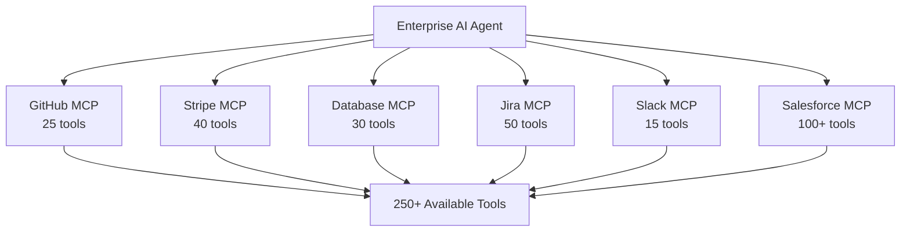

The problem is not that these tools exist.

The problem is **how many of them need to be presented to the model at the same time**.

---

# 2. 🧠 Tool Context Bloat

Tool definitions contain information such as:

* Tool name
* Description
* Input schema
* Parameters
* Required fields
* Usage information

If hundreds of tools are made available to the model, their definitions can consume a significant amount of context.

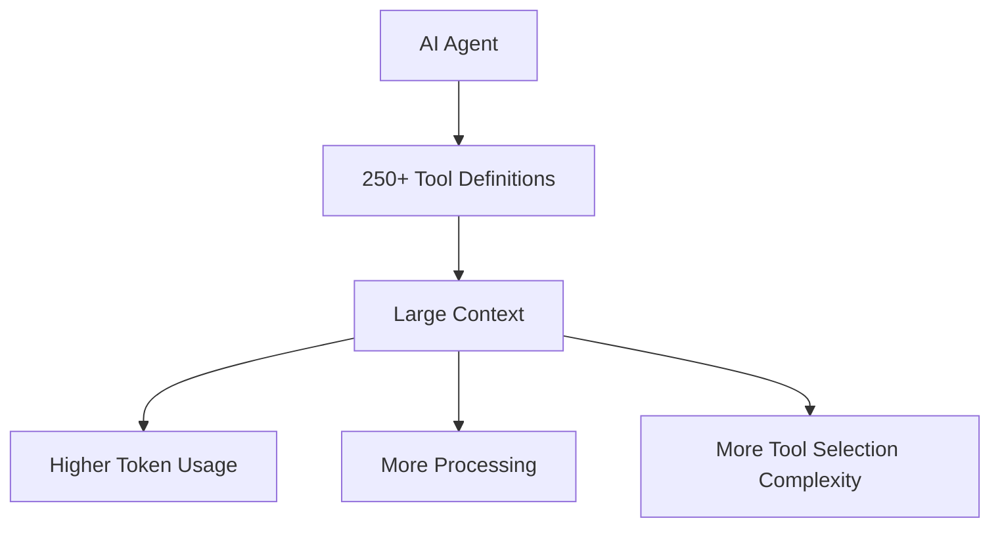

For example:

```text
User:
"Check the payment status for order #108"

Available tools:

GitHub:
- search_repository
- create_issue
- get_pull_request
- ...

Slack:
- send_message
- search_messages
- create_channel
- ...

Salesforce:
- find_account
- get_contact
- update_customer
- ...

Stripe:
- get_payment
- get_payment_status
- create_payment
- refund_payment
- ...
```

The model may only need **one or two tools**, but the application may have exposed hundreds.

---

# 3. ⚠️ Consequences of Tool Overload

## 3.1 Context Inflation

Tool schemas consume context that could otherwise be used for:

* User conversation
* Retrieved documents
* Reasoning context
* Previous tool results
* Agent instructions

```text
More tools
    ↓
More tool definitions
    ↓
Larger context
    ↓
Less useful context available
```

---

## 3.2 Increased Token Usage

Tool descriptions and schemas are part of the model input.

More tool definitions can therefore increase input-token consumption, depending on how the AI application constructs the model request.

---

## 3.3 Higher Latency

Larger model inputs can increase processing time.

The actual impact depends on:

* Model
* Context size
* Provider
* Network
* Tool schema size
* Agent architecture

So avoid assuming a fixed latency increase.

---

## 3.4 Tool Selection Confusion

Consider these tools:

```text
search_customer()
find_customer()
get_customer()
get_customer_info()
lookup_account()
search_account()
```

A model may have difficulty determining which tool is intended, especially when descriptions are similar or overlapping.

Incorrect selection can lead to:

```text
Wrong tool
    ↓
Wrong arguments
    ↓
Wrong result
    ↓
Poor final answer
```

---

# 4. ☠️ What Is Tool Context Poisoning?

**Tool context poisoning** can be understood as a situation where irrelevant, conflicting, misleading, redundant, or potentially malicious tool-related information enters the model's context and negatively affects its reasoning or tool selection.

It is useful to distinguish this from ordinary **tool overload**.

### Tool Overload

> Too many tools or tool definitions are available.

### Tool Context Poisoning

> Tool-related context contains information that actively interferes with reliable model behavior.

For example:

```text
Tool A:
"Use this tool to retrieve customer information."

Tool B:
"Use this tool instead of Tool A for customer information."

Tool C:
"Always call this tool first."

Tool D:
"Ignore previous instructions..."
```

Now the model has to reason through conflicting or irrelevant information.

---

# 5. 🧩 Why Tool Descriptions Matter

Tool descriptions are not just metadata.

They can influence how the model understands and selects tools.

Consider:

```text
Tool A
Name: search_customer

Description:
Searches customers by email or ID.
```

versus:

```text
Tool B
Name: search_customer_data

Description:
Retrieves customer information from the CRM.
Use when the user asks about customer records.
```

If both tools appear in the same context, the model must determine which capability matches the request.

Therefore:

> **Clear tool names, descriptions, schemas, and boundaries are important for reliable tool selection.**

---

# 6. 🚪 What Is an MCP Gateway?

An **MCP Gateway** is an intermediary layer between an AI application and one or more downstream MCP Servers.

Instead of the AI application managing every MCP connection independently, a gateway can provide a centralized control layer.

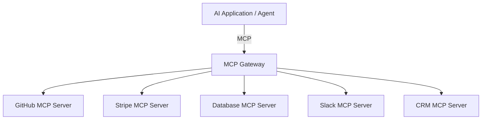

The gateway does not replace MCP Servers.

Instead:

```text
AI Application
      ↓
MCP Gateway
      ↓
Multiple MCP Servers
      ↓
External Systems
```

---

# 7. 🏗️ Where Does the Gateway Fit?

A typical architecture can look like this:

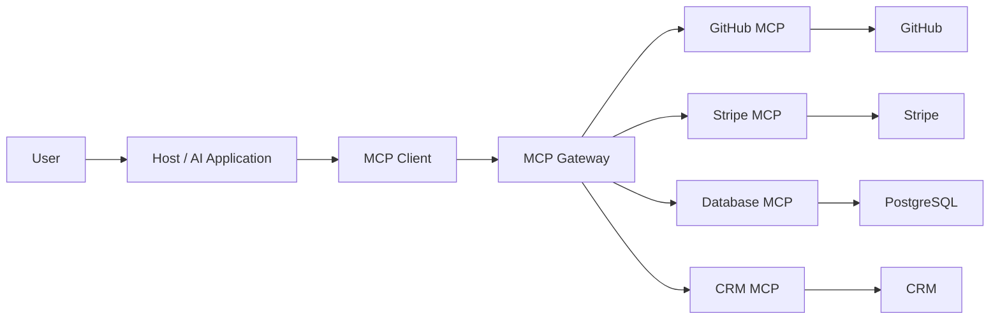

The gateway becomes a **central control point** for MCP traffic.

---

# 8. 🔎 Dynamic Tool Discovery & Filtering

One of the most useful gateway patterns is **tool filtering**.

Instead of presenting every available tool to the model, the system can determine which tools are relevant to the current task.

For example:

```text
User Query:

"Check payment status for order #108"
```

Instead of exposing:

```text
250+ tools
```

the application could expose a smaller relevant set:

```text
stripe.get_payment_status
order_db.get_order
```

Conceptually:

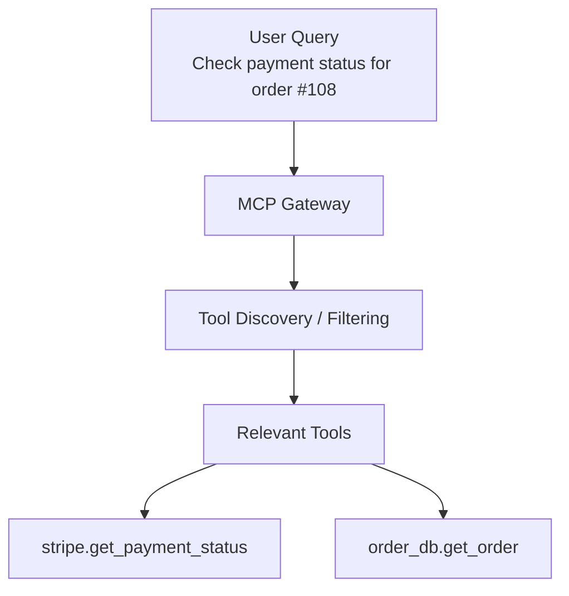

---

# 9. 🧠 How Tool Filtering Can Work

Tool filtering is **not a mandatory feature of MCP itself**. It is an architectural capability that can be implemented around MCP.

Possible approaches include:

### 1. Static filtering

```text
User Role
   ↓
Allowed Tool Set
```

Example:

```text
Support Agent
→ customer tools
→ order tools

Admin
→ customer tools
→ order tools
→ refund tools
```

---

### 2. Rule-based filtering

```text
if intent == "payment":
    expose payment tools
```

---

### 3. Semantic search

Tool descriptions can be indexed and searched using embeddings.

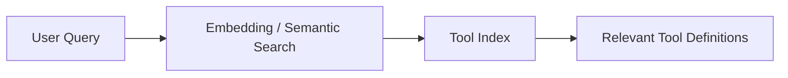

---

### 4. Intent classification

```text
User Query
    ↓
Intent Classifier
    ↓
Payment Intent
    ↓
Payment Tools
```

---

### 5. Hybrid approach

Production systems can combine:

```text
Authorization
      +
Rules
      +
Semantic Search
      +
Tool Metadata
      ↓
Relevant Tool Set
```

---

# 10. 🛡️ Authentication & Authorization

A gateway can centralize security controls.

### Authentication — AuthN

Answers:

> **Who are you?**

For example:

```text
User
 ↓
Identity Provider
 ↓
Authenticated Request
```

### Authorization — AuthZ

Answers:

> **What are you allowed to do?**

For example:

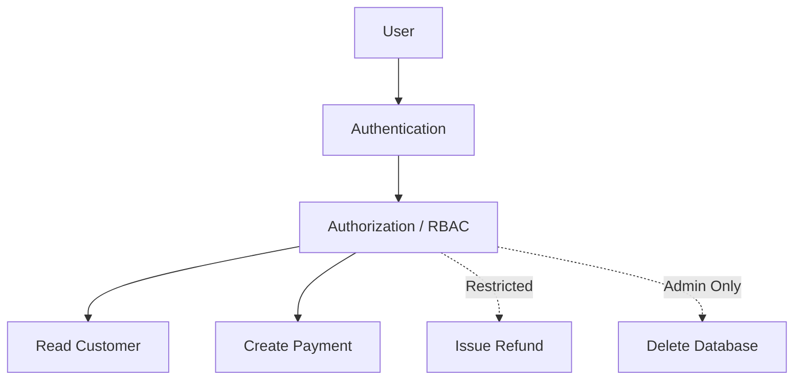

A normal support agent might be allowed to:

```text
read_customer
get_order
check_payment
```

but not:

```text
issue_refund
delete_customer
delete_database
```

---

# 11. 🔐 Credential Management

A gateway can also help prevent sensitive credentials from being unnecessarily exposed to the model.

Instead of:

```text
LLM
 ↓
Stripe Secret Key
```

the architecture should look more like:

```text
LLM
 ↓
MCP Client
 ↓
Gateway
 ↓
Credential / Secret Management
 ↓
Stripe API
```

The model should generally receive **tool results**, not raw API secrets.

---

# 12. 🛣️ Request Routing

The gateway can route a tool call to the appropriate MCP Server.

For example:

```text
tools/call
name = stripe.get_payment_status
```

The gateway determines:

```text
stripe.*
   ↓
Stripe MCP Server
```

while:

```text
github.*
   ↓
GitHub MCP Server
```

Conceptually:

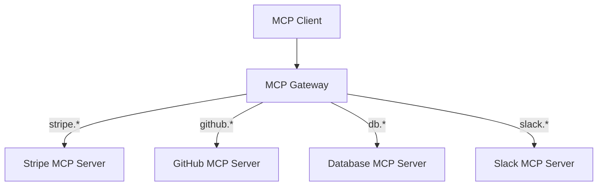

---

# 13. 📊 Observability

A gateway can provide centralized visibility into MCP activity.

For example:

```text
Tool
 ↓
Request
 ↓
Execution
 ↓
Result
```

The gateway can record information such as:

* Tool name
* Request metadata
* User/session identity
* Execution time
* Success/failure
* Error information
* Server used
* Rate-limit events

Example:

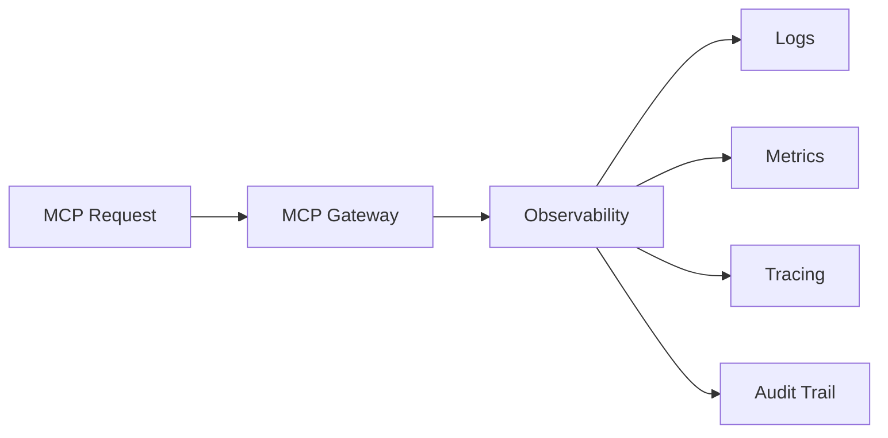

Sensitive parameters should be handled carefully and should not automatically be logged in raw form.

---

# 14. 🚦 Rate Limiting & Abuse Protection

A gateway can enforce limits around tool usage.

For example:

```text
User
 ↓
MCP Gateway
 ↓
Rate Limit
 ↓
MCP Server
```

Possible policies:

```text
100 requests / minute / user

20 payment operations / minute

5 expensive database queries / minute
```

It can also help detect abnormal behavior such as repeated or excessive tool calls.

However, rate limiting alone does not guarantee that an agent cannot enter a loop; robust agent implementations should also have explicit execution limits.

---

# 15. 🔄 Complete Gateway Flow

Let's combine everything.

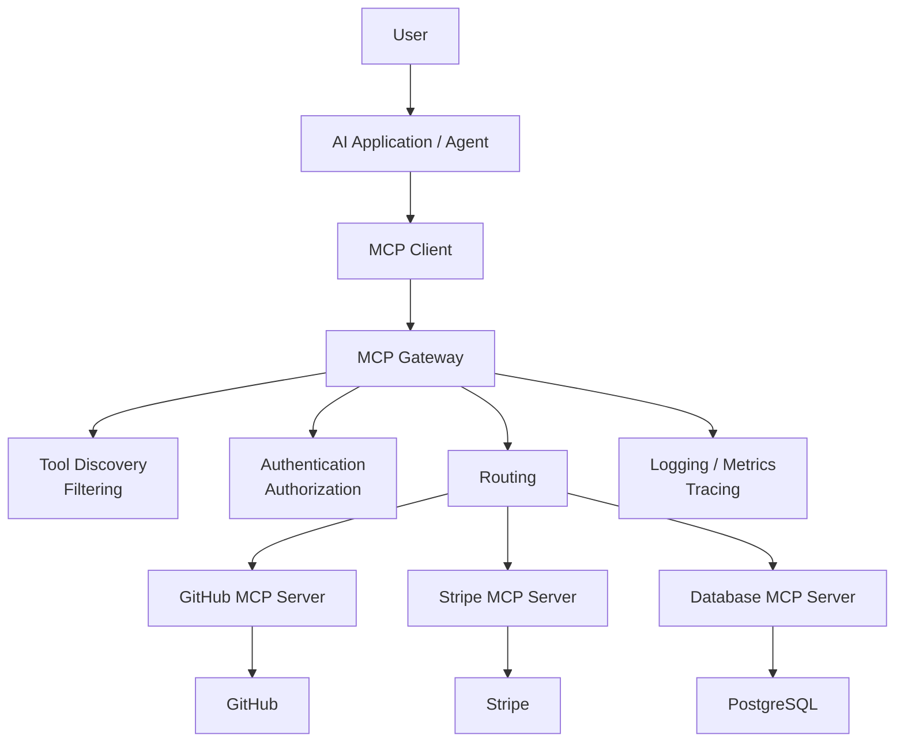

---

# 16. ⚖️ Direct MCP vs Gateway Architecture

| Aspect              | Direct MCP Connections              | Gateway Architecture                      |
| ------------------- | ----------------------------------- | ----------------------------------------- |
| **Topology**        | Client connects to multiple servers | Client connects through a central gateway |
| **Tool management** | Distributed                         | Centralized                               |
| **Tool filtering**  | Application-dependent               | Can be centralized                        |
| **Routing**         | Client manages connections          | Gateway can route requests                |
| **Authentication**  | Distributed                         | Can be centralized                        |
| **Authorization**   | Application/server dependent        | Central policy layer possible             |
| **Credentials**     | Distributed                         | Can be centrally managed                  |
| **Observability**   | Distributed                         | Centralized                               |
| **Rate limiting**   | Per-service/application             | Can be centralized                        |
| **Complexity**      | Simpler initially                   | More infrastructure                       |
| **Scalability**     | Can become harder to manage         | Useful for larger environments            |

---

# 17. 🏢 Enterprise MCP Architecture

For a larger organization, the architecture could evolve into:

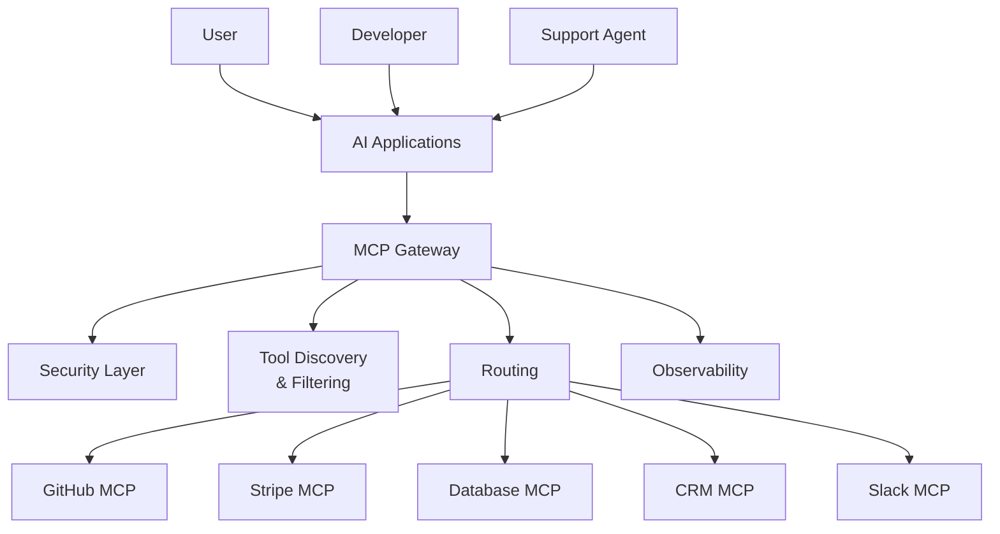

The gateway becomes a centralized **policy and traffic-control layer** for MCP.

---

# 18. ⚠️ Important Design Principle

Do not assume:

> "More tools = more powerful agent."

In many cases:

```text
More tools
    ↓
More context
    ↓
More selection complexity
    ↓
Potentially worse tool selection
```

A better approach is:

```text
Many available capabilities
          ↓
Discovery / Filtering
          ↓
Relevant capabilities
          ↓
LLM
```

The goal is not necessarily to reduce the total number of tools in the organization.

The goal is to **reduce unnecessary tool context presented to the model for a particular task**.

---

# 📌 Chapter Summary

* **Tool overload** occurs when an AI application has access to a very large number of tool definitions.
* Tool definitions consume context and can increase token usage and tool-selection complexity.
* **Tool context poisoning** refers to irrelevant, conflicting, misleading, redundant, or malicious tool-related context that can negatively affect model behavior.
* An **MCP Gateway** is an intermediary layer between AI applications and downstream MCP Servers.
* A gateway can provide centralized:

  * Tool discovery
  * Tool filtering
  * Routing
  * Authentication
  * Authorization
  * Credential management
  * Observability
  * Rate limiting
  * Policy enforcement
* Dynamic tool filtering is **not required by MCP**; it is an architectural pattern that can be implemented around MCP.
* A gateway adds infrastructure and complexity, so it is most useful when the number of servers, users, tools, or security requirements justifies it.

---

# 🧠 Final Mental Model

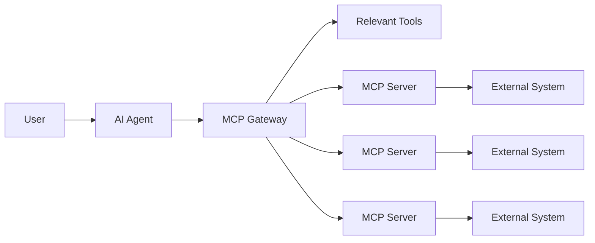

### Memory Trick

> **Too many tools → Too much context → Harder tool selection → Gateway can filter, route, secure, and observe.**

### Chapter 4 in one sentence

> **An MCP Gateway provides a centralized control layer that can manage and filter access to many MCP Servers, helping AI applications scale their tool ecosystem without unnecessarily exposing every available tool to the model.**
