# 🎯 Chapter 5: MCP Interview Guide & Master Summary

---

## 🎯 Chapter Overview

This chapter is designed as a **final MCP interview revision guide** covering:

* Core MCP concepts
* Host, Client, and Server architecture
* Tools, Resources, and Prompts
* JSON-RPC 2.0
* STDIO and HTTP-based transports
* MCP vs REST
* Tool overload and Tool Context Poisoning
* MCP Gateway architecture
* Common interview questions
* Final architecture cheat sheets

The goal is to understand not only **what MCP is**, but also **why it exists, how it works, and where it fits in a production AI system**.

---

# 💡 Part 1 — Top MCP Interview Questions

## Q1. What is Model Context Protocol (MCP)?

### Answer

**Model Context Protocol (MCP)** is an open protocol that standardizes how AI applications communicate with external capability servers that expose **tools, resources, and prompts**.

It provides a common communication layer between an AI application and external systems such as:

* GitHub
* Databases
* File systems
* SaaS APIs
* Search systems
* Internal enterprise services

A simplified architecture is:

```text
AI Application
      │
      │ MCP
      ▼
 MCP Server
      │
      ▼
External System
```

### Important clarification

MCP should **not** be described simply as a replacement for provider-specific tool-calling APIs.

AI model providers can still have different APIs and tool-calling mechanisms. MCP primarily standardizes the **AI application ↔ MCP server** interaction.

### Interview-friendly answer

> **MCP is an open protocol that standardizes how AI applications discover and interact with external capabilities through MCP servers, including tools, resources, and prompts.**

---

# Q2. Why was MCP created?

Modern AI applications increasingly need access to external systems.

For example:

```text
AI Agent
 ├── GitHub
 ├── Stripe
 ├── Slack
 ├── PostgreSQL
 ├── Google Drive
 └── Internal APIs
```

Without a common protocol, developers may need different integration approaches for different systems and frameworks.

MCP provides a standardized protocol layer for connecting AI applications to external capability servers.

### Core idea

```text
Many AI Applications
        │
        │ Standard Protocol
        ▼
    MCP Servers
        │
        ├── GitHub
        ├── Stripe
        ├── Database
        └── Internal APIs
```

---

# Q3. What are the three core primitives of an MCP Server?

An MCP server can expose three major primitives:

| Primitive     | Purpose                   | Example            |
| ------------- | ------------------------- | ------------------ |
| **Tools**     | Executable operations     | `create_payment()` |
| **Resources** | Data/context              | Database schema    |
| **Prompts**   | Reusable prompt templates | Code-review prompt |

### 1. Tools

Tools are executable operations.

Examples:

```text
create_payment()
search_repository()
create_issue()
query_database()
send_email()
```

A model may decide that a tool is necessary and request its invocation through the MCP client.

---

### 2. Resources

Resources provide data or contextual information.

Examples:

```text
postgres://database/schema
file:///project/README.md
github://repo/issues
```

Resources are generally about **accessing information**, rather than performing an action.

---

### 3. Prompts

Prompts are reusable, parameterized prompt templates exposed by the server.

Example:

```text
code_review_prompt(
    language="TypeScript",
    focus="security"
)
```

---

# Q4. What is the MCP Host, Client, and Server?

This is one of the most important MCP interview concepts.

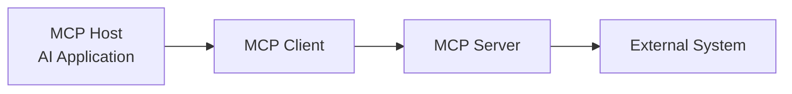

### Host

The **Host** is the application the user interacts with.

Examples can include:

* AI coding applications
* Desktop AI applications
* Custom AI agents
* Agent runtimes

The host manages the overall AI interaction.

### Client

The **MCP Client** is the component responsible for communicating with an MCP server.

It handles MCP protocol communication and maintains the connection/session with the server.

### Server

The **MCP Server** is a program that exposes capabilities through MCP.

For example:

```text
GitHub MCP Server
 ├── search_repositories
 ├── get_issue
 ├── create_issue
 └── create_pull_request
```

The server may internally communicate with the GitHub API.

---

# Q5. What is the difference between STDIO and HTTP-based MCP transports?

## STDIO

STDIO is primarily used for **local MCP servers**.

The host/client starts the MCP server as a local process.

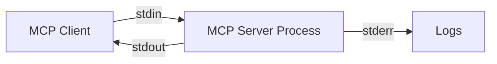

Typical flow:

```text
Client
  │
  │ spawn process
  ▼
MCP Server
  │
  ├── stdin  ← requests
  ├── stdout → responses
  └── stderr → logs
```

### Common use cases

* Local development
* Desktop AI applications
* Local file systems
* Developer tools
* Personal automation

---

## HTTP-based transport

For remote MCP servers, modern MCP implementations use **Streamable HTTP**.

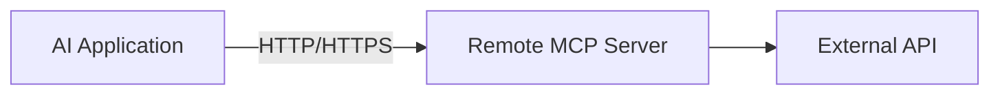

This is suitable for:

* Cloud-hosted MCP servers
* Shared services
* Remote infrastructure
* Enterprise environments

### Important interview correction

Older MCP documentation/tutorials may describe **HTTP + SSE**.

SSE (**Server-Sent Events**) was used by earlier MCP transport designs. **Streamable HTTP is the modern HTTP transport approach.**

So don't describe SSE as the only or current MCP HTTP transport.

---

# Q6. Can MCP replace REST APIs?

### Answer: No.

MCP and REST solve different problems.

```text
REST
 ↓
General software-to-software API communication

MCP
 ↓
AI application ↔ MCP server communication
```

An MCP server can internally use REST.

For example:

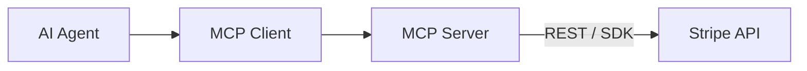

Therefore:

> **MCP does not replace REST. MCP can sit above REST APIs and provide an AI-oriented protocol layer around them.**

---

# Q7. What is JSON-RPC 2.0 in MCP?

MCP uses **JSON-RPC 2.0** as its message format.

A simplified request looks like:

```json
{
  "jsonrpc": "2.0",
  "id": 1,
  "method": "tools/list",
  "params": {}
}
```

A tool invocation can look conceptually like:

```json
{
  "jsonrpc": "2.0",
  "id": 2,
  "method": "tools/call",
  "params": {
    "name": "create_payment",
    "arguments": {
      "amount": 2000,
      "currency": "USD"
    }
  }
}
```

JSON-RPC provides a structured way to represent requests, responses, notifications, and errors.

---

# Q8. What are `tools/list` and `tools/call`?

### `tools/list`

Used to discover the tools exposed by an MCP server.

```text
Client
  │
  │ tools/list
  ▼
Server
  │
  ▼
Available tool definitions
```

### `tools/call`

Used to request execution of a specific tool.

```text
Client
  │
  │ tools/call
  │ name = create_payment
  ▼
Server
  │
  ▼
Tool execution
```

Similarly, MCP provides resource-related operations such as:

```text
resources/list
resources/read
```

---

# Q9. What happens when an AI Agent uses an MCP Tool?

Consider:

> "Check the payment status for order #108."

A simplified lifecycle is:

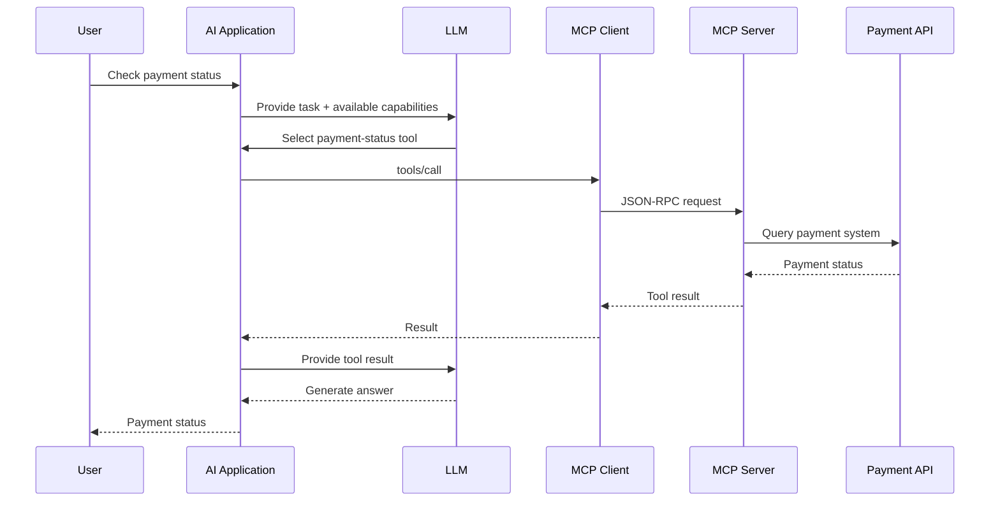

### Key principle

```text
LLM
 ↓ decides
MCP Client
 ↓ communicates
MCP Server
 ↓ executes
External System
```

The LLM does not directly execute the external API call.

---

# Q10. What is Tool Context Poisoning?

This requires a little nuance.

When an AI application exposes a very large number of tools, the model may receive many tool definitions containing:

* Tool names
* Descriptions
* Parameters
* Schemas
* Usage instructions
* Constraints

This can create **tool-context bloat**.

If the tool-related information becomes irrelevant, conflicting, misleading, redundant, or potentially untrusted, it can interfere with the model's reasoning and tool selection. This is often described conceptually as **Tool Context Poisoning**.

### Example

```text
250+ tools
     │
     ▼
Large tool context
     │
     ├── Token overhead
     ├── More processing
     ├── Similar tools
     ├── Conflicting descriptions
     └── Harder tool selection
```

### Important distinction

```text
Tool Overload
     ↓
Too many tools are available

Tool Context Poisoning
     ↓
Tool-related context negatively interferes
with reasoning or tool selection
```

The term "tool context poisoning" is useful as an architectural/security concept, but it should not be presented as a formally defined MCP protocol primitive.

---

# Q11. What is an MCP Gateway?

An **MCP Gateway** is an architectural middleware layer placed between an AI application and multiple MCP servers.

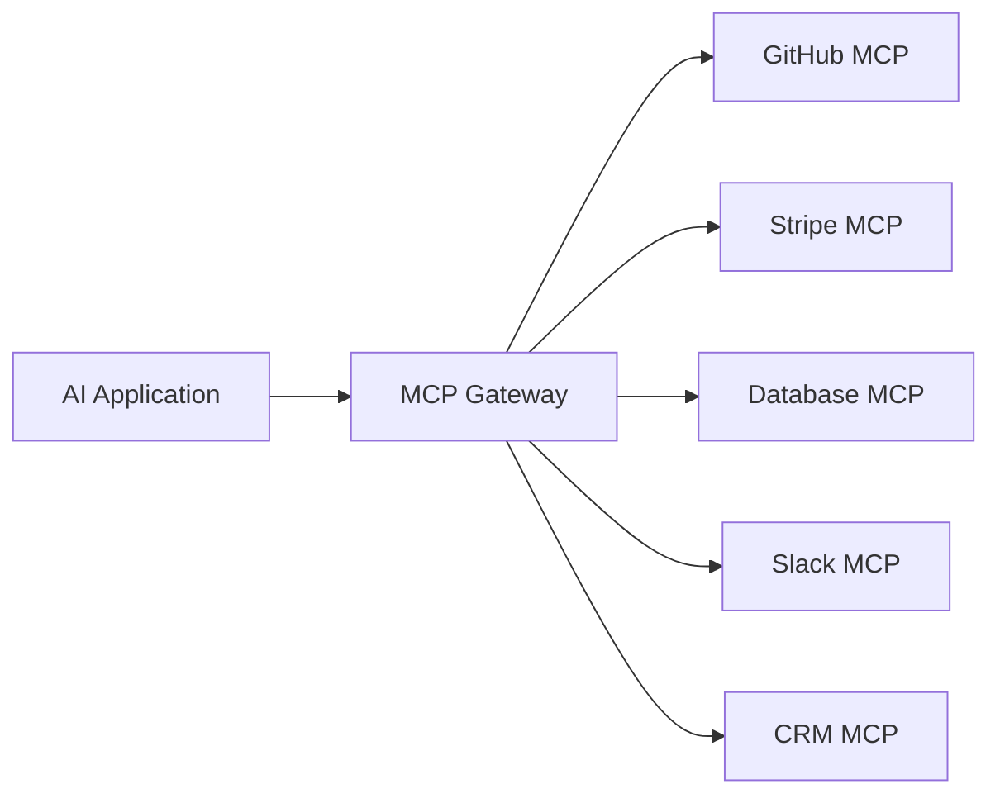

A gateway can provide centralized capabilities such as:

* Tool discovery
* Tool filtering
* Routing
* Authentication
* Authorization
* Rate limiting
* Logging
* Observability
* Policy enforcement

### Important clarification

An MCP Gateway does **not automatically perform semantic tool selection**.

Semantic filtering, embeddings, intent classification, or similar discovery mechanisms are architectural features that a particular gateway implementation may provide.

---

# Q12. How can an MCP Gateway reduce tool overload?

Suppose an organization has:

```text
GitHub     → 30 tools
Stripe     → 40 tools
Database   → 50 tools
Slack      → 20 tools
CRM        → 100 tools

Total      → 240 tools
```

Instead of exposing every tool to the model for every request, a gateway could perform discovery/filtering.

User:

> "Check payment status for order #108."

Potentially relevant capabilities:

```text
stripe.get_payment_status
order_db.get_order
```

Architecture:

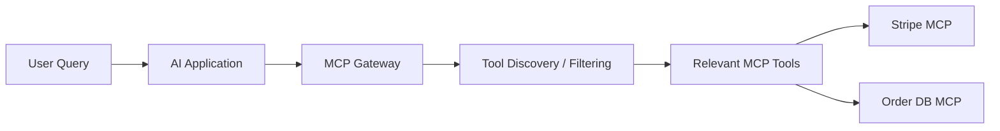

The exact number of tools exposed should be determined by the application's requirements and implementation; there is no universal rule that it must be "2–5 tools."

---

# Q13. What is the difference between Authentication and Authorization?

### Authentication — AuthN

Answers:

> **Who are you?**

Example:

```text
User → Login → Identity verified
```

### Authorization — AuthZ

Answers:

> **What are you allowed to do?**

Example:

```text
Developer
 ├── read repository ✓
 ├── create issue ✓
 └── delete repository ✗
```

An MCP gateway can centralize these policies across multiple downstream MCP servers.

---

# Q14. Why is observability important in MCP systems?

An AI application may invoke many tools automatically.

Without observability, it becomes difficult to understand:

```text
Which tool was called?
Who called it?
What arguments were provided?
How long did it take?
Did it fail?
Which downstream service failed?
```

A production gateway can collect metrics and logs such as:

```text
Tool invocation count
Tool latency
Error rate
Authentication failures
Rate-limit events
Server availability
Request traces
```

This becomes especially important in enterprise AI systems.

---

# 🏗️ Part 2 — Master MCP Architecture

## Basic Architecture

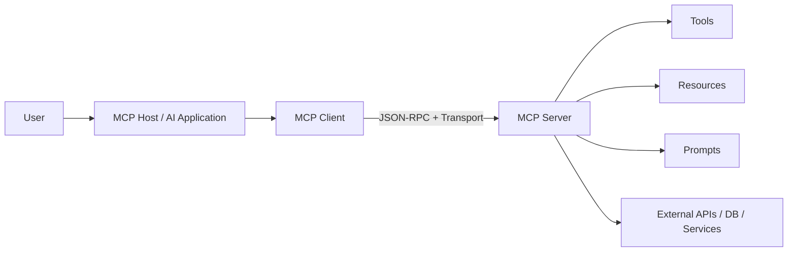

---

# 🌐 Enterprise MCP Architecture

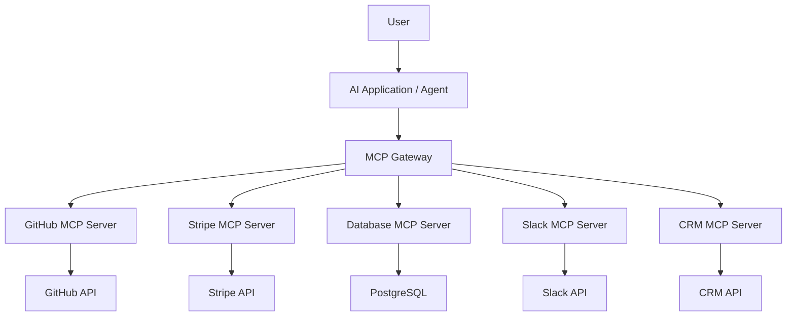

### Gateway responsibilities

```text
                 MCP Gateway
                      │
       ┌──────────────┼──────────────┐
       │              │              │
   Discovery       Security      Observability
       │              │              │
    Filtering      AuthN/AuthZ    Logging
    Routing        Policies       Metrics
```

---

# 🔄 MCP Communication Model

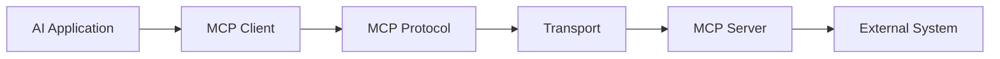

Remember:

```text
MCP Protocol
    ↓
Defines communication semantics

Transport
    ↓
Defines how messages are transmitted

External API
    ↓
Performs the actual business operation
```

---

# 🧠 Part 3 — MCP Mental Model

## The complete picture

```text
                    USER
                     │
                     ▼
             ┌───────────────┐
             │   MCP HOST    │
             │ AI Application│
             └───────┬───────┘
                     │
                     ▼
             ┌───────────────┐
             │  MCP CLIENT   │
             └───────┬───────┘
                     │
             JSON-RPC + Transport
                     │
                     ▼
             ┌───────────────┐
             │  MCP SERVER   │
             └───────┬───────┘
                     │
          ┌──────────┼──────────┐
          ▼          ▼          ▼
       Tools     Resources    Prompts
          │
          ▼
   External Systems
```

---

# 📊 Part 4 — MCP vs REST

| Feature            | REST                      | MCP                         |
| ------------------ | ------------------------- | --------------------------- |
| Primary purpose    | General API communication | AI application ↔ MCP server |
| Common transport   | HTTP                      | STDIO / HTTP-based          |
| Message style      | HTTP methods/resources    | JSON-RPC                    |
| Tool discovery     | Application-specific      | MCP capability discovery    |
| AI-specific        | No                        | Yes                         |
| Can work together? | Yes                       | Yes                         |

### Example

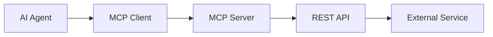

MCP and REST are therefore **complementary technologies**, not direct replacements.

---

# 🚀 Part 5 — Tool Overload → Gateway

The production problem can be summarized as:

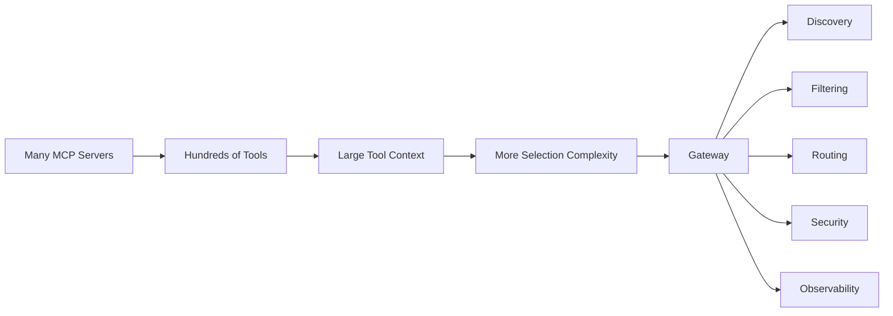

### Core principle

> **Don't expose every possible capability to the model when only a small subset is relevant to the current task.**

---

# 📝 Part 6 — Rapid Interview Cheat Sheet

| Question                                 | Short Answer                                                   |
| ---------------------------------------- | -------------------------------------------------------------- |
| What is MCP?                             | Open protocol for AI applications to interact with MCP servers |
| What does MCP server expose?             | Tools, Resources, Prompts                                      |
| What is a Tool?                          | Executable capability                                          |
| What is a Resource?                      | Data/context identified by a URI                               |
| What is a Prompt?                        | Reusable prompt template                                       |
| What is MCP Host?                        | AI application managing the interaction                        |
| What is MCP Client?                      | Component communicating with MCP server                        |
| What is MCP Server?                      | Program exposing MCP capabilities                              |
| What message format does MCP use?        | JSON-RPC 2.0                                                   |
| What is `tools/list`?                    | Tool discovery                                                 |
| What is `tools/call`?                    | Tool invocation                                                |
| What is STDIO?                           | Local process transport                                        |
| What is Streamable HTTP?                 | Modern HTTP-based MCP transport                                |
| Is SSE still the main MCP transport?     | No; it was used by earlier HTTP transport designs              |
| Does MCP replace REST?                   | No                                                             |
| Can MCP servers use REST APIs?           | Yes                                                            |
| What is tool overload?                   | Too many available tool definitions                            |
| What is tool context poisoning?          | Tool-related context interfering with reasoning/tool selection |
| What is an MCP Gateway?                  | Middleware managing access to multiple MCP servers             |
| Does every MCP system require a gateway? | No                                                             |
| Why use a gateway?                       | Filtering, routing, security, observability, policy, etc.      |

---

# 🧩 Part 7 — Interview Memory Tricks

### Architecture

> **Host manages → Client communicates → Server exposes → Tool acts → Resource provides → Prompt guides**

### Transport

> **STDIO → Local process**

> **Streamable HTTP → Remote communication**

### Protocol

> **JSON-RPC → MCP messages**

### Gateway

> **Discover → Filter → Route → Secure → Observe**

### MCP vs REST

> **REST connects software systems; MCP gives AI applications a standardized way to interact with external capabilities.**

---

# 🎯 Final Master Summary

MCP provides a standardized protocol for connecting AI applications with external capabilities.

The architecture can be remembered as:

```text
AI Application
      │
      ▼
  MCP Client
      │
      │ JSON-RPC
      │
      ▼
  MCP Server
      │
      ├── Tools
      ├── Resources
      └── Prompts
      │
      ▼
External Systems
```

For local applications:

```text
MCP Client
    │
  STDIO
    │
MCP Server
```

For remote applications:

```text
MCP Client
    │
Streamable HTTP
    │
MCP Server
```

For large production environments:

```text
AI Application
      │
      ▼
 MCP Gateway
      │
 ┌────┼────┬────┬────┐
 ▼    ▼    ▼    ▼    ▼
GitHub Stripe DB  Slack CRM
 MCP    MCP  MCP   MCP MCP
```

---

# 🔑 One-Line Summary

> **"REST provides a general way for software systems to communicate; MCP provides a standardized protocol for AI applications to discover and interact with external capabilities."**

---

# 🧠 Chapter 5 — Final Interview Sentence

If an interviewer asks:

> **"Explain MCP in one minute."**

Use this:

> **"Model Context Protocol, or MCP, is an open protocol that standardizes how AI applications communicate with external capability servers. An MCP Host contains the AI application, an MCP Client handles communication, and an MCP Server exposes Tools, Resources, and Prompts. MCP uses JSON-RPC for its protocol messages and can use transports such as STDIO for local servers and Streamable HTTP for remote servers. MCP doesn't replace APIs like REST; instead, an MCP server can use those APIs internally. In larger systems, an MCP Gateway can provide centralized tool discovery, filtering, routing, security, and observability."**

---

# 📌 Complete MCP Learning Map

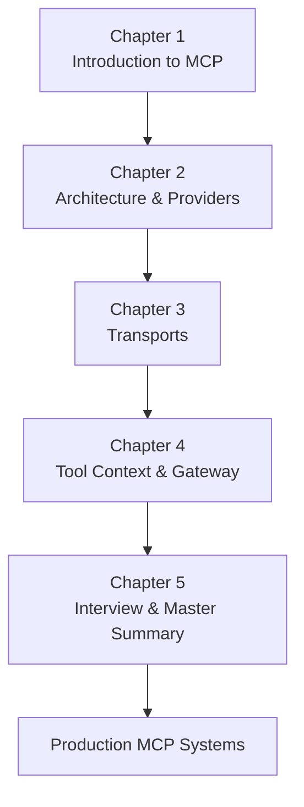

### The entire learning path in one sentence:

> **Agentic AI needs external capabilities → MCP standardizes AI application ↔ capability-server communication → Servers expose Tools/Resources/Prompts → JSON-RPC carries MCP messages → STDIO/Streamable HTTP transports them → Gateways can manage large tool ecosystems.**

