Great. Since MCP has changed materially in the current TypeScript SDK, I’ll base the implementation notes on the **current MCP TypeScript SDK v2**, whose stable release implements the **2026-07-28 MCP specification**. The current SDK uses split packages such as `@modelcontextprotocol/server` and `@modelcontextprotocol/client`; older tutorials commonly use the v1 monolithic `@modelcontextprotocol/sdk`, so I’ll explicitly point out those differences. ([Model Context Protocol][1])

# 🚀 Complete MCP Master Notes + TypeScript Implementation

## Course Roadmap

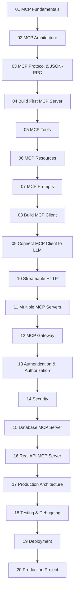

---

# 1. What Exactly Are We Building?

We'll eventually build this:

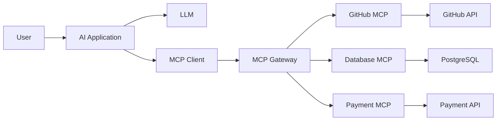

The important separation is:

```text
LLM
 ↓
decides what it needs

MCP Client
 ↓
communicates using MCP

MCP Server
 ↓
executes capability

External System
 ↓
performs actual operation
```

---

# 2. MCP Core Concepts

## 2.1 MCP

**Model Context Protocol** is an open protocol that lets AI applications interact with external systems through MCP servers.

An MCP server can expose:

```text
Tools
Resources
Prompts
```

Current MCP TypeScript SDK documentation describes the same architecture: an MCP host connects to servers that expose tools, resources and prompts. ([Model Context Protocol][1])

---

# 3. MCP Host

The **Host** is the application containing the AI interaction.

Examples:

```text
Cursor
Claude Code
VS Code
Custom AI Agent
Your own Node.js application
```

Architecture:

```text
Host
 ├── LLM
 ├── MCP Client
 └── User Interface
```

---

# 4. MCP Client

The MCP Client communicates with an MCP Server.

```text
Host
 │
 └── MCP Client
       │
       ▼
    MCP Server
```

A host can have multiple MCP clients:

```text
AI Host
 ├── MCP Client → GitHub Server
 ├── MCP Client → Database Server
 └── MCP Client → Stripe Server
```

---

# 5. MCP Server

An MCP server is a program that exposes capabilities through MCP.

For example:

```text
GitHub MCP Server

Tools:
 ├── search_repositories
 ├── get_issue
 ├── create_issue
 └── create_pull_request

Resources:
 └── repository://...

Prompts:
 └── code_review
```

The server may internally call:

```text
REST API
GraphQL
Database
SDK
Filesystem
Internal service
```

---

# 6. MCP Primitives

There are three core server-side primitives:

```text
              MCP SERVER
                  │
       ┌──────────┼──────────┐
       ▼          ▼          ▼
     Tools    Resources   Prompts
```

## Tools

Actions.

```text
create_issue()
send_email()
query_database()
create_payment()
```

## Resources

Data/context.

```text
file://README.md
database://schema
github://repository/issues
```

## Prompts

Reusable prompt templates.

```text
code_review
debug_error
generate_documentation
```

---

# 7. MCP Protocol

MCP uses structured protocol messages based on **JSON-RPC**.

Conceptually:

```text
Client
  │
  │ JSON-RPC request
  ▼
Server
  │
  │ JSON-RPC response
  ▼
Client
```

Example:

```json
{
  "jsonrpc": "2.0",
  "id": 1,
  "method": "tools/list",
  "params": {}
}
```

Tool call:

```json
{
  "jsonrpc": "2.0",
  "id": 2,
  "method": "tools/call",
  "params": {
    "name": "add",
    "arguments": {
      "a": 10,
      "b": 20
    }
  }
}
```

---

# 8. MCP Transport

Transport answers:

> **How do MCP messages travel?**

Two important current transports:

```text
STDIO
Streamable HTTP
```

Older tutorials may show HTTP + SSE. The current SDK documents SSE as a legacy/deprecated transport for backward compatibility and recommends Streamable HTTP for new HTTP implementations. ([Model Context Protocol][2])

---

# 9. STDIO

STDIO is mainly for local MCP servers.

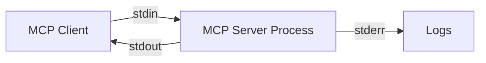

Very important:

> **stdout belongs to the MCP protocol.**

Therefore:

```ts
console.error("Server started");
```

is safe for logs.

Avoid:

```ts
console.log("Server started");
```

because stdout carries protocol data. The official SDK quickstart explicitly warns about this. ([GitHub][3])

---

# 10. Streamable HTTP

For remote MCP servers:

```text
AI Application
      │
      │ HTTPS
      ▼
Remote MCP Server
```

This is appropriate for:

* Cloud servers
* SaaS
* Enterprise infrastructure
* Shared MCP services

---

# 11. Start Our Project

We'll use:

```text
Node.js
TypeScript
Zod
MCP TypeScript SDK v2
```

The current official v2 quickstart requires Node.js 20+ and uses ESM. ([GitHub][3])

Create:

```bash
mkdir mcp-master
cd mcp-master

npm init -y
```

Install:

```bash
npm install @modelcontextprotocol/server zod
npm install @modelcontextprotocol/client
npm install -D typescript tsx @types/node
```

The current SDK separates server and client packages. ([GitHub][4])

---

# 12. `package.json`

```json
{
  "name": "mcp-master",
  "version": "1.0.0",
  "type": "module",
  "scripts": {
    "server": "tsx src/server.ts",
    "client": "tsx src/client.ts",
    "dev": "tsx watch src/server.ts"
  },
  "dependencies": {
    "@modelcontextprotocol/client": "latest",
    "@modelcontextprotocol/server": "latest",
    "zod": "latest"
  },
  "devDependencies": {
    "@types/node": "latest",
    "tsx": "latest",
    "typescript": "latest"
  }
}
```

---

# 13. TypeScript Configuration

Create:

```text
tsconfig.json
```

```json
{
  "compilerOptions": {
    "target": "ES2022",
    "module": "NodeNext",
    "moduleResolution": "NodeNext",
    "strict": true,
    "esModuleInterop": true,
    "skipLibCheck": true,
    "types": ["node"]
  },
  "include": ["src"]
}
```

---

# 14. Project Structure

Start simple:

```text
mcp-master/
│
├── src/
│   ├── server.ts
│   └── client.ts
│
├── package.json
├── tsconfig.json
└── node_modules/
```

Later:

```text
src/
├── server/
│   ├── index.ts
│   ├── tools/
│   ├── resources/
│   ├── prompts/
│   └── services/
│
├── client/
│   ├── index.ts
│   ├── transport.ts
│   └── llm.ts
│
├── gateway/
│
└── shared/
```

---

# 15. Your First MCP Server

Create:

```text
src/server.ts
```

```ts
import { McpServer } from "@modelcontextprotocol/server";
import { serveStdio } from "@modelcontextprotocol/server/stdio";
import * as z from "zod/v4";

serveStdio(() => {
  const server = new McpServer({
    name: "calculator-server",
    version: "1.0.0",
  });

  server.registerTool(
    "add",
    {
      description: "Add two numbers together",
      inputSchema: {
        a: z.number(),
        b: z.number(),
      },
    },
    async ({ a, b }) => {
      const result = a + b;

      return {
        content: [
          {
            type: "text",
            text: String(result),
          },
        ],
      };
    }
  );

  return server;
});
```

The current v2 SDK's first-server guide uses `McpServer`, `serveStdio`, and Zod schemas in this style. ([GitHub][3])

---

# 16. Run the Server

```bash
npm run server
```

You won't see a normal HTTP response.

That's expected.

The server is waiting for an MCP client.

```text
stdin
  ↓
MCP Server
  ↓
stdout
```

---

# 17. Test With MCP Inspector

The official SDK documentation recommends MCP Inspector for testing a local server. ([GitHub][3])

Run:

```bash
npx @modelcontextprotocol/inspector npm run server
```

Depending on your shell, you can also directly launch:

```bash
npx @modelcontextprotocol/inspector npx tsx src/server.ts
```

Then inspect:

```text
Tools
 └── add
```

Input:

```json
{
  "a": 10,
  "b": 20
}
```

Result:

```text
30
```

🎉 You just created your first MCP server.

---

# 18. Understanding `registerTool`

This:

```ts
server.registerTool(
  "add",
  {
    description: "Add two numbers together",
    inputSchema: {
      a: z.number(),
      b: z.number()
    }
  },
  async ({ a, b }) => {
    ...
  }
);
```

means:

```text
Tool name
     ↓
add

Description
     ↓
Add two numbers

Schema
     ↓
a = number
b = number

Handler
     ↓
actual implementation
```

The SDK validates arguments against the schema before invoking the handler. ([GitHub][3])

---

# 19. Build a Better Calculator

Add:

```ts
server.registerTool(
  "multiply",
  {
    description: "Multiply two numbers",
    inputSchema: {
      a: z.number(),
      b: z.number(),
    },
  },
  async ({ a, b }) => {
    return {
      content: [
        {
          type: "text",
          text: String(a * b),
        },
      ],
    };
  }
);
```

And:

```ts
server.registerTool(
  "divide",
  {
    description: "Divide two numbers",
    inputSchema: {
      a: z.number(),
      b: z.number(),
    },
  },
  async ({ a, b }) => {
    if (b === 0) {
      return {
        content: [
          {
            type: "text",
            text: "Cannot divide by zero",
          },
        ],
        isError: true,
      };
    }

    return {
      content: [
        {
          type: "text",
          text: String(a / b),
        },
      ],
    };
  }
);
```

Now your server exposes:

```text
add
multiply
divide
```

---

# 20. MCP Client

Now we'll write our own MCP client.

Create:

```text
src/client.ts
```

```ts
import { Client } from "@modelcontextprotocol/client";
import { StdioClientTransport } from "@modelcontextprotocol/client/stdio";

const client = new Client({
  name: "calculator-client",
  version: "1.0.0",
});

const transport = new StdioClientTransport({
  command: "npx",
  args: ["tsx", "src/server.ts"],
});

await client.connect(transport);

const tools = await client.listTools();

console.log("Available tools:");
console.dir(tools, { depth: null });

const result = await client.callTool({
  name: "add",
  arguments: {
    a: 10,
    b: 20,
  },
});

console.log("Result:");
console.dir(result, { depth: null });

await client.close();
```

The official client quickstart follows the same pattern: create `Client`, create `StdioClientTransport`, connect, then use methods such as `listTools()` and `callTool()`. ([GitHub][5])

Run:

```bash
npm run client
```

---

# 21. What Just Happened?

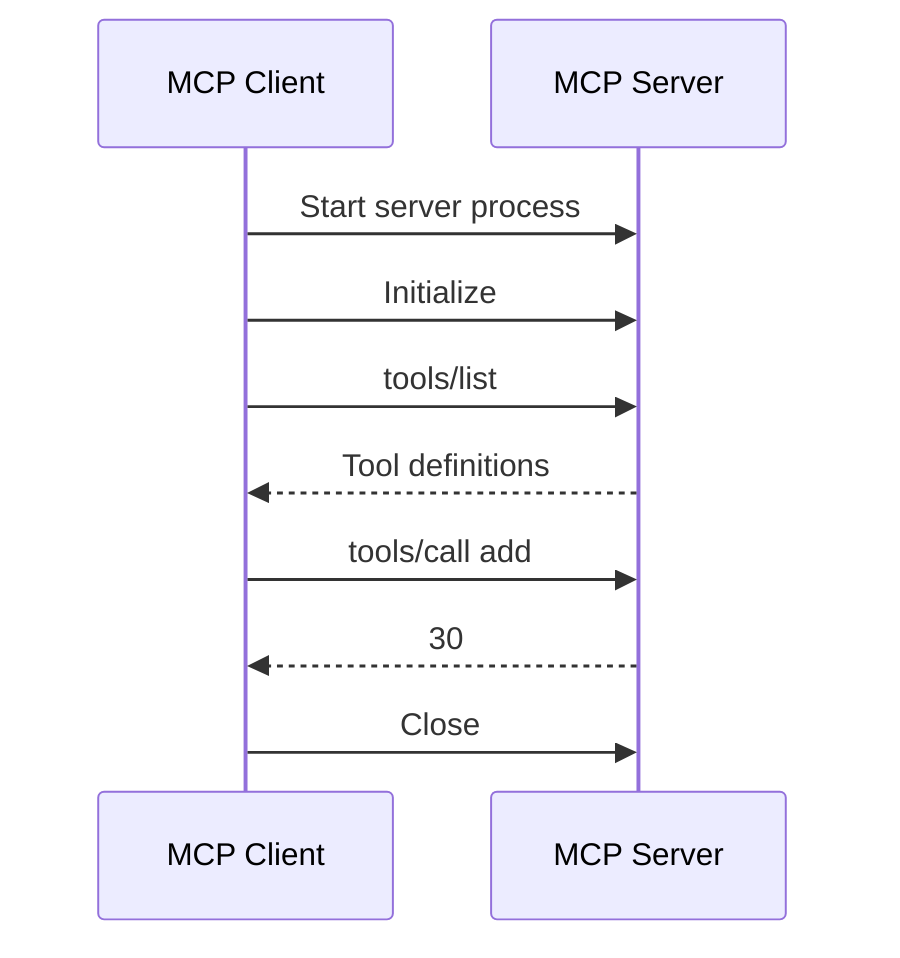

This is the fundamental MCP lifecycle.

---

# 22. `listTools()`

The client can discover:

```ts
const tools = await client.listTools();
```

Conceptually:

```json
{
  "tools": [
    {
      "name": "add",
      "description": "Add two numbers together",
      "inputSchema": {
        "type": "object"
      }
    }
  ]
}
```

The AI application can provide these tool definitions to an LLM.

---

# 23. `callTool()`

The client executes:

```ts
const result = await client.callTool({
  name: "add",
  arguments: {
    a: 10,
    b: 20
  }
});
```

Conceptually:

```text
Client
 │
 │ tools/call
 ▼
Server
 │
 │ execute handler
 ▼
30
```

---

# 24. Build an MCP Resource

Tools perform actions.

Resources provide data.

Let's create a simple documentation resource.

```ts
server.registerResource(
  "documentation",
  "docs://getting-started",
  {
    title: "Getting Started Documentation",
    description: "Basic MCP documentation",
    mimeType: "text/plain",
  },
  async (uri) => {
    return {
      contents: [
        {
          uri: uri.href,
          mimeType: "text/plain",
          text: `
MCP is a protocol for connecting
AI applications with external capabilities.

Core concepts:
- Tools
- Resources
- Prompts
          `.trim(),
        },
      ],
    };
  }
);
```

Conceptually:

```text
Resource
    ↓
docs://getting-started
    ↓
MCP Server
    ↓
documentation
```

---

# 25. Reading Resources From Client

```ts
const resources = await client.listResources();

console.dir(resources, { depth: null });
```

Then:

```ts
const resource = await client.readResource({
  uri: "docs://getting-started",
});

console.dir(resource, { depth: null });
```

Architecture:

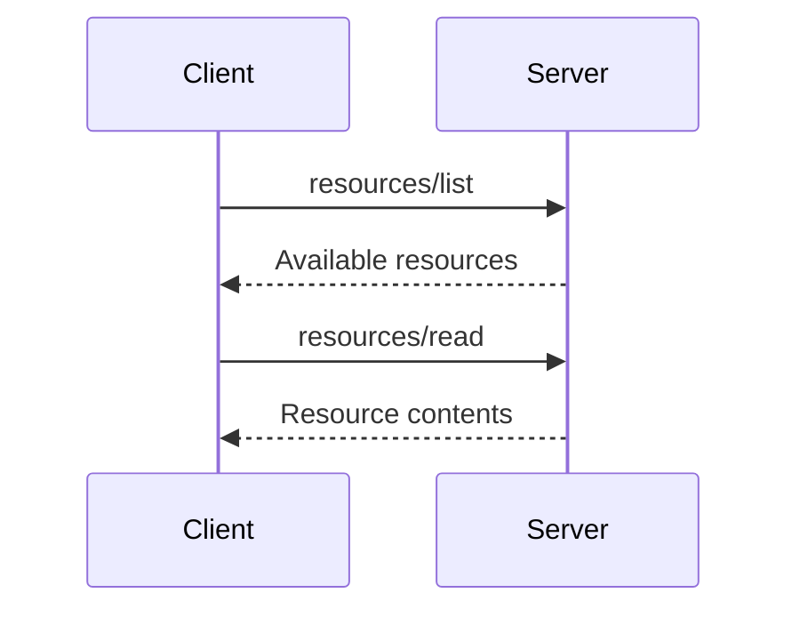

---

# 26. Static vs Dynamic Resources

You can expose a fixed resource:

```text
docs://getting-started
```

or a URI pattern:

```text
user://{userId}/profile
```

For example:

```text
user://123/profile
user://456/profile
user://789/profile
```

This is useful for:

* User profiles
* Documents
* Database records
* Repository information
* Logs

---

# 27. MCP Prompts

Prompts are reusable templates.

Example:

```ts
server.registerPrompt(
  "code-review",
  {
    description: "Review a piece of code",
    argsSchema: {
      language: z.string(),
      code: z.string(),
    },
  },
  ({ language, code }) => ({
    messages: [
      {
        role: "user",
        content: {
          type: "text",
          text: `
Review this ${language} code.

Focus on:
- Bugs
- Security
- Performance
- Maintainability

Code:

${code}
          `.trim(),
        },
      },
    ],
  })
);
```

Now:

```text
Prompt
  ↓
code-review
  ↓
language
code
```

---

# 28. Client Calling Prompt

```ts
const prompt = await client.getPrompt({
  name: "code-review",
  arguments: {
    language: "TypeScript",
    code: "const x = 10;",
  },
});

console.dir(prompt, { depth: null });
```

---

# 29. The Three Primitives Together

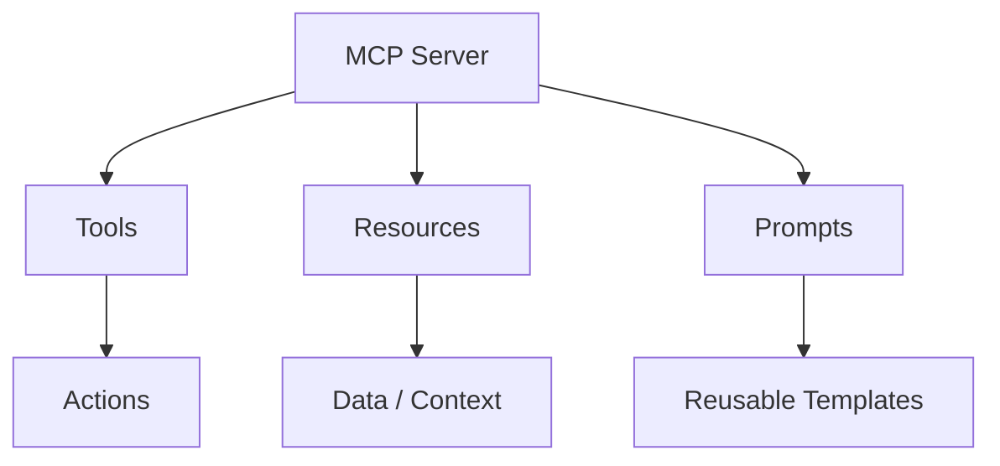

Remember:

```text
Tool     → Do something
Resource → Give me data
Prompt   → Give me a reusable interaction template
```

---

# 30. MCP + LLM

Now we reach the important part.

MCP itself does **not** require a specific LLM.

You can have:

```text
OpenAI
Anthropic
Google
Local LLM
Other model
```

The architecture is:

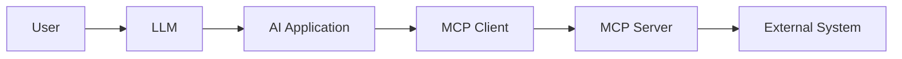

---

# 31. The Agent Tool-Calling Loop

Suppose the user asks:

> "Calculate 20 × 30."

The application can:

### Step 1

Get MCP tools:

```ts
const { tools } = await client.listTools();
```

### Step 2

Convert MCP tool definitions into the format required by your LLM provider.

### Step 3

Send user message + tools to the LLM.

```text
User
 ↓
LLM
 ↓
"I should use multiply"
```

### Step 4

LLM returns a tool call.

```json
{
  "name": "multiply",
  "arguments": {
    "a": 20,
    "b": 30
  }
}
```

### Step 5

Your MCP client calls:

```ts
await client.callTool({
  name: "multiply",
  arguments: {
    a: 20,
    b: 30,
  },
});
```

### Step 6

Send result back to LLM.

```text
600
```

### Step 7

LLM generates:

```text
20 × 30 = 600.
```

---

# 32. The Real Agent Loop

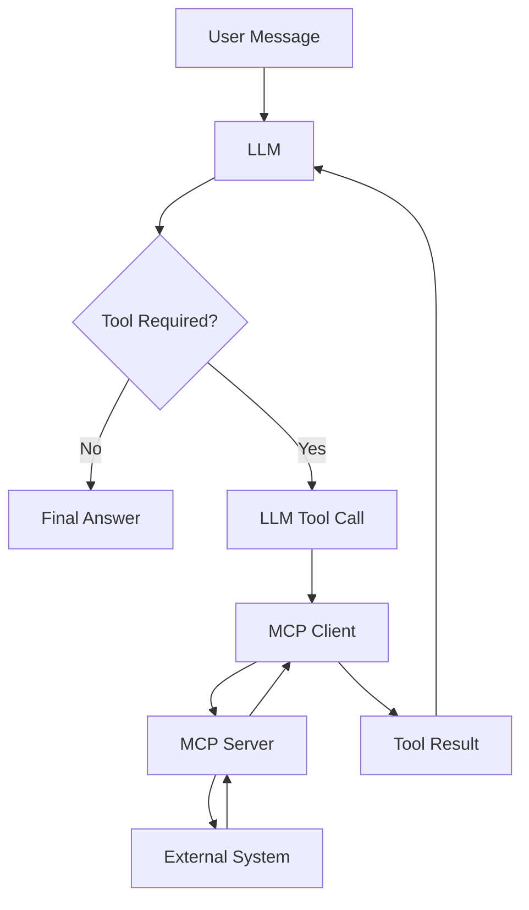

This is the most important architecture to understand.

---

# 33. Build a Real API MCP Server

Let's move beyond calculators.

We'll build:

```text
Weather MCP Server
```

Architecture:

```text
AI Agent
   ↓
MCP Client
   ↓
Weather MCP Server
   ↓
Weather API
```

The server tool:

```text
get_weather(city)
```

---

# 34. API Tool Implementation

Conceptually:

```ts
server.registerTool(
  "get_weather",
  {
    description: "Get current weather information",
    inputSchema: {
      city: z.string(),
    },
  },
  async ({ city }) => {
    const response = await fetch(
      `https://api.example.com/weather?city=${encodeURIComponent(city)}`
    );

    if (!response.ok) {
      return {
        content: [
          {
            type: "text",
            text: `Weather API failed: ${response.status}`,
          },
        ],
        isError: true,
      };
    }

    const data = await response.json();

    return {
      content: [
        {
          type: "text",
          text: JSON.stringify(data),
        },
      ],
    };
  }
);
```

The important architecture is:

```text
MCP Tool
    ↓
Service Layer
    ↓
External API
```

Don't put all your business logic directly inside the MCP handler.

---

# 35. Production Architecture

Instead:

```text
src/
├── server.ts
│
├── tools/
│   └── weather.tool.ts
│
├── services/
│   └── weather.service.ts
│
├── clients/
│   └── weather-api.client.ts
│
└── schemas/
    └── weather.schema.ts
```

Then:

```text
MCP Tool
   ↓
Service
   ↓
API Client
   ↓
External API
```

This makes the code testable.

---

# 36. Database MCP Server

Now create:

```text
Database MCP Server
```

Architecture:

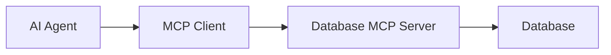

Possible tools:

```text
list_tables()
get_schema()
query_database()
```

---

# 37. Database Tool

Conceptually:

```ts
server.registerTool(
  "list_tables",
  {
    description: "List database tables",
    inputSchema: {},
  },
  async () => {
    const tables = await db.getTables();

    return {
      content: [
        {
          type: "text",
          text: JSON.stringify(tables),
        },
      ],
    };
  }
);
```

---

# 38. Database Security

Never blindly expose:

```text
execute_sql(sql)
```

to an unrestricted model.

This could be dangerous:

```sql
DROP TABLE users;
```

Instead use controlled operations:

```text
get_user()
search_users()
get_orders()
get_order()
list_products()
```

Or implement:

```text
SQL parser
 ↓
Allow-list
 ↓
Read-only transaction
 ↓
Database
```

---

# 39. Tool Design Principle

Bad:

```text
execute_anything()
```

Better:

```text
get_order()
search_orders()
get_customer()
```

Why?

Because tools should have:

```text
Clear purpose
Clear schema
Clear permissions
Predictable behavior
Minimal side effects
```

---

# 40. Read vs Write Tools

A useful classification:

```text
READ
 ├── get_user
 ├── search_orders
 └── get_product

WRITE
 ├── create_order
 ├── update_user
 └── send_email

DANGEROUS
 ├── delete_user
 ├── refund_payment
 └── execute_sql
```

High-impact tools should receive additional authorization and validation.

---

# 41. Human Approval

For dangerous actions:

```text
LLM
 ↓
MCP Tool
 ↓
Authorization
 ↓
Human approval
 ↓
Execution
```

Example:

```text
"Refund $500"

       ↓

MCP Server

       ↓

"Approve refund?"

       ↓

Human

       ↓

Stripe API
```

---

# 42. Multiple MCP Servers

Real applications may have:

```text
GitHub MCP
Stripe MCP
Database MCP
Slack MCP
Google Drive MCP
```

Architecture:

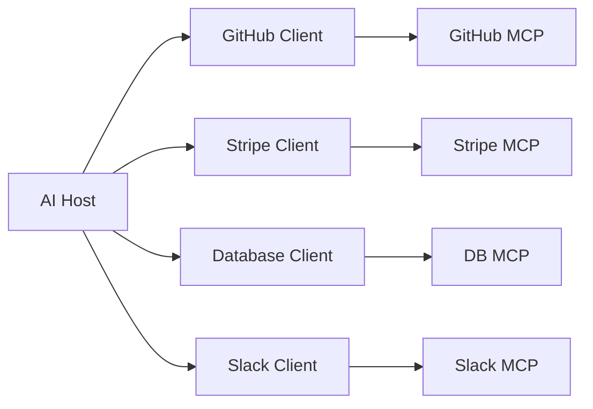

---

# 43. The Tool Explosion Problem

Imagine:

```text
GitHub = 30 tools
Stripe = 40
Slack = 30
CRM = 100
Database = 50
```

Total:

```text
250 tools
```

Giving all 250 definitions to the model can create:

```text
Large context
     ↓
More token usage
     ↓
More selection complexity
     ↓
Potential ambiguity
```

---

# 44. MCP Gateway

Introduce:

```text
AI Agent
   ↓
MCP Gateway
   ↓
Multiple MCP Servers
```

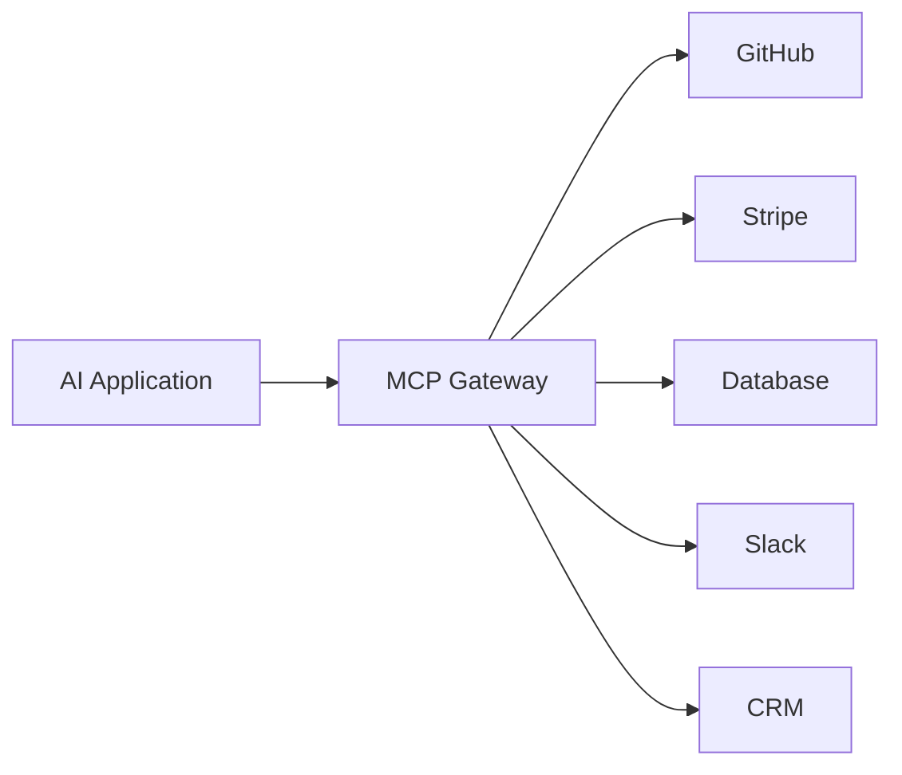

---

# 45. Gateway Responsibilities

A gateway may provide:

```text
Discovery
Filtering
Routing
Authentication
Authorization
Rate limiting
Logging
Tracing
Policy enforcement
```

---

# 46. Dynamic Tool Discovery

User:

```text
"Check order #108 payment status."
```

Gateway determines relevant capabilities:

```text
order.get
payment.get_status
```

Instead of:

```text
250 tools
```

the AI application may receive a much smaller relevant set.

Again, this is an architectural optimization, not a mandatory MCP behavior.

---

# 47. Gateway Semantic Search

Possible implementation:

```text
Tool descriptions
       ↓
Embeddings
       ↓
Vector database
       ↓
User intent embedding
       ↓
Similarity search
       ↓
Relevant tools
```

For example:

```text
User:
"Has my payment gone through?"

        ↓

Embedding

        ↓

Search

        ↓

payment.get_status
order.get
transaction.lookup
```

You could implement this with:

```text
Pinecone
pgvector
Qdrant
Weaviate
Neo4j
```

depending on the architecture.

---

# 48. MCP Security

Never assume:

```text
MCP = trusted
```

Treat tools as privileged capabilities.

Security layers:

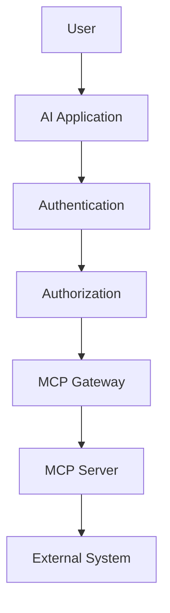

---

# 49. Authentication

Authentication:

```text
Who is this caller?
```

Examples:

```text
OAuth
JWT
API keys
mTLS
Service accounts
```

---

# 50. Authorization

Authorization:

```text
What is this caller allowed to do?
```

Example:

```text
User
 │
 ├── read orders ✓
 ├── create order ✓
 ├── refund payment ✗
 └── delete customer ✗
```

---

# 51. Least Privilege

Give an MCP server only the permissions it needs.

Bad:

```text
MCP Server
 ↓
Database admin
```

Better:

```text
MCP Server
 ↓
Read-only DB user
```

For a payment server:

```text
Payment MCP
 ↓
Payment-specific credentials
```

Not:

```text
Payment MCP
 ↓
Entire infrastructure credentials
```

---

# 52. Input Validation

Always validate:

```ts
inputSchema: {
  amount: z.number().positive(),
  currency: z.enum(["USD", "EUR", "INR"]),
}
```

Then:

```text
Invalid input
    ↓
Rejected
```

rather than:

```text
Invalid input
    ↓
External API
```

---

# 53. Output Validation

Don't blindly return huge external API responses.

Bad:

```ts
return {
  content: [
    {
      type: "text",
      text: JSON.stringify(entireApiResponse),
    },
  ],
};
```

Better:

```ts
const result = {
  id: payment.id,
  status: payment.status,
  amount: payment.amount,
};
```

Then return only useful information.

---

# 54. MCP Server Error Handling

Example:

```ts
try {
  const result = await paymentService.getPayment(id);

  return {
    content: [
      {
        type: "text",
        text: JSON.stringify(result),
      },
    ],
  };
} catch (error) {
  console.error(error);

  return {
    content: [
      {
        type: "text",
        text: "Unable to retrieve payment.",
      },
    ],
    isError: true,
  };
}
```

Don't leak:

```text
Database passwords
Internal stack traces
API keys
Tokens
Private infrastructure details
```

---

# 55. Logging

Use stderr for STDIO:

```ts
console.error("Payment tool called");
```

Structured production logging:

```ts
console.error(
  JSON.stringify({
    event: "tool_call",
    tool: "get_payment",
    requestId,
    durationMs,
  })
);
```

---

# 56. MCP Server + Environment Variables

`.env`:

```env
PAYMENT_API_KEY=secret
DATABASE_URL=postgresql://...
```

Never:

```ts
const key = "sk-secret";
```

Use:

```ts
const apiKey = process.env.PAYMENT_API_KEY;
```

---

# 57. MCP Server Lifecycle

Conceptually:

```text
Create Server
     ↓
Register Capabilities
     ↓
Initialize Transport
     ↓
Accept Client
     ↓
Handle Requests
     ↓
Execute Tools
     ↓
Return Results
     ↓
Shutdown
```

---

# 58. Local MCP Architecture

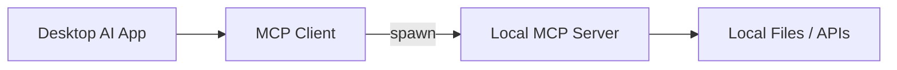

Use:

```text
STDIO
```

---

# 59. Remote MCP Architecture

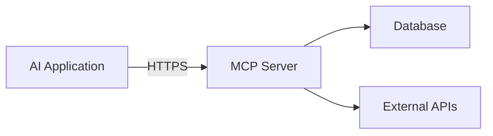

Use:

```text
Streamable HTTP
```

---

# 60. Streamable HTTP Server Concept

The exact server wiring depends on your HTTP framework and current SDK package.

The architecture is:

```text
HTTP Request
     ↓
MCP HTTP Handler
     ↓
MCP Server
     ↓
Tool Handler
```

The current SDK provides framework/server adapters for Node HTTP, Express, Fastify, and Hono. ([GitHub][6])

For a production Node.js backend, this is particularly useful if you're already comfortable with Express/Hono.

---

# 61. HTTP Production Architecture

```text
Internet
   ↓
Load Balancer
   ↓
MCP Gateway
   ↓
MCP Server
   ↓
Service Layer
   ↓
Database / APIs
```

Add:

```text
Authentication
Authorization
Rate Limiting
Tracing
Monitoring
Secrets
```

---

# 62. Horizontal Scaling

Suppose:

```text
MCP Server 1
MCP Server 2
MCP Server 3
```

behind:

```text
Load Balancer
```

Then state management matters.

The current SDK documentation describes several deployment patterns, including stateless mode, persistent storage, and local state with message routing for horizontally scaled servers. ([GitHub][7])

Conceptually:

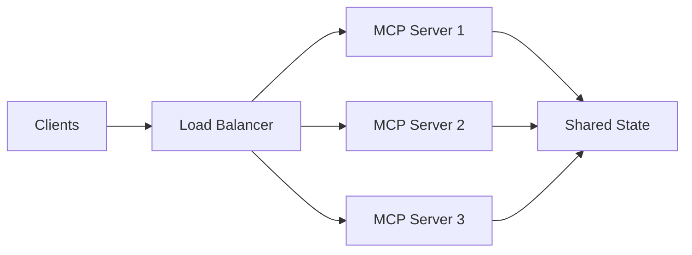

---

# 63. MCP Testing

Test three layers independently.

### Unit tests

```text
Tool Handler
```

### Integration tests

```text
MCP Client
    ↓
MCP Server
```

### End-to-end

```text
User
 ↓
LLM
 ↓
MCP Client
 ↓
MCP Server
 ↓
External API
```

---

# 64. MCP Inspector

During development:

```bash
npx @modelcontextprotocol/inspector npx tsx src/server.ts
```

Use it to inspect:

```text
Tools
Resources
Prompts
Inputs
Outputs
Errors
```

The official quickstart specifically recommends Inspector for exercising a local stdio server. ([GitHub][3])

---

# 65. Production Project — Build a GitHub MCP Server

Now let's design a real project.

```text
github-mcp/
```

Architecture:

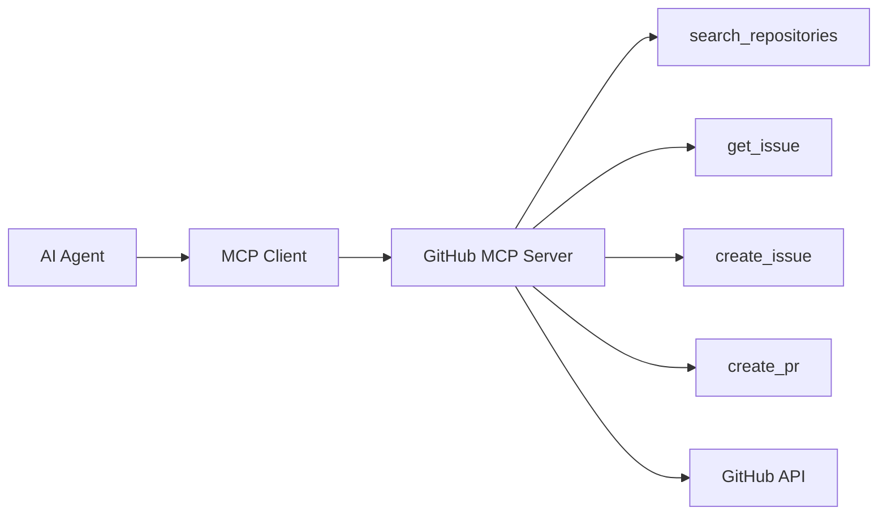

---

# 66. GitHub Tool Design

Read tools:

```text
search_repositories
get_repository
list_issues
get_issue
```

Write tools:

```text
create_issue
comment_issue
create_pull_request
```

Potentially dangerous:

```text
delete_repository
merge_pull_request
```

These should have stronger authorization/approval requirements.

---

# 67. Tool Schema

Example:

```ts
server.registerTool(
  "get_issue",
  {
    description: "Get a GitHub issue",
    inputSchema: {
      owner: z.string(),
      repo: z.string(),
      issueNumber: z.number().int().positive(),
    },
  },
  async ({ owner, repo, issueNumber }) => {
    // GitHub API request
  }
);
```

This is much better than:

```ts
get_issue(url: string)
```

because the model gets a precise structured schema.

---

# 68. API Service Layer

```ts
class GitHubService {
  constructor(
    private readonly token: string
  ) {}

  async getIssue(
    owner: string,
    repo: string,
    issueNumber: number
  ) {
    const response = await fetch(
      `https://api.github.com/repos/${owner}/${repo}/issues/${issueNumber}`,
      {
        headers: {
          Authorization: `Bearer ${this.token}`,
          Accept: "application/vnd.github+json",
        },
      }
    );

    if (!response.ok) {
      throw new Error(`GitHub API error: ${response.status}`);
    }

    return response.json();
  }
}
```

Then your MCP tool calls:

```ts
githubService.getIssue(...)
```

rather than embedding HTTP logic inside the MCP handler.

---

# 69. Production Folder Structure

For a serious MCP server:

```text
github-mcp/
│
├── src/
│   ├── index.ts
│   │
│   ├── server/
│   │   └── create-server.ts
│   │
│   ├── tools/
│   │   ├── get-issue.ts
│   │   ├── search-repositories.ts
│   │   └── create-issue.ts
│   │
│   ├── resources/
│   │   └── repository.ts
│   │
│   ├── prompts/
│   │   └── code-review.ts
│   │
│   ├── services/
│   │   └── github.service.ts
│   │
│   ├── schemas/
│   │   └── github.schema.ts
│   │
│   └── config/
│       └── env.ts
│
├── tests/
│
├── package.json
├── tsconfig.json
└── .env
```

---

# 70. MCP + RAG

MCP and RAG are complementary.

RAG:

```text
Documents
 ↓
Chunk
 ↓
Embed
 ↓
Vector DB
 ↓
Retrieve
 ↓
LLM
```

MCP:

```text
AI Application
 ↓
MCP
 ↓
External capability
```

Together:

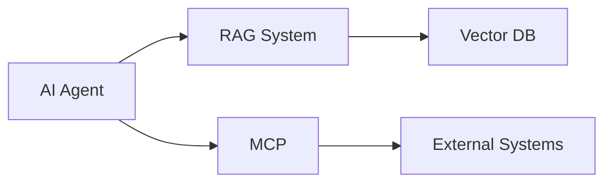

---

# 71. MCP + GraphRAG

Your GraphRAG architecture could be:

```text
AI Agent
   │
   ├── MCP
   │     ↓
   │   Neo4j
   │
   └── RAG
         ↓
      Vector DB
```

MCP tool:

```text
query_knowledge_graph()
```

The implementation could internally execute:

```cypher
MATCH (u:User)-[:PURCHASED]->(p:Product)
WHERE u.id = $userId
RETURN p
```

---

# 72. MCP + AI Agents

This is where MCP becomes especially useful.

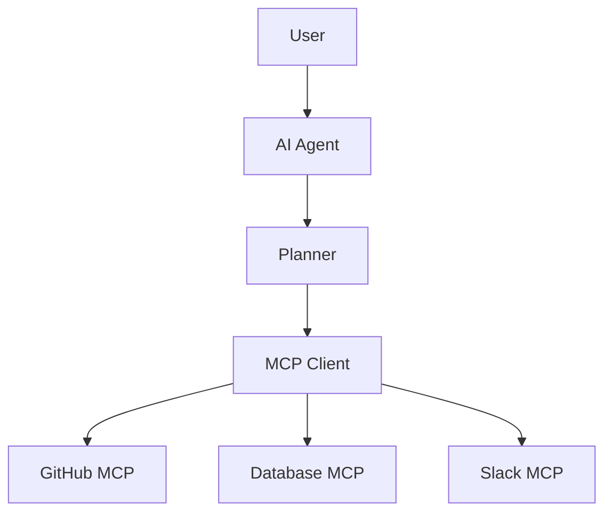

The agent can:

```text
Reason
 ↓
Select tool
 ↓
Execute
 ↓
Observe result
 ↓
Reason again
 ↓
Next tool
```

---

# 73. Multi-Step Agent Example

User:

> "Find the open GitHub issues for this project, check whether they are assigned in our database, and notify the engineering Slack channel."

Possible execution:

```text
1. GitHub → list issues
2. Database → check assignments
3. Agent → analyze
4. Slack → send summary
```

Architecture:

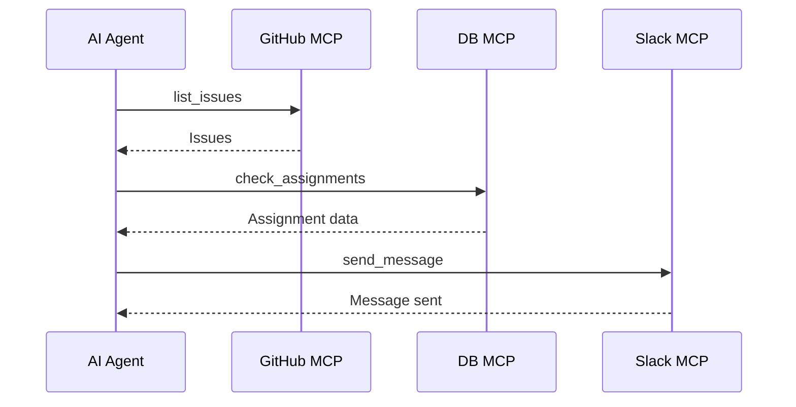

---

# 74. Important MCP Design Principle

Don't create:

```text
one giant MCP server
```

containing:

```text
GitHub
Stripe
Database
Slack
CRM
Email
Storage
```

unless there is a good architectural reason.

Prefer clear capability boundaries:

```text
GitHub MCP
Stripe MCP
Database MCP
Slack MCP
```

Then compose them at the host/gateway layer.

---

# 75. MCP Server vs Normal API

### Normal API

```text
GET /users/123
POST /orders
PATCH /users/123
```

### MCP

```text
get_user
create_order
update_user
```

The MCP layer can expose a model-friendly capability interface while the underlying service can remain REST, GraphQL, gRPC, or SDK-based.

---

# 76. MCP vs Function Calling

These are also different concepts.

### Function calling

Usually:

```text
LLM
 ↓
Tool schema
 ↓
Tool call
 ↓
Application
```

### MCP

```text
AI Application
 ↓
MCP Client
 ↓
MCP Server
 ↓
Tools / Resources / Prompts
```

MCP standardizes the capability-server interaction.

It doesn't eliminate model-provider-specific function/tool calling at the LLM layer.

---

# 77. MCP vs Agent Framework

MCP:

```text
Protocol
```

Agent framework:

```text
Orchestration
Planning
Memory
Loops
State
Tool execution
```

Examples of agent frameworks may use MCP, but MCP itself is not an agent framework.

---

# 78. MCP vs RAG

```text
RAG
→ retrieve information

MCP
→ communicate with external capabilities
```

A system can use both.

---

# 79. MCP vs API Gateway

API Gateway:

```text
Applications
    ↓
API Gateway
    ↓
APIs
```

MCP Gateway:

```text
AI Applications
    ↓
MCP Gateway
    ↓
MCP Servers
```

An MCP gateway can itself rely on normal API gateway infrastructure underneath.

---

# 80. Production Architecture

A mature architecture might look like:

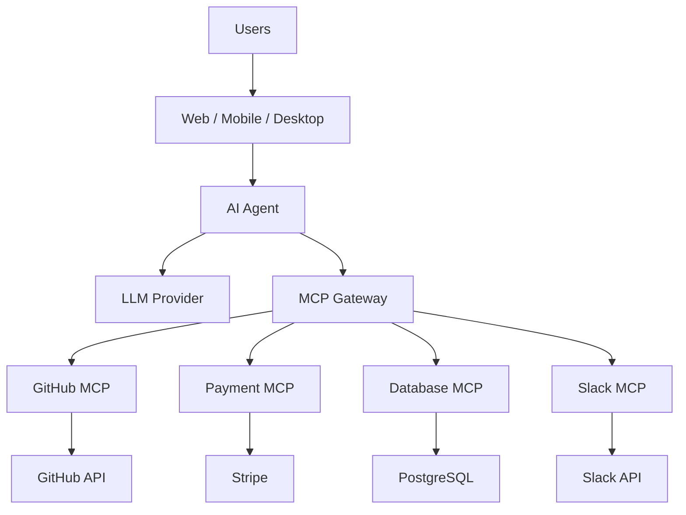

---

# 81. Production Checklist

Before deploying an MCP server:

### Protocol

```text
✓ Correct MCP SDK
✓ Correct transport
✓ Proper initialization
✓ Correct tool schemas
```

### Security

```text
✓ Authentication
✓ Authorization
✓ Least privilege
✓ Input validation
✓ Output filtering
✓ Secret management
✓ Rate limiting
```

### Reliability

```text
✓ Timeouts
✓ Retries where appropriate
✓ Error handling
✓ Idempotency for writes
✓ Circuit breakers where appropriate
```

### Observability

```text
✓ Logs
✓ Metrics
✓ Traces
✓ Tool invocation tracking
✓ Error monitoring
```

### Deployment

```text
✓ HTTPS
✓ Health checks
✓ Horizontal scaling strategy
✓ Session/state strategy
✓ Graceful shutdown
```

---

# 82. MCP Learning Project Sequence

I recommend implementing these projects **in exactly this order**:

```text
Project 01
Calculator MCP
       ↓
Project 02
Weather MCP
       ↓
Project 03
Filesystem MCP
       ↓
Project 04
Database MCP
       ↓
Project 05
GitHub MCP
       ↓
Project 06
Payment MCP
       ↓
Project 07
MCP Client
       ↓
Project 08
LLM + MCP Agent
       ↓
Project 09
Multiple MCP Servers
       ↓
Project 10
MCP Gateway
       ↓
Project 11
Authenticated Remote MCP
       ↓
Project 12
Production AI Agent
```

---

# 83. Your First Complete Mini Project

Let's combine everything we've learned.

```text
mcp-task-manager/
```

Features:

```text
Tools
 ├── create_task
 ├── update_task
 ├── complete_task
 └── search_tasks

Resources
 └── tasks://all

Prompts
 └── daily-plan
```

Architecture:

```mermaid
flowchart TB
    A["AI Application"]

    A --> C["MCP Client"]

    C --> S["Task MCP Server"]

    S --> T["Tools"]
    S --> R["Resources"]
    S --> P["Prompts"]

    T --> DB["SQLite / PostgreSQL"]
    R --> DB
```

---

# 84. Task Tool

```ts
server.registerTool(
  "create_task",
  {
    description: "Create a new task",
    inputSchema: {
      title: z.string().min(1),
      priority: z.enum([
        "low",
        "medium",
        "high",
      ]),
    },
  },
  async ({ title, priority }) => {
    const task = await taskService.create({
      title,
      priority,
    });

    return {
      content: [
        {
          type: "text",
          text: JSON.stringify(task),
        },
      ],
    };
  }
);
```

---

# 85. Search Tool

```ts
server.registerTool(
  "search_tasks",
  {
    description: "Search tasks",
    inputSchema: {
      query: z.string(),
    },
  },
  async ({ query }) => {
    const tasks = await taskService.search(query);

    return {
      content: [
        {
          type: "text",
          text: JSON.stringify(tasks),
        },
      ],
    };
  }
);
```

---

# 86. Complete Task Tool

```ts
server.registerTool(
  "complete_task",
  {
    description: "Mark a task as completed",
    inputSchema: {
      taskId: z.string(),
    },
  },
  async ({ taskId }) => {
    const task = await taskService.complete(taskId);

    return {
      content: [
        {
          type: "text",
          text: JSON.stringify(task),
        },
      ],
    };
  }
);
```

---

# 87. AI Interaction

User:

```text
Create a high priority task:
"Finish MCP notes"
```

LLM decides:

```json
{
  "name": "create_task",
  "arguments": {
    "title": "Finish MCP notes",
    "priority": "high"
  }
}
```

MCP:

```text
AI
 ↓
MCP Client
 ↓
Task MCP
 ↓
Database
```

Response:

```json
{
  "id": "task_123",
  "title": "Finish MCP notes",
  "priority": "high"
}
```

LLM:

```text
Created the high-priority task "Finish MCP notes."
```

---

# 88. The Most Important Mental Model

Memorize this:

```text
                    USER
                      │
                      ▼
               ┌─────────────┐
               │ AI HOST     │
               │ / AGENT     │
               └──────┬──────┘
                      │
                      ▼
               ┌─────────────┐
               │ MCP CLIENT  │
               └──────┬──────┘
                      │
                JSON-RPC
                      │
             STDIO / HTTP
                      │
                      ▼
               ┌─────────────┐
               │ MCP SERVER  │
               └──────┬──────┘
                      │
          ┌───────────┼───────────┐
          ▼           ▼           ▼
        TOOLS     RESOURCES    PROMPTS
          │
          ▼
   EXTERNAL SYSTEMS
```

---

# 89. MCP in One Sentence

> **MCP is a protocol that lets AI applications discover and interact with external capabilities through standardized MCP servers.**

---

# 90. MCP in One Architecture

```text
AI Application
      ↓
   MCP Client
      ↓
 JSON-RPC + Transport
      ↓
   MCP Server
      ↓
Tools / Resources / Prompts
      ↓
External Systems
```

---

# 91. MCP in Production

```text
                    AI APPLICATION
                          │
                          ▼
                    MCP CLIENTS
                          │
                          ▼
                    MCP GATEWAY
                          │
          ┌───────────────┼───────────────┐
          ▼               ▼               ▼
     GitHub MCP       Payment MCP      DB MCP
          │               │               │
          ▼               ▼               ▼
      GitHub API        Stripe         PostgreSQL
```

---

# 92. Final Interview Cheat Sheet

### What is MCP?

Open protocol for AI applications to communicate with external capability servers.

### What does an MCP server expose?

```text
Tools
Resources
Prompts
```

### What is a Tool?

An executable capability.

### What is a Resource?

Data/context exposed by the server.

### What is a Prompt?

Reusable prompt template.

### What is Host?

The AI application.

### What is Client?

The component communicating with an MCP server.

### What is Server?

The program exposing capabilities.

### What protocol messages does MCP use?

JSON-RPC-based MCP messages.

### What is STDIO?

Local process communication.

### What is Streamable HTTP?

HTTP-based transport for remote MCP servers.

### What happened to SSE?

Older HTTP+SSE transport exists for backward compatibility; new implementations should prefer Streamable HTTP. ([Model Context Protocol][2])

### Does MCP replace REST?

No.

### Does MCP replace function calling?

No.

### Is MCP an LLM?

No.

### Is MCP an agent framework?

No.

### Is MCP RAG?

No.

### Can MCP work with RAG?

Yes.

### What is MCP Gateway?

An architectural control layer for managing multiple MCP servers/capabilities.

---

# 🧠 Final Memory Formula

```text
MCP

= Protocol
+ JSON-RPC
+ Client/Server Architecture
+ Tools
+ Resources
+ Prompts
+ Transports
```

And production MCP becomes:

```text
MCP
+
Authentication
+
Authorization
+
Gateway
+
Observability
+
Rate Limiting
+
External APIs
+
Databases
+
AI Agents
```

### Your implementation journey

```mermaid
flowchart LR
    A["Learn MCP"] --> B["Build Server"]
    B --> C["Build Tools"]
    C --> D["Resources"]
    D --> E["Prompts"]
    E --> F["Build Client"]
    F --> G["Connect LLM"]
    G --> H["Multiple Servers"]
    H --> I["Gateway"]
    I --> J["Security"]
    J --> K["Remote HTTP"]
    K --> L["Production MCP"]
```

The official TypeScript SDK repository also maintains runnable server/client examples, including tools, prompts, resources, stdio, and Streamable HTTP, which makes it a useful reference while implementing these exercises. ([GitHub][7])

**Recommended next step:** implement **Project 01 (Calculator MCP) → Project 02 (Weather MCP) → Project 03 (Database MCP)** yourself before jumping to the LLM agent layer. That progression will make the Host → Client → Server → Tool architecture much easier to understand.

[1]: https://ts.sdk.modelcontextprotocol.io/v2/?utm_source=chatgpt.com "MCP TypeScript SDK"
[2]: https://ts.sdk.modelcontextprotocol.io/server?utm_source=chatgpt.com "Server | MCP TypeScript SDK (v1)"
[3]: https://github.com/modelcontextprotocol/typescript-sdk/blob/main/docs/get-started/first-server.md?utm_source=chatgpt.com "typescript-sdk/docs/get-started/first-server.md at main · modelcontextprotocol/typescript-sdk · GitHub"
[4]: https://github.com/modelcontextprotocol/typescript-sdk/blob/main/packages/client/README.md?utm_source=chatgpt.com "typescript-sdk/packages/client/README.md at main · modelcontextprotocol/typescript-sdk · GitHub"
[5]: https://github.com/modelcontextprotocol/typescript-sdk/blob/main/docs/get-started/first-client.md?utm_source=chatgpt.com "typescript-sdk/docs/get-started/first-client.md at main · modelcontextprotocol/typescript-sdk · GitHub"
[6]: https://github.com/modelcontextprotocol/typescript-sdk/blob/main/packages/server/README.md?utm_source=chatgpt.com "typescript-sdk/packages/server/README.md at main · modelcontextprotocol/typescript-sdk · GitHub"
[7]: https://github.com/modelcontextprotocol/typescript-sdk/blob/main/examples/README.md?utm_source=chatgpt.com "typescript-sdk/examples/README.md at main · modelcontextprotocol/typescript-sdk · GitHub"
