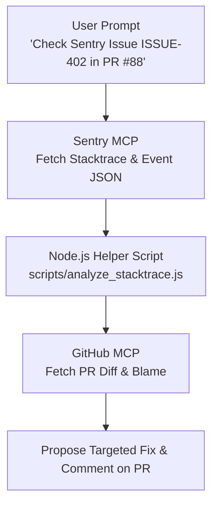

# Sentry Code Review & PR Automated Fixer Skill

## Overview
This Category 3 MCP Enhancement Skill coordinates **Sentry MCP** (error telemetry & stack traces) with **GitHub MCP** (PR code diffs & commit history) to pinpoint production crashes introduced in active Pull Requests and automatically generate fix recommendations.

---

## Multi-MCP Sequential Workflow



---

## Instructions

### Step 1: Fetch Sentry Issue Telemetry
1. Invoke Sentry MCP tool `sentry_get_issue` using provided Issue ID (`ISSUE-402`).
2. Save stack trace payload locally or pass to analyzer script:
```bash
node scripts/analyze_stacktrace.js --issue-id ISSUE-402 --payload '{sentry_json_response}'
```

*Output*: Extracts culprit filename, failing line number, error class (`TypeError`), and variable state.

---

### Step 2: Correlate with GitHub Pull Request Diff
1. Invoke GitHub MCP tool `github_get_pull_request_diff` for PR `#88`.
2. Compare the culprit file path (`src/services/payment.js`) against changed lines in the PR diff.
3. Identify whether the bug was introduced by recent modifications or pre-existing technical debt.

---

### Step 3: Propose Fix & Post Review Comment
1. Generate standard patch fix avoiding silent symptom masking.
2. Format review comment:
   - **Root Cause**: `TypeError: Cannot read properties of undefined (reading 'amount')` at line 42.
   - **Impacted Sentry Events**: 1,420 events affected 380 users.
   - **Suggested Patch**: Nullish coalescing check `paymentData?.amount`.
3. Post via GitHub MCP tool `github_create_pull_request_review_comment`.

---

## Error Handling & Fallbacks

| Error Condition | Action |
| :--- | :--- |
| Sentry API key expired | Prompt user: *"Sentry MCP authentication failed. Update API token in Extension Settings."* |
| Culprit file not in PR diff | Flag bug as pre-existing regression and output stack analysis summary without blocking PR merge. |
