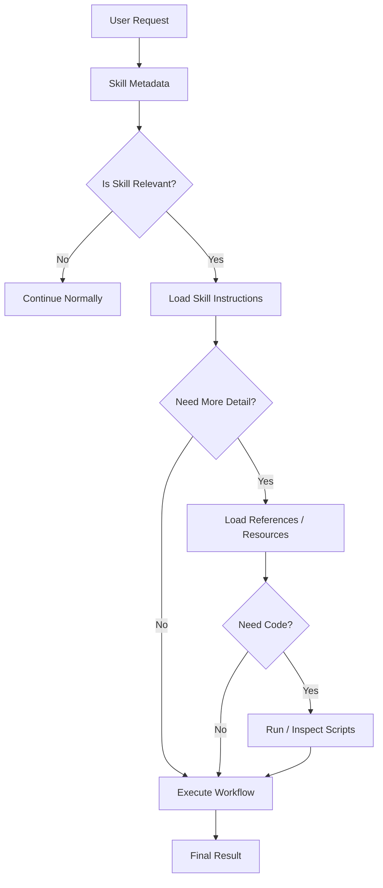
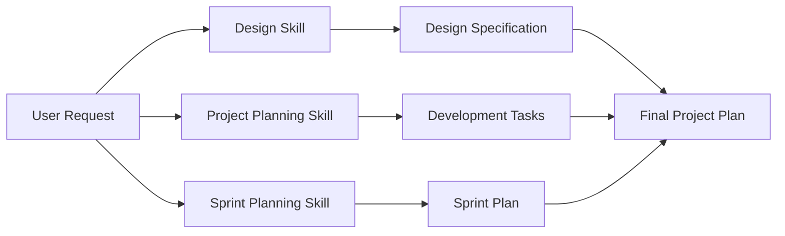
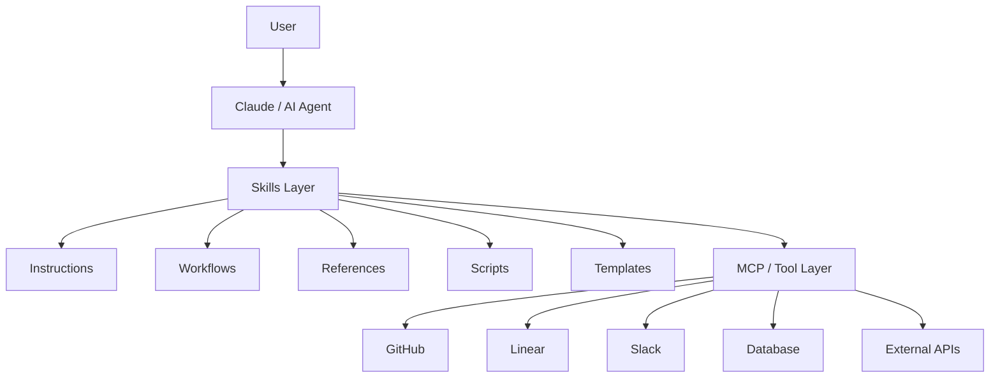

# 📘 Chapter 1 — Introduction & Fundamentals of Claude Skills

## 1. What Are Claude Skills?

**Claude Skills** are structured, reusable capability packages that give Claude specialized instructions, workflows, scripts, and supporting resources for performing a particular type of task.

A Skill can contain:

* **Instructions** — how Claude should perform the task
* **Workflows** — recommended sequence of operations
* **Scripts** — executable code for deterministic or repetitive operations
* **References** — detailed documentation loaded when required
* **Assets/templates** — reusable files and structures
* **Metadata** — information that helps Claude determine when the Skill is relevant

### Simple definition

> **A Skill teaches Claude how to perform a task; MCP gives Claude standardized access to external capabilities.**

A useful conceptual model is:

```text
Claude
   │
   ├── Skills
   │     ├── Instructions
   │     ├── Workflows
   │     ├── Scripts
   │     ├── References
   │     └── Assets
   │
   └── MCP / Tools
         ├── APIs
         ├── Databases
         ├── SaaS platforms
         └── External services
```

The important distinction is that **Skills and MCP solve different problems**.

---

# 2. Why Do We Need Skills?

Modern AI agents can access many external systems through tools and MCP servers.

For example, an agent might have access to:

```text
GitHub
   ├── create_issue
   ├── update_issue
   ├── create_pr
   ├── merge_pr
   └── search_code

Linear
   ├── create_issue
   ├── update_issue
   ├── assign_issue
   └── create_project

Slack
   ├── send_message
   ├── search_messages
   └── create_channel

Database
   ├── query
   ├── insert
   ├── update
   └── delete
```

As the number of tools increases, simply giving an LLM access to all of them does not automatically give it good **workflow knowledge**.

The model may know **what tools exist**, but it still needs to know:

* Which tool should be used?
* In what order?
* What information should be collected first?
* What parameters are required?
* What validation should happen?
* What should happen if a step fails?
* Which operations are safe to perform automatically?
* What output format should be produced?

This is where Skills become useful.

---

# 3. MCP vs Skills

A common misconception is:

> **MCP and Skills are competing technologies.**

They are better understood as **different layers of an agent system**.

### MCP

MCP primarily provides a standardized way for an AI application to interact with external capabilities and context.

For example:

```text
Claude
   │
   │ MCP
   ▼
GitHub MCP Server
   │
   ├── GitHub API
   └── Repository data
```

### Skill

A Skill provides task-specific knowledge and procedures.

For example:

```text
"Prepare a software release"

        │
        ▼
Release Management Skill
        │
        ├── Check repository
        ├── Check open issues
        ├── Review changelog
        ├── Run tests
        ├── Create release
        └── Generate release summary
```

The Skill can use available tools to execute these steps.

---

# 4. 🧠 The Kitchen Analogy

A useful mental model:

| Layer           | Kitchen Analogy                     | Purpose                                |
| --------------- | ----------------------------------- | -------------------------------------- |
| **MCP / Tools** | Kitchen equipment & ingredients     | Provides capabilities                  |
| **Skill**       | Chef's recipe / operating procedure | Explains how to use capabilities       |
| **Claude**      | Chef                                | Reasons about the task and executes it |
| **User**        | Customer                            | Specifies the desired outcome          |

For example:

> User: **"Prepare the weekly engineering report."**

Without a Skill, Claude may need to figure out the process dynamically.

With an appropriate Skill:

```text
Weekly Engineering Report Skill
            │
            ├── Fetch GitHub activity
            ├── Fetch project issues
            ├── Analyze completed work
            ├── Identify blockers
            ├── Generate metrics
            └── Format final report
```

MCP provides access to the systems.

The Skill provides the **procedure and domain-specific guidance**.

---

# 5. The Core Problem: Tool Overload

Imagine an agent has access to:

```text
20 GitHub tools
40 Stripe tools
30 Database tools
50 Jira tools
15 Slack tools
```

That's potentially **155 tool interfaces**.

If all detailed schemas and instructions are placed into the model's active context continuously, several problems can appear.

### 5.1 Context bloat

Large tool definitions consume context that could otherwise be used for:

* user requests
* conversation history
* retrieved information
* reasoning context
* tool results

### 5.2 Increased complexity

The model has to distinguish between many similar operations.

For example:

```text
create_issue
create_ticket
create_task
create_work_item
create_bug
```

The existence of many similar tools can make tool selection more complicated.

### 5.3 Higher token usage

Large schemas and instructions increase the amount of information that must be processed.

### 5.4 Tool-selection errors

The model may choose an inappropriate tool or construct incorrect parameters, particularly when many tools have overlapping functionality.

### 5.5 Workflow gaps

A tool generally describes **what an operation does**.

It does not necessarily define the complete business workflow:

```text
Validate input
      ↓
Fetch existing record
      ↓
Check permissions
      ↓
Perform operation
      ↓
Validate result
      ↓
Notify user
```

A Skill can provide this higher-level workflow guidance.

---

# 6. Context Poisoning

### Definition

**Context poisoning** is a broad term used for situations where irrelevant, excessive, conflicting, or malicious information in an agent's context negatively affects its behavior.

In tool-heavy systems, excessive tool definitions can contribute to context overload.

For example:

```text
System context

+ GitHub tools
+ Stripe tools
+ Slack tools
+ Jira tools
+ Database tools
+ Figma tools
+ Notion tools
+ 100+ schemas
+ User conversation
+ Retrieved documents
+ Previous tool results
```

The model now has to process a large amount of information before solving a relatively simple task.

### Important distinction

Do not treat **context poisoning** as synonymous with **large context**.

Large context and context poisoning are related but different concepts:

```text
Large context
    ↓
More information

Context poisoning
    ↓
Information that negatively affects reasoning
```

Large context can increase the opportunity for irrelevant or conflicting information to interfere, but large context by itself is not necessarily poisoning.

---

# 7. Progressive Disclosure

One of the most important ideas when studying Skills is:

> **Don't load everything immediately. Load the minimum information required, then progressively discover deeper resources.**

Conceptually:



This creates a layered information model.

---

# 8. Three Levels of Skill Information

## Level 1 — Metadata

The first layer contains lightweight information that helps identify the Skill.

Conceptually:

```yaml
name: release-management
description: Helps manage software releases, including changelog generation,
testing, versioning, and release preparation.
```

The important information here is:

```text
What is this Skill?
When might it be relevant?
```

The full workflow does not need to be loaded just to determine whether the Skill might apply.

---

## Level 2 — Skill Instructions

When the Skill becomes relevant, its main instructions can be loaded.

For example:

```text
Release Workflow

1. Inspect repository status.
2. Review changes since the previous release.
3. Run required tests.
4. Update changelog.
5. Validate version information.
6. Prepare release artifacts.
7. Produce release summary.
```

Now Claude has the **workflow knowledge** needed to perform the task.

---

## Level 3 — Supporting Resources

If the Skill requires deeper information, it can use supporting resources such as:

```text
references/
    release-policy.md
    versioning-guide.md
    deployment-guide.md

scripts/
    generate-changelog.py
    validate-version.py

assets/
    release-template.md
    report-template.md
```

This allows the Skill to remain modular rather than putting every piece of information into its main instructions.

---

# 9. Why Progressive Disclosure Matters

Without progressive disclosure:

```text
All Skills
   ↓
All Instructions
   ↓
All References
   ↓
All Scripts
   ↓
Huge Context
```

With progressive disclosure:

```text
Metadata
   ↓
Relevant Skill
   ↓
Required Instructions
   ↓
Required Resources
   ↓
Task Execution
```

The second approach can reduce unnecessary context and make complex agent environments easier to manage.

---

# 10. Skills Are More Than Prompts

A common beginner mistake is to think:

> **Skill = long system prompt**

That's incomplete.

A Skill can combine several components:

```text
Skill
│
├── Instructions
│
├── Workflow
│
├── References
│
├── Scripts
│
└── Assets / Templates
```

Therefore, a Skill can provide both **knowledge and operational resources**.

For example:

```text
Invoice Processing Skill
│
├── SKILL.md
│     ├── Processing rules
│     ├── Validation rules
│     └── Workflow
│
├── references/
│     └── accounting-rules.md
│
├── scripts/
│     └── calculate_tax.py
│
└── assets/
      └── invoice-template.xlsx
```

---

# 11. Composability

Skills are designed to be modular.

A complex task may require several Skills.

For example:

> "Design the landing page, create development tasks, and prepare the sprint."

Possible Skill composition:



Each Skill handles its own specialized responsibility.

### Key idea

> **Composability allows specialized capabilities to be combined instead of building one enormous monolithic Skill.**

---

# 12. Portability

A well-designed Skill should ideally separate:

```text
Task knowledge
        ↓
from
        ↓
Specific application interface
```

This makes the underlying workflow more reusable across environments that support the relevant Skill mechanism.

Depending on the product and implementation, Skills can be used in environments such as:

* Claude.ai
* Claude Code
* Anthropic API-based applications

The exact availability and implementation details can differ by environment, so always verify the current platform documentation when implementing them.

---

# 13. MCP + Skills Architecture

A useful overall architecture is:



Think of the architecture as:

```text
User
  ↓
Claude
  ↓
Skills = HOW
  ↓
MCP / Tools = ACCESS
  ↓
External Systems
```

---

# 14. Skills vs MCP

| Aspect                     | MCP                                         | Skills                                             |
| -------------------------- | ------------------------------------------- | -------------------------------------------------- |
| Primary purpose            | Connect AI to external capabilities/context | Provide specialized instructions and workflows     |
| Main question              | **"What can the agent access?"**            | **"How should the agent perform this task?"**      |
| Examples                   | GitHub, Slack, database, APIs               | Release management, document processing, reporting |
| Provides tools             | Yes                                         | Can use tools                                      |
| Provides workflow guidance | Not inherently                              | Yes                                                |
| Provides scripts           | Not its primary role                        | Can                                                |
| Provides references        | Not its primary role                        | Can                                                |
| Can be composed            | Yes, through tool ecosystem                 | Yes                                                |
| Main abstraction           | Connectivity / context                      | Capability / procedure                             |

### One-line distinction

> **MCP connects; Skills instruct.**

---

# 15. Without Skills vs With Skills

| Dimension           | Raw Tools / MCP                 | MCP + Skills                                         |
| ------------------- | ------------------------------- | ---------------------------------------------------- |
| Tool access         | Available                       | Available                                            |
| Workflow guidance   | Limited / application-dependent | Explicit                                             |
| User instructions   | May need to be detailed         | Can be outcome-oriented                              |
| Domain knowledge    | Mostly supplied elsewhere       | Packaged with Skill                                  |
| Validation guidance | May be absent                   | Can be encoded                                       |
| Reusability         | Tool-dependent                  | Skill can package reusable procedures                |
| Context management  | Can become tool-heavy           | Progressive discovery can reduce unnecessary loading |
| Automation          | Tool calls                      | Tool calls + workflow knowledge                      |

Avoid claiming that Skills guarantee **zero errors**, fixed token reductions, or deterministic behavior. Their benefit depends on how the Skill is designed and how the surrounding agent system handles context and tools.

---

# 16. Example: Software Release Skill

Suppose the user says:

> **"Prepare version 2.0.0 for release."**

### Without a Skill

Claude needs to determine:

```text
What should I check?
Which repository?
Which tests?
How should the changelog be generated?
Which versioning rules apply?
How should the release be formatted?
```

### With a Release Skill

The Skill could define:

```text
1. Inspect repository
2. Identify changes
3. Check release requirements
4. Run tests
5. Validate version
6. Generate changelog
7. Prepare release artifacts
8. Produce release summary
```

MCP tools might provide:

```text
GitHub → repository information
CI → test status
Issue tracker → completed issues
Package registry → published versions
```

The Skill provides the workflow connecting those capabilities.

---

# 17. A Better Mental Model

Remember this four-layer model:

```text
┌─────────────────────────────┐
│           USER              │
│       Desired Outcome       │
└──────────────┬──────────────┘
               ↓
┌─────────────────────────────┐
│           CLAUDE            │
│     Reasoning + Planning    │
└──────────────┬──────────────┘
               ↓
┌─────────────────────────────┐
│           SKILLS            │
│  Instructions + Workflows   │
│  References + Scripts       │
└──────────────┬──────────────┘
               ↓
┌─────────────────────────────┐
│       MCP / TOOLS           │
│ APIs + DBs + SaaS + Files   │
└──────────────┬──────────────┘
               ↓
┌─────────────────────────────┐
│      EXTERNAL SYSTEMS       │
│ GitHub / Slack / DB / etc.  │
└─────────────────────────────┘
```

### Memorize:

**Claude = Brain**
**Skills = Knowledge + Procedure**
**MCP = Connectivity**
**Tools = Actions**
**External systems = Data & services**

---

# 18. Key Terminology

### Skill

A packaged collection of instructions, workflows, resources, and potentially executable components that provides specialized capabilities.

### MCP

A protocol for connecting AI applications with external tools and contextual resources.

### Tool

An executable capability that an agent can invoke.

### Progressive Disclosure

Providing only the information needed at each stage instead of loading everything at once.

### Composability

The ability to combine multiple specialized capabilities to solve a larger task.

### Workflow

A defined sequence of steps for accomplishing an objective.

### Context Bloat

Excessive information occupying the model's context.

### Context Poisoning

Irrelevant, conflicting, misleading, or malicious context that negatively influences model behavior.

---

# 19. 🎯 Interview Questions

### Q1. What is a Claude Skill?

**Answer:**

A Claude Skill is a structured package of specialized instructions, workflows, resources, scripts, and/or templates that helps Claude perform a particular class of tasks consistently and efficiently.

---

### Q2. What is the difference between MCP and Skills?

**Answer:**

MCP primarily provides standardized connectivity between an AI application and external tools or resources, while Skills provide task-specific knowledge, workflows, and operational guidance for using those capabilities.

**Simple version:**

> MCP tells Claude **what it can access**; Skills help define **how to perform a task**.

---

### Q3. What is progressive disclosure?

**Answer:**

Progressive disclosure is an approach where information is exposed in stages. Lightweight metadata is available first, detailed instructions are loaded when a Skill is relevant, and deeper references or executable resources are accessed only when required.

---

### Q4. Why is progressive disclosure useful?

It can:

* Reduce unnecessary context
* Keep specialized instructions modular
* Reduce information overload
* Make large Skill ecosystems easier to manage
* Allow deeper resources to be discovered only when needed

---

### Q5. Can multiple Skills work together?

Yes. Skills can be composed for complex tasks. For example, a design-related Skill and a project-management Skill can contribute different specialized capabilities to the same overall task.

---

### Q6. Are Skills just prompts?

No.

A Skill can include more than instructions. Depending on the implementation, it can contain:

```text
Instructions
+ Workflows
+ References
+ Scripts
+ Assets
+ Templates
```

---

# 20. ⚡ Chapter 1 Cheat Sheet

```text
                    CLAUDE SKILLS
                         │
          ┌──────────────┴──────────────┐
          │                             │
       WHY?                           WHAT?
          │                             │
  Tool complexity              Packaged capabilities
  Context overload             Instructions
  Workflow gaps                Workflows
  Repeated instructions        References
                               Scripts
                               Assets
          │
          ▼
   Progressive Disclosure
          │
     ┌────┼────┐
     ↓    ↓    ↓
    L1   L2   L3
 Metadata │    │
          │    └── References/Scripts/Assets
          └─────── Skill Instructions
          
          │
          ▼
       MCP / Tools
          │
          ▼
 External Systems
```

### The most important distinction

> **MCP is primarily about standardized access to tools/resources.**

> **Skills are about packaging specialized instructions, workflows, and supporting resources.**

### Final mental model

```text
USER
 ↓
CLAUDE
 ↓
SKILL → "How should I solve this?"
 ↓
MCP/TOOLS → "What can I access or execute?"
 ↓
EXTERNAL SYSTEMS
```

This gives you the foundation needed for the next chapter: **how to plan, design, structure, and technically implement a Skill.**
