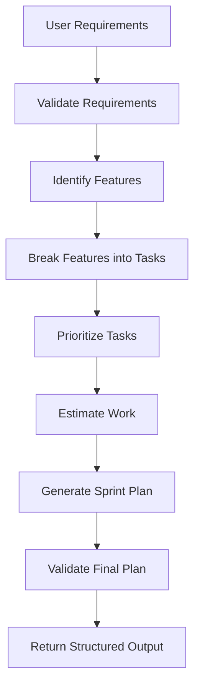
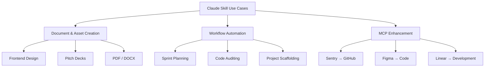
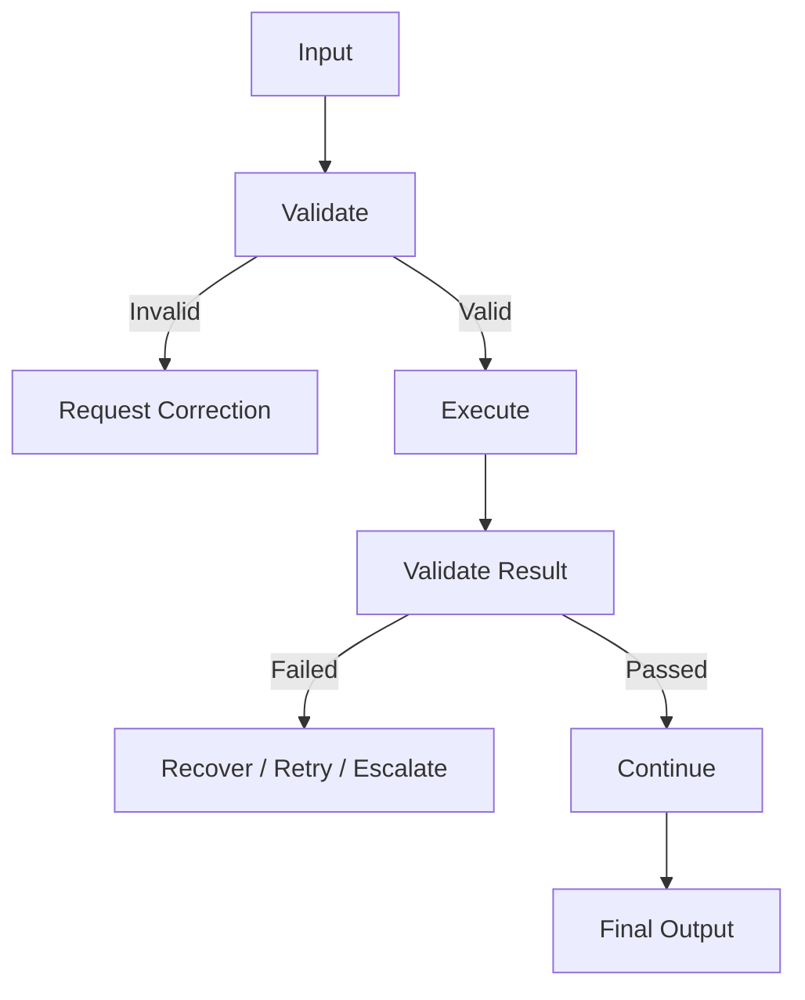

# 📐 Chapter 2 — Planning, Design & Technical Requirements

## 🎯 Chapter Goal

Before writing a Skill, you should answer five questions:

1. **What problem does the Skill solve?**
2. **Who or what triggers it?**
3. **What workflow does it automate or guide?**
4. **What resources/tools does it need?**
5. **How will we test whether it works well?**

A useful development flow is:

```text
Problem
   ↓
Use Cases
   ↓
Workflow Design
   ↓
Success Criteria
   ↓
Skill Structure
   ↓
SKILL.md
   ↓
Scripts / References / Assets
   ↓
Testing
   ↓
Iteration
```

---

# 1. Start With Concrete Use Cases

Don't begin by creating:

```text
my-skill/
└── SKILL.md
```

Instead, first identify **2–3 concrete workflows** that the Skill should handle.

### Weak definition

> "I want to build a project-management Skill."

This is too broad.

### Better definition

> "I want a Skill that helps plan a software sprint, converts requirements into tasks, assigns priorities, and produces a structured sprint plan."

Now the workflow is measurable.

---

# 2. Identify the Core Workflow

For each use case, define:

```text
Input
  ↓
Validation
  ↓
Processing
  ↓
Tool / Script Usage
  ↓
Validation
  ↓
Output
```

For example:

### Sprint Planning Skill



This is much more useful than simply saying:

> "The Skill manages projects."

---

# 3. Common Skill Use-Case Categories

A practical way to categorize Skills is into three groups.



---

# 4. Category 1 — Document & Asset Creation

### Goal

Generate consistent artifacts according to a defined structure, style, or specification.

Examples:

* Presentation generation
* PDF generation
* DOCX generation
* Frontend design
* Brand-consistent documents
* Reports
* Templates

For example:

```text
User
 ↓
"Create a startup pitch deck"
 ↓
Pitch Deck Skill
 ↓
Research / structure / design rules
 ↓
Generate slides
 ↓
Validate structure
 ↓
Final PPTX
```

The Skill provides the **rules and workflow**, while available tools perform the actual operations.

---

# 5. Category 2 — Workflow Automation

These Skills focus on **multi-step processes**.

Examples:

* Sprint planning
* Project setup
* Code audits
* Repository analysis
* Data processing
* Release preparation
* Skill creation

Example:

```text
"Prepare the next sprint"

        ↓

Collect requirements
        ↓
Analyze existing issues
        ↓
Identify tasks
        ↓
Prioritize
        ↓
Estimate
        ↓
Generate sprint
        ↓
Validate
```

The important characteristic is that the user asks for an **outcome**, rather than manually describing every step.

---

# 6. Category 3 — MCP Enhancement

This is particularly important when building agentic systems.

MCP can expose the raw capabilities:

```text
Sentry
 ├── get_error
 ├── search_errors
 └── get_event

GitHub
 ├── get_file
 ├── create_branch
 ├── create_commit
 └── create_pr
```

A Skill can turn these individual capabilities into a workflow.

### Example: Sentry → GitHub Bug Fix


Without workflow guidance, Claude has access to tools but must construct much of this process dynamically.

With a Skill, the workflow can be explicitly documented.

---

# 7. Define Inputs and Outputs

Every Skill should have a clear contract.

## Input

Define what the Skill needs.

Example:

```text
Required:
- Repository
- Target branch
- Release version

Optional:
- Release notes
- Deployment environment
```

## Output

Define what the Skill should produce.

Example:

```text
Output:
- Release summary
- Changelog
- Validation results
- PR / release information
```

Think of the Skill as:

```text
INPUT
  ↓
PROCESS
  ↓
OUTPUT
```

This makes both development and testing easier.

---

# 8. Define Success Criteria

A Skill needs measurable evaluation criteria.

However, avoid treating arbitrary numbers such as **90% trigger rate**, **50% fewer tool calls**, or **zero failed API calls** as universal requirements.

Those can be **project-specific targets**, but they aren't guaranteed properties of Skills.

---

## Quantitative Metrics

Useful metrics include:

### 1. Trigger accuracy

How often does the Skill activate when it should?

```text
Relevant requests correctly triggered
------------------------------------- × 100
Total relevant requests
```

You can separately measure false activations.

---

### 2. Workflow completion rate

```text
Successfully completed workflows
-------------------------------- × 100
Total workflow attempts
```

This is often more meaningful than simply counting tool calls.

---

### 3. Tool-call efficiency

Measure:

```text
Average tool calls with Skill
vs.
Average tool calls without Skill
```

The goal isn't necessarily "fewer calls."

Sometimes a well-designed Skill may intentionally make **more** calls because it performs additional validation.

The real question is:

> **Does the Skill accomplish the task reliably and efficiently?**

---

### 4. Error rate

Track:

```text
Tool failures
Validation failures
Workflow failures
Incorrect outputs
```

---

# 9. Qualitative Metrics

Some properties are difficult to measure with a single number.

### Workflow consistency

Does the Skill produce outputs following the expected structure?

### User effort

Does the user have to repeatedly explain the workflow?

### Recovery behavior

Can the Skill recover from common failures?

### Output quality

Does the final result satisfy the defined requirements?

### Maintainability

Can the Skill's instructions and resources be updated without rewriting the entire system?

---

# 10. Technical Skill Structure

A typical Skill can have this structure:

```text
your-skill-name/
│
├── SKILL.md
│
├── scripts/
│   ├── validate_input.py
│   └── process_data.py
│
├── references/
│   ├── api-patterns.md
│   └── style-guide.md
│
└── assets/
    ├── report-template.md
    └── example.json
```

### Required

```text
SKILL.md
```

### Optional

```text
scripts/
references/
assets/
```

Only add directories that the Skill actually needs.

A tiny Skill doesn't need five layers of supporting files.

---

# 11. `SKILL.md` — The Main Entrypoint

`SKILL.md` is the central file containing the Skill's metadata and instructions.

Conceptually:

```text
SKILL.md
│
├── Frontmatter
│     ├── name
│     ├── description
│     └── optional metadata
│
└── Instructions
      ├── Workflow
      ├── Rules
      ├── Validation
      ├── Tool usage
      └── Error handling
```

---

# 12. Directory Naming

Use clear, predictable names.

Recommended:

```text
payment-gateway-builder/
linear-sprint-planner/
sentry-code-review/
frontend-design/
```

Avoid:

```text
Payment Gateway
payment_gateway
paymentGateway
```

A consistent naming convention makes Skills easier to discover and maintain.

---

# 13. Frontmatter

A Skill commonly begins with YAML frontmatter.

Example:

```yaml
---
name: payment-gateway-builder
description: Builds and configures payment gateway integrations. Use when the user asks to integrate a payment gateway, configure subscriptions, or process payment API specifications.
license: MIT
compatibility: Requires Python 3.10+ and access to the required payment service.
metadata:
  author: DevRel Team
  version: 1.0.0
---
```

### Important

The exact supported frontmatter fields and constraints depend on the Skill implementation/environment you are targeting. Treat the official specification for that environment as authoritative rather than assuming every field is universally supported.

---

# 14. Required vs Optional Metadata

A useful conceptual table:

| Field           | Purpose                                    | Typical status        |
| --------------- | ------------------------------------------ | --------------------- |
| `name`          | Identifies the Skill                       | Required              |
| `description`   | Explains capability and activation context | Required              |
| `license`       | Licensing information                      | Optional              |
| `compatibility` | Runtime/dependency information             | Optional              |
| `metadata`      | Additional custom information              | Optional              |
| `allowed-tools` | Tool-access restrictions where supported   | Environment-dependent |

Don't add metadata just because you can.

The metadata should serve a purpose.

---

# 15. The `name` Field

Example:

```yaml
name: linear-sprint-planner
```

Good naming characteristics:

* Clear
* Short
* Specific
* Consistent
* Easy to identify

For implementations that require the name to match the directory name, use:

```text
linear-sprint-planner/
        ↓
name: linear-sprint-planner
```

Always validate this against the current Skill specification you're implementing.

---

# 16. The `description` Field

The description is particularly important because it helps determine **when the Skill is relevant**.

A useful formula is:

```text
WHAT
 +
WHEN
 +
OPTIONAL: INPUT / OUTPUT
```

### Weak

```yaml
description: Helps with projects.
```

Too vague.

### Better

```yaml
description: Manages Linear project workflows including sprint planning, task creation, prioritization, and status tracking. Use when the user asks about sprint planning, Linear tasks, project planning, or creating tickets.
```

Now we know:

```text
What?
→ Linear project workflows

When?
→ Sprint planning
→ Linear tasks
→ Project planning
→ Ticket creation
```

---

# 17. Description Design Pattern

Use:

```text
[Capability]
+
[User intent]
+
[Trigger examples]
+
[Relevant input/output]
```

For example:

```yaml
description: Analyzes design specifications and generates developer handoff documentation. Use when the user asks for design specifications, component documentation, or design-to-code handoff.
```

### Avoid

Overly technical descriptions that don't describe user intent:

```yaml
description: Implements the PaymentProcessingEntity API abstraction.
```

The system needs to understand **when the Skill is useful**, not merely its internal implementation terminology.

---

# 18. `SKILL.md` Body

After frontmatter comes the actual instructions.

A clean structure is:

```markdown
# Skill Name

## Purpose

What this Skill does.

## When to Use

When this Skill should be activated.

## Inputs

Required and optional inputs.

## Workflow

### Step 1: Validate Input

...

### Step 2: Analyze

...

### Step 3: Execute

...

### Step 4: Validate Result

...

## Output

Expected output format.

## Error Handling

Common failures and recovery procedures.

## References

Additional resources when needed.
```

---

# 19. Example `SKILL.md`

```markdown
---
name: payment-gateway-builder
description: Builds payment gateway integrations. Use when the user asks to integrate a payment provider, configure subscriptions, or implement payment APIs.
---

# Payment Gateway Builder

## Purpose

Build and validate payment gateway integrations.

## Workflow

### Step 1: Validate Input

Verify:

- Payment provider
- API documentation
- Required credentials
- Target environment

### Step 2: Inspect Existing Project

Identify:

- Framework
- Backend structure
- Existing payment code
- Environment configuration

### Step 3: Plan Integration

Define:

- Payment flow
- Webhook flow
- Error handling
- Data model changes

### Step 4: Implement

Use the available tools and scripts to implement the integration.

### Step 5: Validate

Check:

- Required environment variables
- API request structure
- Webhook handling
- Error handling
- Test cases

### Step 6: Report

Return:

- Files changed
- Configuration required
- Tests performed
- Remaining actions
```

This is much easier to maintain than putting everything into one giant paragraph.

---

# 20. Scripts

Scripts are useful when a task requires deterministic computation or repetitive operations.

Example:

```text
scripts/
├── validate_input.py
├── generate_report.py
└── check_config.py
```

Instead of asking the model to manually perform deterministic processing:

```text
Claude
   ↓
Script
   ↓
Deterministic result
   ↓
Claude
```

For example:

```bash
python scripts/validate_input.py --file input.json
```

The Skill can then use the result to decide what happens next.

---

# 21. References

Use `references/` for information that is useful but doesn't need to be present in the main instructions all the time.

Example:

```text
references/
├── api-patterns.md
├── security-rules.md
├── style-guide.md
└── troubleshooting.md
```

Think of it as the Skill's **documentation library**.

```text
SKILL.md
   ↓
"Need detailed API information"
   ↓
references/api-patterns.md
```

This supports progressive disclosure.

---

# 22. Assets

Assets are reusable supporting files.

Examples:

```text
assets/
├── report-template.md
├── example.json
├── logo.svg
└── presentation-template.pptx
```

They should be actual resources required by the workflow rather than a dumping ground for unrelated files.

---

# 23. Error Handling

A production-quality Skill should describe common failure conditions.

Example:

```markdown
## Troubleshooting

### Missing API Key

Cause:
The required API credential is unavailable.

Action:
Ask the user to configure the required environment variable.

### Invalid Input

Cause:
Required fields are missing.

Action:
Report the missing fields and request them before continuing.

### API Failure

Cause:
The external service rejected the request.

Action:
Inspect the error response, determine whether it is retryable,
and retry only when appropriate.
```

This is better than blindly retrying every failure.

---

# 24. Validation Gates

For multi-step workflows, use explicit validation points.



This makes the workflow more robust.

---

# 25. Security Considerations

Skills may contain instructions, scripts, references, and access to external systems.

Therefore, don't blindly trust every input or resource.

Consider:

* Prompt injection
* Malicious documents
* Untrusted tool results
* Credential exposure
* Dangerous commands
* Excessive permissions
* Unexpected file modifications
* Destructive API operations

A good Skill should define boundaries around what it is allowed to do.

---

# 26. Design Principle: Least Privilege

If a Skill only needs read access:

```text
READ
```

don't give it:

```text
READ + WRITE + DELETE + ADMIN
```

Conceptually:

```text
Required permissions
       ↓
Minimum necessary permissions
       ↓
Execute task
```

This reduces the impact of accidental or malicious actions.

---

# 27. Skill Development Checklist

Before implementation:

### Planning

* [ ] Define the problem
* [ ] Identify 2–3 concrete workflows
* [ ] Define inputs
* [ ] Define outputs
* [ ] Identify required tools
* [ ] Identify required references
* [ ] Identify scripts/assets

### Design

* [ ] Define workflow steps
* [ ] Define validation gates
* [ ] Define failure handling
* [ ] Define security boundaries
* [ ] Define success metrics

### Implementation

* [ ] Create Skill directory
* [ ] Create `SKILL.md`
* [ ] Add metadata
* [ ] Write concise instructions
* [ ] Add references only where necessary
* [ ] Add scripts where deterministic processing helps
* [ ] Add assets/templates when required

### Testing

* [ ] Test expected triggers
* [ ] Test unrelated requests
* [ ] Test incomplete input
* [ ] Test invalid input
* [ ] Test tool failures
* [ ] Test recovery
* [ ] Test final output structure

---

# 28. 🎯 Interview Questions

### Q1. What should you do before creating a Skill?

Define the problem and identify a small number of concrete workflows the Skill should handle. Then define inputs, outputs, dependencies, validation, and success criteria.

---

### Q2. Why is the description important?

The description helps the system identify when a Skill is relevant. It should clearly communicate the Skill's capability and the types of user requests that should trigger it.

---

### Q3. What is the purpose of `SKILL.md`?

`SKILL.md` acts as the primary Skill definition, containing metadata and the instructions needed to execute the Skill's workflow.

---

### Q4. Why use `references/`?

To keep supporting documentation separate from the core instructions and make detailed information available when needed.

---

### Q5. Why use scripts?

Scripts are useful for deterministic, repetitive, or computation-heavy operations where explicit code can be more reliable than asking the model to perform the operation manually.

---

### Q6. What makes a good Skill?

A good Skill has:

```text
Clear purpose
      +
Clear trigger conditions
      +
Well-defined workflow
      +
Validation
      +
Error handling
      +
Appropriate resources
      +
Good testing
```

---

# ⚡ Chapter 2 — Final Cheat Sheet

```text
                 BUILDING A SKILL
                        │
                        ▼
                1. Define Problem
                        │
                        ▼
                 2. Define Use Cases
                        │
                        ▼
                3. Define Workflow
                        │
                        ▼
              4. Define Input / Output
                        │
                        ▼
               5. Define Success Metrics
                        │
                        ▼
                6. Create Skill Folder
                        │
                        ▼
                    SKILL.md
                        │
             ┌──────────┼──────────┐
             ↓          ↓          ↓
          scripts/  references/  assets/
             │          │          │
             └──────────┼──────────┘
                        ↓
                    Test Skill
                        │
                        ▼
                    Iterate
```

## 🧠 Remember These 8 Things

1. **Start with workflows, not files.**
2. **Define exactly what the Skill should accomplish.**
3. **Keep `SKILL.md` focused on the core workflow.**
4. **Use progressive disclosure for detailed resources.**
5. **Use scripts for deterministic operations.**
6. **Use references for supporting knowledge.**
7. **Add validation and error-handling gates.**
8. **Measure actual workflow quality instead of assuming fewer tool calls always means better performance.**

### The key relationship

```text
SKILL.md
   │
   ├── WHAT → Description / Purpose
   ├── WHEN → Trigger conditions
   ├── HOW → Workflow instructions
   ├── VALIDATE → Input/output checks
   ├── RECOVER → Error handling
   │
   ├── scripts/     → Deterministic execution
   ├── references/  → Deep knowledge
   └── assets/      → Reusable resources
```

**Chapter 1 taught you *what Skills are and why they exist*.
Chapter 2 now gives you the *engineering process for designing one*.**

The natural next step is **Chapter 3: Testing, Evaluation & Iteration**, where we take a Skill from *“it works once”* to *“it works reliably across many different user requests.”*
