# 🌐 Chapter 4: Distribution, Sharing & API Integration

## 🎯 Chapter Overview

Building a Skill is only half of the problem.

A useful Skill also needs a reliable way to be:

* packaged
* versioned
* shared
* installed
* discovered
* integrated with tools
* used by agents programmatically
* maintained across different environments

The overall lifecycle is:

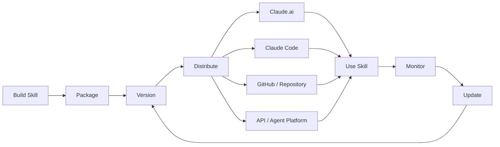

The key idea is:

> **A Skill is a portable capability package that can be distributed wherever a compatible agent runtime supports the Agent Skills format.**

The Agent Skills format uses a directory containing a required `SKILL.md` file plus optional scripts, references, and assets. ([GitHub][1])

---

# 1. 📦 Skill Distribution Models

There are several ways to distribute Skills depending on the environment.

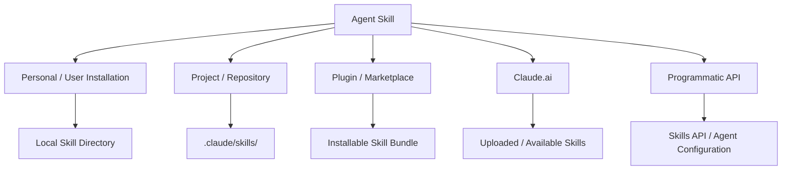

The exact installation mechanism is **platform-specific**. The common element is the Skill package itself: `SKILL.md` plus any supporting resources.

---

# 2. 👤 User-Level Distribution

A Skill can be distributed directly to an individual developer or user.

A typical package looks like:

```text
payment-gateway-builder/
├── SKILL.md
├── scripts/
│   ├── validate.py
│   └── configure.py
├── references/
│   └── payment-api.md
└── assets/
    └── config-template.json
```

The user can then install or upload the package using whatever mechanism their agent platform provides.

### Typical workflow

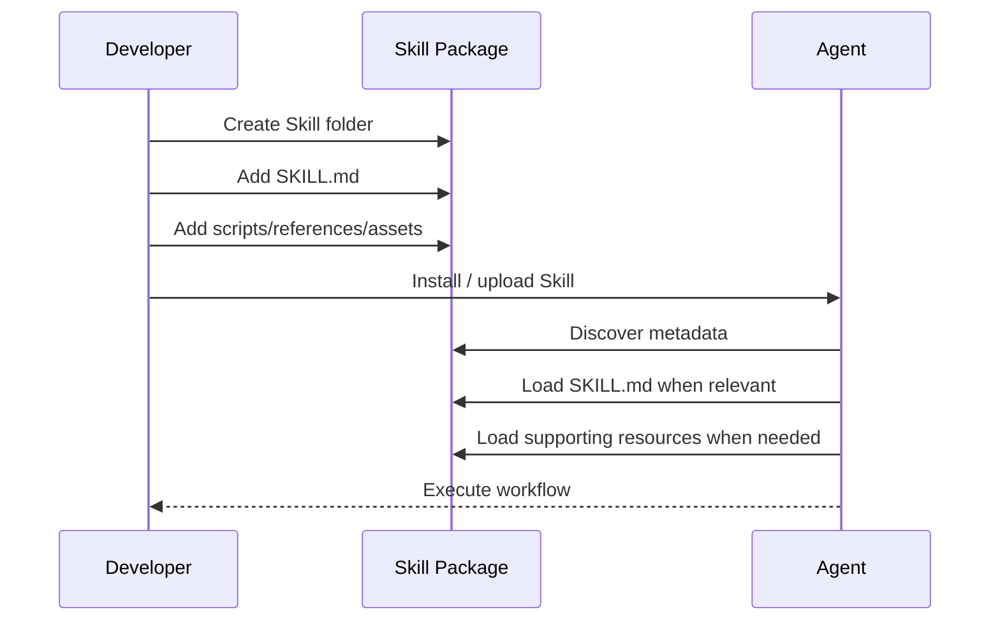

### Important concept

The Skill package should be **self-contained**.

Avoid requiring users to manually copy random pieces of the Skill into prompts.

Instead:

```text
Skill Package
     │
     ├── Instructions
     ├── Workflow
     ├── Scripts
     ├── References
     └── Assets
```

This makes the capability easier to reproduce and maintain.

---

# 3. 💻 Claude Code / Repository Distribution

For development workflows, Skills can live inside a project repository.

A common structure is:

```text
my-project/
├── .claude/
│   └── skills/
│       ├── code-review/
│       │   └── SKILL.md
│       │
│       ├── database-migration/
│       │   └── SKILL.md
│       │
│       └── api-testing/
│           ├── SKILL.md
│           └── scripts/
│               └── test_api.py
│
├── src/
├── package.json
└── README.md
```

This creates an important development pattern:

> **The repository can contain both the application and the instructions that tell an agent how to work on that application.**

Anthropic's current API/agent documentation also describes repository-based Skills under `.claude/skills`, where each Skill is discovered from its own directory containing `SKILL.md`. ([GitHub][2])

---

# 4. 🏢 Team & Organization Distribution

Organizations may want to distribute common Skills across developers or agents.

Examples:

* company coding standards
* security review
* database migration
* documentation generation
* API integration
* incident response
* release management

Architecture:

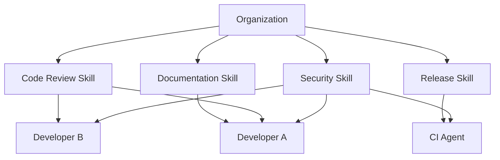

The important distinction is between:

### Centralized distribution

The organization controls the Skill.

```text
Organization
     ↓
Central Skill Repository
     ↓
Developers / Agents
```

### Repository-local distribution

The project itself owns the Skill.

```text
Git Repository
     ↓
.claude/skills/
     ↓
Agents working on repository
```

For team workflows, repository-based Skills have a major advantage: **the Skill can be version-controlled alongside the codebase.**

---

# 5. 🌐 Agent Skills Open Standard

One of the most important developments is that Agent Skills are not limited to a single proprietary format.

The Agent Skills format was originally developed by Anthropic and released as an open standard. It is now documented independently through the Agent Skills specification. ([GitHub][3])

## Core structure

```text
my-skill/
├── SKILL.md
├── scripts/
├── references/
└── assets/
```

The minimum important metadata is:

```yaml
---
name: my-skill
description: Explains what the skill does and when an agent should use it.
---
```

The standard describes:

* `SKILL.md` as the entry point
* `name` and `description` metadata
* Markdown instructions
* optional scripts
* optional references
* optional assets

([GitHub][1])

---

# 6. 🔄 Portability

The biggest benefit of an open Skill format is portability.

Instead of creating:

```text
Claude-specific instructions
        +
Cursor-specific instructions
        +
Copilot-specific instructions
        +
Other-agent-specific instructions
```

you can create a common Skill:

```text
             Agent Skills
                  │
          ┌───────┼────────┐
          ↓       ↓        ↓
       Agent A  Agent B  Agent C
```

However, **portability does not mean that every Skill will work identically everywhere**.

A Skill can depend on:

* local shell commands
* Python
* Node.js
* filesystem behavior
* specific MCP servers
* specific APIs
* authentication
* proprietary tools

Therefore:

> **The format can be portable while the implementation requirements may not be.**

This distinction is extremely important.

---

# 7. 🧩 Skill Portability Layers

Think about portability in three layers.

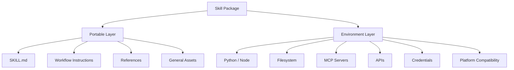

### Example

A generic code-review Skill:

```text
SKILL.md
```

can be portable.

But this:

```text
scripts/run-security-scan.sh
```

might require:

```text
Linux
+
Bash
+
security-scanner
```

Therefore the Skill should clearly document those dependencies.

---

# 8. 💻 Programmatic API Integration

Interactive Skills are useful for humans.

But developers may also want Skills inside:

* SaaS applications
* backend services
* autonomous agents
* scheduled workflows
* multi-agent systems
* internal automation
* CI/CD pipelines

The architecture becomes:

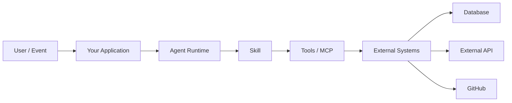

The key separation is:

```text
Skill
  ↓
How should the task be performed?

Tools / MCP
  ↓
What external capabilities can be accessed?

Agent Runtime
  ↓
Who executes the workflow?
```

---

# 9. 🔌 Skills API

Anthropic provides a Skills API for managing custom Skills programmatically.

The current Anthropic implementation documents operations such as:

```text
POST   /v1/skills
GET    /v1/skills
GET    /v1/skills/{id}
DELETE /v1/skills/{id}

POST   /v1/skills/{id}/versions
GET    /v1/skills/{id}/versions
GET    /v1/skills/{id}/versions/{version}
DELETE /v1/skills/{id}/versions/{version}
```

([GitHub][2])

This gives Skills a lifecycle similar to other software artifacts:

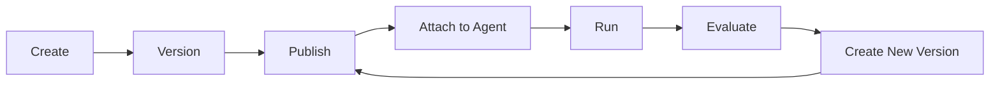

---

# 10. 🏷️ Skill Versioning

Versioning becomes important as soon as a Skill is used by multiple agents.

Example:

```text
payment-gateway-builder
│
├── v1
├── v2
└── v3
```

A change from:

```text
v1.0.0
```

to:

```text
v2.0.0
```

might change:

* workflow
* tool requirements
* output format
* validation rules
* API assumptions
* scripts

Therefore, production agents should avoid silently receiving breaking changes.

### Recommended strategy

```text
Development
    ↓
v1.1.0
    ↓
Evaluation
    ↓
Staging
    ↓
Production
```

For high-risk workflows:

```text
Production Agent
       │
       └── Skill v1.4.2
```

rather than blindly using:

```text
latest
```

Anthropic's current API documentation supports attaching Skills with a specific version or `"latest"` in supported agent configurations. ([GitHub][2])

---

# 11. 🧠 Skills + MCP + API

These three concepts should not be confused.

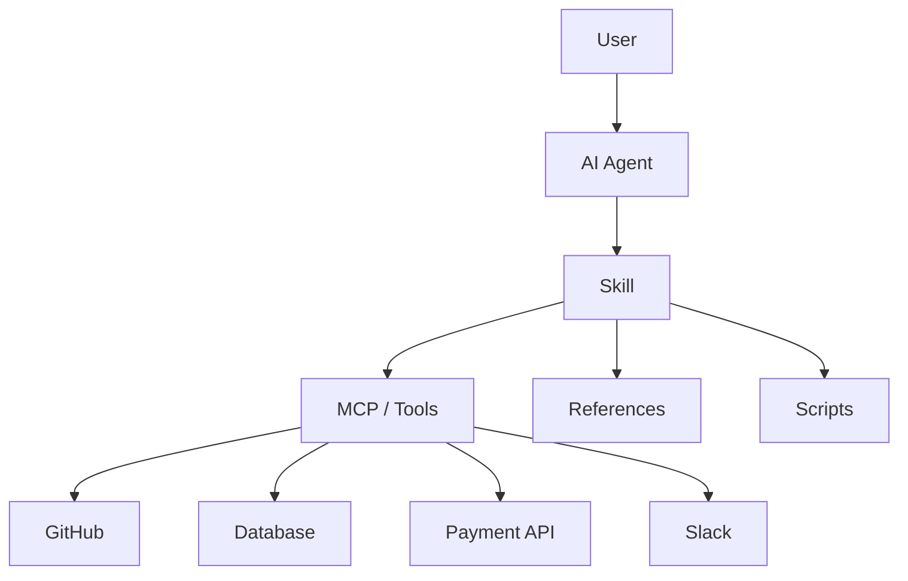

### Skill

Defines:

> **How should the agent solve the problem?**

### MCP / Tools

Defines:

> **What can the agent access or execute?**

### API

Defines:

> **How does my application communicate with the agent platform?**

### External system

Provides:

> **The actual data or operation.**

---

# 12. 🔥 Example: Payment Gateway Skill

Suppose we create:

```text
payment-gateway-builder/
├── SKILL.md
├── scripts/
│   └── validate_config.py
└── references/
    └── payment-api.md
```

The Skill might instruct the agent:

```text
1. Understand requested payment configuration.
2. Validate required fields.
3. Inspect existing project configuration.
4. Read payment API requirements.
5. Configure the payment provider.
6. Run deterministic validation.
7. Report configuration changes.
8. Never claim deployment succeeded unless deployment was verified.
```

MCP might provide:

```text
payment.create_product
payment.create_price
payment.list_customers
payment.create_subscription
```

So:

```text
User:
"Create an enterprise subscription."

        ↓

Skill:
"What steps must I follow?"

        ↓

MCP:
"What payment operations can I perform?"

        ↓

Payment API:
"Actually create the subscription."
```

---

# 13. 🐙 GitHub Distribution

GitHub is a natural distribution mechanism for open-source Skills.

A clean repository can separate:

* human documentation
* Skill implementation
* examples
* tests
* license

Example:

```text
payflow-skill/
│
├── README.md
├── LICENSE
├── CHANGELOG.md
│
├── skill/
│   └── payflow-integration/
│       ├── SKILL.md
│       ├── scripts/
│       │   └── validate.py
│       ├── references/
│       │   └── api-schema.md
│       └── assets/
│           └── config-template.json
│
└── tests/
    ├── trigger-tests.md
    └── workflow-tests.md
```

### Human documentation

```text
README.md
```

explains:

* what the Skill does
* installation
* requirements
* examples
* limitations
* version history

### Agent documentation

```text
SKILL.md
```

contains:

* metadata
* instructions
* workflow
* validation rules
* tool usage guidance

This separation is extremely useful.

---

# 14. 📥 Example Installation Documentation

A good README should answer:

```text
What is it?
Why should I use it?
How do I install it?
What does it require?
How do I use it?
What tools does it need?
How do I update it?
```

Example:

```markdown
# PayFlow Integration Skill

A reusable agent Skill for configuring PayFlow
payment integrations.

## Requirements

- Compatible agent runtime
- PayFlow MCP server
- Valid PayFlow credentials

## Installation

Clone this repository:

git clone https://github.com/example/payflow-skill.git

Then install the Skill using the mechanism
supported by your agent environment.

## Example

Ask your agent:

"Configure an enterprise subscription plan."

## Important

The Skill does not replace PayFlow authentication.
Required credentials must be configured separately.
```

Notice the difference:

### Bad README

```text
This repository contains SKILL.md and Python files.
```

### Better README

```text
Configure PayFlow integrations through a reusable
agent workflow with validation and API guidance.
```

---

# 15. 📣 Positioning: Sell the Outcome, Not the Folder

A Skill is technically a folder.

But users do not care about the folder.

They care about the result.

### Implementation-focused

> "This Skill contains Markdown instructions and Python scripts."

This explains **what it is internally**.

### Outcome-focused

> "This Skill helps teams configure payment integrations using a repeatable workflow with validation and deployment checks."

This explains **what it does for the user**.

The second approach is generally more useful for:

* README files
* marketplaces
* product pages
* documentation
* internal catalogs

---

# 16. 🧭 Skill Discovery

Distribution is not enough.

An agent must also know:

> **When should I use this Skill?**

That is why the `description` field is extremely important.

Example:

```yaml
---
name: payment-gateway-builder
description: >
  Configure payment products, prices, and subscriptions
  using the organization's payment workflow. Use when the
  user asks to create or modify payment configuration.
---
```

Think of the description as the Skill's:

```text
Discovery Interface
```

while the body is its:

```text
Execution Interface
```

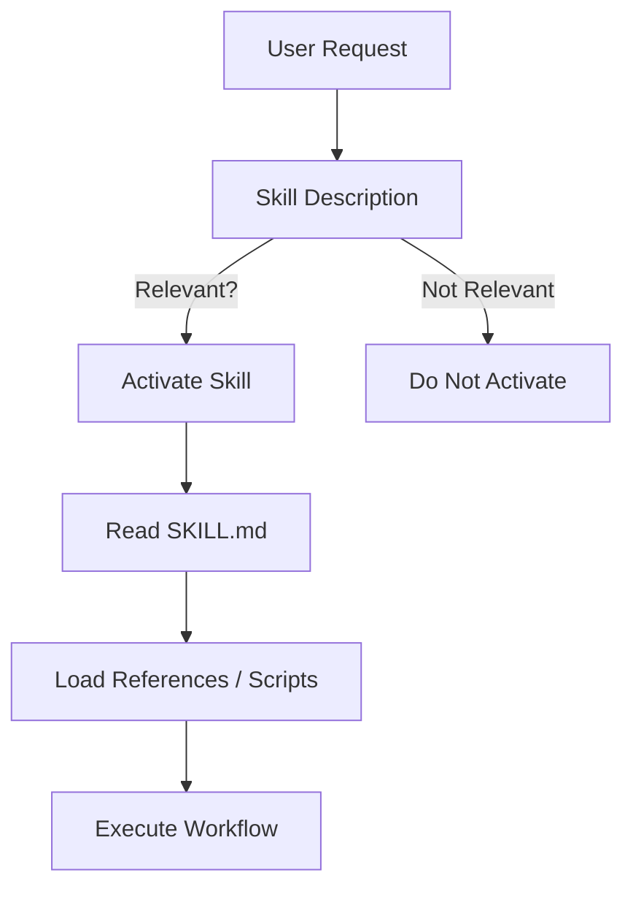

---

# 17. 📚 Progressive Disclosure During Distribution

Distribution and progressive disclosure work together.

A large Skill repository may contain:

```text
100 Skills
```

but an agent does not need to load all their instructions into context simultaneously.

The general pattern is:

```text
Level 1
Metadata
   ↓
Level 2
SKILL.md
   ↓
Level 3
References / Scripts / Assets
```

This allows many Skills to coexist without requiring every detailed instruction to be loaded at once. The Agent Skills documentation explicitly describes this three-stage discovery → activation → execution model. ([GitHub][3])

---

# 18. 🔐 Security Considerations

Distributed Skills should be treated as executable agent instructions.

This is particularly important when a Skill contains scripts or interacts with tools.

Potential risks include:

* malicious instructions
* unsafe shell commands
* credential leakage
* unauthorized API calls
* malicious repository changes
* prompt injection through referenced documents
* compromised dependencies

### Trust model

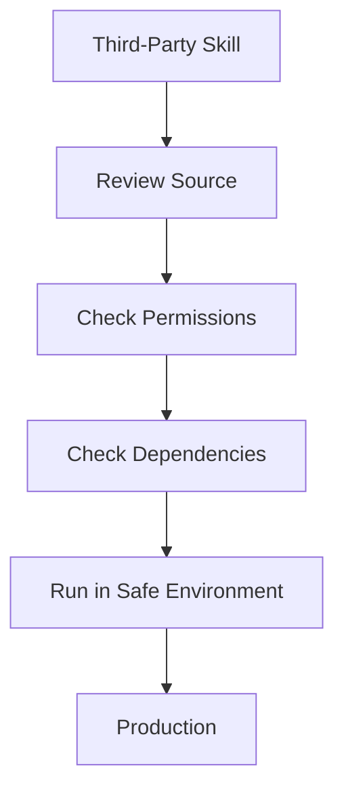

A useful rule is:

> **Do not treat a Skill as harmless documentation simply because its instructions are written in Markdown.**

If the agent has tools such as shell, filesystem, web access, or APIs, the Skill's instructions can influence real actions.

Anthropic's current repository documentation similarly warns that repository Skills are part of the agent's trust boundary and should be audited before being used with powerful tools. ([GitHub][2])

---

# 19. 🔑 Credential Separation

Never hard-code secrets inside:

```text
SKILL.md
```

or:

```text
scripts/
```

Bad:

```python
API_KEY = "sk_live_123456..."
```

Better:

```python
import os

api_key = os.environ["PAYFLOW_API_KEY"]
```

Even better architecture:

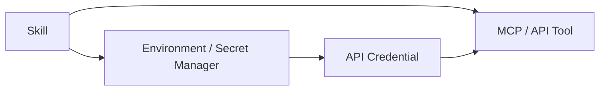

The Skill should describe **how to use a credential**, not contain the credential itself.

---

# 20. 🧪 Distribution Testing

A Skill should be tested after packaging.

Test at least:

### Installation

```text
Can the Skill be installed?
```

### Discovery

```text
Can the agent discover it?
```

### Triggering

```text
Does it activate for relevant requests?
```

### Non-triggering

```text
Does it stay inactive for unrelated requests?
```

### Execution

```text
Do scripts and references work?
```

### Dependencies

```text
Are required tools available?
```

### Versioning

```text
Does the correct version load?
```

### Security

```text
Does it behave safely with malicious input?
```

---

# 21. 📊 Distribution Quality Checklist

| Area          | Question                                       |
| ------------- | ---------------------------------------------- |
| Packaging     | Is the Skill self-contained?                   |
| Metadata      | Is `name` clear?                               |
| Discovery     | Is `description` specific?                     |
| Installation  | Can users install it easily?                   |
| Dependencies  | Are requirements documented?                   |
| Versioning    | Are releases versioned?                        |
| Testing       | Are trigger/workflow tests included?           |
| Security      | Are secrets excluded?                          |
| Documentation | Is README useful to humans?                    |
| Portability   | Are platform-specific requirements documented? |
| Maintenance   | Is there a clear update strategy?              |

---

# 22. 🚀 Production Distribution Pipeline

A mature Skill can follow a software-style release process:

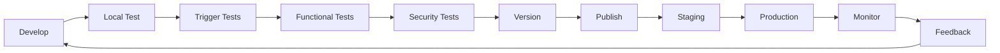

This is essentially:

> **Skills Engineering = Software Engineering + Agent Behavior Engineering**

---

# 23. 🏗️ Complete Skill Distribution Architecture

Putting everything together:

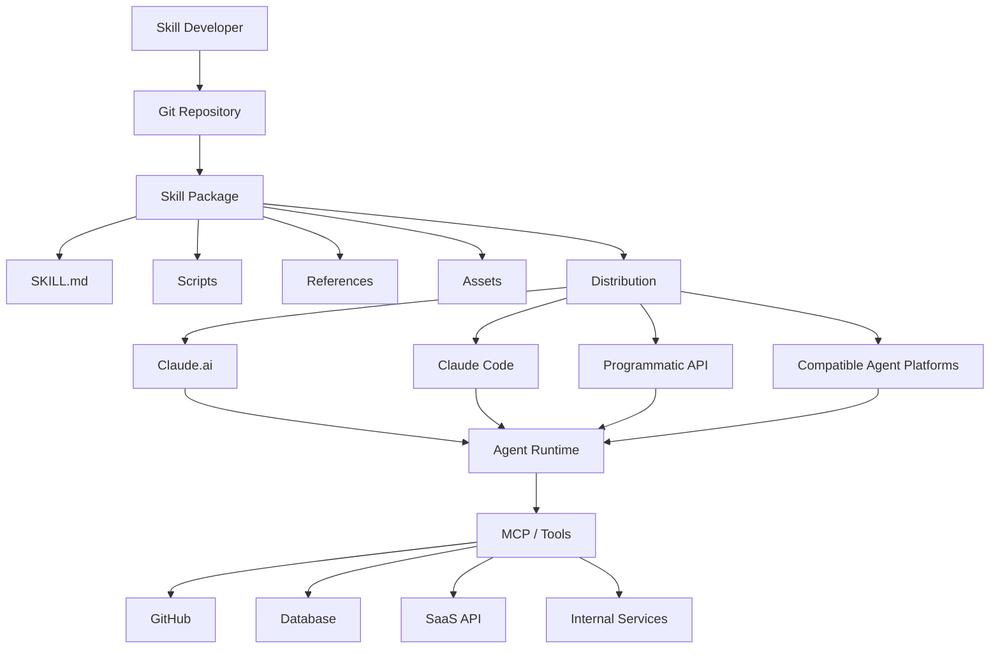

This gives the complete mental model:

```text
Skill
 ↓
Package
 ↓
Version
 ↓
Distribute
 ↓
Discover
 ↓
Activate
 ↓
Execute
 ↓
Evaluate
 ↓
Update
```

---

# 24. 🧠 Skill vs MCP vs API vs Repository

| Component         | Main Responsibility                              |
| ----------------- | ------------------------------------------------ |
| **Skill**         | Instructions, workflow, domain knowledge         |
| **SKILL.md**      | Skill entry point and instructions               |
| **Scripts**       | Deterministic executable logic                   |
| **References**    | Detailed supporting knowledge                    |
| **MCP**           | Standardized connection to tools/resources       |
| **API**           | Programmatic interface to an AI platform/service |
| **GitHub**        | Versioning and distribution mechanism            |
| **Agent Runtime** | Executes the agent workflow                      |
| **External API**  | Performs the actual business operation           |

### One-line mental model

> **Git distributes the Skill, the Skill teaches the workflow, MCP exposes capabilities, and the agent runtime executes the work.**

---

# 25. 🎯 Real-World Example

Imagine you build:

```text
react-native-expert/
```

The Skill contains:

```text
react-native-expert/
├── SKILL.md
├── scripts/
│   ├── check_dependencies.js
│   └── validate_navigation.js
├── references/
│   ├── expo.md
│   ├── navigation.md
│   └── performance.md
└── assets/
    └── project-template/
```

A user asks:

> "Add authentication navigation to my React Native Expo application."

The flow could be:

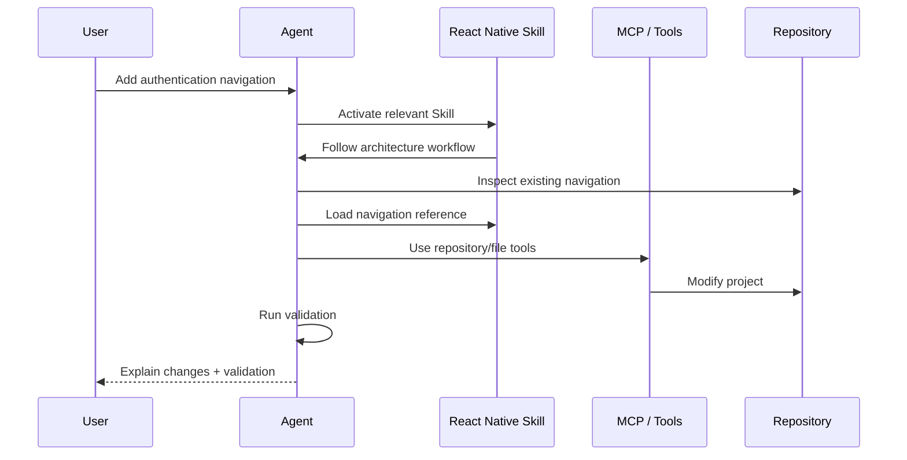

The Skill does not need to contain the entire React Native documentation.

Instead:

```text
SKILL.md
    ↓
High-level workflow

references/
    ↓
Detailed knowledge

scripts/
    ↓
Deterministic validation
```

That is progressive disclosure applied to a real development workflow.

---

# 26. 🎤 Interview Questions

## Q1. How do you distribute an Agent Skill?

**Answer:**

A Skill is distributed as a structured directory containing `SKILL.md` and optional supporting resources such as scripts, references, and assets. Depending on the runtime, it can be installed locally, committed to a project repository, distributed through a plugin/marketplace mechanism, or managed through an API.

---

## Q2. What is the Agent Skills open standard?

**Answer:**

Agent Skills is an open format for packaging reusable agent instructions and resources. Its core structure is a Skill directory containing `SKILL.md`, with optional scripts, references, and assets. It was originally developed by Anthropic and is intended to support reuse across compatible agent implementations. ([GitHub][3])

---

## Q3. Does an open Skill automatically work identically on every AI platform?

**Answer:**

No.

The Skill format can be portable, but the runtime may have different:

* tool APIs
* filesystem access
* execution environments
* MCP integrations
* authentication mechanisms
* supported features

Therefore, portability of the **format** does not guarantee identical portability of the **behavior**.

---

## Q4. Why use GitHub for Skills?

**Answer:**

GitHub provides:

* version control
* collaboration
* code review
* release history
* issue tracking
* distribution
* documentation

It allows Skills to be maintained similarly to software projects.

---

## Q5. Why should credentials not be stored inside a Skill?

**Answer:**

Because a Skill may be shared, committed to source control, or installed by other users. Credentials should instead be provided through secure environment variables, secret managers, or the runtime's authentication mechanism.

---

## Q6. What is the difference between Skill and MCP?

**Answer:**

A Skill defines **how a task should be performed**.

MCP provides standardized access to **tools and external resources**.

Simple formula:

```text
Skill = Procedure
MCP = Connectivity
```

---

## Q7. Why is Skill versioning important?

**Answer:**

Because changing a Skill can change agent behavior. Versioning allows developers to test, release, roll back, and pin known-good versions rather than unexpectedly changing production agent behavior.

---

## Q8. What should a good Skill README contain?

**Answer:**

At minimum:

```text
Purpose
Installation
Requirements
Usage examples
Dependencies
Security considerations
Version information
Limitations
```

---

# 27. ⚡ Chapter 4 Cheat Sheet

```text
┌─────────────────────────────────────┐
│       AGENT SKILL DISTRIBUTION      │
├─────────────────────────────────────┤
│ SKILL.md                            │
│   ↓                                 │
│ Package                             │
│   ↓                                 │
│ Version                             │
│   ↓                                 │
│ Distribution                        │
│   ├── Claude.ai                     │
│   ├── Claude Code                   │
│   ├── Repository                    │
│   ├── Plugins / Marketplaces        │
│   └── API / Agent Runtime           │
│                                     │
│ Discovery → Activation → Execution  │
│                                     │
│ Skill = Procedure                   │
│ MCP   = Connectivity                │
│ API   = Programmatic Interface     │
│ Git   = Versioning + Distribution   │
└─────────────────────────────────────┘
```

### Remember these 8 points

1. **A Skill is a distributable capability package.**
2. **`SKILL.md` is the required entry point.**
3. **Scripts, references, and assets are optional supporting resources.**
4. **Agent Skills is an open standard originally developed by Anthropic.**
5. **Portability of the format does not guarantee identical runtime behavior.**
6. **GitHub is useful for versioning, collaboration, and distribution.**
7. **Skills API enables programmatic Skill management in supported Anthropic environments.**
8. **Never put secrets directly inside Skill files.**

---

# 🧩 Final Mental Model

The complete architecture across Chapters 1–4 is:

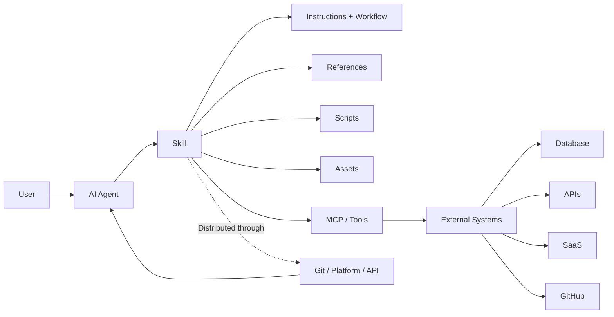

### The entire concept in one sentence:

> **Agent Skills package reusable procedures and domain knowledge into portable folders, distribute them through compatible agent environments, and combine them with tools such as MCP so agents can execute reliable real-world workflows.**

### Chapter progression

```text
Chapter 1
WHAT ARE SKILLS?
        ↓
Chapter 2
HOW DO WE DESIGN THEM?
        ↓
Chapter 3
HOW DO WE TEST THEM?
        ↓
Chapter 4
HOW DO WE DISTRIBUTE & INTEGRATE THEM?
        ↓
Chapter 5
HOW DO WE ARCHITECT & TROUBLESHOOT THEM?
```

**Key correction to keep in your study notes:** avoid memorizing the original chapter's exact claim that every API Skill invocation is simply `container.skills` plus a Code Execution beta container. Anthropic's current Skill/agent documentation has evolved and now documents Skills API management and agent-level Skill attachment as well. ([GitHub][2])

For your MCP/agent-learning path, the most important mental model from this chapter is **Skill = procedure, MCP = connectivity, API = programmatic interface, runtime = execution**.

[1]: https://github.com/anthropics/skills/blob/main/README.md?utm_source=chatgpt.com "skills/README.md at main · anthropics/skills · GitHub"
[2]: https://github.com/anthropics/skills/blob/main/skills/claude-api/shared/managed-agents-tools.md?plain=1&utm_source=chatgpt.com "skills/skills/claude-api/shared/managed-agents-tools.md at main · anthropics/skills · GitHub"
[3]: https://github.com/agentskills/agentskills/blob/main/docs/home.mdx?utm_source=chatgpt.com "agentskills/docs/home.mdx at main · agentskills/agentskills · GitHub"
