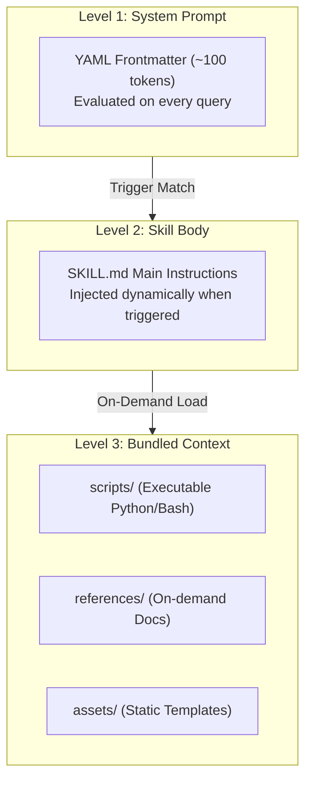

# 📚 Day 16 — Claude Skills Development & MCP Integration Master Notes

Welcome to the chapter-wise master notes for **Day 16: Claude Skills Development & MCP Integration**. These notes synthesize the official Anthropic skills guide, live class lecture transcripts, architectural patterns, and practical execution checklists.

---

## 📑 Chapter Directory & Roadmap

| Chapter | File Link | Key Topics & Core Concepts |
| :--- | :--- | :--- |
| **Chapter 1** | [01-introduction-and-fundamentals-of-claude-skills.md](./01-introduction-and-fundamentals-of-claude-skills.md) | Context poisoning in MCP, Latency & scale problems, Kitchen Analogy, Progressive Disclosure (3-level system), Composability, Portability. |
| **Chapter 2** | [02-planning-design-and-technical-requirements.md](./02-planning-design-and-technical-requirements.md) | Use case categories, Success metrics, File system rules (`SKILL.md`, `kebab-case`, NO internal README), YAML Frontmatter spec, Description formula, Security rules. |
| **Chapter 3** | [03-testing-iteration-and-evaluation-strategies.md](./03-testing-iteration-and-evaluation-strategies.md) | Testing spectrum (Manual vs CLI vs API), Single-task iteration principle, Triggering/Functional/Performance tests, Using `skill-creator`, Iterative feedback loops. |
| **Chapter 4** | [04-distribution-sharing-and-api-integration.md](./04-distribution-sharing-and-api-integration.md) | User vs Workspace distribution, Agent Skills Open Standard, Programmatic API (`/v1/skills`), Code Execution Tool beta, GitHub repository layout, Outcome positioning. |
| **Chapter 5** | [05-architecture-patterns-and-troubleshooting.md](./05-architecture-patterns-and-troubleshooting.md) | Problem-first vs Tool-first framing, 5 Core Architectural Patterns (Sequential, Multi-MCP, Iterative, Context-Aware, Governance), Master Troubleshooting guide. |
| **Chapter 6 & References** | [06-resources-checklists-and-reference-templates.md](./06-resources-checklists-and-reference-templates.md) | Official documentation, Pre-flight checklist, Full YAML specification, `pay-skill` case study, Production `SKILL.md` boilerplate template. |

---

## 📄 Reference Source Files

- **Raw Lecture Transcript**: [raw-class.md](./raw-class.md)
- **Official Anthropic Guide**: [The-Complete-Guide-to-Building-Skill-for-Claude.md](./The-Complete-Guide-to-Building-Skill-for-Claude.md)

---

## 💡 Key Architectural Mental Models

1. **MCP provides Connectivity; Skills provide Knowledge.** MCP gives access to tools, while Skills teach Claude the optimal step-by-step workflow.
2. **Progressive Disclosure Saves Context.** Storing triggers in YAML frontmatter avoids loading thousands of instruction tokens until explicitly required.
3. **Deterministic Code over Probabilistic Text.** For critical validations or multi-step logic, bundle python scripts inside `scripts/` rather than relying solely on language instructions.
